# Introduzione al Corso — P2P Systems and Blockchain

## Struttura del Corso

Il corso (9 CFU) è tenuto da Laura Ricci e Damiano Di Francesco Maesa. Si divide in lezioni teoriche (~6 CFU) e laboratorio (~3 CFU), dove si sviluppano smart contract con **Solidity** e **Hardhat**.

L'esame consiste in un progetto su blockchain seguito da un orale che discute il progetto e gli argomenti teorici non coperti da esso. Esempi di progetti passati: MasterMind o BattleShip sulla blockchain, aste smart, lotterie smart, commercio di contenuti con ricompensa, Splitwise sulla blockchain.

Il programma copre: sistemi P2P (overlay non strutturati, DHT), Bitcoin ed Ethereum, smart contract, soluzioni di scalabilità Layer-2, e applicazioni avanzate come DeFi, Supply Chain e Self Sovereign Identity (SSI). Gli strumenti fondamentali utilizzati durante il corso sono: algoritmi distribuiti, metodi crittografici e strutture dati probabilistiche.

---

## Il Paradigma Peer-to-Peer

Nel modello **Client-Server** classico i server sono macchine dedicate con IP fisso che erogano servizi; i client li consumano senza comunicare tra loro. Il server è un potenziale collo di bottiglia.

> [!definition] Rete Peer-to-Peer (P2P)
>
> Insieme di entità autonome (**peer**) che si auto-organizzano e condividono risorse distribuite (calcolo, memoria, banda). Il sistema è in grado di adattarsi a un continuo **churn** dei nodi mantenendo connettività e prestazioni ragionevoli senza un'entità centrale. Ogni nodo è contemporaneamente fornitore e consumatore di servizi (funzionalità simmetrica: **servent**).

I server possono esistere per il bootstrap iniziale, ma non sono necessari per lo scambio effettivo delle risorse. Una sfida caratteristica delle reti P2P è il **churn**: i nodi entrano ed escono continuamente, ottenendo spesso un nuovo indirizzo IP ad ogni connessione. Questo rende inutilizzabile l'indirizzamento tramite IP statici e richiede meccanismi applicativi — non a livello IP — per localizzare le risorse.
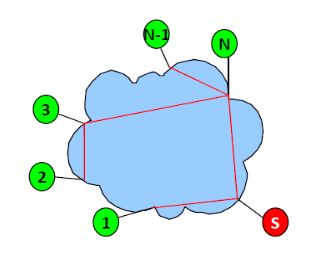
Ogni peer che partecipa a una rete P2P deve affrontare quattro problemi fondamentali: come **unirsi** alla rete (*join*), come **scoprire altri peer** (*peer discovery*), come comportarsi sia da fornitore che da consumatore di servizi, e come **prevenire il free riding** — ovvero impedire che alcuni nodi consumino risorse senza contribuire — incentivando la partecipazione e la reciprocità.

### Condivisione di Risorse

Le risorse condivise in una rete P2P si trovano "ai bordi" di Internet: sono direttamente messe a disposizione dai peer, senza nodi speciali per la loro gestione. Possono essere: **ledger** distribuiti, spazio di archiviazione in lettura/scrittura, potenza di calcolo, banda.

La partecipazione può avvenire per motivi molto diversi. Un peer può offrire risorse gratuitamente per contribuire a un progetto collettivo (es. ricerca di vita extraterrestre con SETI, ricerca su terapie contro il cancro). Oppure può essere **ricompensato** per il contributo alla gestione della rete, come avviene per i **Bitcoin miners**. In ogni caso, la proprietà più interessante è quella di **auto-scalabilità**: la partecipazione di un numero crescente di utenti aumenta naturalmente le risorse del sistema e la sua capacità di servire più richieste.

### L'Evoluzione del File Sharing

Il file sharing è stata la prima *killer application* del P2P. Il funzionamento tipico è il seguente: un utente U ha un client P2P sul proprio computer; ad ogni connessione ottiene un nuovo indirizzo IP. U memorizza i file condivisi in una directory, associando a ciascuno dei metadati identificativi (titolo, autore, data di pubblicazione). Quando U vuole trovare un file, invia una query al sistema, riceve la lista dei peer che lo posseggono, sceglie il peer P secondo certi criteri, e avvia il trasferimento diretto. Nel frattempo, altri utenti possono già scaricare da U le parti del file che U ha già ottenuto.

**Napster** (prima generazione) usava un indice centralizzato dei file su server dedicati, mentre il trasferimento avveniva direttamente tra peer. La centralizzazione dell'indice era però un punto di vulnerabilità — tecnica e legale — e portò alla chiusura del servizio per violazione del copyright: attraverso l'analisi dell'indice centralizzato era possibile risalire ai contenuti scambiati tra gli utenti. La seconda generazione (Gnutella, Kazaa, BitTorrent) ha eliminato ogni punto centrale, distribuendo sia la ricerca che il trasferimento.

---

## Blockchain: Cos'è e Quando Usarla

> [!definition] Blockchain
>
> Database condiviso, replicato e consistente, mantenuto senza un'autorità centrale. È **append-only** (solo aggiunta), immutabile e resistente alle manomissioni. In termini di teoria dei giochi: una macchina a stati decentralizzata mantenuta da attori non fidati, incentivati economicamente a comportarsi correttamente. Non può essere spenta o censurata, e i dati non possono essere eliminati.

Le tecnologie fondamentali sono:
- **Firme digitali** — autenticazione
- **Hash crittografici** — immutabilità e integrità
- **Replicazione** — disponibilità tramite copie distribuite
- **Consenso distribuito** — coordinamento tra repliche mutuamente diffidenti

> [!tip] Quando usare la blockchain
>
> Ha senso considerare la blockchain quando: è necessario memorizzare uno stato condiviso in modalità append-only, ci sono più scrittori con diversi gradi di fiducia reciproca, l'applicazione deve girare in modo distribuito, il processo di settlement è complesso e richiede una terza parte fidata, servono integrità/autenticazione/non-ripudio, le regole sono precise e semplici da codificare, e la trasparenza è preferibile alla privacy.

> [!warning] La blockchain non è sempre la soluzione giusta
>
> Ha senso usarla solo se i partecipanti non sono noti o fidati. Se tutte le parti sono fidate, un database tradizionale è preferibile. Se serve solo immutabilità con parti fidate, bastano database con checksum crittografici (es. AWS QLDB, Kafka). Molti usi proposti della blockchain in ambito aziendale rientrano in questa categoria e non ne hanno effettivamente bisogno.

---

## Bitcoin ed Ethereum

**Bitcoin** nasce nel 2008 dal paper di Satoshi Nakamoto come sistema di cassa elettronica P2P: pagamenti online diretti senza intermediari, con il problema del **double-spending** risolto tramite una catena di blocchi con timestamping basato su hash. Il *Genesis Block* conteneva il messaggio *"Chancellor on brink of second bailout for banks"* — un riferimento esplicito alla crisi finanziaria e all'obiettivo di sottrarre il controllo del denaro alle banche centrali. La *cypherpunk vision* alla base di Bitcoin è che si possa rivoluzionare il mondo costruendo protocolli sicuri.

**Ethereum** espande il concetto: non è solo valuta, ma una piattaforma programmabile. Introduce gli **smart contract**, programmi eseguiti dalla blockchain stessa tramite linguaggi Turing-completi come Solidity. L'intera rete si comporta come un singolo computer globale replicato e consistente (**EVM**, Ethereum Virtual Machine). A differenza di Bitcoin, in cui gli script hanno potere computazionale limitato, Ethereum può risolvere qualunque problema computazionale — con il meccanismo del **gas** per prevenire attacchi denial-of-service.

> [!example] Smart contract assicurativo
>
> Un contratto connesso a un database di voli rimborsa automaticamente il passeggero se il ritardo supera una soglia prestabilita — senza pratiche burocratiche, senza intermediari. Il rimborso in criptovaluta viene trasferito automaticamente al wallet di Bob non appena il ritardo viene verificato.

---

## Le Sfide: Trilemma della Blockchain

> [!warning] Trilemma della Blockchain
>
> È difficile ottenere contemporaneamente **sicurezza**, **decentralizzazione** e **scalabilità**. Migliorare una delle tre proprietà tende a penalizzare le altre. È una delle grandi sfide scientifiche aperte del settore.

### Privacy

Le transazioni su ledger pubblici sono visibili a tutti. Le identità degli utenti possono a volte essere inferite, con rischio di esposizione di dati sensibili. Bilanciare privacy e auditabilità è particolarmente delicato nei protocolli **DeFi**: da un lato richiedono confidenzialità (transazioni, depositi, prestiti senza rivelare importi o indirizzi), dall'altro richiedono auditabilità (verifica del double-spending, conferma della collateralizzazione). Le soluzioni principali sono:

- **Zero Knowledge Proofs (ZKP)**: un *prover* dimostra la validità di un'affermazione a un *verifier* senza rivelare i dati sottostanti. Applicazioni: nascondere dati sensibili mantenendo la correttezza, esecuzione privata di smart contract, verifica d'identità privata on-chain, DeFi privacy-preserving.
- **Fully Homomorphic Encryption (FHE)**: eseguire calcoli su dati cifrati senza decifrarli — il risultato, una volta decifrato, coincide con quello ottenuto dal testo in chiaro. L'idea chiave è: *"posso calcolare sui tuoi dati segreti senza mai vederli"*. Esempio: un protocollo di prestito calcola l'idoneità al credito o il tasso di interesse su saldi cifrati — i saldi restano privati ma il sistema produce risultati corretti.
- **Multiparty Computation (MPC)**: calcolo distribuito tra più parti che collaborano senza rivelare i propri input privati alle altre.

### Scalabilità

Le blockchain tradizionali hanno throughput limitato e costi energetici elevati. Le soluzioni principali spostano l'esecuzione **off-chain**, usando la catena principale solo come ancora di fiducia (*trust anchor*) per la validazione finale:

- **Layer-2** (Optimistic Rollups, ZK-rollups): raggruppano molte transazioni off-chain e ne pubblicano solo la prova sulla catena principale.
- **Payment Channel** (Lightning Network): canali di pagamento bidirezionali che consentono scambi diretti tra peer senza toccare la blockchain per ogni transazione.

---

## Applicazioni

| Applicazione | Descrizione |
|---|---|
| **Criptovalute e Token** | Alternativa alle valute fiat: la blockchain non richiede che un governo emetta moneta né che le banche validino le transazioni. L'offerta è legata a un bene virtuale limitato crittograficamente. La blockchain risolve il double spending e supporta sia token **fungibili** (interscambiabili) che **non fungibili** |
| **NFT** | Prova di proprietà di asset digitali unici (arte, diritti d'autore). Un'opera in .jpeg è facilmente copiabile, ma l'NFT certifica chi è il proprietario originale |
| **DeFi** | Piattaforme come **Uniswap** per il trading diretto tra pari (DEX) con pool di liquidità e market maker automatizzati (AMM). In Uniswap V3, le posizioni di liquidità sono rappresentate come **LP NFTs**: ogni posizione ha parametri distinti e personalizzabili che ne determinano valore e rendimento |
| **Self Sovereign Identity** | L'utente controlla i propri dati e rivela solo le informazioni minime necessarie (minimalismo, portabilità, consenso) |
| **Supply Chain** | Tracciamento provenienza e qualità: es. Walmart-IBM (Hyperledger) per sicurezza alimentare, con sensori IoT che registrano temperatura e posizione. Un altro esempio: ristoranti possono verificare la catena di custodia del pesce, con sensori attaccati al prodotto che registrano posizione, temperatura e umidità lungo tutta la filiera |
| **Intellectual Property** | Il proprietario di un contenuto digitale fa l'hash del contenuto insieme alla propria identità e lo registra sulla blockchain. Se nessun altro può dimostrare di averlo pubblicato prima di quel commit, questo costituisce prova di proprietà — più comodo di un ufficio brevetti e senza dover divulgare i dettagli del contenuto |

---

## Conclusioni e Prospettive

I sistemi P2P offrono vantaggi su più fronti. Per gli utenti: sfruttamento delle risorse in eccesso (cicli CPU inutilizzati, storage libero, banda disponibile) in cambio di risorse, servizi o partecipazione a reti sociali. Per la comunità: la **proprietà di auto-scalabilità** — la partecipazione di un numero maggiore di utenti aumenta naturalmente le risorse del sistema. Per chi sviluppa applicazioni: riduzione dei costi rispetto al modello client-server (server farm ad alta connettività, replicazione per fault tolerance, disponibilità 24×7 sono tutte responsabilità distribuite tra i peer).

Il successo di un'applicazione P2P dipende in larga misura dalla formazione di una **massa critica** di utenti: una soglia di partecipazione che permette all'applicazione di autosostenersi. Nei primi sistemi P2P questa soglia è stata raggiunta grazie alla novità dell'applicazione (contenuti gratuiti nel file sharing, criptovalute come asset redditizio, token come mezzo semplice per scambiare asset). Per le nuove applicazioni, il successo dipenderà oltre che dalla qualità tecnica anche dall'**appeal dell'applicazione** e dalla definizione di nuovi **modelli di business**.

> [!note] Sfide scientifiche aperte
>
> Lo sviluppo di applicazioni P2P su larga scala richiede strumenti nuovi. Le metodologie classiche per i sistemi distribuiti non scalano: un sistema P2P opera su milioni di nodi (non centinaia), e il fallimento o la disconnessione di un nodo è un evento normale, non un'eccezione. Servono: **teoria dei giochi** (cooperazione tra peer, equilibrio di Nash), **nuove tecniche crittografiche**, **nuovi algoritmi di consenso**, **strumenti di analisi di sistemi complessi**.

```{=latex}
\newpage
```

# Classificazione degli Overlay: Overlay Non Strutturati

## Dal Centralizzato al P2P

Napster (2001) ha dimostrato che si può servire una quantità di dati paragonabile a Google con molti meno server, spostando storage e trasferimento direttamente sugli utenti. All'epoca Google impiegava circa 15.000 server, Napster circa 100. Il sistema raggiunge 26,4 milioni di utenti nel 2001, con 10 TB di dati (2 milioni di canzoni, in media 220 per utente). I server si occupano solo di localizzare chi possiede la risorsa — la parte meno costosa del servizio. In questo modello ogni utente è un **servent** (server + client): partecipa "pagando" con le proprie risorse fisiche, contenuti o conoscenza.

**Punti di forza di Napster**: sistema informativo globale senza grandi investimenti, decentralizzazione dei costi e dell'amministrazione, nessun collo di bottiglia sulle risorse (storage e trasferimento distribuiti tra gli utenti). **Punti di debolezza**: il server resta un singolo punto di fallimento e di controllo, necessario per gestire l'intero sistema — esattamente questo lo ha reso vulnerabile agli attacchi legali per violazione del copyright, poiché l'analisi dell'indice centralizzato permetteva di risalire ai contenuti scambiati.

**Gnutella** rimuove anche quest'ultimo punto centrale: nessun indice, connessioni dirette tra peer usate per la ricerca (non per il download). Il risultato è un sistema senza infrastruttura né amministrazione, privo di single point of failure. I punti deboli diventano: alto traffico di rete, assenza di ricerca strutturata, e **free riding** (nodi che consumano risorse senza contribuire).

---

## Reti Overlay

> [!definition] Overlay Network
>
> Rete logica costruita sopra la rete fisica sottostante (underlay), tipicamente a livello applicativo sopra TCP/IP. I link dell'overlay sono "tunnel" che attraversano la rete fisica: un singolo collegamento logico può passare per decine di router. Più overlay possono coesistere contemporaneamente sulla stessa rete fisica, ciascuno offrendo il proprio servizio specifico non disponibile nell'underlay. I nodi dell'overlay sono spesso end host che fungono anche da nodi intermedi che inoltrano traffico.

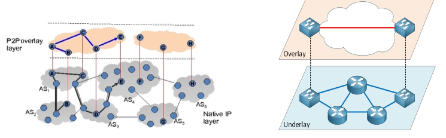
Un protocollo P2P definisce formato e semantica dei messaggi tra peer. I peer sono identificati da ID univoci, generalmente calcolati tramite funzioni hash. I pacchetti P2P, analogamente ai pacchetti IP, sono caratterizzati da un **header** e un **payload**. Il protocollo definisce anche una strategia di routing a livello applicativo dello stack TCP/IP, senza dover modificare i router sottostanti.

## Classificazione degli Overlay

| Tipo | Topologia | Lookup | Garanzie |
|---|---|---|---|
| **Centralizzato** | Server centrale | $O(1)$ | Singolo punto di fallimento |
| **Non Strutturato** | Grafo casuale | $O(N)$ | Nessuna garanzia di trovare la risorsa |
| **SuperPeer (Ibrido)** | Gerarchico | $O(hops_{max})$ | Migliore scalabilità del non strutturato |
| **Strutturato (DHT)** | Topologia controllata | $O(\log N)$ | Lookup garantito, garanzie anche su join e leave |

---

## Overlay Non Strutturati

I peer si connettono arbitrariamente: la topologia forma un grafo casuale (es. Gnutella ≤ 0.4, Bitcoin). La rete è resiliente e facile da mantenere, ma la ricerca è costosa — nel caso peggiore $O(N)$. I falsi negativi sono possibili: la risorsa cercata potrebbe esistere ma non essere raggiunta entro il TTL.

### Bootstrapping e Discovery

Un nuovo nodo non conosce nessuno. Il **bootstrapping** avviene tramite due meccanismi complementari: server DNS noti che memorizzano gli indirizzi IP di un insieme di peer stabili (eseguendo script che interagiscono con i peer e aggiornano automaticamente la lista), oppure una **cache interna** in cui ogni client memorizza gli IP dei peer contattati nelle sessioni correnti e precedenti, aggiornata dinamicamente tramite *gossiping* con i vicini.
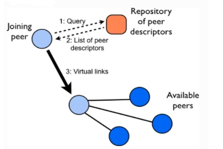
Il processo di partecipazione alla rete si articola in tre fasi:

- **Step 0** — join: il nodo si connette a uno o più peer noti tramite bootstrap.
- **Step 1** — peer discovery: il nodo invia messaggi **Ping** per annunciare la propria presenza; i peer rispondono con **Pong** contenenti le proprie informazioni e inoltrano il Ping ai vicini.
- **Step 2** — searching: il nodo invia una query ai vicini (es. *"do you have any content that matches the string 'Back to Black'?"*); i peer che hanno corrispondenze rispondono, gli altri inoltrano la query per TTL salti.
- **Step 3** — downloading: il trasferimento avviene via connessioni HTTP dirette usando il metodo GET.

### Flooding

L'algoritmo di ricerca base è il **Flooding**: la query viene inviata a tutti i vicini, che la inoltrano a loro volta. Per evitare loop infiniti si usa un **TTL** decrementato ad ogni salto; quando raggiunge zero il messaggio viene scartato. I duplicati si evitano con un ID univoco per ogni messaggio. Le risposte viaggiano all'indietro attraverso le connessioni non transitorie, tramite **Backward Routing**.

```
FloodForward(Query q, Source p):
  if q.id ∈ oldIdsQ: return          // duplicato, scarta
  oldIdsQ ← oldIdsQ ∪ {q.id}
  q.TTL ← q.TTL - 1
  if q.TTL == 0: return              // scaduto, scarta
  foreach s ∈ Neighbors:
    if s ≠ p: send(s, q)             // inoltra a tutti tranne il mittente
```

Il flooding equivale a una **BFS limitata dal TTL**: trova il massimo numero di risultati nel raggio TTL centrato sul nodo sorgente. Garantisce alta resilienza ma genera molto traffico e molti duplicati, scala male, e **non garantisce il ritrovamento della risorsa** (false negative). È usato anche in **Bitcoin** non solo per la ricerca, ma per **propagare le transazioni** nella rete P2P sottostante — dove mantenere la consistenza è la sfida principale.

### Tecniche di Ricerca Avanzate

Le alternative al flooding puro si dividono in due categorie: approcci **BFS-based** (iterative deepening/expanding ring, k-walker random walk, two-level k-walker, directed BFS, modified random BFS) e approcci **DFS-based** (local indices, routing indices, attenuated bloom filter).

**Expanding Ring (Iterative Deepening)** — BFS con TTL crescente. Si parte da un TTL basso (opzionalmente su un sottoinsieme casuale dei vicini); se la ricerca fallisce si ripete incrementandolo fino alla terminazione (risorsa trovata o profondità massima raggiunta). Per non riprocessare gli stessi nodi, quelli al bordo dell'anello *i-esimo* **congelano** la query per un periodo $> W$ (intervallo tra due query successive). Quando la sorgente invia un messaggio `resend` con lo stesso ID e un `NewTTL` maggiore, i nodi interni all'anello precedente lo inoltrano semplicemente; i nodi al bordo lo **scongelano** e inviano la query ai propri vicini con $TTL = NewTTL - PreviousTTL$.

**Random Walk e k-Walker** — Il random walk è modellato come una **catena di Markov** (*drunkard's walk*): il sistema è privo di memoria, la distribuzione di probabilità dello stato futuro dipende solo dallo stato presente, senza direzioni privilegiate. In pratica, il nodo invia la query a *un solo* vicino scelto a caso, che fa lo stesso; il TTL si decrementa ad ogni salto. Se la ricerca fallisce (timeout), la sorgente può riemettere la query lungo un altro cammino casuale. Riduce drasticamente il traffico ma aumenta la latenza.

La variante **k-walker** parallelizza inviando $k$ copie indipendenti, ciascuna che prende il proprio cammino casuale. La terminazione può avvenire per TTL oppure con un **checking method**: i walker periodicamente verificano con la sorgente se la condizione di stop è stata soddisfatta. Si può anche **bilanciare verso nodi ad alto grado** modulando la probabilità di scelta del vicino. Vantaggi e svantaggi: il limite superiore al traffico è $k \times TTL$ messaggi; $k$ walker dopo $T$ passi raggiungono circa lo stesso numero di nodi di 1 walker dopo $k \times T$ passi, riducendo il ritardo di un fattore $k$. Le prestazioni dipendono da $k$, $T$ e dalla popolarità $p$ della risorsa: $k$ e $T$ bassi producono alto ritardo e bassa probabilità di successo; $k$ e $T$ alti producono alto overhead. Una soluzione è impostare i parametri adattativamente in funzione della popolarità.

**Directed BFS e Routing Indices** — I vicini vengono scelti non a caso ma selezionando i "migliori". Un vicino è considerato buono se: ha prodotto risultati in passato, ha bassa latenza, ha il minor numero di hop per i risultati (segno che ha buoni vicini), ed è stabile. Dopo il primo hop, la ricerca può proseguire come un normale BFS.

I **Routing Indices (RI)** formalizzano questa selezione: ogni peer mantiene una struttura dati che, data una query, restituisce la lista dei vicini ordinata per "bontà". Ogni peer ha un indice locale per i propri documenti e un RI che stima quanti documenti sono disponibili per ciascun percorso e per ciascun argomento. Esempio: per il nodo A, tramite il vicino B e i suoi discendenti sono disponibili 100 documenti — 20 nella categoria Database, 10 in Theory, 30 in Languages. Questo permette di inviare la query solo ai vicini più rilevanti per quella specifica ricerca.

---

## Overlay Strutturati (DHT)

Negli overlay **strutturati** la scelta dei vicini segue criteri precisi, generando una topologia controllata. L'obiettivo è garantire scalabilità: il lookup è **key-based** con complessità $O(\log N)$, e le garanzie valgono anche per le operazioni di join e leave dei peer. Esempi: **CAN**, **Chord**, **Pastry**, **Kademlia**.

---

## Overlay Ibridi (SuperPeer)

> [!definition] SuperPeer
>
> Nodo con maggiore capacità (banda, CPU, disponibilità) che funge da hub locale. I peer normali si connettono ai SuperPeer e depositano l'indice delle proprie risorse. Il flooding per la ricerca avviene solo tra SuperPeer; il trasferimento dei file resta diretto tra peer.

I SuperPeer vengono scelti autonomamente dal sistema in base alle capacità (storage, banda) e alla disponibilità (tempo di connessione), definendo dinamicamente un livello gerarchico nella rete. Periodicamente si scambiano informazioni sulle risorse dei peer collegati e si fanno carico del carico dei nodi più lenti. I peer ordinari caricano la descrizione delle proprie risorse sul SuperPeer, lo interrogano per le query, e partecipano direttamente al trasferimento delle risorse.

Il vantaggio è che il traffico di ricerca è contenuto alla rete dei SuperPeer, migliorando la scalabilità rispetto al non strutturato puro — a scapito di una minore resistenza al churn dei SuperPeer stessi.

> [!note] Differenza tra implementazioni
>
> In **Gnutella v0.6** gli *ultrapeers* sono **auto-promossi** dai nodi stessi in base alle proprie capacità. In **Kazaa**, **Skype** (per il relay) e **eDonkey** (pre-Kad) gli ultrapeers sono invece **staticamente definiti**.

---

## Auto-Organizzazione

Le reti non strutturate mostrano proprietà emergenti simili a fenomeni fisici e biologici: dall'interazione locale dei peer emerge spontaneamente una struttura globale, senza alcun coordinamento centrale. In fisica, il **fenomeno di Bénard** mostra come una sostanza magnetica riscaldata da un lato e raffreddata dall'altro formi spontaneamente strutture regolari. In biologia, le colonie di insetti come le termiti producono strutture complesse senza alcun coordinamento centrale. In Gnutella emerge spontaneamente un **backbone** — una rete di nodi con alto grado di connessione (simili a server) che organizzano il traffico della rete, senza che nessuno lo abbia pianificato.

```{=latex}
\newpage
```

# Introduzione alle DHT: Consistent Hashing e Routing

## Il Problema del Recupero Distribuito

In una rete P2P pura il problema fondamentale è il seguente: il nodo A possiede un contenuto I, il nodo B lo vuole ma non ne conosce la posizione. Come decidere dove memorizzare I e come trovarlo, senza ricorrere a un server centralizzato? Qualsiasi soluzione deve fare i conti con due requisiti irrinunciabili: la **scalabilità** — l'overhead di comunicazione e la memoria richiesta da ogni nodo devono essere funzioni contenute del numero di peer N — e l'**adattabilità**, ovvero la capacità di reggere ai guasti e al *churn* continuo di nodi che si connettono e disconnettono.

---

## Searching vs Addressing

In un sistema P2P puro, il recupero dei contenuti può seguire due paradigmi opposti.

Il **searching** guida la ricerca attraverso gli attributi del contenuto, in modo analogo a un motore di ricerca. Il vantaggio è l'immediatezza per l'utente: non sono necessarie strutture ausiliarie e le query complesse sono ammesse. Lo svantaggio è la scalabilità: nelle reti non strutturate con flooding ogni nodo contatta tutti i propri vicini, portando a un overhead di comunicazione $O(N^2)$ nel caso peggiore. Con ottimizzazioni come TTL e identificatori per evitare cicli il costo scende a $O(N)$, ma rimane comunque proibitivo per reti grandi.

L'**addressing** assegna un identificatore univoco a ogni contenuto — tipicamente il suo hash crittografico — e usa quella chiave per recuperarlo. È il fondamento delle **Distributed Hash Tables (DHT)**: l'hash del contenuto diventa la chiave di accesso, e la DHT instrada la query verso il nodo responsabile di quella chiave con garanzie teoriche precise. Il compromesso è la rinuncia alle query complesse e il costo del mantenimento della struttura di indirizzamento. Questo approccio non è più *location-based* (URL che puntano a una posizione), ma *content-based* (l'identità del dato è il suo hash, come fa IPFS).

---

## Motivazione per le DHT

Il punto di partenza è confrontare i due estremi già noti.

L'**approccio centralizzato** (un server di indicizzazione) offre ricerca in $O(1)$ e query complesse senza sforzo, ma richiede spazio $O(N)$ e banda $O(N)$ sul server, ed è un single point of failure. L'**approccio completamente distribuito** (rete non strutturata con flooding) non richiede strutture dati per il routing ($O(1)$ memoria per nodo) ed è intrinsecamente robusto, ma il costo di ricerca esplode a $O(N^2)$, con falsi negativi in caso di partizionamento.

Le DHT si collocano nel punto ottimale di compromesso tra i due:

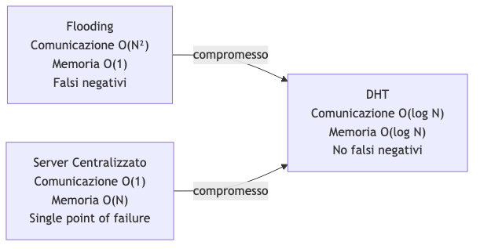
*Fig. — Le DHT si collocano nel punto di compromesso: $O(\log N)$ sia per la comunicazione che per la memoria, senza falsi negativi e con auto-organizzazione.*

Le proprietà chiave che la DHT garantisce rispetto al flooding sono: scalabilità $O(\log N)$, assenza di falsi negativi, e *self-organization* — il sistema gestisce autonomamente join e leave dei nodi, sia volontari che per guasto.

---

## Funzioni Hash

Una **funzione hash** mappa dati di lunghezza arbitraria in un valore di lunghezza fissa (tipicamente un intero). Poiché l'insieme degli input è più grande dell'insieme degli output, le **collisioni** sono inevitabili. In una **hash table** classica, la chiave viene hashata per trovare direttamente il bucket, e ogni bucket contiene in media $\frac{\text{\#items}}{\text{\#buckets}}$ elementi.

Le **funzioni hash crittografiche** devono soddisfare proprietà aggiuntive di sicurezza rispetto alle semplici hash table. Il caso d'uso principale è **SHA** (Secure Hash Algorithm), la famiglia di standard usata anche nelle DHT:

- Input di lunghezza variabile → output di lunghezza fissa (*digest*)
- Una piccola variazione nell'input produce output completamente diversi (*effetto valanga*)
- La funzione è deterministica: lo stesso input produce sempre lo stesso output
- SHA-1 produce un digest di 40 cifre esadecimali = 160 bit → $2^{160}$ valori possibili

> [!example] Output SHA-1 in Java
>
> ```
> SHA1("")    = DA39A3EE5E6B4B0D3255BFEF95601890AFD80709
> SHA1("abc") = A9993E364706816ABA3E25717850C26C9CD0D89D
> SHA1("abd") = CB4CC28DF0FDBE0ECF9D9662E294B118092A5735
> ```
>
> "abc" e "abd" differiscono di un solo carattere ma producono digest completamente diversi — l'effetto valanga in azione. La stringa vuota produce un digest ben definito, non un errore.

Le famiglie disponibili sono SHA-1, SHA-224, SHA-256, SHA-384 e SHA-512, dove le ultime quattro sono note come **SHA-2** e il suffisso indica la lunghezza in bit del digest. Ethereum usa **Keccak** (una variante di SHA-3). Queste funzioni sono il mattone base sia per il consistent hashing delle DHT sia per i puzzle crittografici del Proof of Work di Bitcoin.

---

## Da Memcached alle DHT

**Memcached** è un sistema di caching distribuito per il web: mantiene un pool di server che forniscono accesso rapido alle informazioni, riducendo il carico sul database (l'accesso al DB avviene solo in caso di *cache miss*). L'idea è distribuire una hash table su più server per superare i limiti di memoria di una singola macchina.

Il meccanismo di base: l'hash dell'URL di una risorsa determina in quale server di cache è memorizzata; ogni macchina può calcolare *localmente* quale cache contiene la risorsa cercata, senza comunicazione tra le cache stesse. Questo schema viene esteso alle DHT per i sistemi P2P — ma in uno scenario dinamico emerge immediatamente il **problema del rehashing**.

---

## Il Problema del Rehashing

Le hash table distribuite classiche calcolano il nodo target come $h(\text{key}) \bmod N$, dove $N$ è il numero di server. Con $N$ fisso tutto funziona: 4 bucket con 12 chiavi assegnate uniformemente, ad esempio:

| Bucket | Chiavi assegnate |
|--------|-----------------|
| 1 | 1, 5, 9 |
| 2 | 2, 6, 10 |
| 3 | 3, 7, 11 |
| 4 | 4, 8, 12 |

Ora supponiamo che il bucket 3 vada offline e si aggiunga un nuovo bucket 5. Con $N$ che cambia da 4 a 4 (dopo la rimozione), il calcolo $h(\text{key}) \bmod 4$ rimane valido solo per le chiavi già allineate. Con il nuovo bucket 5 e $N=4 \to N=4$ la situazione è ancora peggio: le chiavi che restano sullo stesso nodo sono solo quelle per cui $h(\text{key}) \bmod 4 = h(\text{key}) \bmod 5$, che è una piccola minoranza.

> [!warning] Entità del problema
>
> Con la funzione classica $\text{SHA}(x) \bmod N$:
> - 4 nodi di caching → 6 nodi: quasi tutte le chiavi devono essere rimappate
> - Con 10 bucket e 1000 chiavi, circa il **99% delle chiavi deve essere riassegnato**
> - Questo produce un traffico enorme che satura la rete, rendendo il sistema inutilizzabile durante ogni operazione di scaling

Il problema è aggravato dal fatto che le chiavi vengono rimappate anche sui nodi che sono rimasti attivi — non solo a causa delle aggiunte o rimozioni, ma per il semplice cambiamento di $N$. In un sistema P2P con churn continuo, questo è inaccettabile.

---

## Consistent Hashing

> [!definition] Consistent Hashing
>
> Tecnica di hashing in cui sia i contenuti che i nodi vengono mappati nello **stesso spazio di indirizzamento**, organizzato come un **anello circolare** (*ring*) di dimensione $2^M$. Ogni nodo gestisce un **intervallo contiguo** di chiavi dell'anello, non un insieme sparso come avviene con il modulo. Lo schema non dipende direttamente dal numero di server: aggiungere o rimuovere nodi richiede di spostare solo una minoranza di elementi — in media $K/n$ chiavi, dove $K$ è il totale delle chiavi e $n$ il numero di nodi.

L'intuizione fondamentale è semplice: invece di mappare gli oggetti a un *indice di bucket* che dipende da $N$, si mappano sia gli oggetti che i nodi nello stesso spazio continuo, e si assegna ogni oggetto al primo nodo che si incontra procedendo in senso orario. Così, quando $N$ cambia, solo i nodi adiacenti alla modifica sono coinvolti nella redistribuzione.

---

## Costruzione di una DHT: l'Anello

La costruzione di una DHT basata su consistent hashing segue tre passi concettuali.

**Passo 1 — Spazio di chiavi comune.** Si definisce un *identifier space* condiviso tra nodi e dati, tipicamente $\{0, 1, \ldots, 2^M - 1\}$ organizzato come un anello modulo $2^M$. Tutti gli identificatori — sia dei nodi che dei contenuti — vivono in questo spazio.

**Passo 2 — Connessione dei nodi.** Ogni nodo è collegato a un numero piccolo e limitato di vicini in modo tale che il numero massimo di hop sia limitato. La topologia dell'overlay definisce diverse strutture possibili: anello con *chord* (scorciatoie), albero, ecc.

**Passo 3 — Assegnazione dei dati.** Sia i nodi che i dati vengono mappati dalla stessa funzione hash nello stesso spazio; si definisce una relazione tra hash dei contenuti e hash dei nodi per determinare chi memorizza cosa.

### Costruzione dell'Anello: Esempio con N=16

Consideriamo uno spazio di identificatori $\{0, \ldots, 15\}$ organizzato come un anello modulo 16, con cinque nodi $a, b, c, d, e$ che ottengono le seguenti posizioni tramite la funzione hash $H$:

$$H(a) = 6, \quad H(b) = 5, \quad H(c) = 0, \quad H(d) = 11, \quad H(e) = 2$$

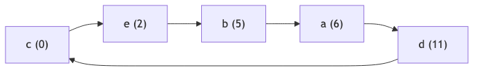
*Fig. — Anello con N=16 e cinque nodi. I nodi (cerchi verdi) sono posizionati alle posizioni 0, 2, 5, 6, 11 dell'anello; ogni nodo punta al proprio successore, formando una lista circolare.*

### Il Successore

Il **successore** `succ(x)` è il primo nodo sull'anello con identificatore $\geq x$, procedendo in senso orario. Importanti distinzioni: `succ` può essere applicato sia a identificatori generici (non occupati da nodi) sia a posizioni di nodi.

> [!example] Calcolo del successore
>
> - `succ(12) = 0` — non ci sono nodi tra 12 e 15, si fa wrap-around all'inizio dell'anello
> - `succ(1) = 2` — il nodo più vicino in senso orario a partire da 1 è il nodo in posizione 2
> - `succ(6) = 6` — la posizione 6 è occupata da un nodo, quindi il successore coincide
>
> È fondamentale distinguere tra gli **identificatori** (tutti i valori 0–15) e i **nodi** (solo le cinque posizioni occupate).

Il successore di un nodo $n$ è definito come `succ(n+1)`:
- Il successore di 0 è `succ(1) = 2`
- Il successore di 2 è `succ(3) = 5`
- Il successore di 5 è `succ(6) = 6`
- Il successore di 6 è `succ(7) = 11`
- Il successore di 11 è `succ(12) = 0` (wrap-around)

### Dove Memorizzare i Dati

I dati vengono memorizzati usando la stessa funzione hash $H$ applicata alla chiave del contenuto. Una coppia `<key, value>` — ad esempio `key="crown"`, `value=JPEG della corona` — ottiene un identificatore $k = H(\text{key})$, e il dato viene archiviato nel nodo `succ(k)`.

Nell'esempio, i dati del gioco vengono distribuiti sull'anello così:

| Oggetto | Hash | Nodo responsabile (`succ`) |
|---------|------|---------------------------|
| Scudo | $H(\text{scudo}) = 12$ | `succ(12) = 0` |
| Ascia | $H(\text{ascia}) = 2$ | `succ(2) = 2` |
| Corona | $H(\text{corona}) = 9$ | `succ(9) = 11` |
| Spada | $H(\text{spada}) = 14$ | `succ(14) = 0` |
| Anello | $H(\text{anello}) = 4$ | `succ(4) = 5` |

Ogni oggetto si "sposta" in senso orario fino al primo nodo che incontra. Lo scudo (hash=12) e la spada (hash=14) atterrano entrambi sul nodo 0 perché non ci sono nodi tra 12 e 15.

### Peer Leave: Consistent Hashing in Azione

> [!example] Rimozione del nodo 11
>
> Se il nodo 11 abbandona la rete, solo le chiavi che gli erano assegnate devono essere rimappate — e vengono assegnate al suo successore, il nodo 0. La corona (hash=9) passa da nodo 11 a nodo 0. Tutti gli altri oggetti (ascia su nodo 2, anello su nodo 5, scudo e spada su nodo 0) restano invariati. Il resto dell'anello non è toccato dalla rimozione.

Questa è la proprietà chiave del consistent hashing: modificare di un'unità il numero di nodi non forza il rimapping globale, ma solo locale.

---

## Proprietà del Consistent Hashing

Quando la hash table viene ridimensionata, in media solo $K/n$ chiavi devono essere rimappate (dove $K$ è il numero totale di chiavi, $n$ il numero di server), a patto che la funzione hash sia uniforme.

- **Rimozione di un nodo**: solo le chiavi associate a quel nodo vengono riassegnate al suo successore. Tutte le altre rimangono invariate.
- **Aggiunta di un nodo**: le chiavi tra il nuovo nodo e il nodo precedente nell'anello vengono riassegnate al nuovo nodo; le altre rimangono invariate.

---

## Node Leave e Node Failure

Una **disconnessione volontaria** richiede tre operazioni: suddividere l'intervallo di indirizzi tra i nodi vicini, copiare le coppie chiave/valore ai nodi corrispondenti, e rimuovere il nodo dalle routing table degli altri nodi.

Un **guasto improvviso** (*node failure*) è più problematico perché tutti i dati memorizzati sul nodo vanno persi se non sono replicati altrove. Le soluzioni adottate nelle DHT reali sono:

- **Replicazione dei dati** su più nodi (ridondanza): ogni chiave viene memorizzata su $r$ successori anziché uno solo
- **Refresh periodico** delle informazioni: i nodi eseguono gossip per mantenere aggiornata la propria visione della rete
- **Percorsi di routing alternativi**: probing periodico dei nodi vicini per rilevarne l'attività; quando si rileva un guasto, si aggiornano le routing table per bypassare il nodo mancante

---

## Data Lookup e Routing

### Lookup Sequenziale

Per effettuare il lookup di una chiave $k$, un nodo calcola $H(k)$ e segue i puntatori al successore fino a trovare il nodo responsabile. Questo è implementato come algoritmo distribuito tramite **RPC** (*Remote Procedure Calls*): la notazione `n.foo()` indica una chiamata remota della funzione `foo()` sul nodo $n$.

> [!example] Lookup di "Crown" dal nodo 2
>
> Il nodo 2 vuole trovare "Crown". Calcola $H(\text{"Crown"}) = 9$. Segue i puntatori al successore: $2 \to 5 \to 6 \to 11$. Il nodo 11 ha la chiave 9 nel proprio intervallo (9 ≤ 11) e restituisce il valore al nodo iniziatore.

Se si usa solo il puntatore al successore diretto, il costo nel caso peggiore è $O(N)$: bisogna attraversare sequenzialmente l'intero anello. Con $N = 10^6$ nodi, questo significa fino a 500.000 hop — inaccettabile.

### Finger Table: Speeding Look Up

Chord risolve l'inefficienza con la **Finger Table**: ogni nodo $n$ mantiene $M$ puntatori verso nodi distanti a salti esponenzialmente crescenti.

> [!definition] Finger Table
>
> $$\text{finger}[i] = \text{succ}(n + 2^{i-1}) \quad \text{per } i = 1, \ldots, M$$
>
> La tabella ha dimensione $M$, dove $N = 2^M$. Ogni nodo conosce: `succ(n+1)`, `succ(n+2)`, `succ(n+4)`, `succ(n+8)`, ..., `succ(n+2^{M-1})`. La dimensione della routing table è $M = \log_2 N$ entry.

L'algoritmo di lookup con finger table funziona così: ad ogni step, il nodo che riceve la query la inoltra al finger il cui identificatore è il massimo che non supera la chiave cercata. Questo "avvicina" il query alla destinazione dimezzando l'intervallo residuo ad ogni hop.

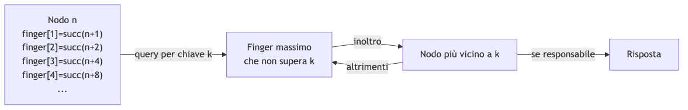
*Fig. — Il meccanismo della finger table: ogni hop dimezza la distanza residua alla chiave cercata, portando il costo totale a $O(\log N)$ hop.*

> [!tip] Scala del miglioramento
>
> Con $N = 10^6$ nodi:
> - Routing sequenziale: fino a **500.000 hop**
> - Finger table: $\log_2(10^6) \approx$ **20 hop**
>
> Il miglioramento è di cinque ordini di grandezza. Sia la routing table che il numero di hop sono $O(\log N)$.

---

## Chord

**Chord** è il DHT di riferimento costruito esattamente sui principi illustrati. Fu sviluppato nel 2001 da un gruppo di ricerca formato da ricercatori del MIT e dell'Università della California (Ion Stoica, Robert Morris, David Liben-Nowell, David R. Karger, M. Frans Kaashoek, Frank Dabek, Hari Balakrishnan) e pubblicato su IEEE/ACM Transactions on Networking con il titolo *"Chord: A Scalable Peer-to-peer Lookup Protocol for Internet Applications"*.

La topologia di Chord è un anello con *chord* — le scorciatoie della finger table sono i "chord" che danno il nome al sistema. Ogni nodo mantiene un puntatore al predecessore (per le operazioni di join/leave) e la finger table per il routing efficiente.

> [!note] Varianti di DHT
>
> Diverse proposte "consistent-hashing compliant" differiscono nel modo in cui i dati vengono associati ai peer e nell'operatore usato per trovare il peer responsabile di una chiave (`FindPeer` o `FindSuccessor`). Esempi notevoli: **CAN** (Content-Addressable Network), **Chord**, **Pastry**, **Tapestry**, **Kademlia**. I termini "Structured Peer-to-Peer" e "DHT" sono spesso usati come sinonimi.

---

## Location Addressing vs Content Addressing

Il **location addressing** è il metodo classico di Internet: un link HTTP punta a una specifica posizione su uno o più server. L'identità del dato è dove si trova, non cosa contiene. Chi controlla quella posizione controlla il contenuto: anche se migliaia di persone hanno scaricato una copia di un dato, HTTP punta a una sola posizione fisica. Il web tradizionale ci costringe a fingere che i dati esistano in un unico posto, con tutte le implicazioni di censura, disponibilità e controllo che ne derivano.

Il **content addressing** rovescia il paradigma: il contenuto viene identificato dalla propria *impronta* crittografica — il suo hash — anziché dalla sua posizione. Avere l'hash di un contenuto permette di ottenerlo da chiunque ne abbia una copia, indipendentemente da dove si trova. L'hash non cambia mai, quindi i link restano validi qualunque sia la fonte, chiunque abbia aggiunto il contenuto, e quando è stato aggiunto.

> [!tip] Implicazioni del Content Addressing
>
> Nel content addressing il link è una *garanzia di integrità*: se ricevo dati il cui hash corrisponde alla chiave cercata, so che sono esattamente quelli che volevo, senza dovermi fidare della sorgente. Non è possibile ricevere contenuti contraffatti spacciandoli per la chiave corretta.

Questo approccio è alla base di **IPFS** (*InterPlanetary File System*), la rete P2P che implementa Web3, il web distribuito. I dati non sono più delegati a server centrali (Facebook, Instagram, Dropbox), ma memorizzati in un ambiente P2P distribuito dove chiunque può recuperare un contenuto da chiunque lo abbia.

### Content Lookup

In un sistema basato su content addressing, il routing è *content-based*: ogni nodo mantiene una routing table che rappresenta una visione parziale della rete. Quando si cerca un dato con hash $k$, il messaggio viene instradato hop-by-hop verso il nodo responsabile di $k$, con ciascun hop che si avvicina alla destinazione. Il numero di hop necessari è $O(\log N)$, con routing table di dimensione $O(\log N)$ per ogni nodo.

---

## API della DHT

Le DHT espongono intenzionalmente un'interfaccia minimale, indipendente dall'applicazione:

- `PUT(key, value)` — inserisce un valore associato a una chiave
- `GET(key)` → `value` — recupera il valore associato a una chiave

Non esiste generalmente una funzione esplicita per spostare le chiavi. Il valore associato a una chiave può essere un file, un indirizzo IP, un riferimento a un peer, o qualsiasi altro dato, a seconda dell'applicazione che usa la DHT come strato infrastrutturale.

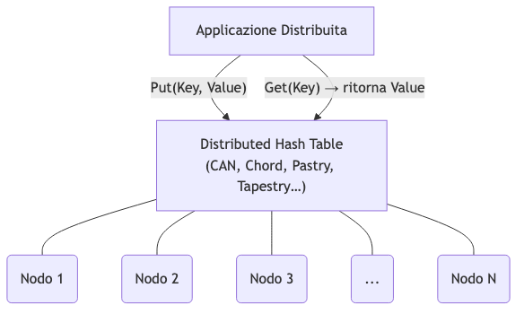
*Fig. — L'API della DHT espone solo Put e Get all'applicazione, nascondendo completamente la complessità della distribuzione.*

---

## Load Balancing e Virtual Server

Il load imbalance in una DHT ha tre cause distinte:

1. **Spazio non uniforme**: un nodo gestisce una porzione di spazio di indirizzi più grande degli altri — risolvibile con una funzione hash uniforme.
2. **Dati pesanti**: lo spazio è distribuito uniformemente, ma il nodo gestisce una *quantità* di dati molto maggiore (le chiavi assegnategli corrispondono a file grandi).
3. **Query concentrate**: lo spazio è distribuito uniformemente, ma il nodo riceve molte più query perché i dati assegnatigli sono molto popolari (*hotspot*).

Il load imbalance produce: minore robustezza del sistema, minore scalabilità, e impossibilità di garantire i bound $O(\log N)$.

La soluzione standard è usare i **virtual server**: ogni nodo fisico mantiene più identità sull'anello — ossia è responsabile di più intervalli non contigui — distribuendo la responsabilità delle chiavi in modo più uniforme. Questo mitiga principalmente i problemi di tipo 1 e parzialmente di tipo 3, ma non risolve completamente il problema degli hotspot dovuti a contenuti virali.

---

## Sfide Aperte delle DHT

> [!warning] DHT Challenges
>
> - **Hotspot**: distribuire le responsabilità in modo uniforme per evitare che alcuni nodi siano molto più carichi di altri. I virtual server aiutano, ma un contenuto estremamente popolare resterà sempre un collo di bottiglia per il nodo responsabile.
> - **Churn**: redistribuire le responsabilità quando i nodi si connettono o disconnettono. In una rete P2P reale il churn è continuo e ad alta frequenza — ogni operazione di join/leave deve essere gestita senza interrompere il servizio.
> - **Trade-off strutturale**: dimensione delle routing table vs traffico nell'overlay vs *stretch* rispetto all'underlay. I percorsi logici nella DHT possono essere molto più lunghi dei percorsi fisici ottimali sulla rete sottostante — un nodo logicamente vicino può essere fisicamente a mezzo mondo di distanza.

---

## Confronto tra Architetture

| Approccio                          | Memoria per nodo | Overhead comunicazione | Query complesse | Falsi negativi | Robustezza |
| ---------------------------------- | ---------------- | ---------------------- | --------------- | -------------- | ---------- |
| **Server Centralizzato**           | $O(N)$           | $O(1)$                 | Sì              | Si             | No (SPOF)  |
| **P2P Non Strutturato (flooding)** | $O(1)$           | $O(N^2)$               | Sì              | No             | Sì         |
| **DHT**                            | $O(\log N)$      | $O(\log N)$            | No              | Si             | Sì         |

---

## Applicazioni delle DHT

Le DHT offrono un servizio generico di memorizzazione e indicizzazione distribuita. Il valore associato a una chiave può essere un file, un indirizzo IP, o qualsiasi altro dato — la semantica dipende dall'applicazione. Esempi concreti di sistemi che usano DHT:

- **IPFS** (*InterPlanetary File System*): file system distribuito content-addressed, base di Web3
- **BitTorrent**: memorizzazione dei riferimenti ai peer in uno swarm (il DHT di BitTorrent è basato su Kademlia)
- **Ethereum**: memorizzazione dei riferimenti ai peer nella rete P2P sottostante al protocollo
- Supporto a servizi di livello superiore: qualsiasi applicazione che necessiti di un registro distribuito di chiave/valore

---

> [!abstract] Sintesi
>
> Le DHT sono sistemi auto-organizzanti, semplici ed efficienti. Il routing è basato su chiave; le chiavi sono distribuite uniformemente tra i nodi, garantendo bottleneck avoidance, inserimento incrementale e fault tolerance. La realizzazione concreta di questo modello tramite consistent hashing con finger table (Chord) porta a una struttura con $O(\log N)$ hop per il lookup e $O(\log N)$ entry nella routing table per nodo. I termini "Structured Peer-to-Peer" e "DHT" sono spesso usati come sinonimi.

---

```{=latex}
\newpage
```

# Kademlia

## Panoramica

Kademlia è un protocollo DHT progettato da Maymounkov e Mazières nel 2002. Il nome viene dal bulgaro: è il nome di una vetta montuosa in Bulgaria, nonché una parola turca per "uomo fortunato". È considerato lo standard de facto per le reti P2P su Internet ed è adottato da Ethereum, IPFS (nelle varianti S/Kademlia e Sloppy Kademlia), BitTorrent (Mainline DHT) ed eMule (rete KAD).

Kademlia presenta caratteristiche che non sono offerte da nessun'altra DHT esistente:
- Le informazioni di routing si diffondono **automaticamente** come effetto collaterale dei lookup, senza messaggi dedicati
- Supporta il **parallel routing** (richieste multiple in parallelo) per ridurre latenza e timeout
- Usa un'unica metrica — lo **XOR** — per calcolare distanze, instradare messaggi e organizzare la routing table
- È **fault tolerant**: se uno o più peer abbandonano la rete, i dati — replicati su più peer — restano recuperabili
- Non richiede motori di database complessi: i dati sono coppie chiave-valore, quindi anche dispositivi IoT con storage limitato possono partecipare

---

## Chord: Riepilogo

In Chord i nodi scelgono un ID quasi uniformemente casuale nell'anello. Gli identificatori sull'anello vengono chiamati **chiavi** (per distinguerli dagli ID dei nodi). Ogni blocco contiguo dell'anello è assegnato a un nodo. Un nodo con identificatore ID mantiene puntatori verso i nodi `successor(ID + 2^i)` per potenze di 2 fino a $2^m$ (finger table), dove $m$ è il numero di bit degli identificatori.

---

## Spazio degli Identificatori

Sia i nodi che i contenuti sono identificati da hash a $M$ bit. Lo spazio di tutti i possibili identificatori è visualizzato come un **trie binario completo**: ogni livello rappresenta un bit, ogni nodo interno ha al più due figli (figlio sinistro → bit 0, figlio destro → bit 1), e ogni foglia rappresenta un identificatore completo.
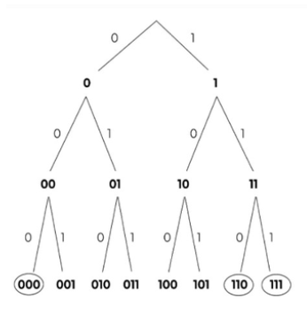
In pratica, lo spazio degli identificatori è enorme e i nodi che partecipano alla DHT sono molto meno degli identificatori possibili. Il **node tree** è una vista alternativa al trie completo: un albero binario non bilanciato che mostra solo le foglie corrispondenti ai nodi effettivamente presenti nella rete. Una foglia del node tree corrisponde a un **prefisso identificatore** che identifica univocamente quel peer — ovvero il prefisso più corto che non è condiviso da nessun altro peer nell'overlay.

### Mappatura delle Chiavi ai Nodi

Per assegnare una chiave (identificatore di un dato) a un nodo, Kademlia usa il **Lowest Common Ancestor (LCA)**: il punto più profondo dell'albero in cui il percorso della chiave e quello del nodo coincidono prima di biforcarsi. La chiave viene assegnata al nodo con LCA più profondo con essa.

In caso di parità tra due nodi che hanno lo stesso LCA rispetto a una chiave, si spezza il pareggio guardando il bit più significativo in cui i due nodi differiscono (il suo indice è $b$): la chiave viene assegnata al nodo il cui $b$-esimo bit coincide con il $b$-esimo bit della chiave.

> [!example] Tie-breaking
>
> Peer 110 e 111 hanno lo stesso LCA rispetto alla chiave 101. I due peer differiscono al terzo bit. Poiché il terzo bit di 101 è 1, la chiave 101 viene assegnata al nodo 111.

---

## La Metrica XOR

### Derivazione

Per trovare il nodo più vicino a una chiave, si può usare un algoritmo brute-force: si esaminano tutti gli ID dei nodi bit per bit dal più significativo al meno significativo; ad ogni posizione, se almeno un candidato ha lo stesso bit della chiave, si eliminano quelli che differiscono. La complessità è $O(n \cdot m)$.

Un approccio più elegante: si definisce un valore scalare di distanza che penalizza le differenze ai bit più significativi più di tutte le differenze ai bit meno significativi messe insieme. Poiché $2^i > \sum_{j=0}^{i-1} 2^j$, la penalità giusta per una differenza al $i$-esimo bit è $2^i$. Questo è esattamente ciò che fa l'operazione **XOR**.

> [!definition] Distanza XOR
>
> La distanza tra due identificatori $x$ e $y$ è definita come $d(x, y) = x \oplus y$. Un contenuto viene memorizzato sul nodo con distanza XOR minima rispetto alla sua chiave.

> [!warning] XOR ≠ distanza numerica
>
> Due identificatori possono essere vicini numericamente ma lontani secondo la metrica XOR:
> $1000 \oplus 0111 = 1111 = 15$ (distanza XOR massima), mentre la differenza numerica è solo 1.
> La metrica XOR si basa sull'albero binario, non sulla linea numerica.

### Proprietà della Metrica XOR

La metrica XOR soddisfa le proprietà di una metrica formale:

- $d(x, x) = 0$
- $d(x, y) > 0$ se $x \neq y$
- **Simmetria** — $d(x,y) = d(y,x)$. Se $A$ vede $B$ come vicino, anche $B$ vede $A$ come vicino. Questo permette a entrambi di apprendere informazioni di routing dall'altro gratuitamente. In Chord questo non vale: se $x$ riceve una query da $y$, $y$ ha $x$ nella sua finger table, ma $x$ potrebbe non avere $y$ come finger → le informazioni nelle query ricevute non possono arricchire la finger table.
- **Disuguaglianza triangolare** — $d(x,z) \le d(x,y) + d(y,z)$. Andare direttamente da $x$ a $z$ è sempre almeno comodo quanto passare per $y$. Segue dalla transitività: $d(x,y) \oplus d(y,z) = d(x,z)$.
- **Unidirezionalità** — Dato un nodo $x$ e una distanza $\Delta$, esiste un **unico** nodo $y$ tale che $d(x,y) = \Delta$. Esempio: $x = 1001$, $\Delta = 0001$, l'unico punto a distanza $\Delta$ da $x$ è $y = 1000$. Le ricerche per la stessa chiave convergono sempre sullo stesso percorso, permettendo di usare **cache lungo la rotta** per evitare hotspot.

### Relazione tra Prefisso Comune e Distanza

La metrica XOR è legata al prefisso identificatore: più lungo è il prefisso comune tra due nodi, minore è la loro distanza XOR. Due identificatori che condividono un prefisso di lunghezza $p$ e differiscono negli ultimi $i = L - p$ bit hanno distanza XOR:

$$2^{i-1} \le d(x,y) < 2^i$$

> [!example] Subtree distances
>
> $X = 010110$, $Y = 011110$, $X \oplus Y = 001000$, $d(x,y) = 2^3 = 8$ (minima per quel sottalbero).
>
> Due foglie nei due sottoalberi opposti (prefisso comune = 0): $0111 \oplus 1000 = 1111 = 15$ (massima), $0111 \oplus 1111 = 1000 = 8$ (minima).

---

## Routing Table e K-Buckets

### Struttura

> [!definition] K-Bucket
>
> Lista di al massimo $k$ contatti, ognuno memorizzato come tripla `(Node ID, IP address, UDP port)`. I contatti sono ordinati per recency: il meno recente in testa, il più recente in coda. Il bucket $i$ contiene contatti con distanza XOR $d \in [2^{i-1}, 2^i)$ dal nodo proprietario.

Ogni nodo mantiene una routing table di $M$ bucket (uno per ogni sottoalbero dal punto di vista del nodo). I bucket per distanze piccole (lunga prefix comune) tendono ad avere pochi contatti — ci sono pochi nodi in quel vicinato. I bucket per distanze grandi coprono porzioni enormi dello spazio e sono generalmente pieni. Ad ogni passo di routing, la query si avvicina di almeno un bit al target: costo totale $O(\log N)$ — è il **prefix match routing**.

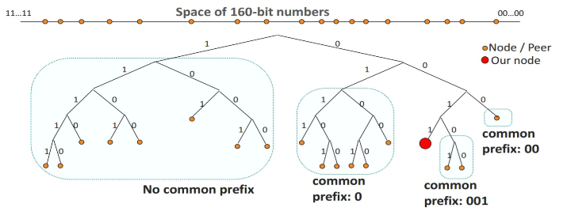
Il parametro $k$ è scelto in modo che la probabilità di $k$ guasti simultanei sia trascurabile.

### Aggiornamento dei K-Buckets

Quando arriva un messaggio da un nodo:

```
if sender già nel bucket:
    sposta sender in coda (più recente)
else if bucket non pieno:
    inserisci sender in coda
else:
    ping al nodo in testa (il meno recente)
    if non risponde:
        rimuovi il nodo in testa, inserisci sender in coda
    else:
        sposta il nodo in testa in coda, scarta sender
```

Questa politica **favorisce i nodi vecchi**: l'analisi di tracce Gnutella mostra che più a lungo un nodo è rimasto online, più è probabile che continui a farlo (*least recently seen eviction*). Ne derivano due vantaggi:
- La routing table è stabile e punta a nodi affidabili
- **Resistenza ai DoS**: un attaccante non può svuotare la routing table inviando messaggi da nodi fasulli, perché i nuovi contatti vengono inseriti solo se i vecchi scompaiono

### Refresh Periodico

I k-bucket vengono aggiornati automaticamente dal traffico dei messaggi. Tuttavia, se un bucket non riceve messaggi per un certo periodo, Kademlia esegue un **refresh** orario: sceglie un ID casuale nel range del bucket e vi effettua una ricerca. Se il nodo con quell'ID risponde, viene inserito nel bucket.

---

## Primitive del Protocollo

Kademlia espone quattro RPC su **UDP**:

| Primitiva | Descrizione |
|---|---|
| `PING` | Verifica se un nodo è online |
| `STORE(key, value)` | Istruisce un nodo a memorizzare una coppia chiave-valore |
| `FIND_NODE(target)` | Restituisce $k$ triple `(ID, IP, UDP port)` per i $k$ nodi più vicini al target. Può attingere da un singolo bucket o da più bucket se il più vicino non è pieno; restituisce sempre $k$ elementi, salvo che il nodo conosca meno di $k$ nodi in totale |
| `FIND_VALUE(key)` | Se il nodo possiede il valore corrispondente a `key`, lo restituisce direttamente. Altrimenti si comporta come `FIND_NODE` e restituisce $k$ triple; spetta al richiedente continuare la ricerca |

---

## Lookup Iterativo e Parallelo

### Tipi di Lookup

Un lookup in Kademlia è una procedura di ricerca distribuita che si avvicina progressivamente a un ID target nello spazio XOR. Il target può essere:
- Un **node ID** (node lookup): usato per mantenere le routing table e trovare il nodo in cui memorizzare un dato
- Un **key ID** (value lookup): usato per recuperare il valore associato a una chiave

### Procedura a 3 step

1. Il nodo iniziatore trova il nodo più vicino al target nella propria routing table (tramite distanza XOR)
2. Invia la query a quel nodo chiedendo nodi più vicini al target
3. Ripete il processo con i nodi più vicini ricevuti

Il lookup si ferma quando: nessuna risposta restituisce nodi più vicini di quelli già noti, oppure il nodo più vicino noto è già stato interrogato. Ad ogni iterazione, la metrica XOR si riduce della metà — il numero di hop è $O(\log N)$.

### Routing Parallelo (α)

Il parametro $\alpha$ controlla la concorrenza: invece di aspettare un nodo alla volta, si interrogano $\alpha$ nodi simultaneamente. Questo riduce la latenza totale e rende il sistema robusto ai nodi lenti o offline.

> [!example] Utilità del parallel routing
>
> Il nodo blu 0011 cerca il nodo rosso 1101. Conosce i nodi verdi 1001 e 1110.
> $d(1101, 1001) = 4$, $d(1101, 1110) = 3$.
> Il nodo 1001 è più distante, ma potrebbe conoscere il target mentre 1110 non lo conosce.
> Con routing parallelo, 0011 invia la query a entrambi simultaneamente.

> [!warning] Il nodo più vicino non è necessariamente il percorso più breve
>
> Dati $x$, $y$, $z$ con $d(y,x) < d(z,x)$: è possibile che $z$ conosca $x$ mentre $y$ non lo conosce. L'unidirezionalità della metrica XOR garantisce che tutti i percorsi convergano verso il target, quindi inviare la query a $\geq 1$ nodi più vicini è sufficiente.

Quando $\alpha = 1$ il lookup è simile a Chord (un passo alla volta); con $\alpha > 1$ Kademlia ha la flessibilità di scegliere tra $k$ nodi a ogni passo.

### Algoritmo Completo

```
k-closest ← α contatti dal k-bucket non vuoto più vicino alla chiave
             (se meno di α, si aggiungono contatti da bucket adiacenti)
closestNode ← il nodo più vicino in k-closest

repeat:
    seleziona α contatti da k-closest non ancora interrogati
    invia FIND_NODE in parallelo e in modo asincrono
    ogni contatto vivo risponde con k nodi
    aggiungi i nuovi nodi a k-closest, aggiorna closestNode
until nessun nodo più vicino di closestNode viene restituito

invia FIND_NODE in parallelo ai k nodi più vicini non ancora interrogati
return k nodi più vicini
```

---

## Join, Store e Leave

### Ingresso nella rete (Join)

1. Il nuovo nodo contatta un **bootstrap node** noto; la routing table iniziale contiene solo la coppia `(nuovo nodo, bootstrap node)` in un unico bucket
2. Esegue `FIND_NODE(proprio ID)` → scopre nodi vicini a sé, riempie i bucket ad alto indice, e si fa conoscere dagli altri nodi
3. Esegue `FIND_NODE(ID casuale)` per bucket sempre più distanti dal proprio, arricchendo progressivamente tutti i bucket

La flessibilità di questa procedura è superiore rispetto a Chord, che richiede passi di join più rigidi.

### Archiviazione di un dato (Store)

1. Si esegue un lookup per trovare i $k$ nodi con ID più vicini alla chiave
2. Si invia `STORE` a tutti i $k$ nodi → il dato è replicato $k$ volte

**Pubblicazione periodica**: i dati sono *soft-state* e devono essere rinfrescati. Il nodo che ha pubblicato un dato deve **ripubblicare periodicamente** per contrastare il churn. Nella versione per file sharing, la ripubblicazione avviene ogni 24 ore. Ottimizzazione: se un nodo riceve un `STORE`, suppone che sia stato inviato anche ai vicini stretti e non ripubblica nell'ora successiva, riducendo i messaggi scambiati.

**Caching lungo il percorso**: i valori vengono **cached** nel primo nodo sul percorso di lookup che non li conosceva. Questo aiuta a distribuire il carico per dati molto popolari.

### Disconnessione (Leave)

La disconnessione non richiede operazioni esplicite: se un nodo non risponde, viene silenziosamente rimosso dai k-bucket degli altri nodi.

---

## Kademlia vs Chord

| Aspetto | Chord | Kademlia |
|---|---|---|
| **Metrica** | Distanza numerica (anello) | XOR |
| **Simmetria** | No — finger table asimmetriche | Sì — apprendimento mutuale gratuito |
| **Routing** | Ricorsivo | Iterativo + parallelo ($\alpha$ nodi) |
| **Lookup** | $O(\log N)$ hop | $O(\log N)$ hop |
| **Aggiornamento routing table** | Messaggi dedicati | Effetto collaterale dei lookup |
| **Località** | Non considerata | RTT memorizzato per ogni contatto; preferisce il contatto con RTT minore |
| **Tolleranza ai guasti** | Limitata | Alta (parallel routing + bucket policy) |

In Chord, se $x$ riceve una query da $y$, $y$ ha $x$ nella sua finger table ma $x$ potrebbe non avere $y$ come finger — le informazioni nelle query ricevute non si possono usare per arricchire la finger table. In Kademlia la simmetria della metrica permette a ogni nodo di arricchire la propria routing table attraverso le query che riceve.

---

## Punti di Forza e Debolezze

> [!abstract] Strengths
>
> - Basso overhead di messaggi di controllo
> - Tolleranza a guasti e disconnessioni dei nodi
> - Selezione di percorsi a bassa latenza (RTT-aware)
> - Limiti di prestazione dimostrabili formalmente

> [!warning] Weaknesses
>
> - Distribuzione non uniforme dei nodi nello spazio degli ID → routing table sbilanciata e routing inefficiente
> - Bilanciamento del carico di memorizzazione non completamente risolto
> - Protocollo originariamente sottospecificato → proliferazione di implementazioni diverse
> - Difficile produrre risultati analitici precisi
> - Risultati di routing non deterministici (tempo, vicinato)

```{=latex}
\newpage
```

# Lezione 5 — (Lab) P2P Networks in Bitcoin ed Ethereum

## Inquadramento della lezione

Questo primo laboratorio del corso apre la sezione applicativa della parte P2P: anziché discutere in astratto le proprietà delle reti overlay, si guarda come due blockchain reali — Bitcoin ed Ethereum — abbiano implementato, ciascuna a modo suo, il livello di comunicazione peer-to-peer su cui tutto il resto (consenso, propagazione delle transazioni, sincronizzazione degli stati) si appoggia.

L'obiettivo è fare da ponte tra la teoria vista nelle lezioni iniziali (classificazione degli overlay, Kademlia, DHT) e ciò che si troverà effettivamente installando un client Bitcoin Core o un nodo `geth`. La chiave di lettura è il confronto: **Bitcoin ha scelto un overlay non strutturato** basato su gossip, **Ethereum uno strutturato** basato su Kademlia — due risposte molto diverse allo stesso problema, scoprire peer con cui parlare senza conoscere la topologia globale.

> [!info] Informazioni organizzative
>
> Il modulo di laboratorio segue in modo "organico" il modulo teorico: la scaletta degli argomenti si adatta a quelli già visti a lezione. Il materiale di riferimento è costituito dai link inseriti nelle slide di ogni laboratorio, e le domande possono essere poste in ufficio (333 Dip. Informatica) o via Teams su richiesta. Ogni studente lavora con il proprio dispositivo (*bring your own device*).

---

## Il problema di base delle reti P2P

Prima di confrontare i due approcci conviene ricordare qual è il problema comune. In una rete peer-to-peer un nodo possiede **solo informazioni topologiche locali**: non conosce — e, per ragioni di privacy e resistenza agli attacchi, **non deve** conoscere — la topologia complessiva. Ogni partecipante vede soltanto i propri vicini diretti.

Questa limitazione non è solo una scelta di design: è un requisito di sicurezza. Una rete in cui ogni nodo pubblica la lista completa dei peer sarebbe banalmente attaccabile, perché un avversario potrebbe ricostruire mappature globali e scegliere bersagli mirati.

Una rete P2P ben progettata deve essere resistente ad almeno tre famiglie di attacchi:

- **Sybil attack**: l'avversario crea un numero arbitrario di identità fittizie per influenzare la rete (routing, consenso, gossip)
- **Eclipse attack**: l'avversario circonda un nodo vittima con peer sotto il suo controllo, isolandolo dal resto della rete
- **Partizionamento**: l'avversario divide la rete in componenti non comunicanti, permettendo ad esempio di presentare stati divergenti a due sottoinsiemi di vittime

> [!warning] Bootstrapping problem
>
> Come fa un nodo appena avviato a scoprire il primo peer a cui connettersi, se per definizione non conosce nessuno? Questa "gallina-uovo" è nota come **bootstrapping problem** e viene tipicamente risolta con una lista di nodi di fiducia hardcoded nel client o con query DNS. È un punto di fragilità: chi controlla quei seed controlla potenzialmente anche chi riesce a entrare nella rete.

La scelta architetturale fondamentale, fatta questa premessa, è fra due famiglie di overlay:

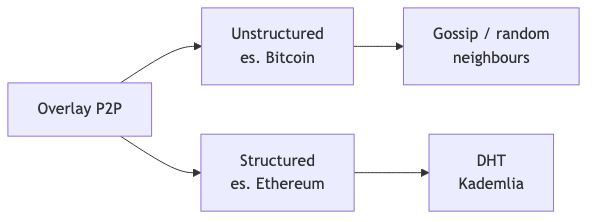
*Fig. — Le due grandi famiglie di overlay P2P utilizzate dalle principali blockchain.*

In entrambi i casi lo scopo è lo stesso: **abilitare la comunicazione per un'applicazione decentralizzata**. Le strade scelte per raggiungerlo sono molto diverse.

---

## Bitcoin: overlay non strutturato e gossip

### Struttura generale

Bitcoin — almeno nella sua forma attuale, senza considerare Lightning — è una **rete di comunicazione P2P il cui unico scopo è scambiarsi informazioni su uno stato globale condiviso**. Le informazioni sono transazioni e blocchi; lo stato globale è il set UTXO.

Le scelte progettuali del livello network di Bitcoin si possono riassumere così:

| Aspetto | Scelta di Bitcoin |
|---|---|
| Overlay | Non strutturato, **gossip** |
| Bootstrapping | Lista DNS + hardcoded |
| Privacy | Randomizzazione (nessuna geolocalizzazione) |
| Sicurezza | Connessioni cifrate solo dalla v27+ (apr. 2024) |
| Trasporto | TCP |

> [!note] Cifratura tardiva
>
> Fino all'aprile 2024 le connessioni tra nodi Bitcoin erano in chiaro. Questo permetteva, a chi era posizionato sulla rete (ISP, punti di interscambio), di distinguere facilmente il traffico Bitcoin e fare fingerprinting. La v27 introduce finalmente il supporto nativo al cifrato, con BIP 324.

### Node discovery in Bitcoin

Un nodo appena avviato segue un protocollo relativamente semplice per entrare a far parte della rete:

1. **Ottiene una lista di indirizzi candidati** da DNS di fiducia o da una lista hardcoded: ad esempio `nslookup seed.bitcoin.sipa.be` restituisce gli IP di una serie di nodi "seeder" mantenuti da sviluppatori noti della community. L'elenco hardcoded nel sorgente vive in `src/chainparamsseeds.h`.
2. **Invia un messaggio `version`** a uno o più di questi peer per tentare la connessione.
3. Se il peer accetta, risponde con un messaggio **`verack`** (version acknowledgement).
4. Da quel momento il nodo può chiedere altri peer a chi già conosce tramite il messaggio **`getaddr`**, ricevendo in risposta una lista di indirizzi di altri partecipanti alla rete.
5. Periodicamente, il nodo **annuncia se stesso** (cioè invia la propria `addr`) ad alcuni vicini scelti casualmente, così che l'informazione della sua presenza si propaghi per gossip.

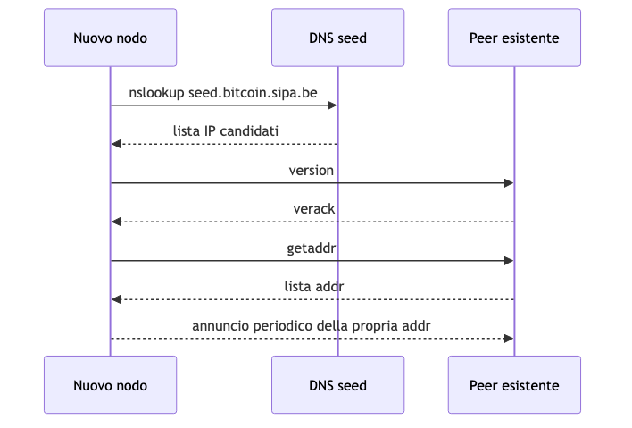
*Fig. — Handshake iniziale di un nuovo nodo Bitcoin: dal seed DNS all'inserimento attivo nella rete.*

Una volta stabilita la rete di vicini, i messaggi applicativi veri e propri — transazioni e blocchi — vengono propagati con un meccanismo a tre fasi: `inv` annuncia la disponibilità di un oggetto (un hash), `getdata` lo richiede, infine arriva il `block` o `tx`. Tecniche come **trickle** e **diffusion** randomizzano i tempi di propagazione per ridurre la possibilità che un osservatore risalga al nodo originatore di una transazione.

### Gestione delle connessioni

Un nodo Bitcoin mantiene un numero di connessioni "target" tra **8 e 11**, e un massimo configurabile (di default **125**). Il parametro `-maxconnections=<num>` controlla quest'ultimo. La logica concreta risiede in `src/net.h` nel repository di Bitcoin Core.

> [!tip] Perché 8 connessioni
>
> Il numero basso non è casuale: pochi peer stabilmente connessi bastano a garantire la raggiungibilità (ogni messaggio fa solo pochi hop prima di propagarsi a tutta la rete), limitano il consumo di banda e — soprattutto — rendono più costoso per un avversario circondare un nodo. Con 125 come limite massimo c'è spazio per accettare connessioni in ingresso da altri nodi.

### Monitoraggio della rete

Essendo Bitcoin una rete aperta, chiunque può scansionarla e tenerne conteggio. Due strumenti spesso citati:

- [bitnodes.io](https://bitnodes.io/) — conta i nodi raggiungibili e mostra grafici storici
- [21.ninja](https://21.ninja/) — visualizza la propagazione dei blocchi

Questi dashboard sono utili in due sensi: danno un'idea di quanti nodi sono "full" (oggi dell'ordine di decine di migliaia) e, guardando la serie temporale, permettono di correlare eventi (hard fork, aggiornamenti software) con variazioni nella topologia.

### Attacchi specifici al layer P2P di Bitcoin

Oltre ai Sybil/eclipse classici, la scarna sicurezza di rete di Bitcoin ha prestato il fianco storicamente a:

- **DNS poisoning** dei seed: se l'attaccante compromette la risoluzione DNS di un seed, può imporre a tutti i nuovi nodi una visione parziale della rete
- **Network listening**: l'intercettazione in chiaro del traffico (risolta solo con la v27)
- **Fingerprinting tramite il "addresses cookie"**: sfruttando il modo in cui i nodi memorizzano e ripropagano le `addr` si può ricostruire una mappa implicita dei peer, violando la privacy topologica

> [!note] Riferimento
>
> L'articolo di Biryukov et al. (<https://arxiv.org/pdf/1410.6079>) è un classico su come il livello di rete di Bitcoin leaks informazioni che minano la privacy degli utenti.

---

## Ethereum: overlay strutturato con Kademlia

Ethereum risponde allo stesso problema di Bitcoin — scambiare informazioni sullo stato globale — ma con un impianto più sofisticato, sia perché nato dopo (con più esperienza di attacchi), sia perché le sue esigenze applicative (molti sub-protocolli) lo richiedono.

| Aspetto | Scelta di Ethereum |
|---|---|
| Overlay | Strutturato, **Kademlia** |
| Bootstrapping | Lista hardcoded di *bootnodes* |
| Privacy | Randomizzazione nella scelta dei vicini |
| Sicurezza | Connessioni **autenticate e cifrate** |
| Trasporto | **UDP** per node discovery, **TCP** per comunicazione |

### Perché una DHT per il P2P

Kademlia è una DHT — una *distributed hash table* — e l'argomento per cui una DHT sia preferibile a un gossip non strutturato è ormai consolidato:

- **Decentralizzazione**: non serve coordinarsi per costruire la propria tabella di routing
- **Fault tolerance / dinamismo**: la struttura si adatta al *churn* (nodi che entrano ed escono continuamente), entro limiti ragionevoli
- **Scalabilità e load balancing**: la quantità di informazione locale cresce come $O(\log n)$ nel numero di nodi, e il routing richiede $O(\log n)$ hop

> [!tip] Il log magico
>
> Le DHT "log/log" sono il punto di equilibrio ideale: uno stato di routing piccolo che garantisce comunque latenze basse. Questo è ciò che permette a una rete con decine di migliaia di nodi Ethereum di continuare a scoprire peer in tempi ragionevoli.

### Come Kademlia è adattato in Ethereum

Le differenze rispetto al Kademlia "da manuale" sono interessanti e riflettono la diversa finalità. In Kademlia tradizionale si usa la DHT per cercare **valori associati a chiavi**. In Ethereum **non si fanno value lookup**: la DHT serve esclusivamente per trovare peer vicini — dove "vicino" non significa vicino geograficamente, ma vicino nello spazio degli identificatori.

| Dimensione | Kademlia "classico" | Kademlia di Ethereum |
|---|---|---|
| Chiavi vs nodi | Spazi distinti, key lookup | Stesso spazio, **solo node lookup** |
| Dimensione ID | Tipicamente 160 bit | **512 bit** (chiave pubblica) |
| Hash per distanza | SHA-1 | **Keccak-256** |
| Numero di bucket | 160 | **256** |
| Elementi per bucket | $k = 20$ | $k = 16$ |
| Meccanismo di reputazione | Uptime | Reputazione complessa (ping/pong + metriche) |

Gli **identificatori dei peer** in Ethereum sono la chiave pubblica stessa (già casuale per costruzione), e la distanza è calcolata come XOR tra due ID, prendendo il bit più significativo — esattamente lo schema di Kademlia. La tabella di routing è organizzata in 256 bucket, uno per ogni possibile "prefisso di distanza", ciascuno contenente fino a 16 elementi.

> [!definition] Enode (Ethereum Node Identifier)
>
> Il formato con cui un nodo Ethereum è identificato a livello di network è:
>
> ```
> enode://<public-key>@<IP>:<TCP-port>?discport=<UDP-discovery-port>
> ```
>
> Esempio reale:
>
> ```
> enode://6f8a80d14311c39f...cac9f77166ad92a0@10.3.58.6:30303?discport=30301
> ```
>
> La parte prima della `@` è la chiave pubblica a 512 bit (codificata esadecimale); poi l'IP, la porta TCP per la comunicazione autenticata, e la porta UDP dedicata alla *discovery* Kademlia.

> [!warning] Privacy e ricostruzione della tabella
>
> La tabella di routing di un nodo viene usata per **conoscere** i peer, ma non necessariamente per **connettersi** direttamente a loro. Questo è uno scudo di privacy: se un avversario riuscisse a ricostruire interamente le tabelle di routing di altri nodi, potrebbe dedurne informazioni sensibili. I vicini di comunicazione effettivi vengono scelti a caso tra i peer responsivi di tutti i bucket.

### Stack a livelli (tiered stack)

La comunicazione in Ethereum è stratificata in modo che ogni livello si occupi di una sola responsabilità:

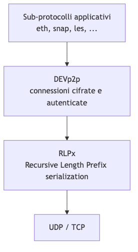
*Fig. — Lo stack tiered di Ethereum: RLPx fornisce serializzazione e trasporto cifrato, DEVp2p gestisce le connessioni, e diversi sub-protocolli usano lo stesso canale in multiplex.*

- **RLPx** (*Recursive Length Prefix* serialization + crittografia) è il livello che rende possibile trovare peer e parlare con loro in modo sicuro. Definisce l'handshake iniziale e la serializzazione binaria dei messaggi.
- **DEVp2p** è il protocollo che stabilisce e mantiene le connessioni persistenti su cui poi si parlano i sub-protocolli.
- **Sub-protocolli** come `eth` (transazioni, blocchi, stato), `snap` (sync veloce), `les` (light client) viaggiano sulla stessa connessione DEVp2p in **multiplexing**.

### Node discovery in pratica

La scoperta dei peer avviene in due fasi distinte, sui due trasporti diversi:

**Fase UDP (Kademlia)** — localizzare peer:

1. Il nodo chiede i "vicini di se stesso" a uno dei **bootnode** hardcoded (vedi `params/bootnodes.go` nel repository go-ethereum).
2. Ricevuta la lista iniziale, iterativamente invia `findnode` ai peer appena scoperti per riempire i bucket.
3. Si effettua un **bonding** via `ping/pong` per verificare che i peer siano vivi.

**Fase TCP (RLPx + DEVp2p)** — stabilire la comunicazione vera e propria:

1. **Handshake RLPx**: verifica versioni, stabilisce chiavi effimere, autentica la controparte. Documentazione ufficiale: `devp2p/rlpx.md#initial-handshake`.
2. **Messaggio `Hello`** per comunicare le capability: quali sub-protocolli si è in grado di parlare. Da qui in poi il multiplexing è possibile.

Importante: indipendentemente da quale sub-protocollo applicativo si usi, è sempre RLPx a fornire il canale sottostante di autenticazione e cifratura.

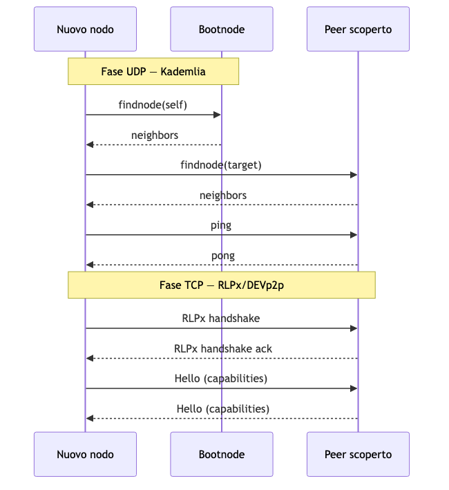
*Fig. — Le due fasi della scoperta e connessione in Ethereum: UDP per trovare peer, TCP per parlarci in sicurezza.*

### Monitorare la rete Ethereum

Come per Bitcoin, anche Ethereum ha dashboard pubbliche. [etherscan.io/nodetracker](https://etherscan.io/nodetracker) è il riferimento più usato per avere un quadro del numero di nodi attivi e della loro distribuzione geografica.

---

## Esempio pratico: connettersi con `geth` a una rete privata

La parte operativa del laboratorio mostra come usare `geth` (il client Go di Ethereum) per entrare in una piccola rete privata, bypassando o controllando il meccanismo di discovery.

### Opzioni rilevanti

Due flag da ricordare:

- `--bootnodes enode://...,enode://...` permette di specificare *manualmente* la lista di bootnode invece di affidarsi a quelli hardcoded. Serve per reti private.
- `--nodiscover` disabilita del tutto la node discovery: utile quando si vuole una rete chiusa di nodi noti a priori.

### Procedura passo-passo

> [!example] Avvio di un nodo su una rete privata
>
> 1. Installare `geth` seguendo la [guida ufficiale](https://geth.ethereum.org/docs/getting-started/installing-geth).
> 2. Creare una cartella di lavoro per i dati del nodo:
>    ```bash
>    mkdir testLecture1
>    ```
> 3. Procurarsi il file di genesi `testlecture1.json` (il significato dei suoi campi verrà discusso più avanti nel corso).
> 4. Inizializzare il datadir con il file di genesi:
>    ```bash
>    geth --datadir testLecture1/ init testlecture1.json
>    ```
> 5. Avviare il nodo con una `networkid` custom e una porta dedicata, aprendo la console JavaScript interattiva:
>    ```bash
>    geth --datadir ~/testLecture1/ --networkid 35353 --port 3333 --vmdebug console
>    ```

Una volta dentro la console si possono ispezionare e manipolare i peer:

- `admin.nodeInfo` — stampa la propria `enode`, da condividere con altri per farsi trovare
- `admin.peers` — elenca i peer attualmente connessi
- `admin.addPeer("enode://...")` — aggiunge esplicitamente un peer di cui si conosce l'enode, senza passare dalla discovery

> [!tip] Reti private e `--nodiscover`
>
> In un laboratorio con pochi nodi conosciuti, disabilitare la discovery e usare `admin.addPeer` è la strada più semplice per ottenere una rete pulita, dove si ha controllo totale su chi parla con chi. Riprodurre questo scenario è essenziale per poter osservare in maniera deterministica il comportamento dei protocolli ai livelli superiori (consenso, smart contract, ...).

---

## Attacchi alla topologia di Ethereum

Il design di Kademlia è stato pensato per **scoraggiare** (non impedire) la ricostruzione completa della routing table altrui. Due sono le strategie che un avversario può tentare:

- **Usare il set noto degli ID esistenti**: invece di cercare ID casuali nello spazio a 512 bit (enorme), ci si concentra sugli ID dei peer effettivamente presenti nella rete. Questo riduce drasticamente lo spazio di ricerca.
- **Brute force mirato**: poiché in pratica solo i bucket con prefisso corto comune sono popolati (gli altri sarebbero dedicati a "distanze" in cui statisticamente non c'è nessuno), si concentra lo sforzo lì.

La difesa principale — lo **hash step** con Keccak-256 applicato agli ID — rende il costo della ricostruzione dipendente dal target e non lineare: non basta fare 256 richieste `findnode`, bisogna scegliere bene i target per coprire i bucket popolati.

> [!question] Domanda aperta di ricerca
>
> Quando un nodo riceve un `findnode`, risponde con un messaggio `neighbors` contenente i 16 nodi più vicini trovati nella propria tabella. Quanti messaggi `findnode`, con quali target, sono necessari per scaricare completamente la routing table di un nodo?
>
> È una domanda non banale. I lavori di riferimento sono Henningsen et al. (<https://ieeexplore.ieee.org/document/8969695>) e Marcus et al. (<https://eprint.iacr.org/2018/236.pdf>), che analizzano eclipse attack e ricostruzione di tabelle Kademlia in Ethereum.

---

## Sintesi comparativa

> [!abstract] Bitcoin vs Ethereum al layer P2P
>
> Entrambe le reti rispondono allo stesso problema — propagare informazioni in una rete aperta senza conoscere la topologia globale — ma con filosofie opposte. **Bitcoin** privilegia la semplicità di un gossip non strutturato: poche connessioni, propagazione randomizzata, sicurezza di rete aggiunta solo tardivamente. **Ethereum** investe in un overlay strutturato via Kademlia, con autenticazione e cifratura by design, e uno stack tiered (RLPx / DEVp2p / sub-protocolli) che gli permette di ospitare comodamente molti protocolli applicativi sulla stessa infrastruttura. La differenza non è cosmetica: influenza la resilienza agli attacchi di eclipse, la facilità di fingerprinting, e la capacità di evolvere il protocollo aggiungendo nuovi sub-protocolli senza rompere la rete.

```{=latex}
\newpage
```

# Crittografia per P2P e Blockchain

Due strumenti crittografici sono alla base di blockchain e DHT: le **funzioni di hash** (collegano i blocchi rendendoli tamper-proof) e le **firme digitali** (impediscono agli utenti di ripudiare le proprie azioni). Strumenti più avanzati — zero knowledge, strutture dati autenticate, accumulatori crittografici — verranno trattati più avanti nel corso.

---

## Funzioni di Hash Crittografiche

Una funzione di hash converte una stringa binaria di lunghezza arbitraria (anche 0) in una stringa di lunghezza fissa. L'output — detto *digest*, *fingerprint* o informalmente *checksum* — ha sempre la stessa dimensione indipendentemente dall'input (video, audio, testo, eseguibili).

Per le strutture dati ordinarie, una funzione hash deve essere: deterministica, efficiente da calcolare (es. `y = x mod table_dim`), pseudo-casuale per distribuire uniformemente gli elementi, minimizzare le collisioni. Le funzioni hash **crittografiche** aggiungono ulteriori proprietà di sicurezza.

### Proprietà Fondamentali

**Determinismo** — La stessa funzione hash applicata più volte allo stesso documento produce sempre lo stesso risultato.

**Fast Computation** — L'hash deve essere computazionalmente efficiente da calcolare.

**One-Way (Pre-image Resistance)** — Dato un hash $y$, deve essere computazionalmente impossibile trovare un $x$ tale che $H(x) = y$. Con SHA-1 (160 bit) un attacco brute-force richiederebbe $2^{71}$ anni.

**Avalanche Effect** — Un singolo bit di differenza nell'input produce un hash completamente diverso; cambiare anche solo 1 bit modifica tutto l'output.

**Collision Resistance** — Le collisioni esistono matematicamente (per il *Pigeonhole Principle*: con più input che output, almeno un output deve corrispondere a più di un input), ma devono essere computazionalmente impossibili da costruire intenzionalmente.

> [!example] Pigeonhole Principle
>
> Se si scelgono 51 numeri interi tra 1 e 100, almeno due devono essere consecutivi. Dimostrazione: le "buche" sono le coppie {1,2}, {3,4}, ..., {99,100} — 50 coppie per 51 numeri. Per il principio del piccione, almeno una buca contiene due piccioni.

**Weak Collision Resistance (Second Pre-image Resistance)** — Dato un input $x$ noto, deve essere difficile trovare un $x' \neq x$ tale che $H(x') = H(x)$. Questo previene, ad esempio, la distribuzione di software corrotto spacciato per autentico: un attaccante non può generare un file malevolo con lo stesso hash del software legittimo.

### Il Paradosso del Compleanno e la Sicurezza Effettiva

Per trovare una collisione in modo garantito bastano $2^n + 1$ input distinti (per Pigeonhole). Tuttavia il **Birthday Paradox** abbassa drasticamente il limite pratico:

In una stanza di $n$ persone scelte a caso, $n = 23$ è sufficiente perché la probabilità che due condividano il compleanno superi il 50%. Questo perché la seconda persona deve evitare 1 compleanno su 365, la terza 2 su 365, ecc.; il prodotto delle probabilità di "nessuna collisione" scende rapidamente. Formalmente, con $\sqrt{2^n} = 2^{n/2}$ input casuali si ha già alta probabilità di collisione.

Per una funzione hash con $n$-bit di output, bastano $\approx 2^{n/2}$ input casuali per trovare una collisione con probabilità 0,5. La sicurezza effettiva è quindi **metà dei bit di output**.

> [!warning] Quantificazione brute force
>
> Se un computer calcola 10.000 hash/sec, calcolare $2^{128}$ hash richiederebbe $10^{27}$ anni. Anche se tutti i computer mai costruiti dall'umanità avessero calcolato sin dall'inizio dell'universo, la probabilità di aver trovato una collisione sarebbe infinitesimamente piccola.

| Algoritmo | Bit output | Sicurezza effettiva | Stato |
|---|---|---|---|
| MD2, MD4 | 128 bit | 64 bit | Ritirati — vulnerabili |
| MD5 | 128 bit | 64 bit | Vulnerabile (ok per app non di sicurezza) |
| SHA-1 | 160 bit | 80 bit | Ritirato — debole |
| SHA-256 | 256 bit | 128 bit | Usato da Bitcoin — sicuro |
| SHA-512 | 512 bit | 256 bit | Corrente — massima sicurezza |

Almeno **80 bit** di sicurezza sono necessari. Le funzioni hash hanno storicamente una vita utile di circa **10 anni**. Lo standard attuale è **SHA-3** (Keccak), adottato anche da Ethereum.

> [!warning] Hash non crittografici
>
> La **parità a blocco a 8 bit**: è banale trovare una collisione invertendo un numero pari di bit nella stessa colonna. Il **CRC** (Cyclic Redundancy Check) è il resto di una divisione polinomiale lunga — ottimo per rilevare burst error nelle comunicazioni, ma facile da collidere intenzionalmente. CRC è stato usato erroneamente nel protocollo **WEP** (Wired Equivalent Privacy) dove si richiedeva integrità crittografica.

### Cryptanalysis

Oltre al brute force, la **crittoanalisi** cerca debolezze logiche nell'algoritmo: scorciatoie, buchi nella funzione. Una funzione si dice *broken* quando è possibile trovare collisioni significativamente più velocemente del brute force.

### Proprietà Avanzate

**Hiding** — Dato $H(R \| x)$, deve essere impossibile ricavare informazioni su $x$. Formalmente: $H$ è *hiding* se, scelto $R$ da una distribuzione con alta min-entropy (nessun valore più probabile degli altri), dato $H(R \| x)$ è computazionalmente impossibile trovare $x$.

Le funzioni base non garantiscono hiding se lo spazio di input è piccolo e prevedibile (es. password), rendendole vulnerabili ai **Rainbow Table Attack**: si pre-calcolano le hash di tutte le password possibili in una tabella; al login si cerca il hash nel database. La soluzione è concatenare un valore casuale $R$ a 256 bit ad alta min-entropy: $H(R \| x)$, rendendo lo spazio di ricerca enorme.

**Puzzle-Friendliness** — Per qualsiasi output target $y$ e valore casuale $k$ ad alta min-entropy, trovare $x$ tale che $H(k \| x) = y$ richiede un attacco esaustivo in tempo $\approx 2^n$, senza scorciatoie algoritmiche. Questa proprietà implica che nessuna strategia di risoluzione è significativamente migliore della ricerca esaustiva.

---

## Applicazioni delle Funzioni di Hash

### Applicazioni non-blockchain

**Gestione password** — I sistemi memorizzano $H(\text{password})$ invece del testo in chiaro. Anche in caso di compromissione del database, le password originali non sono recuperabili.

**Integrity checks (anti-tampering)** — Si calcolano checksum per i file da scaricare o trasmettere. Prima di aprire o eseguire un file, si calcola il suo hash e lo si confronta con il checksum atteso: se coincidono, il file non è stato alterato o corrotto.

**Data deduplication** — Se due file hanno lo stesso hash, sono identici — senza dover confrontare i file interi. Usato ad esempio da **eMule** con MD5 per verificare che due file siano identici anche se descritti da keyword diverse.

**DHT** — Le chiavi vengono hashate per localizzare il nodo responsabile in modo efficiente e deterministico.

### Applicazioni blockchain

**Hash Pointers** — Un hash pointer è sia un riferimento a una posizione (dove si trova il dato) sia un hash crittografico del dato in quella posizione. Permette di verificare che i dati non siano stati alterati. Bitcoin usa una **hash chain** (blockchain) per memorizzare il ledger delle transazioni: ogni blocco contiene l'hash del blocco precedente, garantendo la *tamper-freeness* — modificare un blocco invalida tutti i successivi.

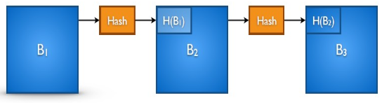

**Commitment Scheme** — Permette di "chiudere in una busta" una decisione senza terze parti fidate.

**Hash Puzzles (Proof of Work)** — Trovare $x$ tale che $H(r \| x) \in S$.

---

## Commitment Scheme

### Motivazione: Sasso-Carta-Forbici online

Alice e Bob giocano a sasso-carta-forbici via Internet senza terze parti fidate. Il problema: chi va per primo perde, perché l'avversario può adattarsi. La soluzione è che chi va per primo *si impegna* a una scelta senza rivelarla.

Il flusso con commitment crittografico ($R_A$ = valore casuale scelto da Alice):

$$A \to B: h_A = H(R_A \| \text{paper})$$
$$B \to A: \text{scissors}$$
$$A \to B: R_A, \text{paper}$$

Bob verifica che $h_A = H(R_A \| \text{paper})$. Se sì, sa che Alice non ha barato.

- Bob non riesce a determinare la scelta di Alice perché non conosce $R_A$ (*hiding* + *pre-image resistance*)
- Alice non può cambiare idea dopo aver ricevuto "scissors": dovrebbe trovare $R'_A$ tale che $H(R_A \| \text{paper}) = H(R'_A \| \text{stone})$ → violazione della **second-preimage resistance**

La proprietà per cui il mittente non può cambiare il valore impegnato si chiama **binding**.

### API e Implementazione

```
com   ← commit(value, nonce)     // sigilla il valore
                                 // pubblica com
match ← verify(com, nonce, value) // apre la busta
```

Implementazione con funzione hash:
- `commit(msg, nonce)` = $H(\text{msg} \| \text{nonce})$
- `verify(com, nonce, msg)` = $(H(\text{msg} \| \text{nonce}) == \text{com})$

L'uso del `nonce` (number used once) garantisce la proprietà hiding anche quando lo spazio dei messaggi è piccolo.

---

## Search Puzzle (Proof of Work)

Un search puzzle consiste in: una funzione hash crittografica $H$, un valore casuale $r$, un insieme target $S$. La soluzione è un valore $x$ tale che:

$$H(r \| x) \in S$$

Si tratta di un **partial pre-image attack**: si deve trovare parte dell'input affinché l'output appartenga a un insieme (non a un singolo valore come nella pre-image resistance). La difficoltà si modula definendo la dimensione di $S$: un $S$ più grande rende il puzzle più facile. In **Bitcoin**, $S$ è definito dal numero di zeri iniziali richiesti nell'hash SHA-256 del blocco.

La puzzle-friendliness garantisce che non esistano scorciatoie: l'unico metodo è il tentativo esaustivo.

---

## Crittografia Asimmetrica e Firme Digitali

La crittografia asimmetrica usa una coppia di chiavi: una **chiave privata** ($K^-$), nota solo al proprietario, e una **chiave pubblica** ($K^+$), derivata matematicamente da essa ma non invertibile. La proprietà fondamentale è la **reciprocità**: ciò che una chiave cifra, l'altra decifra, e viceversa.

**Cifratura (riservatezza)** — Alice cifra un messaggio con la chiave *pubblica* di Bob; solo Bob, con la sua chiave *privata*, può decifrarlo.

**Vantaggi rispetto alla crittografia simmetrica**: nessun bisogno di concordare preventivamente una chiave condivisa. Chi vuole ricevere messaggi cifrati deve solo rendere pubblica la propria chiave pubblica. Finché la chiave privata è tenuta segreta, nessun altro può decifrare.

### Firme Digitali

> [!definition] Firma Digitale
>
> Meccanismo equivalente a una firma autografa ma molto più sicuro. Fornisce tre garanzie: **autenticazione** (il messaggio è stato creato dal mittente riconosciuto), **non ripudio** (il mittente non può negare di aver firmato — la firma può essere portata in tribunale come prova), **integrità** (il messaggio non è stato alterato durante la trasmissione).

Il flusso è l'**inverso della cifratura**: il mittente firma con la propria chiave *privata*, chiunque può verificare con la chiave *pubblica*.

**Firma naive**: Bob firma $m$ cifrando con la sua chiave privata $K^-_B$, creando $K^-_B(m)$. Invia ad Alice la coppia $(m, K^-_B(m))$. Alice verifica applicando la chiave pubblica: $K^+_B(K^-_B(m)) = m$. Se coincide, sa che solo Bob — possessore di $K^-_B$ — ha potuto firmare.

Poiché firmare asimmetricamente un messaggio lungo è computazionalmente costoso, in pratica si firma solo il **digest**:

$$\text{firma} = K^-_B(H(m))$$

Il verificatore calcola $H(m)$ e lo confronta con $K^+_B(\text{firma})$: se coincidono, l'autenticità è garantita.

Per avere simultaneamente **riservatezza + integrità**: il mittente firma con la propria chiave privata e cifra il pacchetto completo con la chiave pubblica del destinatario. Il destinatario decifra con la propria chiave privata e verifica con la chiave pubblica del mittente.

### API Standard

```
(sk, pk) := generateKeys(keysize)    // sk = signing key, pk = public key
sig      := sign(sk, message)        // cifra con sk → firma
isValid  := verify(pk, message, sig) // decifra sig con pk, confronta con message
```

Proprietà richiesta: `verify(pk, message, sign(sk, message)) == true`.

**Sfida principale**: cosa impedisce a un avversario di imparare a firmare messaggi analizzando la chiave pubblica? Le costruzioni basate su problemi hard (fattorizzazione, logaritmo discreto) rendono questo computazionalmente impossibile.

| Algoritmo | Base matematica | Note |
|---|---|---|
| RSA | Fattorizzazione di numeri primi (one-way trapdoor function) | Standard storico |
| DSA | Logaritmo discreto | Standard NIST |
| ECDSA | Logaritmo discreto su curve ellittiche | Usato da Bitcoin |

**Bitcoin e ECDSA**: ogni transazione Bitcoin contiene in input una firma e una chiave pubblica; in output il codice (script) per la procedura di verifica.

### Certification Authorities

La debolezza degli schemi asimmetrici è la **weak authentication**: verificare la firma garantisce solo che chi ha firmato possiede la chiave privata corrispondente — non che sia davvero chi afferma di essere.

> [!example] Pizza Prank
>
> Alice crea un ordine di pizze a nome di Bob, lo firma con la *propria* chiave privata, e invia alla pizzeria la propria chiave pubblica spacciandola per quella di Bob. La pizzeria verifica la firma (correttamente), consegna le pizze a Bob. La weak authentication non basta.

Le **Certification Authority (CA)** risolvono il problema: emettono certificati digitali che legano crittograficamente un'identità alla sua chiave pubblica, firmando essi stessi il certificato con la propria chiave privata (di cui tutti si fidano).

---

## Hash vs Cifratura

> [!note] Differenza concettuale
>
> La **cifratura** è bidirezionale: con la chiave giusta si cifra e si decifra. L'**hashing** è irreversibile per definizione: non esiste un'operazione di "de-hashing". Sono strumenti complementari, non intercambiabili.

---

## RIPEMD-160 e Bitcoin

Bitcoin usa **due** funzioni hash: SHA-256 per il Proof of Work e **RIPEMD-160** (160 bit, output) per la derivazione degli indirizzi wallet. Il doppio hash `RIPEMD160(SHA256(pubkey))` produce l'indirizzo Bitcoin a partire dalla chiave pubblica.

```{=latex}
\newpage
```

# Strutture Dati per DHT e Blockchain

Questa lezione copre quattro strutture dati fondamentali per sistemi distribuiti e blockchain: **Hash Pointer**, **Filtri di Bloom**, **Merkle Tree** e **Merkle Patricia Trie**.

---

## Hash Pointer

> [!definition] Hash Pointer
>
> Un puntatore tradizionale indica *dove* si trova un dato. Un hash pointer indica *dove* si trova il dato **e** ne contiene l'hash crittografico, permettendo di verificare che non sia stato alterato. È un puntatore *tamper-evident*.

L'idea è costruire strutture dati concatenando componenti tramite hash pointer invece di puntatori normali. Per calcolare l'hash pointer a un blocco, si fa l'hash dell'intero blocco **incluso** il suo hash pointer al blocco precedente.

L'esempio più noto è la **blockchain**: ogni blocco contiene l'hash pointer al blocco precedente. Modificare il blocco $k$ invalida il suo hash, quindi non coincide con il puntatore nel blocco $k+1$. In una blockchain **Proof of Work**, ogni blocco contiene anche la prova che il PoW è stato eseguito con successo: modificare i dati richiede di rieseguire il PoW per tutti i blocchi successivi — computazionalmente impossibile.

Gli hash pointer funzionano su qualsiasi struttura senza cicli: liste, alberi, DAG. Applicazioni:
- **Bitcoin/Ethereum**: catena di blocchi con SHA-256 e RIPEMD-160 (doppio hash)
- **IPFS**: Merkle DAG
- **eMule** (*Advanced Intelligent Corruption Handling*): prima applicazione storica; verifica che i blocchi di un file scaricato dalla rete non siano stati manomessi, sfruttando i Merkle Tree

---

## Filtri di Bloom

### Il Problema

Dato un insieme $S = \{s_1, s_2, \ldots, s_n\}$ con $n$ molto grande, vogliamo rispondere alla domanda "l'elemento $k$ appartiene a $S$?" usando poca memoria. Memorizzare tutti gli elementi esplicitamente è proibitivo. La soluzione è un'approssimazione: si accetta un trade-off tra spazio occupato e probabilità di falsi positivi.

> [!definition] Filtro di Bloom
>
> Struttura dati probabilistica per membership query. Può rispondere:
> - "$k$ **non** appartiene a $S$" → **garantito** (nessun falso negativo)
> - "$k$ **forse** appartiene a $S$" → con una certa probabilità di falso positivo

### Costruzione

Un filtro di Bloom è un vettore $B[1 \ldots m]$ di $m$ bit (inizialmente tutti a 0) e $k$ funzioni di hash $h_1, \ldots, h_k$, indipendenti e uniformemente distribuite, ciascuna mappante in $[1, m]$. Non è necessario che siano crittografiche: bastano funzioni veloci. Esempio: $h_i(x) = MD5(x \| i)$.

**Inserimento** di un elemento $x \in S$: si calcolano $h_1(x), \ldots, h_k(x)$ e si impostano a 1 i bit corrispondenti. Un bit può essere target di più di un elemento.

**Lookup** di un elemento $y$: si calcolano $h_1(y), \ldots, h_k(y)$.
- Se **tutti** i bit corrispondenti sono 1 → $y$ è *probabilmente* in $S$
- Se **anche uno solo** è 0 → $y$ è *certamente* assente

I falsi positivi accadono quando tutti i bit di un elemento estraneo sono già stati impostati a 1 da altri elementi.

### Probabilità di Falso Positivo

L'analisi si può modellare col paradigma **balls and bins**: inserire $n$ elementi con $k$ funzioni equivale a lanciare $kn$ palline in $m$ secchi.

Con $n$ elementi inseriti, la probabilità che un bit specifico sia ancora a 0 è:

$$p' = \left(1 - \frac{1}{m}\right)^{kn} \approx e^{-kn/m}$$

La probabilità di un falso positivo (tutti i $k$ bit a 1 per un elemento assente) è:

$$P_{fp} = \left(1 - e^{-kn/m}\right)^k$$

Questa dipende da due parametri:
- **$m/n$** (bit per elemento): per $k$ fisso, al crescere di $m$ la $P_{fp}$ **decresce esponenzialmente**
- **$k$** (numero di funzioni di hash): fissato $m/n$, la $P_{fp}$ prima decresce poi **risale** all'aumentare di $k$. Con pochi bit per elemento (es. $m/n = 2$) troppe funzioni riempiono il filtro di 1 e peggiorano il risultato; con $m/n = 10$ aumentare $k$ diminuisce sempre la $P_{fp}$

> [!example] Regola pratica
>
> Il filtro diventa efficace quando $m = c \cdot n$ con $c$ costante. Con $m = 8n$ (8 bit per elemento) e $k \approx 5\text{–}6$ funzioni, la probabilità di falso positivo è circa $2\%$ — buon compromesso con un numero limitato di bit.

### Operazioni sugli Insiemi

| Operazione | Metodo | Note |
|---|---|---|
| Unione $S_1 \cup S_2$ | OR bit a bit di $B_1$ e $B_2$ | Esatto (stessi $m$ e $k$) |
| Intersezione $S_1 \cap S_2$ | AND bit a bit di $B_1$ e $B_2$ | Approssimato — un bit a 1 in entrambi può venire da elementi diversi non nell'intersezione |
| Cancellazione | Non supportata | Azzerare un bit rimuoverebbe anche altri elementi che lo condividono |

Per supportare la cancellazione si usano i **Counting Bloom Filter**: ogni entry è un contatore invece di un bit. L'inserimento incrementa, la cancellazione decrementa.

### Applicazioni Reali

| Sistema | Uso |
|---|---|
| **Bitcoin (SPV client)** | I client mobili costruiscono un filtro con gli indirizzi di interesse e lo inviano a un nodo completo (bandwidth saving + privacy). Il nodo filtra le transazioni rilevanti senza trasmettere l'intera blockchain |
| **Ethereum** | I *log bloom* negli header dei blocchi riassumono gli eventi degli smart contract. Esempio: trovare tutti i token venduti da un utente in un blocco di 500 transazioni — si interroga il log bloom per la presenza dell'utente e si analizza il blocco solo in caso di match, evitando il parsing sequenziale |
| **Google Chrome** | Filtro locale per verificare se un URL è in un database di siti malevoli, prima di fare una query remota al server |
| **Google BigTable** | Evita costosi disk lookup cercando prima nel filtro, aumentando le performance delle query al database |

---

## Merkle Tree

### Il Problema dell'Authenticated File Storage

Alice salva un file $F$ (contenuto $D$) su un server remoto e cancella la copia locale. Quando lo recupera, come verifica che il server non abbia restituito un file alterato $D' \neq D$?

- **Soluzione 1** (banale): non cancellare $D$ — inutile se manca la memoria
- **Soluzione 2** (hash singolo): Alice conserva $H(D)$; verifica confrontando $H(D') = H(D)$. Funziona per il file intero, ma se Alice vuole solo un frammento deve scaricare tutto e ricalcolare l'hash
- **Soluzione 3** (Merkle Tree): aggiungere struttura al commitment — non un singolo hash ma una gerarchia di hash

> [!definition] Merkle Tree
>
> Struttura dati introdotta da **Ralph Merkle nel 1979** per sintetizzare grandi quantità di dati con verifica efficiente. È un albero binario completo di hash costruito da un insieme iniziale $\{x_1, \ldots, x_n\}$ (con $n$ potenza di 2):
> - Le **foglie** contengono l'hash di ciascun dato: $y_i = H(x_i)$
> - I **nodi interni** contengono l'hash della concatenazione dei figli: $H(\text{figlio\_sx} \| \text{figlio\_dx})$
> - La **radice** (**Merkle Root Hash**) riassume crittograficamente l'intero dataset

### Costruzione

Con $n$ dati $x_1, x_2, \ldots, x_n$ e funzione hash $H$:
- Ogni nodo interno memorizza $H(x \| y) = H(\text{concatenazione dei figli})$
- Il commitment finale è il Merkle Root $y_{2n-1}$
- **Costo di costruzione**: $O(n)$ spazio e $O(n)$ hash
  
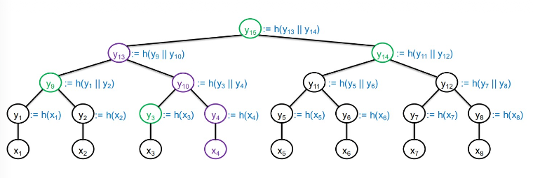
### Merkle Proof (Proof of Inclusion)

Protocollo file storage:
1. Alice invia $D$ al server; il server memorizza $(F, D)$
2. Alice calcola il **Merkle Tree Root** (MTR) da $D$, conserva MTR ($O(1)$ — 256 bit), cancella $D$
3. Più tardi: Alice chiede al server il chunk $x_i$
4. Il server (Prover) restituisce $x_i$ + **prova di inclusione** $p$ (gli hash dei fratelli lungo il percorso foglia→radice)
5. Alice (Verifier) verifica $p$ rispetto al MTR conservato

> [!example] Merkle Proof Concreta
>
> Per dimostrare che $D = x_4$ appartiene all'albero, si esibiscono i fratelli lungo il percorso: $y_3$, $y_9$, $y_{14}$.
>
> La verifica ricalcola:
> - $z_4 = H(D)$
> - $z_{10} = H(y_3 \| z_4)$
> - $z_{13} = H(y_9 \| z_{10})$
> - $z_{15} = H(z_{13} \| y_{14})$
>
> Si controlla che $z_{15} = y_{15}$ (la radice fidata). Se sì, il chunk è autentico.

| Proprietà | Valore |
|---|---|
| Costo costruzione | $O(n)$ spazio e hash |
| Spazio commitment | $O(1)$ — solo il Merkle Root (256 bit) |
| Dimensione prova | $O(\log n)$ hash |
| Costo di verifica | $O(\log n)$ operazioni |
| Falsi negativi | Impossibili — se $x_i \in \{x_1,\ldots,x_n\}$ la prova è sempre costruibile |
| Falsi positivi | Impossibili — una prova falsa richiederebbe trovare una collisione hash |

### Proof of Non-Membership

Per dimostrare che $\text{Data} \notin \{x_1, \ldots, x_n\}$: si ordinano le foglie e si trovano $x_i < \text{Data} < x_{i+1}$; si dimostrano le inclusioni di $x_i$ e $x_{i+1}$.

### Applicazioni

- **Bitcoin**: memorizza le transazioni in ogni blocco
- **Ethereum**: usa Merkle-Patricia Tries per stato e transazioni
- **IPFS**: Merkle DAG
- **Apache Cassandra**: verifica dell'integrità dei dati replicati

---

## Trie, Patricia Trie e Merkle Patricia Trie

### Trie (Prefix Tree / Radix Tree)

Il nome *trie* viene da "retrieval". È una struttura ad albero per stringhe in cui ogni arco è etichettato con un carattere (o lettera dell'alfabeto); un percorso dalla radice a un nodo *marcato* forma una stringa valida. Con l'alfabeto inglese ogni nodo può avere fino a 26 figli.

**Ricerca**: si scende dall'alto seguendo i caratteri della stringa; se si trova il percorso e il nodo finale è marcato → successo; se si è bloccati o il nodo finale è non marcato → fallimento.

**Problema**: la maggior parte dei nodi ha un solo figlio, creando lunghe catene inutili (es. "Ann", "Anna", "Annab", "Annabe", "Annabel" formano un percorso senza biforcazioni). Lo spazio richiesto è elevato.

### Patricia Trie

**PATRICIA** = *Practical Algorithm To Retrieve Information Coded In Alphanumeric* (1960). È una versione compressa del trie: le catene di nodi a figlio unico vengono **compresse in un singolo arco** con etichetta multipla (la concatenazione delle etichette dei nodi compressi). Il risultato è un albero in cui ogni nodo interno ha **almeno due figli**.

Il Patricia Trie funziona anche come **dizionario di coppie (chiave, valore)**: le chiavi sono le stringhe rappresentate nell'albero, i valori sono memorizzati nei nodi terminali. Usato in Ethereum per lo stato dei contratti.

### Nibble

In Ethereum le chiavi sono stringhe esadecimali suddivise in **nibble** (mezzo byte = 4 bit = 1 carattere esadecimale). Questo permette una condivisione più **granulare** dei prefissi: 16 possibili direzioni per ogni nodo interno (anziché 256 per i byte interi).

### Merkle Patricia Trie (Ethereum)

> [!definition] Merkle Patricia Trie
>
> Struttura ibrida introdotta nel **Yellow Paper di Ethereum** e ora usata nella maggior parte delle blockchain EVM-based. Combina:
> - La **compressione dei prefissi** del Patricia Trie → ricerca veloce e deterministica
> - La **garanzia crittografica** dei Merkle Tree → integrità e tamper-proof validation
>
> Usata da Ethereum per memorizzare lo stato degli account/contratti e le transazioni.

Le coppie (chiave, valore) in Ethereum possono essere:
- `(indirizzo account → saldo)`
- `(identificatore transazione → importo trasferito)`

I nodi del Merkle Patricia Trie sono di tre tipi:

| Tipo | Contenuto | Ruolo |
|---|---|---|
| **Leaf node** | Nibble finali della chiave + valore | Nodo terminale; memorizza il valore |
| **Extension node** (shared node) | Nibble condivisi (prefisso comune) + hash pointer al branch node | Compressione del prefisso comune |
| **Branch node** | Array di 16 elementi (uno per nibble 0–F) + eventuale valore | Punto di biforcazione tra prefissi |

> [!example] Costruzione MPT
>
> Inserzione di 'do' → creazione di un nodo foglia.
> Inserzione di 'puppy' → il prefisso comune (in esadecimale '646f') genera uno shared node + branch node; la nuova foglia viene collegata tramite un **hash pointer** (l'hash del nodo foglia stesso) → questa è la componente *Merkle* dell'albero. Il nibble '6' è condiviso tra tutti i prefissi → viene creato un nodo dedicato al livello di nibble.

Un singolo hash pointer alla radice del MPT garantisce l'integrità crittografica dell'intero stato di Ethereum: qualunque modifica cambia la radice.

---

## Riepilogo

| Struttura | Problema risolto | Complessità | Garanzie |
|---|---|---|---|
| **Hash Pointer** | Tamper-evidence su strutture concatenate | $O(1)$ per verifica | Qualunque manomissione è rilevabile |
| **Filtro di Bloom** | Membership query su insiemi enormi | $O(k)$ insert/lookup | No falsi negativi; falsi positivi controllabili con $m/n$ e $k$ |
| **Merkle Tree** | Autenticazione di frammenti di dati | $O(n)$ costruzione, $O(\log n)$ prova/verifica | Nessun falso positivo né negativo |
| **Merkle Patricia Trie** | Stato globale distribuito e verificabile | $O(\log n)$ lookup | Integrità crittografica + ricerca efficiente per prefisso |

```{=latex}
\newpage
```

# Introduzione alla Blockchain

## Il Ledger Distribuito

> [!definition] Ledger
>
> Un registro cronologico di eventi, **append-only**: si possono solo aggiungere voci, mai modificare o cancellare quelle passate. Funziona come un notaio digitale: tutti i partecipanti devono concordare sul suo contenuto.

Un ledger non serve solo per le transazioni finanziarie: qualunque applicazione che necessita di un log di eventi può beneficiarne. Un ledger distribuito viene replicato tra i nodi di una rete P2P: ogni nodo possiede la stessa copia immutabile.

> [!example] Alice come intermediaria
>
> Alice gestisce un'azienda che fa da intermediaria tra dettaglianti e grossisti. Ha difficoltà a mantenere un ledger consistente perché serve centinaia di clienti. Decide di condividere il ledger con tutti: ciascuno mantiene una copia e la aggiorna. Emerge immediatamente il problema della **consistenza**: chi decide cosa è scritto nel ledger?

Quando il ledger è organizzato come una sequenza di blocchi concatenati prende il nome di **blockchain**. Esistono architetture alternative — **IOTA**, ad esempio, usa un DAG invece di una catena lineare.

Ogni blocco contiene tre elementi:
- **Dati** — le transazioni (es. "Alice invia X a Bob")
- **Hash del blocco** — impronta crittografica del contenuto
- **Hash del blocco precedente** — il collegamento che forma la catena (hash pointer)

La catena parte dal **Genesis Block**. Modificare un blocco cambia il suo hash, invalidando tutti i successivi. In una blockchain **Proof of Work**, ripristinarli non richiede solo ricalcolare gli hash: bisogna trovare un valore che, combinato con il nuovo hash, risolva il PoW per ogni blocco successivo. Questo è computazionalmente impossibile. Altre blockchain possono usare meccanismi diversi (es. PoS).

---

## Il Problema del Consenso

In un sistema distribuito senza autorità centrale, chi decide quale operazione aggiungere al registro?

> [!definition] Consenso
>
> Accordo tra i nodi di una rete distribuita sull'**ordine e la validità** delle informazioni memorizzate su un ledger condiviso e replicato. Il consenso è il meccanismo che definisce: chi decide quale operazione viene aggiunta alla blockchain, e quale tra le operazioni da confermare viene scelta.

Il consenso è essenziale per prevenire il **double spending**: le informazioni digitali si copiano facilmente — i bit sono più facili da copiare della carta — quindi senza un accordo collettivo nulla impedisce di spendere la stessa moneta due volte. Se la maggioranza è onesta, i nodi dovrebbero votare contro le transazioni di double spending.

Un approccio classico è il **consenso basato sul voto**: ogni operazione viene trasmessa in broadcast sulla rete e si raccolgono i voti; la maggioranza determina la correttezza delle transazioni e l'ordine dei blocchi.

In un mondo ideale funzionerebbe, ma in reti P2P aperte ci sono due ostacoli reali:
- Ritardi e partizioni di rete (*jitter*, nodi che non si vedono temporaneamente)
- Nodi malintenzionati (**byzantine parties**) che possono comportarsi in modo arbitrario

---

## L'Attacco Sybil

Il punto debole del consenso a voto in reti aperte: cosa significa "maggioranza" se chiunque può creare identità false?

> [!definition] Attacco Sybil
>
> Un attaccante inietta nella rete un numero arbitrario di identità fittizie per ottenere la maggioranza dei voti e manipolare il consenso. Il nome viene dalle Sibille dell'antica Grecia — profetesse attraverso cui parlava una divinità, metafora di più identità per la stessa persona; rappresentate nel pavimento del **Duomo di Siena**. In informatica il libro di riferimento è *Sybil* (Flora Rheta Schreiber, 1973), su una donna con 16 personalità distinte.

Iniettare identità false è banale: basta registrarsi molte volte con la stessa DHT. Il singolo nodo impersona così molteplici identità logiche.

**Obiettivi dell'attacco Sybil:**
- Routing attacks (controllare i percorsi di instradamento)
- Controllare la replica dei dati
- Disturbare la connettività della rete
- Essere la maggioranza nel voto → consenso nelle criptovalute

**Difese:**
- **Proof of Work** (Bitcoin, Ethereum): richiede potere computazionale
- **Proof of Stake**: richiede stake economico
- **Certified Node-IDs**: richiede un'autorità centrale — non è una soluzione P2P

### Double Spending con Sybil

Alice esegue un attacco Sybil assumendo più del 50% delle identità nella rete. Poi tenta di spendere lo stesso bitcoin sia verso Bob che verso Charlie. Usando le sue identità multiple (>50%), approva con il consenso entrambe le transazioni di double spending → l'attacco ha successo.

---

## La Proof of Work

**La soluzione di Bitcoin**: invece di contare le identità, si conta la **potenza di calcolo**.

> [!definition] Proof of Work
>
> Per partecipare al consenso, un nodo deve risolvere un problema computazionalmente difficile ma facile da verificare. Creare identità multiple è inutile se si ha un solo computer: per manipolare la rete bisogna controllare la maggioranza della potenza di calcolo globale. Gli attacchi Sybil diventano costosi e inutili.

La PoW funziona come una **lotteria** in cui i biglietti sono molto costosi (risolvere il problema). Il vincitore della lotteria decide **unilateralmente** quale sarà il prossimo blocco e riceve una ricompensa economica per comportarsi onestamente — incentivo a seguire le regole.

---

## Proof of Ownership e UTXO

Oltre al consenso, serve dimostrare la **proprietà** degli asset.

> [!example] ICO di Alice
>
> Alice vuole aprire un ristorante ma l'affitto è alto e i venture capitalist sono avidi. Usa una **ICO** (*Initial Coin Offering*): propone un progetto su blockchain, raccoglie finanziamenti, crea **token** come compensazione per i finanziatori — nel caso concreto, *cryptocoupon* per pasti scontati all'apertura del ristorante.
>
> Alice usa un ledger per registrare i trasferimenti di token. Il problema: come può un finanziatore dimostrare di possedere un coupon? Come può Alice dimostrare di essere autorizzata a emetterlo? Senza una CA centralizzata.

La soluzione è puramente crittografica: Alice genera una coppia `(chiave pubblica, chiave privata)`. Chiunque conosca la chiave privata corrispondente alla chiave pubblica di Alice possiede i suoi cryptocoupon — Alice stessa, chiunque lei voglia (a cui cede la chiave privata), o chiunque la rubi.

- **Chiave pubblica** → identifica il proprietario del token
- **Chiave privata** → conferisce il possesso effettivo e autorizza i trasferimenti tramite firma digitale

### Esempio di Spesa

Alice (con chiave privata `af876f536...`) vuole trasferire il 50% di un coupon a ciascuno di due finanziatori:
1. Identifica le chiavi pubbliche dei destinatari (es. `1FE1W2EEJE...`, `A5d65ab38...`)
2. Firma il trasferimento con la propria chiave privata → dimostra di essere autorizzata
3. Registra la transazione firmata sul ledger
4. I due destinatari usano le proprie chiavi private per riscuotere il mezzo coupon

> [!warning] La chiave privata è tutto
>
> Chiunque ottenga la chiave privata di un utente ha il pieno controllo dei suoi asset — non esiste recupero, non esiste banca che possa aiutare.

### UTXO

Bitcoin non ha il concetto di "conto" con saldo. Esistono solo trasferimenti. Per sapere quanto possiede, un utente scorre l'intero registro cercando gli **UTXO** (*Unspent Transaction Output*): le transazioni ricevute e non ancora spese. Spendere un UTXO lo distrugge e ne crea di nuovi per il destinatario (e per il resto).

---

## Permissionless vs Permissioned

| | Permissionless | Permissioned |
|---|---|---|
| **Accesso** | Aperto a chiunque | Limitato a nodi autorizzati |
| **Identità** | Anonima/pseudonima | Certificata (umani con password/chiavi, sensori con chiavi) |
| **Consenso** | PoW, PoS (costoso ma senza fiducia) | PBFT e simili (efficiente, ambiente controllato) |
| **Esempi** | Bitcoin, Ethereum, Steemit, Algorand | Hyperledger, Ethereum Quorum, Corda |
| **Rischi** | Fork, attacchi (es. DAO hack da $54M) | Richiede fiducia negli operatori |

### Permissionless

Chiunque può partecipare e minare. Il sistema funziona senza fidarsi di nessuno, grazie agli incentivi economici. Non richiede autorità centrale.

### Permissioned

Accesso e consenso limitati a partecipanti con identità verificata. Le differenze chiave rispetto alle permissionless sono:
- Le parti hanno **identità**: umani con password/chiavi, sensori con chiavi proprie — tutti **autenticati**
- Si usano meccanismi di consenso diversi, basati sul voto tra nodi noti
- **Accountability**: se un nodo viene scoperto a barare, è identificabile — diverso approccio agli attacchi Sybil

> [!example] Supply chain del frozen yogurt
>
> Alice vende il ristorante e apre un'attività di frozen yogurt. Le spedizioni arrivano sciolte: di chi è la colpa — Bob (il trasportatore) o Carol (la fabbrica)? Con una blockchain permissioned accessibile solo a Bob, Carol e sensori di temperatura certificati, ogni evento è tracciato e firmato digitalmente. La responsabilità è attribuibile con certezza.

Il **PBFT** (*Practical Byzantine Fault Tolerance*, Castro e Liskov, 1999) è il protocollo di consenso tipico delle blockchain permissioned: tolera comportamenti arbitrari di nodi malevoli in reti asincrone, con prestazioni nettamente superiori alla PoW in ambienti con partecipanti noti e controllati.

```{=latex}
\newpage
```

# Bitcoin

> [!warning] Bitcoin è difficile da capire
>
> Bitcoin si trova al crocevia di più discipline: non solo informatica, ma economia, diritto, politica e scienze sociali. Non è solo una tecnologia — è un cambio di paradigma culturale con implicazioni legali, politiche e sociali rilevanti.

---

## Le Origini: dalla Moneta Elettronica a Bitcoin

L'idea di una moneta elettronica (**e-cash**) è nata molto prima di Bitcoin. Già nel 1999 Milton Friedman prevedeva lo sviluppo di un metodo per trasferire fondi su Internet tra due sconosciuti — esattamente come scambiarsi una banconota da 20 dollari.

Il primo tentativo concreto fu quello di David Chaum, professore a Berkeley e "padrino" del movimento cyberpunk, negli anni Ottanta. Il suo sistema si basava sulle **firme cieche** (*blind signatures*):

1. L'utente genera una moneta: un token casuale unico
2. L'utente "acceca" (*blinds*) il token e lo invia alla banca per la firma
3. La banca firma il token accecato senza poterne vedere il contenuto — al momento della firma, sa di aver firmato una moneta, ma non quale
4. L'utente "scopre" (*unblinds*) la moneta, ottenendo un token firmato e valido che può spendere anonimamente

Il sistema garantiva l'**intracciabilità** (*pecunia non olet*), ma non risolveva completamente il double spending: l'utente poteva inviare lo stesso token a due commercianti diversi. La contromisura era che ogni commerciante, al momento della riscossione, sottoponeva la moneta alla banca per verifica: se la moneta era già stata spesa, la transazione veniva rifiutata. Elegante — ma richiedeva ancora la fiducia in una banca centrale.

> [!definition] Requisiti della Moneta Elettronica
>
> L'e-cash deve conservare gli attributi fisici del contante:
> - **Non falsificabile** (*unforgeable*): impossibile il double spending
> - **Non tracciabile** (*untraceable*): la privacy dell'utente deve essere garantita — *pecunia non olet*

La storia dei pagamenti ha attraversato millenni: dai bilanci mesopotamici (2040 a.C.), alle banche centralizzate (BNP Paribas, 1848), ai circuiti VISA (1958), fino all'eCash di Chaum (1983). Il vero salto verso il *decentralized banking* arriva nel 2008, seguito da Ethereum (2015) e Zcash (2016).

---

## Satoshi Nakamoto e il Whitepaper

Nell'ottobre 2008, sotto lo pseudonimo **Satoshi Nakamoto**, viene pubblicato *"Bitcoin: A Peer-to-Peer Electronic Cash System"* sulla mailing list di crittografia. La proposta: pagamenti online diretti tra due parti, senza istituzioni finanziarie. Le firme digitali da sole non bastano — dipendere da terze parti fiduciarie per evitare il double spending ne annulla i benefici.

> [!example] L'Annuncio Originale
>
> Il messaggio di Nakamoto alla mailing list il 31 ottobre 2008:
>
> *"I've been working on a new electronic cash system that's fully peer-to-peer, with no trusted third party. The main properties: Double-spending is prevented with a peer-to-peer network. No mint or other trusted parties. Participants can be anonymous. New coins are made from Hashcash style proof-of-work. The proof-of-work for new coin generation also powers the network to prevent double-spending."*

La soluzione di Bitcoin è una rete P2P che marca temporalmente le transazioni inserendole in una catena basata su **Proof of Work**. La catena più lunga è sia la prova dell'ordine cronologico degli eventi, sia la garanzia che quella sequenza provenga dalla maggioranza della potenza computazionale.

### Nakamoto Timeline

| Data | Evento |
|---|---|
| 2008-08-18 | Registrazione del dominio bitcoin.org |
| 2008-10-31 | Pubblicazione del Bitcoin paper |
| 2008-11-09 | Progetto Bitcoin registrato su sourceforge.net |
| 2009-01-03 | Genesis Block minato alle 18:15:05 GMT |
| 2009-01-09 | Bitcoin v0.1 rilasciato e annunciato sulla mailing list di crittografia |
| 2009-01-12 | Prima transazione (blocco 170) da Satoshi a Hal Finney |
| 2010 (metà) | Nakamoto interrompe ogni interazione e lascia il progetto alla comunità |

> [!example] La Pizza da 10.000 BTC
>
> Nel maggio 2010, sul forum Bitcointalk, Laszlo Hanyecz offrì 10.000 BTC (circa 25 dollari all'epoca, ricevuti come ricompensa di mining) a chiunque gli consegnasse "un paio di pizze". La richiesta fu esaudita da un ragazzo della costa ovest: primo acquisto documentato di beni reali con Bitcoin.

### Bitcoin: Protocollo e Valuta

È importante distinguere tra due accezioni del termine:

- **Bitcoin** (maiuscolo): il protocollo, il software e la comunità
- **bitcoin** (minuscolo): le unità della valuta, gli *asset* nativi intrinseci al protocollo

I bitcoin vengono trasferiti usando il protocollo Bitcoin. Non esiste bitcoin al di fuori del protocollo che lo definisce.

---

## Caratteristiche e Resilienza

Bitcoin è pensato come alternativa ai sistemi di pagamento tradizionali. Il confronto con le soluzioni precedenti è diretto:

| Problema dei sistemi precedenti | Soluzione Bitcoin |
|---|---|
| Serve un server fidato o istituzione finanziaria | **Apertura**: basta un client Bitcoin, senza conto bancario né carta di credito; nessun ente centralizzato controlla l'offerta di moneta |
| Nessuna anonimità | **Pseudo-anonimità**: transazioni senza disclosure dell'identità; gli indirizzi come pseudonimi — come "pagare in contanti" |
| Alte commissioni di transazione | Commissioni minime (almeno nei primi anni; PayPal richiede 2–10%) |

Bitcoin è transnazionale e senza confini (*borderless*), **permissionless** (nessun regolatore centrale), **censorship resistant** (i fondi non possono essere congelati), **cross-jurisdictional** (nessuna giurisdizione specifica si applica) e pseudonima. L'infrastruttura opera su sospetto di default: nessun partecipante deve fidarsi degli altri.

### Perché Bitcoin è Sopravvissuto

In 17 anni, Bitcoin ha dimostrato una resilienza notevole. Ha superato:

- Il collasso di **Mt. Gox** nel 2014 (Magic the Gathering Online eXchange): all'epoca era il più grande exchange USD/Bitcoin al mondo; a febbraio 2014 dichiarò bancarotta, con circa 850.000 BTC ($450 milioni all'epoca) scomparsi — probabilmente a causa di un attacco di **malleabilità** del protocollo (trattato nelle lezioni successive)
- L'associazione con il dark web attraverso **Silk Road**: mercato online operante come Tor hidden service, attivo tra febbraio 2011 e ottobre 2013, usato per acquistare beni illeciti (droghe, materiale pornografico) anonimamente; il gestore Ross William Ulbricht è stato condannato all'ergastolo
- Attacchi ransomware come **WannaCry**

Nonostante le enormi fluttuazioni di prezzo e lo scetticismo di economisti come Paul Krugman e Alan Greenspan — che lo hanno paragonato a uno schema Ponzi — il sistema è rimasto vitale.

### Ragioni del Successo

Il successo si spiega con diversi fattori:

- **Ragioni ideologiche**: criptoanarchia (nessuno controlla la moneta), movimento cyberpunk
- **Tempismo**: nato durante la crisi finanziaria del 2008 — impossibile "stampare" nuovi BTC arbitrariamente
- **Bitcoin come oro digitale**: offerta controllata dal protocollo, nessun intervento sull'offerta monetaria, sicuro — alcuni suggeriscono di investire fino al 5% del portafoglio in Bitcoin
- **Presenza di exchange**: piattaforme dove i bitcoin si scambiano con valute fiat tradizionali. Dopo Mt. Gox (chiuso nel 2014), ne sono nati altri più affidabili: CoinDesk, BPI, Bitstamp, Bitfinex, Coinbase, itBit, OKCoin
- **Mercati regolamentati**: stanno emergendo mercati Bitcoin con supervisione legale
- **Ecosistema in espansione**: centinaia di altre criptovalute e token nati negli ultimi anni

---

## Identità e Indirizzi

In assenza di una Certification Authority, Bitcoin gestisce le identità tramite crittografia asimmetrica con l'algoritmo **ECDSA** (*Elliptic Curve Digital Signature Algorithm*) sulla curva *secp256k1*:

$$y^2 = x^3 + ax + b \pmod{p}$$

La derivazione di un indirizzo parte dalla chiave privata e procede in un'unica direzione:

$$sk \xrightarrow{\text{curva ellittica}} pk \xrightarrow{\text{SHA-256}} \xrightarrow{\text{RIPEMD-160}} \xrightarrow{\text{Base58}} \text{Indirizzo Bitcoin}$$

La **chiave privata** (`sk`) deve rimanere segreta: controlla i fondi associati. La **chiave pubblica** (`pk`) si deriva da `sk` tramite moltiplicazione sulla curva ellittica — operazione irreversibile. La chiave pubblica funziona come il "nome pubblico" dell'utente e "parla per" la sua identità; in pratica, si usa più spesso `Hash(pk)` — l'indirizzo. Se una transazione reca una firma `sig` tale che `verify(pk, data, sig) == true`, si può ragionevolmente concludere che `pk` ha autorizzato quella transazione.

L'**indirizzo** è l'hash della chiave pubblica, codificato in **Base58**: un alfabeto alfanumerico da cui Nakamoto ha rimosso i caratteri ambigui (`0`, `O`, `I`, `l`) per prevenire errori di trascrizione. Base58 usa 58 caratteri (62 dell'alfabeto alfanumerico completo meno i 4 ambigui): permette di rappresentare grandi numeri in formato compatto.

> [!note] Nessuna cifratura
>
> In Bitcoin non esiste nulla di cifrato per nascondere informazioni — tutto è pubblico sulla blockchain. Le chiavi servono solo a dimostrare, tramite firma digitale, la proprietà e l'autorizzazione a spendere.
>
> Per garantire privacy si possono utilizzare tecniche di **Zero Knowledge** — ma non sono native nel protocollo base.

> [!note] Gli Indirizzi Possono Rappresentare Script
>
> Nella maggior parte dei casi un indirizzo Bitcoin corrisponde all'hash di una coppia di chiavi pubblica/privata. Tuttavia, un indirizzo può anche rappresentare uno **script** (P2SH — Pay-to-Script-Hash). Chiunque può generare nuove identità in qualsiasi momento e quante ne vuole. Gli indirizzi funzionano come il nome del beneficiario in un assegno: *"pay to the order of xxx"*. Per quanto riguarda la privacy: gli indirizzi non sono direttamente collegati all'identità reale, ma un osservatore può correlare l'attività di un indirizzo nel tempo e trarre inferenze — quindi si parla di **pseudo-anonimità**.

---

## Flusso di Pagamento

Il flusso tipico di un pagamento Bitcoin segue quattro passi:

1. Il commerciante Bob comunica il proprio indirizzo **fuori banda** (*out of band*) ad Alice — non attraverso la rete P2P Bitcoin. L'indirizzo può essere condiviso via QR code, email, o verbalmente
2. Alice genera una transazione che paga all'indirizzo di Bob e la trasmette in **broadcast** sulla rete P2P
3. I miner raccolgono le transazioni trasmesse in un blocco candidato; uno dei blocchi candidati contenente la transazione viene minato
4. Bob attende le **conferme** sulla transazione prima di consegnare i beni

---

## Il Modello UTXO

Bitcoin non ha il concetto di "conto" con un saldo. Il sistema si basa sugli **UTXO** (*Unspent Transaction Output*): il saldo mostrato da un wallet è la somma di tutti gli UTXO associati agli indirizzi dell'utente, calcolata scorrendo la blockchain e aggregando tutti gli output non spesi.

> [!tip] Lo Stato di Bitcoin
>
> "Lo stato di Bitcoin risiede negli output non spesi delle transazioni." — L'insieme degli UTXO rappresenta lo spazio condiviso dell'intera rete Bitcoin. A differenza di Ethereum (che richiede una rappresentazione di stato più complessa), il modello UTXO è semplice e verificabile. L'UTXO set è molto più piccolo dell'intera blockchain e può essere mantenuto in RAM, velocizzando i controlli di validità.

Le transazioni distruggono UTXO esistenti (input) e ne creano di nuovi (output). I bitcoin di un utente possono essere distribuiti come UTXO tra centinaia di transazioni e centinaia di blocchi — non esiste una nozione di saldo memorizzato su un indirizzo:

$$\sum \text{inputs} \geq \sum \text{outputs}$$

La differenza è la **transaction fee**, che spetta al minatore che include la transazione nel blocco:

$$fee = \sum \text{inputs} - \sum \text{outputs}$$

Gli input devono essere consumati per intero — non si può frazionare un UTXO alla fonte. Per questo le transazioni comuni hanno due output: uno per il destinatario e uno di "resto" (*change*) verso un indirizzo del mittente.

Le strutture di transazione più comuni:

| Tipo | Input | Output | Uso tipico |
|---|---|---|---|
| **Comune** | 1 | 2 | Pagamento + resto al mittente |
| **Aggregazione** | N | 1 | Unire micro-UTXO in uno solo (equivalente di cambiare un mucchio di monete con una banconota); può essere target di **dusting attack** |
| **Distribuzione** | 1 | N | Pagare più destinatari (es. stipendi) |

L'aggregazione viene anche sfruttata per **transazioni multi-firma** (*multisignature*): più parti contribuiscono input e firmano congiuntamente.

---

## La Struttura JSON di una Transazione

Una transazione Bitcoin reale è rappresentata in formato JSON con tre sezioni principali:

**Metadati:**
- `hash`: hash dell'intera transazione — identificatore univoco
- `version`: permette interpretazioni diverse di alcuni campi
- `locktime`: definisce il momento più precoce in cui la transazione può essere aggiunta alla blockchain; impostato a zero nella maggior parte delle transazioni per indicare esecuzione immediata; usato in transazioni di escrow e nel Lightning Network (canale di pagamento)

**Input** — array JSON dove ogni elemento contiene:
- Hash pointer alla transazione precedente + indice dell'output da spendere
- Script di sblocco (*unlocking script*)

**Output** — array JSON dove ogni elemento contiene:
- Valore da trasferire in quell'output (in satoshi)
- Script di blocco (*locking script*) contenente l'indirizzo del destinatario

---

## Il Linguaggio di Scripting

Ogni UTXO è governato da uno **script**: un programma che definisce le condizioni per spenderlo. La validazione concatena uno *scriptSig* (script di sblocco, fornito da chi spende) con uno *scriptPubKey* (script di blocco, imposto da chi ha creato l'UTXO) e li esegue insieme.

Il linguaggio di scripting di Bitcoin è deliberatamente:

- **Non Turing-completo** — nessun loop, per impedire cicli infiniti che bloccherebbero i nodi in fase di validazione; tutti i full node (miner e nodi completi, non mobile) devono validare gli script
- **Stateless** — tutta l'informazione necessaria all'esecuzione è contenuta nello script stesso; nessuno stato persiste tra esecuzioni (a differenza di Ethereum)
- **Deterministico** — l'esecuzione è sempre identica su qualsiasi hardware
- **Semplice e compatto** — opcode da un byte (256 istruzioni possibili); istruzione di base: aritmetica, logica (`IF...THEN...ELSE`), istruzioni speciali per crittografia (hash, verifica firma, verifica multi-firma)

L'esecuzione è **stack-based** (simile al linguaggio FORTH): le istruzioni operano su una pila.

Gli opcode principali:

| Opcode | Hex | Descrizione |
|---|---|---|
| `OP_DUP` | `0x76` | Duplica l'elemento in cima allo stack |
| `OP_HASH160` | `0xa9` | SHA-256 seguito da RIPEMD-160 sull'elemento in cima |
| `OP_EQUALVERIFY` | `0x88` | Verifica che i due elementi in cima siano uguali, altrimenti invalida |
| `OP_CHECKSIG` | `0xac` | Verifica la firma crittografica |
| `OP_VERIFY` | `0x69` | Invalida la transazione se il valore in cima non è vero |
| `OP_EQUAL` | `0x87` | Restituisce 1 se i due elementi in cima sono identici, 0 altrimenti |
| `OP_CHECKMULTISIG` | — | Verifica firme multiple (Multi-Sig) |
| `OP_CHECKLOCKTIMEVERIFY` | — | Locktime assoluto: verifica che la transazione non sia spesa prima di un certo momento |
| `OP_CHECKSEQUENCEVERIFY` | — | Locktime relativo rispetto alla transazione precedente |

### Tipi di Script

I tipi di script principali sono:

- **Verifica di firma semplice** — redimere una transazione precedente firmandola con la chiave privata
- **MultiSig** — richiede più firme per spendere
- **Pay-to-Script-Hash (P2SH)** — l'indirizzo rappresenta l'hash di uno script arbitrario; lo script completo viene rivelato solo al momento della spesa
- **Proof-of-burn** — distrugge irrecuperabilmente dei bitcoin (usato per alcune applicazioni)

Script più complessi codificano condizioni di spesa avanzate: transazioni di **escrow**, **green addresses**, **micro-pagamenti**.

### P2PK — Pay-to-Public-Key

Lo script più semplice. I fondi sono bloccati direttamente sulla chiave pubblica:

- **Locking script**: `<Public Key> OP_CHECKSIG`
- **Unlocking script**: `<Signature>`

L'esecuzione inserisce la firma nello stack, poi la chiave pubblica, e `OP_CHECKSIG` verifica che la firma corrisponda. Se sì, lascia `TRUE` in cima allo stack e la transazione è valida.

### P2PKH — Pay-to-Public-Key-Hash

Lo script standard più usato. Il mittente "blocca" i fondi sull'**hash** della chiave pubblica del destinatario (non sulla chiave stessa). Per sbloccarli, il destinatario deve fornire:

1. La **chiave pubblica** — che hashata con `OP_HASH160` deve coincidere con il valore nel blocco
2. Una **firma** valida sulla transazione, verificata con `OP_CHECKSIG`

La prima istruzione è `OP_DUP` perché la chiave pubblica serve due volte: una copia per il confronto dell'hash, l'originale per la verifica della firma.

> [!example] P2PKH in Pratica: Subway
>
> Subway accetta pagamenti in bitcoin. Bob vuole comprare un panino:
> 1. Subway fornisce il proprio indirizzo P2PKH — che può essere codificato in un **QR code** e scansionato dalla fotocamera dello smartphone di Bob, oppure inviato via email
> 2. Bob crea la transazione con lo script P2PKH che blocca i fondi su quell'indirizzo
> 3. Subway può spenderli presentando la propria chiave pubblica (il cui hash corrisponde all'indirizzo) e la firma valida

### Transazioni Coinbase

Le transazioni Coinbase non hanno input derivanti da UTXO precedenti: creano "denaro fresco" come ricompensa per il minatore che ha risolto la Proof of Work. È l'unico meccanismo con cui nuovi Bitcoin entrano in circolazione.

---

## Ciclo di Vita di una Transazione

Una transazione firmata viene propagata in broadcast ai nodi vicini, che la ritrasmettono fino a inondare la rete. Ogni nodo la valida contro la propria **UTXO Cache** (una cache in RAM degli output non spesi, molto più piccola dell'intera blockchain):

```
Receive transaction t
for each input (h, i) in t do
    if output (h, i) is not in local UTXO or signature invalid
        then Drop t and stop
    end if
end for
if sum of values of inputs < sum of values of outputs then
    Drop t and stop
end if
for each input (h, i) in t do
    Remove (h, i) from local UTXO
end for
Append t to local memory pool (waiting for confirmation)
Forward t to neighbors in the Bitcoin network
```

I passi di validazione sono:
1. Verifica che tutti gli input esistano nella cache UTXO e non siano già stati spesi
2. Verifica che le firme di tutti gli input siano valide (ogni input è firmato con la chiave privata corrispondente alla chiave pubblica referenziata nello script di output)
3. Verifica che $\sum \text{inputs} \geq \sum \text{outputs}$
4. Rimuove gli UTXO consumati dalla cache locale
5. Inserisce la transazione nel **Memory Pool** locale e la propaga

> [!warning] Accettazione Locale vs Globale
>
> L'algoritmo di ricezione descrive la **politica di accettazione locale**: le transazioni accettate localmente potrebbero non essere accettate globalmente. Le transazioni considerate non confermate vengono aggiunte al memory pool locale. Per essere globalmente confermate e aggiunte alla blockchain, serve il **consenso** — ovvero che un miner le includa in un blocco valido.

La transazione diventa permanente e irreversibile solo quando un minatore la seleziona dal memory pool, la include in un blocco candidato e risolve la Proof of Work — ancorandola alla blockchain con il consenso della rete.

```{=latex}
\newpage
```

# Lezione 10 — (Lab) Bitcoin con bitcoinj

## Cosa si è fatto in questa lezione

Secondo laboratorio del corso, interamente dedicato a Bitcoin visto "dall'interno" tramite la libreria **bitcoinj**. Dopo aver discusso nella lezione precedente il layer P2P in astratto, qui si scrive vero codice Java che apre connessioni verso la rete Bitcoin, stampa informazioni sui peer, scarica un blocco di esempio dalla **testnet**, genera indirizzi di tutti i tipi previsti dal protocollo (legacy, SegWit, Taproot) e infine ispeziona il famoso **genesis block** estraendone il messaggio di Satoshi.

L'impianto è molto operativo: le slide presentano snippet di codice che lo studente riproduce e modifica. Alla fine della lezione è assegnato un esercizio pratico — generare una **vanity address** con prefisso a scelta — che richiede di comprendere la relazione tra chiave e indirizzo.

> [!info] Obiettivi concreti del laboratorio
>
> - Installare Bitcoin Core e importare `bitcoinj` in un progetto Java
> - Scrivere un client che si collega alla rete testnet e richiede un blocco specifico dato il suo hash
> - Generare chiavi ECDSA e derivarne indirizzi di tipi diversi (P2PKH, P2WPKH)
> - Scaricare e decodificare il genesis block di Bitcoin, in particolare la `coinbase` e il messaggio testuale in essa contenuto
> - **Esercizio 1**: scrivere un programma che genera indirizzi fino a trovarne uno con un prefisso scelto (vanity address)

---

## Strumenti e link di riferimento

Il laboratorio si appoggia su due strumenti principali. **Bitcoin Core** è il client di riferimento, scaricabile dal sito ufficiale:

- [bitcoin.org/en/download](https://bitcoin.org/en/download)

Per scrivere codice che parla con la rete Bitcoin dall'interno di un'applicazione Java si usa **bitcoinj**, una libreria molto matura che astrae il protocollo di rete, la serializzazione dei messaggi e la gestione delle chiavi:

- Sito ufficiale: [bitcoinj.org](https://bitcoinj.org/)
- JAR direttamente scaricabile da Maven Central: [bitcoinj-core-0.17.jar](https://search.maven.org/remotecontent?filepath=org/bitcoinj/bitcoinj-core/0.17/bitcoinj-core-0.17.jar)
- Javadoc della versione 0.17: [bitcoinj.org/javadoc/0.17/](https://bitcoinj.org/javadoc/0.17/)

> [!tip] Perché `bitcoinj`
>
> Scrivere da zero un client che parli il protocollo di Bitcoin è un'impresa: bisogna implementare la serializzazione dei messaggi, la gestione delle connessioni, le regole di consenso, la verifica degli header, ecc. `bitcoinj` fornisce tutto questo come API Java, permettendo di concentrarsi sulla logica applicativa. È la stessa libreria usata in produzione da wallet come **BitcoinJ Wallet** e da svariate soluzioni enterprise che integrano Bitcoin.

---

## Esempio di connessione alla rete

Il primo blocco di codice mostrato in aula ha uno scopo didattico molto chiaro: far vedere che bastano poche decine di righe per collegarsi alla **testnet3**, scoprire i peer tramite DNS, e scaricare un blocco noto.

L'**hash del blocco** di riferimento usato durante la lezione è preso da [blockstream.info](https://blockstream.info/testnet/block/0000000000000adc6423b570d751efcdf5e019d3d955fee155c28925913cb667) — un explorer che permette di navigare la testnet.

### Struttura del programma

```java
public static void connectionTest() throws InterruptedException {
    NetworkParameters netParams = TestNet3Params.get();

    BlockStore blockStore = new MemoryBlockStore(netParams.getGenesisBlock());
    BlockChain blockChain;

    try {
        blockChain = new BlockChain(netParams.network(), blockStore);
        PeerGroup peerGroup = new PeerGroup(netParams, blockChain);
        peerGroup.setUserAgent("Sample App", "1.0");
        peerGroup.addPeerDiscovery(new DnsDiscovery(netParams));
        peerGroup.start();

        Thread.sleep(10000);
        printNetStats(peerGroup);

        for (Peer p : peerGroup.getConnectedPeers()) {
            System.out.println(p.getAddr());
        }

        while (peerGroup.getConnectedPeers().isEmpty())
            Thread.sleep(5000);

        Sha256Hash blockHash = Sha256Hash.wrap(
            "0000000000000adc6423b570d751efcdf5e019d3d955fee155c28925913cb667");
        Block block;
        boolean flag = true;

        try {
            while (flag) {
                Peer pFirst = peerGroup.getConnectedPeers()
                    .get(peerGroup.getConnectedPeers().size() - 1);
                Future<Block> future = pFirst.getBlock(blockHash);
                block = future.get(5, TimeUnit.SECONDS);
                System.out.println("Here is the block: " + block);
                flag = false;
            }
        } catch (TimeoutException ex) {
            // do nothing, just try a new peer
        } catch (ExecutionException ex) {
            // do nothing, just try a new peer
        }

        Thread.sleep(10000);
        printNetStats(peerGroup);
        peerGroup.stop();

    } catch (BlockStoreException ex) {
        System.getLogger(P2PBClab1project.class.getName())
            .log(System.Logger.Level.ERROR, (String) null, ex);
    }
}

public static void printNetStats(PeerGroup peerGroup) {
    System.out.println("\n\nNETWORK INFO:");
    System.out.println("Max connections: " + peerGroup.getMaxConnections());
    System.out.println("Current connections: " + peerGroup.numConnectedPeers());
    System.out.println("Chain height: " + peerGroup.getMostCommonChainHeight());
    System.out.println("\n\n");
}
```

### Cosa fa, passo per passo

Il flusso concettuale è lineare e ricalca esattamente la discovery vista la lezione precedente:

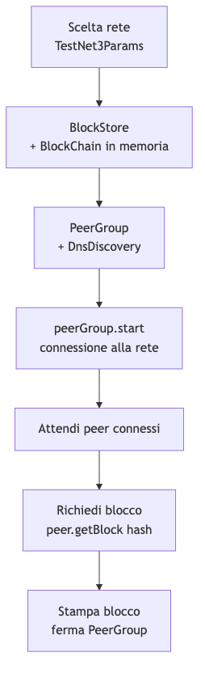
*Fig. — Pipeline dell'esempio di connessione: tutto ruota attorno a `PeerGroup`, l'astrazione `bitcoinj` che gestisce il pool di connessioni P2P.*

La chiave è il `PeerGroup`: rappresenta un insieme di connessioni gestite automaticamente, incluso il mantenimento del numero target di peer e la ri-connessione in caso di timeout. `DnsDiscovery` è il meccanismo di bootstrapping che interroga i seed DNS di cui si è parlato nella lezione sul layer P2P.

La richiesta del blocco specifico (`peer.getBlock(hash)`) restituisce un `Future` — quindi è asincrona — e il loop `while(flag)` tenta la richiesta su peer diversi finché uno risponde entro 5 secondi. Questo pattern è tipico delle reti P2P: nessun peer specifico ha il "dovere" di rispondere, quindi il client deve essere preparato a ritentare.

> [!warning] Blocco di esempio su testnet
>
> L'hash `0000000000000adc6423b570d751efcdf5e019d3d955fee155c28925913cb667` si riferisce a un blocco **testnet**, non mainnet. È importante perché in testnet le regole di PoW sono rilassate (difficulty molto più bassa) e gli indirizzi hanno un prefisso diverso. Cambiare `TestNet3Params` in `MainNetParams` fa sì che il client si colleghi alla rete di produzione e tenti di recuperare blocchi reali — occhio alla quantità di dati!

---

## Indirizzi Bitcoin e loro tipologie

Una volta collegati alla rete, la lezione passa a mostrare come generare chiavi e indirizzi. Prima però viene fatto un rapido ripasso dei tipi di indirizzo che esistono oggi in Bitcoin mainnet.

> [!definition] Tipi di indirizzo Bitcoin (mainnet)
>
> | Tipo | Prefisso | Descrizione |
> |---|---|---|
> | **Legacy P2PKH** | `1...` | Pay-to-Public-Key-Hash — il formato storico |
> | **Legacy P2SH** | `3...` | Pay-to-Script-Hash — script generici (multisig, timelock, ...) |
> | **Nested SegWit P2SH-P2WPKH/P2WSH** | `3...` | SegWit impacchettato in un P2SH per compatibilità — solo transizionale |
> | **SegWit nativo P2WPKH/P2WSH** | `bc1q...` | Bech32, witness version 0 |
> | **Taproot P2TR** | `bc1p...` | Bech32m, witness version 1 — singole firme Schnorr o Tapscript |

Il nested SegWit (`3...`) è stato utile durante la transizione per permettere a wallet che non conoscevano il nuovo formato `bc1q` di inviare fondi a destinatari SegWit, ma oggi è essenzialmente deprecato: i nuovi wallet preferiscono generare direttamente `bc1q` (SegWit v0) o `bc1p` (Taproot) per beneficiare delle fee ridotte e delle nuove funzionalità.

### Generare un indirizzo da una chiave

```java
public static void createNewAddr() {
    NetworkParameters netParams1 = TestNet3Params.get();

    ECKey key = new ECKey();
    System.out.println("We created key " + key);
    Address addressFromKey = key.toAddress(ScriptType.P2PKH, netParams1.network());

    System.out.println("On the " + netParams1.network() +
        " network, we can use this address " + addressFromKey);

    NetworkParameters netParams2 = MainNetParams.get();
    addressFromKey = key.toAddress(ScriptType.P2PKH, netParams2.network());
    System.out.println("On the " + netParams2.network() +
        " network, we can use this address " + addressFromKey);

    addressFromKey = key.toAddress(ScriptType.P2WPKH, netParams2.network());
    System.out.println("On the " + netParams2.network() +
        " network, we can use this address " + addressFromKey);
}
```

L'esempio mostra tre cose importanti:

1. **Una stessa chiave ECDSA** (`ECKey key = new ECKey()`) può essere usata per derivare più indirizzi.
2. Lo stesso hash della chiave pubblica produce **indirizzi con prefisso diverso** a seconda della rete (testnet vs mainnet) perché il byte di version cambia.
3. Lo stesso hash produce anche **indirizzi formattati diversamente** a seconda dello `ScriptType` scelto: con `P2PKH` si ottiene un indirizzo legacy `1...`, con `P2WPKH` si ottiene un SegWit nativo `bc1q...`. La chiave privata è la stessa, ma lo script di lock differisce, e quindi cambia l'encoding dell'indirizzo.

> [!tip] Chiave → indirizzo non è iniettivo sul tipo
>
> Una stessa chiave genera indirizzi di tipo diverso perché l'indirizzo è una funzione di (hash della chiave pubblica, tipo di script, rete). Se si invia denaro al P2PKH di una chiave, non è automaticamente spendibile con la firma sul P2WPKH della stessa chiave: lo script di unlock è diverso. Il proprietario della chiave può firmare per entrambi, ma deve sapere a quale dei suoi indirizzi gli è stato inviato il denaro.

### Esercizio 1 — Vanity address

> [!example] Esercizio 1: vanity address
>
> **Consegna**: scrivere un programma che genera un indirizzo Bitcoin il cui encoding **inizia con una stringa scelta** dall'utente (es. `1Fabio...`, `bc1qgold...`).
>
> **Approccio**: non esiste un modo per costruire una chiave che produca un indirizzo con un prefisso specifico senza invertire la funzione hash (cosa infattibile). L'unica strada è **brute force**: generare chiavi casuali una dopo l'altra, calcolare l'indirizzo corrispondente, controllare se inizia con la stringa desiderata, e se no ripetere.
>
> ```java
> String target = "1Fab";
> while (true) {
>     ECKey key = new ECKey();
>     Address addr = key.toAddress(ScriptType.P2PKH, MainNetParams.get().network());
>     if (addr.toString().startsWith(target)) {
>         System.out.println("Found: " + addr);
>         System.out.println("Private key: " + key.getPrivateKeyAsWiF(MainNetParams.get().network()));
>         break;
>     }
> }
> ```
>
> Il tempo di esecuzione cresce **esponenzialmente** nella lunghezza del prefisso (approssimativamente un fattore 58 per ogni carattere aggiunto nel Base58): 3-4 caratteri si trovano in secondi, 6-7 in minuti, 10+ richiedono hardware dedicato.

> [!warning] Sicurezza delle vanity address
>
> Per chiavi cercate brute force su hardware proprio non c'è problema — la chiave privata resta locale. Si diffidi però dei servizi online che generano vanity address "per conto vostro": se il servizio genera la chiave e poi la invia, può trattenerne una copia e svuotare il wallet quando vi viene inviato denaro. L'unico pattern sicuro è lo **split-key vanity**, in cui la parte entropica proviene da voi e il servizio fornisce solo capacità di calcolo.

---

## Inspezione del genesis block

L'ultima parte del laboratorio è l'ispezione del blocco 0 di Bitcoin — il **genesis block**, minato da Satoshi Nakamoto il 3 gennaio 2009.

> [!definition] Genesis block di Bitcoin
>
> Il blocco con hash `0x000000000019d6689c085ae165831e934ff763ae46a2a6c172b3f1b60a8ce26f` è il primo blocco della blockchain di Bitcoin. È **hardcoded** nel codice di ogni client e serve come radice di fiducia da cui far partire la verifica dell'intera catena. La sua ricompensa coinbase (50 BTC) è spendibile in teoria ma è considerata non-spendibile di fatto perché l'UTXO corrispondente non è mai stato incluso nel UTXO set di Bitcoin Core.
>
> Riferimento: [en.bitcoin.it/wiki/Genesis_block](https://en.bitcoin.it/wiki/Genesis_block)

### Codice per leggere il genesis

```java
// 0x000000000019d6689c085ae165831e934ff763ae46a2a6c172b3f1b60a8ce26f
public static void getBtcGenesis() throws InterruptedException {
    NetworkParameters netParams = MainNetParams.get();

    Block genesis = netParams.getGenesisBlock();

    System.out.println(genesis);

    TransactionInput txIn = genesis.getTransactions().get(0).getInput(0);

    System.out.println(bytesToHex(txIn.getScriptBytes()));

    String message = hexToAscii(bytesToHex(txIn.getScriptBytes()));

    System.out.println(message);

    printBlockInfo(genesis);
    printTxInfo(genesis.getTransactions().get(0));
}

public static void printBlockInfo(Block blk) throws InterruptedException {
    System.out.println("Hash       " + blk.getHashAsString());
    System.out.println("Prev Hash  " + blk.getPrevBlockHash());
    System.out.println("Timestamp  " + blk.getTimeSeconds());
    System.out.println("Timestamp  " + blk.time());
}
```

### Il messaggio di Satoshi

La parte più suggestiva è la decodifica del **coinbase script** della prima (e unica) transazione del genesis block. In una transazione normale l'input contiene la firma che sblocca l'UTXO speso; in una coinbase, che non spende nulla, il campo `scriptSig` è libero e Satoshi lo ha sfruttato per incidere un messaggio leggibile in ASCII:

```
The Times 03/Jan/2009 Chancellor on brink of second bailout for banks
```

È il titolo del *Times* di Londra di quel giorno. Serve a due scopi: **dimostrare che il blocco è stato minato non prima del 3 gennaio 2009** (non si può predire un titolo di giornale futuro), e lasciare traccia storica del contesto politico-finanziario in cui Bitcoin nasce — una risposta esplicita alla crisi bancaria e ai salvataggi pubblici.

> [!tip] Timestamping incorporato nel protocollo
>
> La tecnica di scrivere un riferimento pubblico verificabile (come un titolo di giornale) in un blocco per dimostrarne la datazione "non prima di" è essenzialmente un **timestamping crittografico** fatto in modo manuale. In seguito è stato formalizzato da servizi come OpenTimestamps, che permettono di inserire hash di documenti arbitrari nella blockchain di Bitcoin come prova di esistenza a una certa data.

### Cosa estraiamo dal genesis

Eseguendo `printBlockInfo` e `printTxInfo` si vede concretamente la struttura di un blocco Bitcoin:

- **Hash** del blocco — `000000000019d6689c085ae165831e934ff763ae46a2a6c172b3f1b60a8ce26f`
- **Prev hash** — tutti zeri, perché non c'è un blocco precedente
- **Timestamp** — 1231006505 secondi Unix, cioè 3 gennaio 2009 18:15:05 UTC
- **Transazione coinbase** con il messaggio di cui sopra e un output di 50 BTC al public key di Satoshi (in formato P2PK, non P2PKH: è lo stile più vecchio)

---

## Transazioni e SegWit

Nel finale della lezione vengono indicate due risorse per approfondire ciò che si costruirà nei laboratori successivi (dove si imposteranno transazioni manualmente):

- **Deconstructing a Bitcoin transaction** — [dev.to/thunderbiscuit/deconstructing-a-bitcoin-transaction-4l2n](https://dev.to/thunderbiscuit/deconstructing-a-bitcoin-transaction-4l2n). Una spiegazione campo-per-campo di cosa c'è dentro una transazione Bitcoin: version, input list (previous outpoint, scriptSig, sequence), output list (value, scriptPubKey), locktime. Utile per capire come serializzare manualmente una transazione.
- **SegWit recap** — [learnmeabitcoin.com/technical/upgrades/segregated-witness](https://learnmeabitcoin.com/technical/upgrades/segregated-witness/). Introduzione al segregated witness, l'upgrade del 2017 che ha separato i dati di firma (witness) dal resto della transazione, risolvendo la transaction malleability e aprendo la strada a Lightning Network.

> [!note] Perché serve comprendere SegWit
>
> Il motivo per cui le slide ripassano SegWit proprio qui è che il tipo di indirizzo che si genera (`P2PKH` vs `P2WPKH`) si riflette direttamente nella struttura della transazione che lo spende: un P2WPKH mette la firma nel campo *witness*, non nello `scriptSig`, e calcola la fee in base al *virtual size* invece che alla dimensione grezza. Senza questo contesto, alcuni campi di una transazione moderna sembrano arbitrari.

---

## Sintesi del laboratorio

> [!abstract] Cosa resta in mano dopo questa lezione
>
> - Un progetto Java funzionante che si collega alla **testnet Bitcoin** tramite `bitcoinj` e scarica un blocco richiesto per hash
> - La capacità di **generare chiavi ECDSA** e derivarne indirizzi legacy (`P2PKH`) o SegWit nativi (`P2WPKH`) per mainnet o testnet
> - Un primo vanity address personale, ottenuto brute-forzando chiavi finché il loro indirizzo inizia con un prefisso scelto
> - Un'ispezione diretta del **genesis block** di Bitcoin, con la decodifica del messaggio di Satoshi nel coinbase della transazione 0
> - Link di riferimento per approfondire la struttura delle transazioni e SegWit in vista dei laboratori successivi

```{=latex}
\newpage
```

# Lezione 11 — (Lab) Bitcoin Transactions e Scripts

## Cosa si è fatto in questa lezione

Terzo laboratorio Bitcoin: dopo aver fatto conoscenza con `bitcoinj` nella lezione precedente (connessione alla rete, generazione di indirizzi, lettura del genesis block), qui si entra nel cuore della serializzazione del protocollo. Si scrive codice Java per **ispezionare una transazione campo per campo**, **decodificare gli script** di input e output mostrandoli come sequenze di opcode leggibili, e si affronta il caso speciale delle transazioni con `OP_RETURN` — l'opcode usato per inserire dati arbitrari nella blockchain.

La parte finale è operativa: si scaricano transazioni reali in formato hex da `blockchain.info`, si passano al parser di `bitcoinj` (`Transaction.read()`) e si confronta il risultato con il decoder ufficiale per verificare la correttezza della propria comprensione del formato binario.

> [!info] Obiettivi concreti del laboratorio
>
> - Scrivere una funzione `printTxInfo` che stampa in modo leggibile tutti i campi di una `Transaction` di bitcoinj (hash, coinbase flag, weight, witness flag, input/output con script e indirizzi)
> - Scrivere una funzione `printScriptAsOpCodes` che trasforma il bytecode grezzo di uno script Bitcoin in una sequenza testuale di opcode, gestendo correttamente i dati push e l'`OP_RETURN`
> - Scaricare transazioni reali dalla blockchain in formato **raw hex**, deserializzarle, ispezionarle e verificare il risultato contro il decoder pubblico
> - Vedere esempi concreti di tre tipi di transazione: **legacy**, **SegWit**, con **OP_RETURN**

---

## Riferimenti della lezione

Le slide citano esplicitamente una serie di link che sono il materiale di studio integrativo al codice mostrato in aula. Vale la pena tenerli a portata.

Per le **transazioni** e il loro formato:

- [Deconstructing a Bitcoin transaction](https://dev.to/thunderbiscuit/deconstructing-a-bitcoin-transaction-4l2n) — descrizione campo-per-campo molto chiara
- [SegWit recap](https://learnmeabitcoin.com/technical/upgrades/segregated-witness/) — come il witness cambia la struttura e perché

Per gli **script e gli opcode**:

- [Script e opcode list](https://learnmeabitcoin.com/technical/script/) — ripasso generale
- [Opcode Explained](https://opcodeexplained.com/opcodes/) — lista dettagliata di tutti gli opcode
- [Bitcoin Wiki — Script](https://en.bitcoin.it/wiki/Script) — riferimento storico canonico
- [OP_RETURN](https://learnmeabitcoin.com/technical/script/return/) — approfondimento sull'opcode più importante di questa lezione

Per l'**esercitazione pratica**:

- [blockchain.info raw transaction endpoint](https://blockchain.info/rawtx/a637ad18fabee7ad3ccd51e317091a6e16991311c0c9b83233b140b66b114448?format=hex) — esempio che restituisce l'hex della transazione
- [Blockchain.com Decode Transaction](https://www.blockchain.com/explorer/assets/btc/decode-transaction) — tool web per verificare la decodifica

---

## Struttura di una transazione Bitcoin

Prima di scrivere codice conviene fissare mentalmente i campi. Una transazione Bitcoin, nel formato serializzato, si compone di:

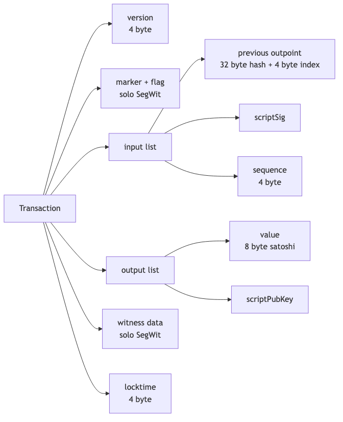
*Fig. — I campi di una transazione Bitcoin. `marker`/`flag` e `witness data` sono presenti solo nelle transazioni SegWit.*

La distinzione cruciale per il codice è fra transazione **legacy** e **SegWit**: nelle legacy la firma vive dentro `scriptSig` (un campo dell'input); nelle SegWit viene spostata in una sezione separata (`witness data`) in fondo alla transazione, lasciando `scriptSig` vuoto. Questo cambia il layout binario e richiede il parser di gestire i due casi. Bitcoinj si occupa di distinguerli automaticamente leggendo il **marker byte** (`0x00`) e il **flag byte** (`0x01`) che, se presenti subito dopo la version, segnalano una transazione SegWit.

> [!definition] Coinbase transaction
>
> La prima transazione di ogni blocco è la **coinbase**, che crea nuovi bitcoin (il block reward) e non ha un input spendibile precedente: il suo unico input ha `previous outpoint` con hash tutto-zero e indice `0xFFFFFFFF`, e `scriptSig` è lasciato libero dal miner per inserirvi dati arbitrari (tipicamente il numero del blocco per l'altezza — BIP 34 — o messaggi testuali, come fece Satoshi nel genesis).

---

## `printTxInfo` — stampare una transazione in modo leggibile

Il primo esercizio di laboratorio è una funzione che prende una `Transaction` di bitcoinj e ne stampa tutti i campi in formato umano. Il valore didattico è che costringe a distinguere i casi (coinbase vs regolare, con vs senza witness) e a ricavare gli indirizzi dai rispettivi script.

```java
public static void printTxInfo(Transaction tx) throws InterruptedException {
    // txHash, isCoinbase, weight, hasWitness
    StringBuilder line = new StringBuilder();
    boolean isCoinbase = false;
    boolean hasWitness = false;
    line.append(tx.getTxId().toString());
    line.append(",");
    if (tx.isCoinBase()) {
        isCoinbase = true;
        line.append("1");
    } else {
        isCoinbase = false;
        line.append("0");
    }
    line.append(",");
    line.append("" + tx.getWeight());
    line.append(",");
    if (tx.hasWitnesses()) {
        hasWitness = true;
        line.append("1");
    } else {
        hasWitness = false;
        line.append("0");
    }
    System.out.println("General info : " + line.toString());

    line = new StringBuilder();
    if (isCoinbase) {
        // check if it has messages inside input scripts
        boolean first = true;
        for (TransactionInput ii : tx.getInputs()) {
            if (first) first = false;
            else line.append("\n");
            line.append("Coinbase input script message? " +
                hexToAscii(bytesToHex(ii.getScriptBytes())));
        }
    } else {
        // not coinbase so there is at least one input
        // prevTx_Id, prevTxPos, script:
        boolean first = true;
        for (TransactionInput ii : tx.getInputs()) {
            if (first) first = false;
            else line.append("\n");
            line.append("Prev txHash " + ii.getOutpoint().hash().toString());
            line.append("\nPrev txPos  " + ii.getOutpoint().index());
            line.append("\nscriptSig   " + bytesToHex(ii.getScriptBytes()));
            if (ii.hasWitness()) {
                line.append("\nwitness     " + ii.getWitness().toString());
            }
        }
    }
    System.out.println("Inputs :\n" + line.toString());

    line = new StringBuilder();
    // addr, amount, outScriptBytes
    // there is always at least one output
    boolean first = true;
    for (TransactionOutput oo : tx.getOutputs()) {
        if (first) first = false;
        else line.append("\n");
        byte[] outScript = oo.getScriptBytes();
        String outAddr = ScriptParser.addrFromOut(outScript);
        int outType = ScriptParser.typeFromOut(outScript);
        if (outAddr == null) {
            // writes '#UNKNOWN#' as address if not decodable
            outAddr = "#UNKNOWN#";
        }
        line.append("Addr " + outAddr);
        line.append("\nAmount " + oo.getValue().getValue());
        line.append("\nscript " + bytesToHex(outScript));
        line.append("\nscript " + printScriptAsOpCodes(outScript));
        line.append("\nscript type " + ScriptTypeCustom.typeName(outType));
    }
    System.out.println("Outputs :\n" + line.toString());
}
```

### Cosa vale la pena notare

- **`getTxId()`** restituisce il doppio SHA-256 dei campi "non witness" della transazione. Per le SegWit è utile perché rende l'ID immune dalla *malleability*: modificare la firma non cambia l'ID della transazione.
- **`getWeight()`** è la metrica usata da Bitcoin per calcolare le fee dopo SegWit: i byte witness contano 1, quelli non-witness contano 4. Il limite di blocco è 4M weight units.
- **Caso coinbase**: si stampa il contenuto dello `scriptSig` interpretato come ASCII, per vedere l'eventuale messaggio del miner. È lo stesso trucco con cui si è letto il `Chancellor on brink of second bailout for banks` nel genesis.
- **Caso regolare**: per ogni input si stampa la coppia `(prev hash, prev index)` che identifica l'UTXO speso, il `scriptSig` in hex, e il witness se presente.
- **Per gli output**: si usa un `ScriptParser` custom che tenta di decodificare lo `scriptPubKey` in un indirizzo. Se lo script non corrisponde a un pattern noto (non è P2PKH, P2SH, P2WPKH, ...) si scrive `#UNKNOWN#` invece di inventare un indirizzo.

> [!tip] Indirizzo = pattern riconosciuto nello script
>
> Un **indirizzo non è un campo della transazione**: è una **reinterpretazione** dello `scriptPubKey` quando quest'ultimo ha una forma "nota". `OP_DUP OP_HASH160 <20B> OP_EQUALVERIFY OP_CHECKSIG` → P2PKH, `OP_HASH160 <20B> OP_EQUAL` → P2SH, e così via. Se lo script è arbitrario (es. un multisig bare, un timelock), non c'è un indirizzo standard da mostrare.

---

## `printScriptAsOpCodes` — decodificare uno script Bitcoin

Gli script di Bitcoin sono sequenze di byte che il parser deve interpretare come un misto di **opcode** (singoli byte con nome simbolico) e **push di dati** (un byte che dichiara la lunghezza, seguito dai dati). La funzione mostrata in aula fa proprio questo.

```java
public static String printScriptAsOpCodes(byte[] script) {
    StringBuilder line = new StringBuilder();
    for (int i = 0; i < script.length;) {
        int val = Utilities.readUnsignedByte(script[i]);
        line.append(ScriptOpCodes.getOpCodeName(val));
        line.append(" ");
        i++;
        if ((val >= 1) && (val <= 75)) {
            for (int j = 0; j < val; j++) {
                line.append(byteToHex(script[i]));
                line.append(" ");
                i++;
            }
        } else if (val == 106) {
            while (i < script.length) {
                line.append(hexToAscii(byteToHex(script[i])));
                line.append(" ");
                i++;
            }
        }
    }
    return line.toString();
}
```

### Logica del parser

Il parser ha tre rami:

- **Byte 1–75**: è un'istruzione implicita `OP_PUSHBYTES_N` — il byte stesso indica quanti byte successivi sono dati da pushare nello stack. Si stampano come hex.
- **Byte 106 (`OP_RETURN`)**: segnala che la transazione è "unspendable" e che tutto ciò che segue sullo script è **puro dato arbitrario**, interpretato come ASCII (per comodità: qualsiasi contenuto è ammesso).
- **Altri opcode**: si stampa solo il nome simbolico (es. `OP_DUP`, `OP_HASH160`, `OP_CHECKSIG`).

> [!warning] Parser semplificato
>
> La funzione non gestisce gli opcode di push a lunghezza esplicita (`OP_PUSHDATA1`, `OP_PUSHDATA2`, `OP_PUSHDATA4`, valori 76-78), che servono a pushare quantità di dati superiori a 75 byte. Per uno script P2PKH o P2SH standard non è un problema — gli hash sono 20 byte e le firme stanno sotto i 75. Per script più complessi, come alcuni `OP_RETURN` con payload grande, bisognerebbe estendere il parser.

### Esempio: decodifica di uno `scriptPubKey` P2PKH

Prendendo un output di tipo P2PKH, lo `scriptPubKey` in hex è tipicamente:

```
76 a9 14 <20-byte-hash> 88 ac
```

Passato a `printScriptAsOpCodes` restituisce:

```
OP_DUP OP_HASH160 OP_PUSHBYTES_20 <hex dell'hash> OP_EQUALVERIFY OP_CHECKSIG
```

— che è esattamente lo script canonico di pagamento a hash di chiave pubblica.

---

## OP_RETURN: dati arbitrari sulla blockchain

> [!definition] OP_RETURN
>
> `OP_RETURN` (opcode `0x6A`, decimale 106) termina immediatamente l'esecuzione dello script facendolo **fallire sempre**. Un output il cui `scriptPubKey` inizia con `OP_RETURN` non è mai spendibile: non esiste alcuna sequenza di `scriptSig` che possa farlo valutare a `true`. In compenso, i nodi Bitcoin accettano in coda all'opcode **fino a 80 byte** di dati arbitrari, che vengono così incisi permanentemente nella blockchain.

Il caso d'uso tipico è **timestamping**: si prende l'hash di un documento, lo si inserisce come payload di un `OP_RETURN`, si firma la transazione. Da quel momento esiste una prova pubblica e immutabile che il documento esisteva al timestamp del blocco che contiene la transazione. È l'idea alla base di servizi come [OpenTimestamps](https://opentimestamps.org/).

> [!tip] Perché OP_RETURN invece di mettere i dati nello scriptSig
>
> Si potrebbe teoricamente mettere dati arbitrari nello `scriptSig` di un input, ma quell'approccio crea **UTXO non spendibili che restano nel UTXO set** per sempre, gonfiandolo inutilmente. `OP_RETURN` è riconosciuto dai nodi come *provably unspendable*: l'output associato viene **escluso dal UTXO set**, quindi non pesa sulle prestazioni della rete. È la ragione per cui Bitcoin Core lo ha standardizzato.

---

## Parte operativa: leggere transazioni reali

L'ultima parte del laboratorio consiste nello scaricare transazioni vere dalla blockchain di produzione e farle digerire al parser. Il metodo è:

1. Prendere un TXID noto (anche da un explorer)
2. Chiedere l'hex grezzo con `https://blockchain.info/rawtx/<txid>?format=hex`
3. Passarlo a `bitcoinj` con `Transaction.read()`
4. Stampare con `printTxInfo`
5. Verificare il risultato con il [decoder ufficiale](https://www.blockchain.com/explorer/assets/btc/decode-transaction) di blockchain.com

### Il codice mostrato

```java
public static void readRawTx() throws InterruptedException {

    // String rawHex = "020000000180b98c54dbab5106d5a1449f4e5fdb9146deca1d48e93d66
    // 6c5d9290b7c37a3f010000006b483045022100f0e32ceb205a5056694611afcffe4c1f0e63e9c5738
    // 2607045ff2c3d9b5b7b3f0220111f0323e56d7462a9299833166569f1a68e1f5090b49bea64f541c4
    // 94109c6c012102d0648f06a31d47112f1ff7848c85ce54b772c513bc3337c98f081c19d3dca260fff
    // fffff02006d7c4d000000001976a91474d463a046e3175142464740db692fa0762a93e88accad5e5
    // f1b50000001976a914c98fc6bd9c2fd88533f28e6797cfa2a0a0e18ecf88ac00000000";

    // first segwit
    // dfcec48bb8491856c353306ab5febeb7e99e4d783eedf3de98f3ee0812b92bad
    // String rawHex = "01000000000101740e5e391018c5e9dc79f324f9607c9c46d21b02f66da
    // baa870b4add871d6379f01000000171600148d7a0a3461e3891723e5fdf8129caa0075060cffffff
    // fff01fcf60200000000001600148d7a0a3461e3891723e5fdf8129caa0075060cff02483045022100
    // 88025cffdaf69d310c6fed11832edd9c19b6a912c132262701ad0e6133227d9202207d73bbf777abd
    // 2aeae995d684e6bb1a048c5ac722e16de48bdd35643df7decf001210283409659355b6d1cc3c32dec
    // d5d561abaac86c37a353b52895a5e6c196d6f44800000000";

    // opreturn
    // d84f8cf06829c7202038731e5444411adc63a6d4cbf8d4361b86698abad3a68a
    String rawHex = "010000000178ded99d5bd03110a4e43d2cd7cddb3032af3e362d12ed0b8d"
        + "35cf811baf00255600000004948304502210fc323c40c6eb030c405bbacb478e6848b115c2bdbc5f7"
        + "8b275072ccecccacaf8a02207102afeb0a16c2caf7dd07a06d642d1ee0286ebe5f7c4d7092c78af4b0"
        + "4a44e101ffffffff02e80300000000000001976a9140910f9bbafabf5f653080ba23487d80a1dca614"
        + "388ac00000000000000000a6a084557204369616Ff2100000000";

    byte[] ba = hexStringToByteArray(rawHex);
    ByteBuffer bf = ByteBuffer.wrap(ba);
    Transaction tx = Transaction.read(bf);
    System.out.println("Tx ID: " + tx.getTxId());
    System.out.println("Inputs: " + tx.getInputs().size());
    System.out.println("Inputs: " + tx.getOutputs().size());
    printTxInfo(tx);
}
```

### Le tre transazioni di esempio

Il docente presenta tre rawHex commentati, uno per ogni caso significativo:

| Caso | TXID | Cosa mostra |
|---|---|---|
| **Legacy** (quello attivo nell'esempio iniziale) | — | Struttura classica: input con `scriptSig` pieno, nessun witness, un paio di output P2PKH |
| **SegWit** (primo esempio SegWit del docente) | `dfcec48b…bad` | Marker `0x00` + flag `0x01` dopo la version, `scriptSig` vuoto, firma spostata nel witness alla fine |
| **OP_RETURN** | `d84f8cf0…68a` | Uno degli output è un `OP_RETURN` con payload ASCII decodificabile |

> [!example] Workflow di verifica
>
> 1. Scommentare uno dei tre rawHex nel codice
> 2. Eseguire `readRawTx()` e leggere l'output stampato
> 3. Aprire nel browser `blockchain.com/explorer/assets/btc/decode-transaction`
> 4. Incollare lo stesso rawHex e confrontare i campi: version, input count, output count, TXID, tipo di script per ogni output
> 5. Se il codice è corretto, i due output coincidono campo per campo

---

## Sintesi operativa

> [!abstract] Cosa resta in mano dopo il laboratorio
>
> - Un parser Java che prende una `Transaction` di bitcoinj e ne stampa tutti i campi (TXID, weight, coinbase flag, witness flag, input con previous outpoint e scriptSig/witness, output con indirizzo decodificato e script in opcode)
> - Un decodificatore di script Bitcoin che gestisce push di dati (1–75 byte) e il caso speciale di `OP_RETURN` (106)
> - La capacità di scaricare una transazione arbitraria dalla blockchain tramite l'endpoint raw di `blockchain.info`, deserializzarla con `Transaction.read()` e confrontare il risultato con il decoder ufficiale
> - Tre esempi concreti — legacy, SegWit, OP_RETURN — che coprono i casi significativi che capiterà di incontrare nelle lezioni successive sugli Advanced Bitcoin Scripts

```{=latex}
\newpage
```

# Bitcoin Mining

## Consenso Tradizionale vs Consenso di Nakamoto

Gli algoritmi di consenso classici — Paxos, Raft, PBFT — sono progettati per ambienti **chiusi**: i nodi sono noti in anticipo, ciascuno conosce l'identità degli altri e i canali di comunicazione sono autenticati. Funzionano bene per database distribuiti, state machine replication, sincronizzazione di orologi.

Le blockchain permissionless come Bitcoin operano in un contesto radicalmente diverso: nodi anonimi, churn elevato, nessun canale autenticato, nessuna sincronizzazione degli orologi, nessuna lista di partecipanti. I protocolli tradizionali semplicemente non si applicano.

> [!definition] Consenso di Nakamoto
>
> Un approccio "implicito" al consenso: nessuna votazione, nessuno scambio di messaggi collettivo. Garantisce *eventual consistency* — i nodi possono avere visioni temporaneamente divergenti del registro, ma alla fine convergeranno tutti sulla stessa cronologia, a patto che la maggioranza della potenza computazionale sia onesta.

Come osservato in lezione: la decentralizzazione di Bitcoin non è raggiunta con metodi puramente tecnici, ma con una combinazione di crittografia e *clever incentive engineering*.

---

## Il Problema del Double Spending

Senza consenso, il sistema crollerebbe immediatamente. Immaginiamo che Bob invii bitcoin ad Alice (transazione "verde"), propagata nel network. Subito dopo Bob prova a spendere gli stessi bitcoin con July (transazione "rossa"), propagata da un altro nodo. Nodi diversi riceverebbero le due transazioni in ordine diverso e i loro registri divergerebbero — impossibile capire quale sia quella valida.

La **MemPool** (*Memory Pool*) è la "sala d'attesa" in RAM di ogni nodo: contiene le transazioni ricevute ma non ancora incluse in un blocco. È importante sottolineare che la MemPool **non è l'UTXO set**: quest'ultimo contiene le transazioni già confermate nella blockchain, mentre la MemPool è un buffer temporaneo di transazioni in attesa di conferma. Funziona come una *clearing house*: quando un nodo riceve una transazione in conflitto con una già presente nella sua MemPool, la scarta immediatamente. Ma questo risolve solo il problema locale — il consenso globale richiede qualcosa di più.

---

## Mining: la Lotteria della Blockchain

I nodi competono per estrarre transazioni dalla propria MemPool e aggiungerle al registro. Questa competizione è il **mining**: una lotteria in cui il vincitore ha il diritto di proporre il blocco successivo e lo trasmette in broadcast alla rete.

Quando un nodo riceve un nuovo blocco valido, elimina dalla propria MemPool tutte le transazioni ora confermate e quelle in conflitto — garantendo che il double spending tentato da Bob venga neutralizzato.

---

## Anatomia di un Blocco

Il miner riempie un **blocco candidato** con transazioni dalla MemPool, poi costruisce il **Block Header**: un riassunto compatto dei metadati (circa 1000 volte più piccolo della lista delle transazioni).

| Campo | Dimensione | Descrizione |
|---|---|---|
| **Magic Number** | 4 byte | Identificatore costante della rete Bitcoin |
| **Block Size** | 4 byte | Dimensione totale del blocco |
| **Version** | 4 byte | Versione del protocollo; gestisce soft/hard fork |
| **Previous Block Hash** | 32 byte | Hash SHA-256 dell'header del blocco precedente — il "link" crittografico della catena |
| **Merkle Root** | 32 byte | Radice del Merkle Tree delle transazioni; qualsiasi modifica a una transazione altera questo valore |
| **Timestamp** | 4 byte | Secondi Unix dalla mezzanotte del 1 gen 1970; usato per calibrare la difficoltà |
| **Difficulty Target** | 4 byte | Soglia al di sotto della quale deve cadere l'hash del blocco |
| **Nonce** | 4 byte | Il valore che il miner modifica iterativamente per trovare la soluzione |
| **Transaction Counter** | 1–9 byte | Numero di transazioni nel blocco |
| **Transactions List** | Variabile (fino a 1 MB) | L'elenco effettivo delle transazioni |

Perché raggruppare in blocchi e non minare singole transazioni? Una catena di hash su blocchi è molto più corta di una su milioni di transazioni, rendendo la verifica esponenzialmente più rapida. Blocchi più grandi significano anche trasmissioni di rete più efficienti.

---

## Proof of Work: Meccanica e Complessità

> [!definition] Proof of Work
>
> Funzione $F_d(c, x) \to \{\text{true, false}\}$ dove $d$ è la difficoltà, $c$ è la challenge (l'header del blocco senza il nonce) e $x$ è il **nonce** da trovare. Calcolare $F_d$ con $x$ noto è rapido; trovare $x$ tale che il risultato sia "true" è computazionalmente difficile.

Il procedimento del miner:

1. Imposta il nonce a 0
2. Calcola `SHA256(SHA256(Block-Header + Nonce))`
3. Se l'hash è **inferiore al Target** → blocco valido, trasmetti
4. Altrimenti, incrementa il nonce di 1 e ripeti

Ogni singolo bit dell'hash a 256 bit è indipendente dagli altri — come il lancio di una moneta. Non esistono scorciatoie: l'unico metodo è la forza bruta. La probabilità che un hash casuale cada sotto la soglia $T$ è:

$$p = \frac{T + 1}{2^{256}}$$

Il numero medio di tentativi per trovare un hash valido è $1/p$. Al 1° gennaio 2017, questo valore era circa $2^{70}$.

> [!tip] Gli "zeri iniziali" sono una semplificazione
>
> Spesso si dice che la PoW è risolta quando l'hash inizia con un certo numero di zeri. È una buona approssimazione, ma non precisa: il target può abbassarsi senza cambiare il numero di zeri (es. da `001001` a `001000` — stessi due zeri, target più basso). La soglia effettiva è numerica, non basata sui caratteri.

L'idea di usare puzzle crittografici costosi da risolvere ma facili da verificare non è nuova: sistemi simili erano stati proposti per mitigare DoS e spam email (richiedendo cicli CPU invece di denaro per "affrancare" ogni messaggio). Nakamoto l'ha adattata al consenso distribuito.

> [!tip] La metafora dei dardi
>
> La PoW può essere immaginata come il lancio di freccette verso un bersaglio con gli occhi bendati. Ogni lancio ha uguale probabilità di colpire qualsiasi punto del bersaglio. La difficoltà è inversamente proporzionale alla dimensione del cerchio verde (la zona valida): più il cerchio è piccolo, più è difficile colpirlo. Se i giocatori diventano più bravi (hardware più veloce), si restringe il cerchio — si abbassa il target. Aggiungere uno zero al prefisso richiesto raddoppia in media lo sforzo computazionale; rimuoverne uno lo dimezza.

### PoW: Applicazioni Precedenti a Bitcoin

La Proof of Work come strumento generale ha storia propria, ben prima di Nakamoto. Il suo principio è semplice: un meccanismo che consente a una parte di *dimostrare* a un'altra di aver impiegato una certa quantità di risorse computazionali, dove la verifica richiede molto meno tempo dell'esecuzione.

**Contrasto agli attacchi DoS** — Si può condizionare l'accesso a un servizio alla risoluzione di un puzzle computazionalmente costoso. Questo throttle le richieste: chi vuole inondare il server deve pagare un costo CPU per ogni tentativo, rendendo l'attacco proibitivo su larga scala.

**Contrasto allo spam email** — L'idea è affrancare ogni messaggio non con denaro ma con cicli CPU: chi invia poche email non sente quasi il costo, perché il puzzle viene eseguito poche volte. Per uno spammer che invia centinaia di migliaia di messaggi al giorno, lo stesso puzzle moltiplicato per milioni di invii diventa proibitivamente costoso. Il costo computazionale funge da "francobollo" digitale.

---

## Resistenza agli Attacchi Sybil

Ad ogni round, il miner che risolve la PoW viene eletto implicitamente come leader. L'elezione è proporzionale alla **potenza computazionale**, una risorsa fisica difficile da monopolizzare — non al numero di identità di rete. Creare migliaia di identità false non dà alcun vantaggio: conta solo quanti hash al secondo si riesce a calcolare. Per sabotare il sistema bisognerebbe controllare almeno il 51% della potenza di hashing globale.

---

## Incentivi per i Miner

Validare blocchi costa enormi quantità di energia. Perché farlo onestamente?

**Block Reward** — La prima transazione di ogni blocco è la **Coinbase Transaction**: crea bitcoin "dal nulla" e li assegna al miner. È l'unico meccanismo per immettere nuovi BTC nel sistema. La supply totale è fissa a **21.000.000 BTC** (raggiunta circa nel 2140), il che rende Bitcoin strutturalmente resistente all'inflazione — impossibile "stampare" nuova moneta per decisione politica. Questo implica una proprietà che non esiste in alcuna valuta fiat: chi possiede 1 BTC possiede sempre almeno un ventunomilionesimo dell'intera supply globale. Nelle valute tradizionali, i governi e le banche centrali possono aumentare l'offerta per decisioni politiche, diluendo il valore di chi già possiede quella valuta.

La ricompensa si dimezza ogni 210.000 blocchi (~4 anni): è il celebre **Halving**.

| Era | Periodo | Block Reward |
|---|---|---|
| 1 | 2009 | 50 BTC |
| 2 | 2012 | 25 BTC |
| 3 | 2016 | 12,5 BTC |
| 4 | 2020 | 6,25 BTC |
| 5 | 2024 (attuale) | 3,125 BTC |
| … | … fino all'Era 33 | 1 Satoshi ($10^{-8}$ BTC) |

**Transaction Fees** — La differenza tra $\sum \text{inputs}$ e $\sum \text{outputs}$ di ogni transazione va al miner. Gli utenti le impostano volontariamente per ottenere priorità di inclusione. Con il susseguirsi degli halving, le fee costituiranno una percentuale sempre maggiore dei ricavi dei miner.

La Coinbase Transaction contiene anche un input "fittizio" usato per messaggi personalizzati. Nel Genesis Block, Nakamoto vi nascose: *"The Times 03/Jan/2009: Chancellor on brink of second bailout for banks"*.

> [!note] Struttura dell'output della Coinbase
>
> L'output della Coinbase Transaction è inviato a uno o più indirizzi Bitcoin del miner stesso. Il valore corrisponde alla somma della block reward più le fee di tutte le transazioni incluse nel blocco. È il miner a decidere a quali propri indirizzi destinare la ricompensa.

### Dinamiche a Lungo Termine dei Ricavi

Storicamente la componente dominante dei ricavi dei miner è stata il block reward; le transaction fee rappresentano solo una piccola percentuale. Questa situazione è però destinata a cambiare: man mano che gli halving si succedono e la block reward si avvicina a zero, le fee diventeranno la fonte quasi esclusiva di compensazione.

C'è però una tensione strutturale: ogni nuovo miner che entra nella rete abbassa la probabilità di ricompensa degli altri. Per mantenere competitive le proprie probabilità, ogni miner è incentivato ad aumentare continuamente il proprio hash rate, alimentando una corsa agli armamenti computazionale. Questa dinamica ha spinto i miner a organizzarsi in **mining pool** — discusse nella lezione successiva.

---

## Regolazione Automatica della Difficoltà

Il sistema è calibrato per produrre **un blocco ogni 10 minuti**. Questo intervallo non è casuale: deve essere molto più lungo del tempo di propagazione del blocco sulla rete, affinché tutti i miner lavorino sulla stessa catena senza sprecare energia su rami obsoleti. Nelle parole di Nakamoto stesso: *"We want blocks to usually propagate in much less time than it takes to generate them, otherwise nodes would spend too much time working on obsolete blocks."* Se i blocchi vengono minati troppo frequentemente, i miner costruiscono catene concorrenti: solo una diventerà la più lunga, e tutti gli altri avranno sprecato energia su rami che verranno abbandonati — riducendo la sicurezza effettiva del sistema.

Ethereum ha scelto tempi più rapidi, ottenendo conferme più veloci e minore variabilità nei payout per i miner, ma al costo di più fork e un sistema di ricompensa molto più complesso.

La difficoltà si auto-regola ogni **2016 blocchi** (~2 settimane a 10 min/blocco = 20.160 minuti). Il ricalcolo avviene in modo completamente autonomo su ogni nodo:

$$\text{Nuovo Target} = \text{Vecchio Target} \times \frac{\text{Tempo effettivo}}{20.160 \text{ min}}$$

- Rete troppo veloce (es. 16.128 min) → rapporto $0{,}8$ → target si abbassa → difficoltà aumenta
- Rete troppo lenta (es. 22.176 min) → rapporto $1{,}1$ → target si alza → difficoltà diminuisce

L'aspetto più elegante: nessun coordinatore centrale. Tutti i nodi eseguono lo stesso algoritmo open-source sulle stesse informazioni e convergono autonomamente allo stesso nuovo target.

---

## Struttura della Blockchain e Fork

La blockchain non è una catena perfettamente lineare, ma un **albero** in cui solo il ramo più lungo è canonico.

I blocchi non hanno un indice interno: vengono identificati dal loro **Block Hash** (calcolato dinamicamente alla ricezione) o dalla **Block Height** (numero di blocchi dal Genesis Block, che ha altezza 0). L'ultimo blocco aggiunto è la *blockchain head*.

La tamper-freeness è garantita strutturalmente: modificare una transazione altera il Merkle Root, cambia l'hash del blocco, invalida il `hashprev` del blocco successivo, e innesca un effetto a cascata che obbliga a ricalcolare tutta la PoW da quel punto in poi.

### Fork Temporanei e Longest Chain Rule

La latenza di rete introduce i **fork temporanei**: due miner possono trovare un blocco valido quasi simultaneamente, puntando allo stesso genitore. La rete si divide — alcuni nodi vedono prima il blocco A, altri il blocco C, in base alla vicinanza fisica al miner che ha trovato il blocco — e due rami crescono in parallelo. Ogni miner continua a lavorare sul ramo che ha ricevuto per primo; il ramo alternativo viene conservato in una cache locale. I due fork possono crescere indipendentemente, con miner diversi che lavorano su rami diversi.

> [!definition] Longest Chain Rule (Regola di Nakamoto)
>
> I nodi considerano valida la catena che rappresenta il maggiore lavoro cumulativo (la più lunga). Non appena un nuovo blocco estende uno dei due rami rendendolo più lungo, tutti i miner abbandonano il ramo più corto e migrano sul ramo vincente. I blocchi del ramo perdente diventano **orphan blocks**; le loro transazioni non confermate tornano nella MemPool per essere eventualmente incluse in un blocco futuro.

Per questo motivo si raccomanda la **regola delle 6 conferme**: una transazione è considerata definitiva solo quando ha almeno altri 5 blocchi costruiti sopra di essa. Il valore 6 è il default, ma può essere configurato dal client in base al livello di sicurezza desiderato — transazioni di alto valore possono richiedere più conferme. Scopo della regola: dare alla rete il tempo di raggiungere un accordo sull'ordinamento dei blocchi.

### Algoritmo di Ricezione di un Blocco

Quando un nodo riceve un nuovo blocco $b$, esegue il seguente algoritmo per aggiornare la propria visione della blockchain:

```
Receive block b
  For this node the current head is block bmax at height hmax
  Connect block b in the tree as child of its parent p at height
    hb = hp + 1
  if hb > hmax then
    hmax = hb
    bmax = b
    compute UTXO for the path leading to bmax
    cleanup memory pool
  end if
```

Se il nuovo blocco è più alto della testa corrente, diventa la nuova testa. Si ricalcola l'UTXO set lungo il percorso fino alla nuova testa e si pulisce la MemPool rimuovendo le transazioni ora confermate e quelle in conflitto. Se invece il blocco appartiene a un fork più corto, viene conservato in cache senza diventare la testa.

### Teorema del Consenso di Nakamoto

> [!theorem] Eventual Consistency
>
> I fork vengono risolti e tutti i nodi concordano alla fine su quale sia la blockchain più lunga. Il sistema garantisce *eventual consistency*.
>
> **Proof sketch**: affinché un fork continui a esistere, devono essere trovati blocchi quasi simultaneamente su entrambi i rami, estendendoli in parallelo. La probabilità che questo accada ripetutamente decresce esponenzialmente con la lunghezza del fork. Quindi esisterà sempre un momento in cui un solo ramo viene esteso, diventando la catena più lunga e imponendosi come quella canonica.

Fork prolungati — due catene che crescono in parallelo a lungo — sono matematicamente possibili ma estremamente improbabili: la componente aleatoria del mining e i ritardi di propagazione introducono sufficiente rumore da impedire una crescita perfettamente sincrona dei due rami.

```{=latex}
\newpage
```

# Lezione 13 — (Lab) Script Classification e blk.dat

## Cosa si è fatto in questa lezione

Quarto laboratorio Bitcoin. Si riprende da dove si era chiuso il lab precedente — la decodifica di una transazione raw — e si fa un salto di livello: invece di guardare transazioni **una alla volta**, si scrive un **parser dell'intera blockchain** che legge i file `blk*.dat` in cui Bitcoin Core salva i blocchi sul disco e produce statistiche aggregate (numero di transazioni, coinbase, witness, distribuzione dei tipi di script, indirizzi non decodificabili).

Il percorso logico della lezione è chiaro: prima si completa il parser di script costruendo le utility che **classificano** un output in una delle categorie standard (P2PK, P2PKH, P2SH, P2WPKH, P2WSH, `OP_RETURN`, empty) e che da uno `scriptPubKey` **ricavano l'indirizzo** nel formato Base58Check o Bech32 appropriato. Poi si fa un passo avanti e si applica il parser all'intera blockchain usando `BlockFileLoader` di bitcoinj.

> [!info] Obiettivi concreti del laboratorio
>
> - Scrivere `readRawTxAndDecode(rawHex)` che stampa per ogni input/output lo script in hex e come sequenza di opcode
> - Definire la classe `ScriptTypeCustom` con le costanti numeriche dei tipi di script e la funzione `typeName(code)` per stamparli
> - Scrivere `ScriptParser.typeFromOut(script)` che classifica un output pattern-matching sui byte
> - Scrivere `ScriptParser.addrFromOut(script)` che estrae l'indirizzo leggibile da uno `scriptPubKey` (P2PKH/P2SH con Base58Check, P2WPKH/P2WSH con Bech32)
> - **Esercizio**: estendere il parser per riconoscere anche **P2TR** (Taproot)
> - Conoscere il formato dei file `blk*.dat` di Bitcoin Core
> - Scrivere un `BCParser` che scorre tutti i `blk*.dat`, decodifica ogni transazione e produce statistiche aggregate sulla blockchain

---

## Riferimenti della lezione

- [Extending to Taproot — learnmeabitcoin.com/technical/script/p2tr](https://learnmeabitcoin.com/technical/script/p2tr/) — per l'esercizio di estensione
- [Bitcoin Core blk.dat format](https://learnmeabitcoin.com/technical/block/blkdat/) — spiegazione del layout binario dei file di blocchi

---

## Ripresa: decodificare uno script output

Per convenienza, la prima slide ricapitola il codice di parsing di una raw transaction con decodifica di input e output. È sostanzialmente il punto di arrivo del lab precedente:

```java
public static void readRawTxAndDecode(String rawHexTx) {
    byte[] ba = hexStringToByteArray(rawHexTx);
    ByteBuffer bf = ByteBuffer.wrap(ba);
    Transaction tx = Transaction.read(bf);

    for (TransactionInput in : tx.getInputs()) {
        byte[] inScript = in.getScriptBytes();
        System.out.println("INPUT script hex "     + bytesToHex(inScript));
        System.out.println("INPUT script OPcodes " + bytesToOpcode(inScript));
    }

    for (TransactionOutput out : tx.getOutputs()) {
        byte[] outScript = out.getScriptBytes();
        System.out.println("OUTPUT script hex "     + bytesToHex(outScript));
        System.out.println("OUTPUT script OPcodes " + bytesToOpcode(outScript));
        System.out.println("OUTPUT script Type "    + ScriptParser.typeFromOut(outScript));
        String outAddr = ScriptParser.addrFromOut(outScript);
        if (outAddr == null) outAddr = "#UNKNOWN#";
        System.out.println("OUTPUT script address " + outAddr);
    }
}
```

Il cuore interessante, ora, è quello che sta dentro `ScriptParser.typeFromOut` e `ScriptParser.addrFromOut`. Su di essi si basa tutta la classificazione successiva.

---

## `ScriptTypeCustom` — la tassonomia dei tipi di script

Per rendere il risultato del parser manipolabile (incrementi contatori, scelte basate sul tipo) si definisce una classe con costanti numeriche:

```java
public class ScriptTypeCustom {
    // type of script used 1=P2PK 2=P2PKH 3=P2SH 4=P2MS 5=other
    public static final int UNKNOWN = 0;
    public static final int P2PK    = 1;
    public static final int P2PKH   = 2;
    public static final int P2SH    = 3;
    public static final int RETURN  = 4;
    public static final int EMPTY   = 5;
    public static final int P2WPKH  = 6;
    public static final int P2WSH   = 7;
    public static final int SUPPORTEDSCRIPTTYPES = 8;

    // multisig example: txhash da738e29f64e90ae46dcc3e6b4154041d6324abbe7919e722d486a4a3148b7dc

    public static String typeName(int code) {
        switch (code) {
            case UNKNOWN: return "UNKNOWN";
            case P2PK:    return "P2PK";
            case P2PKH:   return "P2PKH";
            case P2SH:    return "P2SH";
            case RETURN:  return "PROVABLY UNSPENDABLE";
            case EMPTY:   return "ANYONE CAN SPEND";
            case P2WPKH:  return "P2WPKH";
            case P2WSH:   return "P2WSH";
            default:      return "ERROR - UNRECOGNIZED SCRIPT CODE";
        }
    }
}
```

Due etichette meritano commento:

- **`RETURN` → "PROVABLY UNSPENDABLE"**: un output con `OP_RETURN` non è mai spendibile, il nodo lo sa a priori e lo esclude dal UTXO set.
- **`EMPTY` → "ANYONE CAN SPEND"**: uno script vuoto valuta banalmente a `true`, quindi il primo chiunque può creare una transazione che lo spende. In pratica è un errore, ma esiste qualche transazione con output simili nei primi blocchi della blockchain.

Il commento sull'hash `da738e29f64e90ae46dcc3e6b4154041d6324abbe7919e722d486a4a3148b7dc` è un esempio di transazione con **bare multisig** (P2MS): uno script multisig pubblicato direttamente, senza essere impacchettato in P2SH. Non è riconosciuto dal parser della lezione (ricade in `UNKNOWN`) ma è importante sapere che esiste.

---

## `ScriptParser.typeFromOut` — classificare un output per pattern matching

L'idea è banale e potente allo stesso tempo: ogni tipo di script ha una **forma canonica** in termini di opcode; basta verificare se lo `scriptPubKey` ha esattamente quella forma.

```java
public class ScriptParser {
    private static final int OP_DUP           = 118;
    private static final int OP_HASH160       = 169;
    private static final int OP_EQUALVERIFY   = 136;
    private static final int OP_CHECKSIG      = 172;
    private static final int OP_CHECKSIGVERIFY = 173;
    private static final int OP_EQUAL         = 135;
    private static final int OP_RETURN        = 106;
    // between 1 and 75 it is a relevant op_push_data@ i.e. number of bytes to be pushed to the stack
    private static final int OP_PUSHDATA20 = 20;
    private static final int OP_PUSHDATA32 = 32;
    private static final int OP_PUSHDATA33 = 33;
    private static final int OP_PUSHDATA65 = 65;
    private static final int OP_0 = 0;

    private static boolean isOpCode(byte b, int opcode) {
        return Utilities.readUnsignedByte(b) == opcode;
    }

    public static int typeFromOut(byte[] script) {
        if ((script == null) || (script.length < 1))
            return ScriptTypeCustom.EMPTY;
        // no empty script
        if (isOpCode(script[0], OP_RETURN))
            return ScriptTypeCustom.RETURN;
        else if (isOpCode(script[0], OP_DUP) && (script.length >= 23)) {
            // P2PKH
            if (isOpCode(script[1], OP_HASH160) && isOpCode(script[2], OP_PUSHDATA20))
                return ScriptTypeCustom.P2PKH;
            else return ScriptTypeCustom.UNKNOWN;
        } else if (isOpCode(script[0], OP_PUSHDATA65) && (script.length >= 66)) {
            return ScriptTypeCustom.P2PK;
        } else if ((script.length == 66) &&
                   ((isOpCode(script[script.length - 1], OP_CHECKSIG))
                 || (isOpCode(script[script.length - 1], OP_CHECKSIGVERIFY)))) {
            // old broken P2PK
            return ScriptTypeCustom.P2PK;
        } else if (isOpCode(script[0], OP_HASH160)) {
            if ((script.length >= 23) && isOpCode(script[1], OP_PUSHDATA20)
                && (isOpCode(script[script.length - 1], OP_EQUAL)
                 || isOpCode(script[script.length - 1], OP_EQUALVERIFY))) {
                // P2SH 160
                return ScriptTypeCustom.P2SH;
            } else return ScriptTypeCustom.UNKNOWN;
        } else if (isOpCode(script[0], OP_0)) {
            // support for native segwit
            if (isOpCode(script[1], OP_PUSHDATA20) && (script.length == 22)) {
                // P2WPKH
                return ScriptTypeCustom.P2WPKH;
            } else if (isOpCode(script[1], OP_PUSHDATA32) && (script.length == 34)) {
                // P2WSH
                return ScriptTypeCustom.P2WSH;
            } else return ScriptTypeCustom.UNKNOWN;
        } else return ScriptTypeCustom.UNKNOWN;
    }
}
```

### Le forme canoniche in tabella

| Tipo | Lunghezza | Pattern |
|---|---|---|
| **P2PKH** | 25 byte | `OP_DUP OP_HASH160 <20B pubKeyHash> OP_EQUALVERIFY OP_CHECKSIG` |
| **P2PK** (moderno) | 67 byte | `<65B pubKey uncompressed> OP_CHECKSIG` |
| **P2PK** (rotto/vecchio) | 66 byte | forma storica mal-formattata che finisce con `OP_CHECKSIG(VERIFY)` |
| **P2SH** | 23 byte | `OP_HASH160 <20B scriptHash> OP_EQUAL` |
| **P2WPKH** | 22 byte | `OP_0 <20B pubKeyHash>` |
| **P2WSH** | 34 byte | `OP_0 <32B scriptHash>` |
| **RETURN** | variabile | inizia con `OP_RETURN` |
| **EMPTY** | 0 byte | script vuoto |

> [!warning] Il caso "old broken P2PK"
>
> Nei primissimi blocchi di Bitcoin alcuni script P2PK hanno una forma non perfettamente canonica (mancano byte di push espliciti, o usano `OP_CHECKSIGVERIFY` invece di `OP_CHECKSIG`). Il parser gestisce questo caso di recupero per evitare di classificarli come `UNKNOWN`. È il tipo di dettaglio storico che emerge solo quando si analizza la blockchain dall'inizio.

### Esercizio: estendere a P2TR

> [!example] Esercizio — aggiungere Taproot
>
> **P2TR** (Taproot) ha forma:
>
> ```
> OP_1 <32B x-only pubKey>
> ```
>
> ovvero la witness version `0x51` (`OP_1`) seguita da un push di 32 byte. Basta aggiungere una costante `P2TR = 8` in `ScriptTypeCustom`, aumentare `SUPPORTEDSCRIPTTYPES`, e nel parser aggiungere un ramo analogo a `OP_0`:
>
> ```java
> } else if (isOpCode(script[0], OP_1)) {
>     if (isOpCode(script[1], OP_PUSHDATA32) && (script.length == 34))
>         return ScriptTypeCustom.P2TR;
>     else return ScriptTypeCustom.UNKNOWN;
> }
> ```
>
> Rimane da aggiungere `typeName`, l'encoding Bech32m (diverso dal Bech32 di SegWit v0!) in `addrFromOut`, e il supporto al tipo in tutte le statistiche. Vedi [learnmeabitcoin.com/technical/script/p2tr](https://learnmeabitcoin.com/technical/script/p2tr/) per il formato completo.

---

## `ScriptParser.addrFromOut` — ricavare l'indirizzo dallo script

Una volta classificato il tipo, estrarre l'indirizzo significa applicare l'encoding giusto all'hash giusto. Il codice mostrato è un `switch` strutturato che copia la porzione di script rilevante in un array di byte e lo passa al codificatore corretto.

```java
public static String addrFromOut(byte[] script) {
    if ((script == null) || (script.length < 1)) return null;
    // no empty script
    if (isOpCode(script[0], OP_RETURN))
        return null;
    else if (isOpCode(script[0], OP_DUP) && (script.length >= 23)) {
        // it is P2PKH
        if (isOpCode(script[1], OP_HASH160) && isOpCode(script[2], OP_PUSHDATA20)) {
            byte[] res = new byte[20];
            System.arraycopy(script, 3, res, 0, 20);
            return getAddressFromPubHash(res);
        } else return null;
    } else if (isOpCode(script[0], OP_PUSHDATA65) && (script.length >= 66)) {
        // it is P2PK
        byte[] res = new byte[65];
        System.arraycopy(script, 1, res, 0, 65);
        return getAddressFromPubKey(res);
    } else if ((script.length == 66) &&
               ((isOpCode(script[script.length - 1], OP_CHECKSIG))
             || (isOpCode(script[script.length - 1], OP_CHECKSIGVERIFY)))) {
        // old broken version of P2PK without initial length byte
        byte[] res = new byte[65];
        System.arraycopy(script, 0, res, 0, 65);
        return getAddressFromPubKey(res);
    } else if (isOpCode(script[0], OP_HASH160)) {
        if ((script.length >= 23) && isOpCode(script[1], OP_PUSHDATA20)
            && (isOpCode(script[script.length - 1], OP_EQUAL)
             || isOpCode(script[script.length - 1], OP_EQUALVERIFY))) {
            // it is P2SH 160
            byte[] res = new byte[20];
            System.arraycopy(script, 2, res, 0, 20);
            return getAddressFromScriptHash(res);
        } else return null;
    } else if (isOpCode(script[0], OP_0)) {
        // support for native segwit
        if (isOpCode(script[1], OP_PUSHDATA20) && (script.length == 22)) {
            // P2WPKH
            byte[] res = new byte[20];
            System.arraycopy(script, 2, res, 0, 20);
            return SegwitAddress.fromHash(MainNetParams.get(), res).toBech32();
        } else if (isOpCode(script[1], OP_PUSHDATA32) && (script.length == 34)) {
            // P2WSH
            byte[] res = new byte[32];
            System.arraycopy(script, 2, res, 0, 32);
            return SegwitAddress.fromHash(MainNetParams.get(), res).toBech32();
        } else return null;
    } else return null;
}
```

### Helper di encoding

```java
// PRE: b is long 20
public static String getAddressFromPubHash(byte[] b) {
    // add version "00"
    byte[] version = { 0 };
    // base58check encoding
    return Base58.encodeChecked(version[0], b);
}

// PRE: b is long 65
public static String getAddressFromPubKey(byte[] b) {
    // get hash160 from pubkey
    // perform sha256
    // perform ripemd160
    // encode hash160
    return getAddressFromPubHash(sha256Ghash160(b));
}

// PRE: b is long 20
public static String getAddressFromScriptHash(byte[] b) {
    // add version "05"
    byte[] version = { 5 };
    // base58check encoding
    return Base58.encodeChecked(version[0], b);
}
```

> [!tip] I due encoding
>
> - **Base58Check** per gli indirizzi legacy (P2PK, P2PKH, P2SH): version byte + payload + checksum (doppio SHA-256, primi 4 byte), il tutto codificato in Base58 (niente `0`, `O`, `I`, `l` per evitare confusione visiva)
> - **Bech32** per SegWit nativo (P2WPKH, P2WSH): include il witness program, una HRP (`bc` per mainnet) e un checksum con proprietà di error-correction molto migliori
>
> I version byte per gli indirizzi Base58Check mainnet: **`0x00`** per P2PK/P2PKH (prefisso `1`), **`0x05`** per P2SH (prefisso `3`).

---

## Bitcoin Core — i file blk.dat

Arrivati a questo punto il laboratorio fa il salto di scala: non una transazione alla volta, ma l'intera blockchain, come viene effettivamente archiviata da Bitcoin Core sul disco.

> [!definition] blk*.dat
>
> Bitcoin Core, una volta sincronizzato, **non** tiene i blocchi in un database relazionale: li memorizza in una sequenza di file binari denominati `blk00000.dat`, `blk00001.dat`, ecc., ciascuno grande circa 128 MB, contenuti tipicamente in `~/.bitcoin/blocks/`. Ogni file contiene una serie di blocchi concatenati, ciascuno preceduto da un *magic number* (`0xF9BEB4D9` per mainnet) e dalla lunghezza del blocco. I blocchi **non sono necessariamente in ordine di altezza** — vengono scritti nell'ordine in cui arrivano durante la sincronizzazione, che in presenza di riorganizzazioni può non coincidere con quello della catena canonica.
>
> Riferimento: [learnmeabitcoin.com/technical/block/blkdat](https://learnmeabitcoin.com/technical/block/blkdat/)

Perché parsare i blk.dat invece di usare la JSON-RPC di Bitcoin Core? Perché è **drasticamente più veloce**: non c'è overhead di IPC né di serializzazione JSON, si legge direttamente il binario che il nodo stesso ha scritto. Per analisi di grandi quantità di blocchi (contare script types su tutta la storia, ricostruire il UTXO set, etc.) è l'unico approccio praticabile.

---

## `BCParser` — analizzare l'intera blockchain

Il laboratorio costruisce una classe `BCParser` che scorre tutti i file blk.dat e raccoglie statistiche.

### Struttura della classe

```java
public class BCParser {

    // Location of block files
    String chaindataFolder;
    int DEBUGtotalTxs;
    int DEBUGcoinbaseCounter;
    int DEBUGwitnessTxs;
    int DEBUGnullAddresses;
    int[] DEBUGscriptTypes;

    public BCParser(String f) {
        chaindataFolder = f;
        DEBUGtotalTxs = 0;
        DEBUGcoinbaseCounter = 0;
        DEBUGwitnessTxs = 0;
        DEBUGnullAddresses = 0;
        DEBUGscriptTypes = new int[ScriptTypeCustom.SUPPORTEDSCRIPTTYPES];
        for (int i = 0; i < DEBUGscriptTypes.length; i++)
            DEBUGscriptTypes[i] = 0;
    }

    // The method returns a list of files in a directory according to a certain
    // pattern (block files have name blkNNNNN.dat)
    public static List<File> buildList(String PREFIX) {
        List<File> list = new LinkedList<File>();
        for (int i = 0; true; i++) {
            File file = new File(PREFIX + String.format(Locale.US, "blk%05d.dat", i));
            if (!file.exists()) break;
            list.add(file);
        }
        return list;
    }
}
```

La `buildList` costruisce la lista dei file blk.dat scandendo ordinatamente `blk00000.dat`, `blk00001.dat`, ... finché ne trova uno mancante. Questa lista viene passata al `BlockFileLoader` di bitcoinj, che espone la sequenza di blocchi come un iterabile Java.

### Il parser principale

```java
public void parseNoUtxo(File out, int n) throws IOException {
    NetworkParameters np = MainNetParams.get();
    // Creates a BlockFileLoader object by passing a list of .dat files.
    BlockFileLoader loader = new BlockFileLoader(np, buildList(chaindataFolder));
    BufferedWriter bw = new BufferedWriter(new FileWriter(out));

    int blockCounter = 0;
    // NOTE: blocks are not ordered, so this is NOT the same as block height!!
    for (Block block : loader) {
        if (blockCounter >= n) break;
        if (blockCounter % 20000 == 0) {
            System.out.println("Analysed " + blockCounter + " NOT ORDERED blocks.");
            System.out.println(blockCounter + " - " + block.getHashAsString());
        }
        parseBlockExact(block, bw);
        blockCounter++;
    } // End of iteration over blocks
    bw.close();

    System.out.println("TotalTxs " + DEBUGtotalTxs
        + " , of which coinbases are " + DEBUGcoinbaseCounter
        + " and " + DEBUGwitnessTxs + " are witness transactions.");
    System.out.println("Scripts found :");
    int ttemp = 0;
    for (int i = 0; i < DEBUGscriptTypes.length; i++) {
        System.out.println(DEBUGscriptTypes[i] + " " + ScriptTypeCustom.typeName(i));
        ttemp += DEBUGscriptTypes[i];
    }
    System.out.println("Total : " + ttemp + " (" + DEBUGnullAddresses + " null addresses).");
}
```

> [!warning] I blocchi non sono ordinati
>
> Il commento nel codice è importante: `BlockFileLoader` restituisce i blocchi **nell'ordine in cui sono stati scritti sul disco**, che non coincide con l'altezza. Il 20000-esimo blocco processato **non è il blocco 20000 della catena**. Se serve l'ordine per altezza bisogna ricostruirlo a parte, usando i `prevBlockHash` per fare il chaining (e scartando gli orfani).

### `parseBlockExact` — processare un singolo blocco

Il secondo metodo scrive su file, per ogni transazione del blocco, una riga con le informazioni generali seguite da input e output.

```java
/**
 * Outputs script info for the given block as:
 * one tx per line
 * generalInfo ':' InputsInfo (empty if coinbase) ':' OutputsInfo
 * generalInfo := timeStamp',' blockHash',' txHash',' isCoinbase',' txSizeEstimate
 */
public void parseBlockExact(Block block, BufferedWriter bw) throws IOException {
    boolean isCoinbase;
    boolean first;
    StringBuilder line;
    for (Transaction tx : block.getTransactions()) {
        DEBUGtotalTxs++;
        // write tx general infos:
        // timestamp, blockHash, txHash, isCoinbase, estimatedSize, hasWitness
        line = new StringBuilder();
        line.append(block.time());
        line.append(",");
        line.append(block.getHashAsString());
        line.append(",");
        line.append(tx.getTxId().toString());
        line.append(",");
        if (tx.isCoinBase()) {
            isCoinbase = true;
            line.append("1");
        } else {
            isCoinbase = false;
            line.append("0");
        }
        line.append(",");
        line.append(tx.getVsize());
        line.append(",");
        if (tx.hasWitnesses()) {
            DEBUGwitnessTxs++;
            line.append("1");
        } else {
            line.append("0");
        }
        line.append(":");
        if (isCoinbase) {
            DEBUGcoinbaseCounter++;
        } else {
            // not coinbase so there is at least one input
            // save inputs in the format
            // |prevTx_Id,prevTxPos|*
            first = true;
            for (TransactionInput ii : tx.getInputs()) {
                if (first) first = false;
                else line.append(";");
                //line.append(Utilities.byteArrayToHexString(ii.getScriptBytes()));
                line.append(ii.getOutpoint().hash().toString());
                line.append(",");
                line.append(ii.getOutpoint().index());
            }
        }
        line.append(":");
        // save outputs in the format
        // |addr,amount,scriptType|[:addr,amount,scriptType]*
        // there is always at least one output
        first = true;
        for (TransactionOutput oo : tx.getOutputs()) {
            if (first) first = false;
            else line.append(";");
            byte[] outScript = oo.getScriptBytes();
            String outAddr = ScriptParser.addrFromOut(outScript);
            int outType = ScriptParser.typeFromOut(outScript);
            DEBUGscriptTypes[outType]++;
            if (outAddr == null) {
                // writes '#num' as address if not decodable
                outAddr = "#" + DEBUGnullAddresses;
                DEBUGnullAddresses++;
            }
            line.append(outAddr);
            line.append(",");
            line.append(oo.getValue().getValue());
            line.append(",");
            line.append(outType);
        }
        bw.write(line.toString());
        bw.newLine();
    }
}
```

### Formato del CSV-like in output

Ogni riga rappresenta una transazione e ha la forma:

```
timestamp,blockHash,txHash,isCoinbase,vsize,hasWitness : inputs : outputs
```

dove:

- **`inputs`** (vuoto se coinbase): `prevTxHash,prevTxPos;prevTxHash,prevTxPos;...`
- **`outputs`**: `addr,amount,scriptType;addr,amount,scriptType;...`

Gli indirizzi non decodificabili vengono rimpiazzati con un progressivo `#0`, `#1`, ... in modo da avere comunque un identificatore univoco per riga.

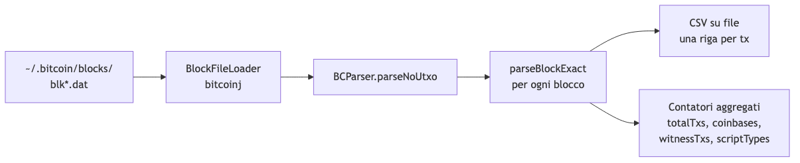
*Fig. — Pipeline di `BCParser`: dai file blk.dat al CSV-like con statistiche aggregate sulla blockchain intera.*

### Analisi possibili a valle

Con un output CSV-like di questo tipo si possono rispondere a domande come:

- Quanti script di tipo P2PKH vs P2SH vs P2WPKH ci sono nella storia di Bitcoin? E come è cambiato il mix nel tempo (segmentando sul timestamp)?
- Quante transazioni SegWit sono state fatte dopo l'attivazione di agosto 2017?
- Quanti output sono `PROVABLY UNSPENDABLE` (OP_RETURN)? Che payload contengono?
- Quanti indirizzi sono rimasti `UNKNOWN` — e quindi usano script non-standard (bare multisig, condizioni custom, ecc.)?

> [!tip] Il limite: niente UTXO set
>
> Il parser scritto in questo laboratorio si chiama `parseNoUtxo` per una ragione: non ricostruisce il set degli output non spesi. Per farlo bisognerebbe, per ogni input, cercare l'output corrispondente (prevTxHash + prevTxPos) e rimuoverlo dalla collezione degli UTXO vivi. È fattibile ma richiede molto più lavoro e memoria. Nella versione attuale ci si limita alle statistiche per transazione.

---

## Sintesi operativa

> [!abstract] Cosa resta in mano dopo il laboratorio
>
> - Un **classificatore di script** Bitcoin che riconosce per pattern i tipi standard (P2PK, P2PKH, P2SH, P2WPKH, P2WSH, OP_RETURN, empty) e restituisce un codice numerico
> - Un **decodificatore di indirizzo** che applica Base58Check (con version 0x00 o 0x05) o Bech32 a seconda del tipo di script
> - Un esercizio di estensione per Taproot (`OP_1 <32B>` + Bech32m)
> - Conoscenza del formato dei file `blk*.dat` di Bitcoin Core
> - Un **parser dell'intera blockchain** (`BCParser`) che legge i blk.dat tramite `BlockFileLoader`, scrive un CSV-like con una riga per transazione, e tiene contatori aggregati su tipi di script, coinbase, witness e indirizzi non decodificabili

```{=latex}
\newpage
```

# Bitcoin Security

Il sistema Bitcoin si articola su quattro livelli — **Blockchain Design**, **P2P Architecture**, **Consensus** e **Transactions** — ognuno soggetto ad attacchi specifici. La rete P2P affronta l'Eclipse Attack e l'Approx. Bitcoin Mining; il consenso subisce il 51% Attack e il Selfish Mining; le transazioni fronteggiano il Double Spending e il Malleability Attack. La sicurezza è analizzata tramite modelli formali come Random Oracle, Nakamoto's Model e Bitcoin Backbone.

---

## Double Spending e Attacco del 51%

Il **Double Spending Attack** consiste nel tentare di spendere lo stesso bitcoin due volte verso due destinatari diversi. L'approccio ingenuo — trasmettere entrambe le transazioni alla rete — fallisce: finiscono entrambe nella MemPool, ma un minatore onesto ne includerà solo una nel blocco successivo, scartando la seconda. Se due minatori le validano contemporaneamente generando un fork, la Longest Chain Rule ne renderà valida solo una — motivo per cui si attendono solitamente 6 conferme.

L'attacco diventa pericoloso in modalità **stealth**. Il minatore malevolo:
1. Spende bitcoin sulla catena pubblica per acquistare un bene (es. una barca)
2. Mina in segreto una catena privata omettendo quella transazione — mantenendo il controllo dei bitcoin
3. Quando la catena privata supera quella pubblica, la trasmette alla rete
4. Per la Longest Chain Rule, la rete adotta la nuova catena: l'attaccante riottiene i fondi e mantiene il bene

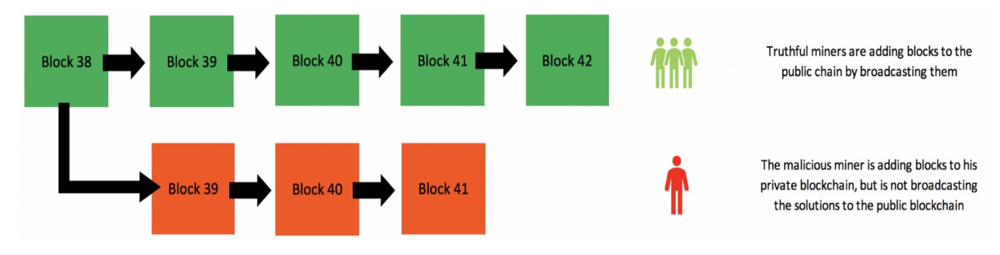

Perché l'attacco riesca con regolarità, il minatore deve detenere oltre il **50% dell'hashing power** — da qui il nome "51% Attack".

> [!note] Il caso GHash.IO (2014)
>
> La mining pool GHash.IO raggiunse quasi il 50% della potenza di calcolo (38,24%), scatenando il panico nella community. Non subì alcun attacco: per chi detiene tanto potere è economicamente più conveniente continuare a minare e incassare i block reward che distruggere il network per annullare una singola transazione.

---

## Transaction Malleability e il Caso Mt. Gox

La **Transaction Malleability** permetteva di alterare il **TXID** (identificativo) di una transazione senza modificarne gli effetti reali — mittente, destinatario e importo restavano invariati, ma l'ID cambiava. Come se il numero di tracking di un pacco venisse sostituito in transito.

La vulnerabilità era nell'algoritmo **ECDSA**: una firma è una coppia $(r, s)$, ma se $(r, s)$ è valida lo è anche $(r, n-s)$, dove $n$ è una costante della curva. Poiché il TXID è l'hash SHA-256 dell'intera transazione (inclusa la firma nello ScriptSig), cambiare la rappresentazione in $(r, n-s)$ modifica il TXID senza invalidare la firma logica.

Lo schema di attacco funziona così: Alice invia 50 BTC a Bob, generando una transazione con TXID = 1234. Bob intercetta la transazione, ne crea una copia con la firma modificata in $(r, n-s)$ — stessi input, stesso output, stessa firma logicamente valida, ma TXID diverso (es. 4567). Ora c'è una gara: entrambe le transazioni finiscono nella MemPool. Il momento in cui una viene confermata, l'altra viene scartata come duplicato. Se viene confermata quella di Bob (TXID 4567), Alice non trova mai il suo TXID originale (1234) sulla blockchain — e Bob sostiene di non aver ricevuto nulla, costringendola a un secondo pagamento.

> [!note] Il fallimento di Mt. Gox (2013–2014)
>
> Mt. Gox gestiva il 72% delle transazioni Bitcoin mondiali. Ad aprile 2014 dichiarò bancarotta, avendo perso ~744.408 BTC (il 6% dell'offerta totale, ~450 milioni di dollari dell'epoca). Mt. Gox non usava codifiche di firma standard: alcuni utenti le "standardizzavano" applicando la reverse malleability, ispirando gli hacker. Gli attaccanti prelevavano fondi, alteravano il TXID in transito, ricevevano i fondi e — poiché l'exchange non vedeva l'ID originale — rieffettuavano il prelievo.

La vulnerabilità è stata eliminata con il soft fork **Segregated Witness (SegWit)**: i dati della firma vengono spostati in "witness data" separati, e il TXID viene calcolato senza includerli — la modifica della firma non può più cambiare l'ID.

---

## Attacco Denial of Service

Se un minatore rifiuta di processare le transazioni di un utente sgradito, quest'ultimo subisce solo un ritardo. La transazione resta nella MemPool finché qualsiasi altro nodo onesto non propone un blocco che la include. Non esiste un meccanismo efficace per censurare permanentemente una transazione in una rete con sufficienti nodi onesti.

---

## Attori del Network

| Tipo di nodo | Wallet | Mining | Blockchain completa | Routing P2P |
|---|---|---|---|---|
| **Reference Client (Bitcoin Core)** | Sì | Sì | Sì | Sì |
| **Full Node** | No | No | Sì | Sì |
| **Solo Miner** | No | Sì | Sì | Sì |
| **Lightweight / SPV Wallet** | Sì | No | No | Sì |

---

## Evoluzione Hardware per il Mining

Il mining consiste nell'eseguire SHA-256 in loop variando il nonce fino a ottenere un hash inferiore al target. Il ciclo centrale è concettualmente semplice:

```
while (1)
    HDR[kNoncePos]++;
    if (SHA256(SHA256(HDR)) < (65535 << 208) / DIFFICULTY)
        return;
```

L'hardware su cui gira questo loop si è evoluto in quattro generazioni, con guadagni di efficienza enormi ad ogni salto:

| Generazione | Periodo | Caratteristiche | Tempo medio per un blocco |
|---|---|---|---|
| **CPU** | 2009 | Elaborazione sequenziale su core generici | ~139.461 anni (2015, singolo PC) |
| **GPU** | 2010+ | Alto parallelismo via OpenCL; overclocking diffuso | ~300 anni (100 GPU) |
| **FPGA** | 2011+ | Schede programmabili via Verilog; ottime per operazioni bitwise | ~25 anni |
| **ASIC** | 2013+ | Chip dedicati esclusivamente a SHA-256 (es. TerraMiner 4: 2 TH/s a $3.500) | Secondi/minuti |

---

## Solo Mining vs Mining Pool

Il **solo mining** segue una distribuzione di Poisson con alta varianza: nel 2014, con 1700 GH/s, l'attesa media per un blocco era oltre 3 anni. Si accumula stress e spese senza entrate garantite.

La deviazione standard è alta per costruzione: se in un mese ci si aspetta di trovare 4 blocchi, la deviazione standard è $\sqrt{4} = 2$. Significa che alcuni mesi se ne trovano 6, altri 2, altri 0. Oltre all'incertezza economica, il solo mining introduce un problema di fiducia: il miner non può verificare in modo indipendente se il proprio hardware funzioni correttamente, né se gli altri miner stiano barando per ottenere una quota sproporzionata dei premi — e in effetti i miner *possono* imbrogliarsi a vicenda. Questo è uno dei motivi principali che ha spinto verso le mining pool.

Le **Mining Pool** aggregano i minatori riducendo la varianza in cambio di entrate più piccole ma costanti. Un *Pool Manager* centrale distribuisce il lavoro, raccoglie le soluzioni e redistribuisce i premi trattenendo una fee. Per verificare che i minatori stiano davvero lavorando, questi inviano **shares**: blocchi "quasi validi" con una difficoltà ridotta rispetto alla rete, che fungono da prova probabilistica del lavoro svolto.

### Metodi di Pagamento

La scelta del metodo di pagamento è il cuore del rapporto economico tra pool e miner: determina chi si fa carico del rischio della varianza e come viene scoraggiato il comportamento opportunistico. Esistono tre schemi principali, con varianti ibride usate dalle pool moderne.

#### Pay Per Share (PPS) e FPPS

Nel modello **PPS** (*Pay Per Share*), il miner viene pagato per ogni share valida inviata, indipendentemente dal fatto che la pool trovi effettivamente un blocco. Il pagamento è deterministico: se la difficoltà della rete è $D$ e la difficoltà delle share è $d$, ogni share vale esattamente $\frac{d}{D} \cdot \text{block\_reward}$. La pool si assume interamente il rischio della varianza — in settimane sfortuna, pagherà i miner anche senza ricavare premi.

**FPPS** (*Fully Pay Per Share*) è la variante estesa: oltre al block reward, include nella quota per share anche le **transaction fees** del blocco (che in PPS puro vengono spesso trattenute dall'operatore). FPPS è quindi più generoso per il miner ma richiede una fee operativa più alta.

> [!warning] Incentivo perverso del PPS
>
> Poiché il miner viene pagato a prescindere, non ha alcun incentivo a trasmettere immediatamente un blocco valido trovato — potrebbe teoricamente scartarlo per massimizzare le proprie share senza contribuire alla catena. Nella pratica questo comportamento è raro perché degenera nella loss di reputazione e nella rimozione dalla pool.

#### Pay Per Last N Shares (PPLNS)

Nel modello **PPLNS**, la ricompensa viene distribuita solo quando la pool trova un blocco, e viene ripartita in proporzione alle share che ciascun miner ha inviato nell'ultima finestra di $N$ share. Il parametro $N$ è scelto dall'operatore: una finestra piccola premia i miner più recenti; una finestra grande diluisce il contributo nel tempo.

L'effetto principale è che il miner si espone alla stessa varianza della pool: se la pool trova molti blocchi in rapida successione, guadagna molto; se è sfortunata, guadagna poco. In compenso, la fee è bassa perché l'operatore non anticipa pagamenti.

> [!tip] PPLNS scoraggia il pool hopping
>
> Il **pool hopping** è la strategia di un miner opportunista che si unisce a una pool all'inizio di un round (quando le share accumulate sono poche e la sua quota relativa è alta) per poi passare a un'altra pool verso la fine. Con PPLNS la finestra scorrente penalizza chi entra tardi o è intermittente: le sue share recenti hanno peso minore rispetto a chi contribuisce stabilmente. Questo rende PPLNS resistente al pool hopping.

#### Pay Proportional

Nel modello **proporzionale**, la ricompensa di ogni blocco trovato viene divisa tra i miner in proporzione alle share inviate *durante quel round* (cioè dall'ultimo blocco trovato dalla pool al blocco corrente). A differenza di PPLNS non c'è finestra scorrevole: si azzera ad ogni blocco.

Questo schema è vulnerabile al pool hopping in modo ancora più diretto: un miner che entra a inizio round (quando poche share sono state accumulate) ha una quota percentuale molto alta. Man mano che il round si allunga, nuovi miner entrano e la quota si diluisce — conviene quindi abbandonare i round lunghi. Per questo motivo il Pay Proportional puro è stato quasi completamente abbandonato in favore di PPLNS.

#### Confronto riassuntivo

| Metodo | Chi porta il rischio varianza | Vulnerabile al pool hopping | Fee tipica | Transaction fees incluse |
|---|---|---|---|---|
| **PPS** | Operatore della pool | No | Alta | No |
| **FPPS** | Operatore della pool | No | Alta | Sì |
| **PPLNS** | Il miner | Parzialmente (finestra scorrevole lo riduce) | Bassa | Dipende dalla pool |
| **Pay Proportional** | Il miner | Sì (molto vulnerabile) | Bassa | Dipende dalla pool |

> [!warning] Mining Pool Decentralizzate (es. P2Pool, dal 2011)
>
> Non richiedono un operatore fidato. I miner costruiscono in parallelo una **sharechain** — una blockchain privata con difficoltà ridotta (~un blocco ogni 30 secondi) — agganciata all'ultimo blocco Bitcoin. Ogni share è scritta sulla sharechain e registra la quota di ricompensa spettante. Quando si trova un blocco Bitcoin valido, i pagamenti vengono processati sulla rete principale tramite *merge mining*. L'auditability totale impedisce truffe interne.

### Top Mining Pool (2025)

| Pool | Fee | Hashrate | Metodo |
|---|---|---|---|
| Foundry USA | 2% PPLNS / 4% PPS | 231,5 EH/s | FPPS |
| BTC.com | 1,38% | 161,44 EH/s | Advanced FPPS |
| Antpool | 0% PPLNS / 4% PPS+ | 30,5 EH/s | PPLNS, PPS+ |
| F2Pool | 2,5% | 25,81 EH/s | PPS+ |
| Binance | 2,5% | 23,86 EH/s | FPPS, PPS+, PPS |
| Poolin | 2,5% | 23,59 EH/s | FPPS |
| ViaBTC | 2% PPLNS / 4% PPS | 20,32 EH/s | PPLNS, PPS |

Le pool sono nate nel 2010 (era GPU) e già nel 2014 raccoglievano il 90% dell'hashrate globale. I protocolli standardizzati odierni facilitano lo spostamento dei miner tra pool diverse.

```{=latex}
\newpage
```

# Advanced Bitcoin Scripts e SPV Clients

Tre costrutti avanzati di Bitcoin — **multisignature**, **hash lock** e **time lock** — sono alla base della Lightning Network, la principale soluzione di scalabilità per Bitcoin.

---

## Multisignature (Multisig)

In un protocollo multi-firma, un gruppo di firmatari autorizza collettivamente una transazione; la verifica avviene tramite le chiavi pubbliche di tutti i partecipanti. L'approccio ingenuo concatena le firme individuali, ma la dimensione cresce linearmente con il numero di firmatari. L'ideale sarebbe una dimensione fissa indipendente dal numero di partecipanti.
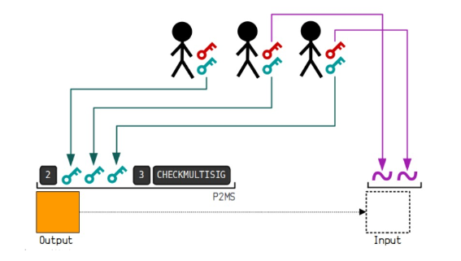
Bitcoin ha adottato inizialmente la soluzione più semplice con **ECDSA**: firme multiple separate, non aggregate. Le **firme Schnorr**, che permettono l'aggregazione, sono state introdotte solo in seguito con il protocollo **Taproot**.

Un indirizzo multisig accoppia un indirizzo Bitcoin a un locking script che richiede **M** firme valide su **N** chiavi pubbliche associate.

### Script Multisig

**Locking script** M-of-N:
```
M <PubKey1> … <PubKeyN> N OP_CHECKMULTISIG
```

**Unlocking script** (qualsiasi combinazione valida di M firme):
```
<Signature 1> … <Signature M>
```

Esempio 2-of-3 con Alice, Bob e Judy:
- Locking: `2 <PkA> <PkB> <PkC> 3 OP_CHECKMULTISIG`
- Unlocking valido: `<Sig A> <Sig C>` — qualsiasi due delle tre

### Casi d'uso

| Schema | Caso d'uso |
|---|---|
| **1-of-2** | Conto corrente coniugale per piccole spese — basta la firma di uno |
| **2-of-2** | Conto risparmio — entrambi devono approvare |
| **2-of-2** | Wallet con autenticazione a due fattori (laptop + smartphone) — un trojan sul telefono non basta per rubare i fondi |
| **2-of-2** | Blocco fondante della Lightning Network |
| **2-of-3** | Conto risparmio genitore-figlio — il figlio non può prelevare senza il consenso di un genitore |
| **2-of-3** | Escrow trustless tra compratore e venditore con arbitro |

---

## Transazioni Escrow

Alice vuole acquistare un libro raro da Bob, ma vivono in città diverse e non si fidano l'uno dell'altro: Alice non vuole pagare prima di ricevere il libro, Bob non vuole spedire prima di essere pagato.

La soluzione è una **transazione escrow 2-of-3** con Judy come arbitro neutrale. Alice crea la transazione multisig con una chiave pubblica ciascuno per Alice, Bob e Judy, e la pubblica sulla blockchain. I fondi entrano in una sorta di "limbo": nessuno può muoverli da solo, servono sempre due firme. L'escrow fallisce solo se Judy collude esplicitamente con una delle parti.

> [!example] I tre scenari possibili
>
> **2a — Tutto ok**: Alice riceve il libro. Alice e Bob firmano insieme per rilasciare i fondi a Bob. Judy non viene coinvolta. Servono due transazioni: una per depositare nell'escrow, una per pagare Bob.
>
> **2b — Alice riceve ma rifiuta di pagare**: Bob fornisce a Judy la prova di spedizione. Bob e Judy firmano insieme per inviare i fondi a Bob.
>
> **2c — Bob non spedisce**: Alice dimostra a Judy di non aver ricevuto nulla. Alice e Judy firmano insieme per restituire i fondi ad Alice.

---

## Pay-To-Script-Hash (P2SH)

Gli script multisig sono scomodi in pratica. Se un cliente deve pagare un'azienda con un multisig 2-of-5, l'azienda deve trasmettere l'intero script al cliente, che ha bisogno di un wallet speciale per costruirlo. La transazione risultante è cinque volte più grande del normale: fee più alte (a carico del mittente), script troppo lungo per un QR code, e l'intero script resta in RAM nel set UTXO di ogni full node finché non viene speso.

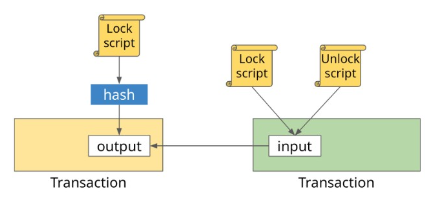

**P2SH** (BIP-16, gennaio 2012) risolve il problema: il destinatario del pagamento è identificato dall'**hash dello script**, non dallo script stesso.

| | Locking script | Unlocking script |
|---|---|---|
| **Multisig classico** | `OP_1 <PK1> <PK2> OP_2 OP_CHECKMULTISIG` | `OP_0 <Sig1>` |
| **P2SH** | `OP_HASH160 <RedeemScriptHash> OP_EQUAL` | `OP_0 <Sig1> <Sig2> \| <OP_2 <PK1> <PK2> <PK3> OP_3 OP_CHECKMULTISIG>` |

Per riscattare un P2SH l'utente presenta: la firma richiesta + il *Redeem Script* originale in chiaro, che hashato deve coincidere con l'hash nel locking script.

> [!tip] Il vantaggio chiave del P2SH
>
> Il P2SH sposta tutti gli oneri **dal mittente al destinatario**:
> - La complessità di costruire lo script passa al destinatario
> - Le fee aggiuntive per lo script lungo le paga il destinatario (al momento della spesa), non il mittente
> - Lo script lungo non occupa RAM nell'UTXO set ora, ma viene registrato sulla blockchain solo quando viene speso (nell'input)
> - Gli script vengono codificati come normali indirizzi: qualsiasi wallet semplice può pagare

---

## Hash-Time Locked Contracts (HTLC)

Un HTLC combina due meccanismi:

> [!definition] HTLC
>
> - **Hash Lock**: l'hash di un segreto è pubblicato nello script. I fondi si sbloccano solo se il destinatario rivela pubblicamente il segreto originale.
> - **Time Lock**: condizione di fallback — se entro un timeout prestabilito il segreto non viene rivelato, i fondi tornano al mittente.

Gli HTLC sono usati nei **payment channel** (Lightning Network) e negli **Atomic Swap**.

### Atomic Swap

Un Atomic Swap permette di scambiare criptovalute su blockchain diverse in modo *trustless*, senza exchange centralizzati. Il problema classico: chi invia i fondi per primo rischia che la controparte non adempia. L'HTLC risolve sincronizzando i due lati dello scambio.

**Esempio**: Alice ha BTC e vuole ZEN di Bob.

1. Alice genera un segreto `s`, ne calcola `H(s)` e crea un HTLC sulla blockchain Bitcoin bloccando 1 BTC: Bob può riscattarli rivelando `s`, oppure dopo 24 ore i fondi tornano ad Alice. Alice invia `H(s)` a Bob.
2. Bob crea un HTLC identico sulla blockchain ZEN bloccando 200 ZEN con lo stesso `H(s)` e un timelock di 24 ore.
3. Alice usa `s` per sbloccare l'HTLC di Bob sulla rete ZEN e incassare i 200 ZEN — operazione pubblica e registrata sulla blockchain.
4. Bob legge `s` dalla blockchain ZEN e lo usa per sbloccare l'HTLC di Alice su Bitcoin, incassando 1 BTC.

L'hashlock sincronizza lo scambio; il timelock garantisce che nessuno perda i fondi se la controparte sparisce.

---

## Data Registering e Proof of Burn

La blockchain può fungere da **registro notarile**: si calcola l'hash di un documento e lo si registra on-chain per provare l'esistenza di quel file in una data specifica.

Il metodo originale era simulare un pagamento verso un indirizzo falso (nessuno ha la chiave privata corrispondente) usando 20 byte liberi come campo dati. Il problema: quell'UTXO non può mai essere rimosso dalla RAM dei full node — **data pollution**.

**OP_RETURN** (introdotto dopo il 2013 come compromesso) standardizza la registrazione:

```
OP_RETURN <Data>
```

L'output è esplicitamente non spendibile: i coin associati vengono distrutti, ma l'entry non entra nell'UTXO set e non inquina la RAM. Si usa in due modi:
- Solo per registrare dati (senza bruciare coin significativi)
- **Proof of Burn**: distruggere deliberatamente coin in modo verificabile

> [!note] Usi della Proof of Burn
>
> - **Bootstrap di nuove criptovalute**: gli utenti bruciano BTC per ottenere token della nuova chain, distribuendo la supply in modo decentralizzato
> - **Consenso alternativo**: si vince la "lotteria dei blocchi" bruciando coin invece di consumare energia (come nella PoW). Il bilanciamento matematico tra coin bruciati e ricompense è però difficile da implementare correttamente.

---

## Simplified Payment Verification (SPV)

Scaricare l'intera blockchain (>649 GB ad aprile 2025) non è pratico su smartphone. I **client SPV** (o *lightweight client*) scaricano solo gli **header dei blocchi** — circa 80 byte ciascuno, mille volte più leggeri del blocco completo — e sono interessati solo alle transazioni che riguardano gli indirizzi nel proprio wallet.

La sicurezza è mantenuta su due livelli:
- L'header contiene il **nonce**: si può verificare che la Proof of Work sia stata completata
- La validità di una transazione si verifica tramite **Merkle proof**: il full node invia il ramo del Merkle Tree che collega la transazione alla Merkle Root nell'header. L'SPV ricalcola ricorsivamente gli hash dal basso verso l'alto e confronta il risultato con la radice — se coincide, la transazione è autentica.

### Bloom Filter e Privacy

Richiedere transazioni specifiche per indirizzo rivelerebbe al full node quali indirizzi appartengono all'utente. Per proteggere la privacy, l'SPV invia al full node un **Bloom filter** costruito sugli indirizzi del wallet (OR bit a bit degli hash di ogni indirizzo).

Il full node testa ogni output di ogni transazione contro il filtro:
- Se tutti gli hash restituiscono un bit a 1 → la transazione è *probabilmente* rilevante → viene inviata all'SPV
- Se anche un solo hash restituisce uno 0 → la transazione è *certamente* irrilevante → viene ignorata

I falsi positivi sono accettati deliberatamente: nascondono quali indirizzi interessano davvero all'SPV (privacy) e rimangono comunque pochi (efficienza di banda).

---

## Bitcoin Protocol Stack e Rete P2P

| Livello | Descrizione |
|---|---|
| **Application layer** | Applicazioni user-facing che usano la blockchain |
| **Transaction layer** | Script e logica di validità delle transazioni |
| **Consensus layer** | Algoritmi per l'accordo sull'incorporazione delle transazioni (es. PoW) |
| **Network (P2P) layer** | Broadcasting dei dati tra i nodi |

La rete P2P è **non strutturata**: chiunque può connettersi. Di default ogni nodo mantiene 117 connessioni TCP in uscita e accetta fino a 8 in entrata sulla porta 8333, senza autenticazione né cifratura.
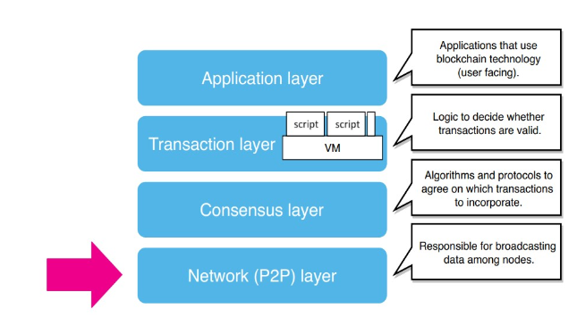

### Bootstrap e Peer Discovery

Un nodo nuovo deve prima trovare qualcuno con cui parlare. I metodi in ordine di preferenza:
1. **Seed address hard-coded** nel client — nodi stabili con IP statici
2. **DNS bootstrap** — server DNS dedicati che restituiscono liste di IP
3. **Forum e chat** — fallback manuale se tutto il resto fallisce

Una volta connesso, il nodo ricorda gli indirizzi dei peer con cui ha comunicato con successo: al riavvio può riconnettersi rapidamente senza ripartire da zero.

Per scoprire ulteriori peer, il nodo invia messaggi `GETADDR` ai vicini, che rispondono con messaggi `ADDR` contenenti liste di IP. Il nuovo nodo annuncia anche se stesso inviando un `ADDR` con il proprio IP, che i vicini propagano ai loro vicini.

### Handshake

All'apertura di una connessione, i nodi si scambiano un messaggio `VERSION` che contiene tra l'altro il campo **bestHeight** — l'altezza corrente della blockchain del nodo. Se un nodo ha una catena più corta di quella del vicino, richiede i blocchi mancanti.

### Gossip Protocol e Propagazione

La propagazione di transazioni e blocchi avviene tramite **gossip** (*any-to-all*): ogni nodo propaga ai propri vicini ciò che riceve.

Il flusso standard per una transazione o un blocco:

1. **`INV`** — messaggio di annuncio: il nodo invia ai vicini l'hash della transazione/blocco (non il contenuto). È una notifica, non un invio.
2. **`GETDATA`** — i vicini che non hanno già quel dato richiedono il contenuto completo.
3. **`BLOCK` / `TRANSACTION`** — il nodo invia il dato effettivo.

> [!tip] Minimizzare il consumo di banda
>
> Se lo stesso hash arriva da più peer contemporaneamente, il nodo invia `GETDATA` a **uno solo** di essi. Questo evita di scaricare lo stesso dato più volte.

**Unsolicited Block Push**: quando un miner trova un blocco, sa con certezza di essere l'unico ad averlo. Salta il passaggio `INV` e invia direttamente il blocco ai vicini — ogni secondo conta per non perdere il vantaggio competitivo.

**GETBLOCK**: un nodo che si è disconnesso o si avvia per la prima volta deve sincronizzarsi. Chiede al vicino la sua visione locale della blockchain; il vicino risponde con gli hash dei blocchi a varie altezze. Il nodo trova il primo hash in comune con la propria catena e richiede i blocchi successivi tramite `GETDATA`. Il processo è iterativo: dopo aver scaricato un batch, invia un nuovo `GETBLOCK` fino a essere aggiornato.

### Protezione contro il DoS

Nodi malevoli potrebbero inondare la rete con oggetti invalidi, saturando la banda. La protezione è integrata nel protocollo per design:

- Un nodo invia un messaggio `INV` ai vicini **solo dopo aver validato** il blocco o la transazione (firma valida, UTXO valido)
- Ogni nodo mantiene uno **score di reputazione** per ciascun peer
- Se un peer si comporta male (es. invia transazioni con firme invalide), il suo score viene degradato
- Sotto una certa soglia, il peer viene disconnesso

```{=latex}
\newpage
```

# Lezione 16 — Lightning network of Bitcoin

## Il Trilemma della Blockchain

Prima di capire perché esiste la Lightning Network, occorre capire il problema che intende risolvere. Vitalik Buterin ha formalizzato l'osservazione che i sistemi blockchain tendono a soddisfare al massimo due delle tre proprietà desiderabili simultaneamente.

> [!definition] Trilemma della Blockchain (Buterin)
> 
> Un sistema blockchain può soddisfare al massimo due delle seguenti tre proprietà: **decentralizzazione** (nessun punto di controllo centrale, resistenza alla censura), **scalabilità** (capacità di gestire un numero crescente di transazioni per unità di tempo), **sicurezza** (capacità di operare correttamente e difendersi dagli attacchi).

Concretamente, i sistemi esistenti si posizionano in modo diverso su questo triangolo. Bitcoin ed Ethereum privilegiano sicurezza e decentralizzazione, ma non scalano — Bitcoin elabora circa 7 transazioni al secondo a livello globale, contro le 65.000 di Visa. Hyperledger e Ripple sono sicuri e scalabili, ma centralizzati: un numero ristretto di nodi controlla la rete, con minima resistenza alla censura. IOTA era scalabile e decentralizzato, ma usava un Proof-of-Work leggero che ne comprometteva la sicurezza.

Il problema è quantitativamente serio. Con blocchi da 1 MB (4 MB dal 2017 con SegWit) e transazioni medie da 250 byte, Bitcoin può contenere circa 400 transazioni per blocco, che a un blocco ogni 10 minuti danno 7 TPS. La conferma richiede 6 blocchi per considerarsi definitiva, quindi circa un'ora di attesa. Non c'è confronto con i sistemi di pagamento tradizionali.

### Perché le soluzioni on-chain non bastano

La prima risposta intuitiva è: aumentiamo la dimensione del blocco. Bitcoin Cash ha fatto esattamente questo, portando prima a 8 MB e poi a 32 MB in un hard fork. Il problema è che per raggiungere la stessa capacità di Visa servirebbero blocchi da 8 GB — non è un errore di battitura. I nodi dovrebbero archiviare circa 400 TB di dati generati ogni anno e disporre di 120 megabit/sec di banda. Il risultato inevitabile è che solo un piccolo numero di nodi con risorse molto elevate potrebbe partecipare, aumentando la centralizzazione e riducendo la sicurezza.

Aumentare il tasso di produzione dei blocchi introduce un altro problema: più fork concorrenti, con conseguente riduzione della sicurezza complessiva. Il Proof-of-Stake e i protocolli di consenso leggeri risolvono il problema energetico e scalano meglio, ma spesso non sono davvero decentralizzati in pratica, e tendono a favorire chi è già ricco.

---

## L'Idea dei Canali di Pagamento Off-Chain

L'intuizione chiave che sblocca il problema è questa: non è necessario che ogni transazione finisca sulla blockchain. La blockchain è lenta e cara da usare perché richiede consenso globale tra tutti i nodi — ma il consenso globale è necessario solo per il regolamento finale dei fondi, non per ogni singolo pagamento intermedio.

> [!tip] Intuizione chiave
> 
> Spostare la maggior parte delle transazioni _fuori_ dalla blockchain, usando la catena solo per aprire e chiudere i canali di pagamento. In mezzo, le parti si scambiano "cambiali" (promissory notes) off-chain, a velocità di rete.

L'analogia della slide è illuminante: immaginate un cliente al bar che dà la carta di credito al barista all'inizio della serata. Il barista segna ogni drink su un conto ma non addebita la carta ad ogni giro, evitando le commissioni. Alla fine della serata regola tutto con un'unica transazione. Il barista non rischia niente perché ha la carta in mano come garanzia; se il cliente sparisce, può addebitarla. Nella Lightning Network, la "carta di credito" è il deposito in un indirizzo multifirma sulla blockchain, e le "cambiali" sono transazioni Bitcoin firmate ma non ancora trasmesse in rete.

I canali di pagamento off-chain sono quindi:

- **trustless**: non richiedono fiducia reciproca tra le parti, perché la blockchain funge da arbitro
- **decentralizzati**: costruiti sopra l'infrastruttura di Bitcoin, senza hard fork
- **istantanei**: le transazioni avvengono alla velocità della rete peer-to-peer, non ai ritmi della blockchain
- **ad alto volume**: potenzialmente illimitati in numero di transazioni per canale

La tipologia base è **unidirezionale** (una parte paga sempre l'altra), ma le estensioni più importanti sono i **canali bidirezionali** e la **composizione di canali** — che insieme costituiscono la Lightning Network vera e propria.

---

## Il Protocollo Lightning Network

La Lightning Network è un protocollo di livello 2 proposto da Joseph Poon e Thaddeus Dryja nel 2015. Tecnicamente si basa su tre operazioni fondamentali per ogni canale: apertura, impegni off-chain e chiusura.

### Apertura del Canale: la Funding Transaction

A livello tecnico, un canale di pagamento è un **indirizzo multifirma 2-di-2** — per spendere i fondi in quell'indirizzo servono le firme di entrambe le parti (Alice e Bob), esattamente come un conto bancario cointestato che richiede due firme per i prelievi.

Per aprire il canale, Alice crea una **funding transaction** che invia i suoi bitcoin all'indirizzo multifirma. Questa è l'unica transazione che deve comparire sulla blockchain durante l'intera vita del canale. La struttura è:

```
Funding Transaction:
  Input:  Indirizzo di Alice
  Output: Indirizzo multifirma Alice+Bob
  Importo: 100K satoshi
```

I fondi restano "in escrow" nell'indirizzo condiviso finché il canale non viene chiuso.

### Impegni Off-Chain: le Commitment Transactions

Una volta aperto il canale, Alice e Bob si scambiano **commitment transactions** — transazioni Bitcoin valide che ridistribuiscono i fondi del multifirma tra i due, ma che _non vengono trasmesse_ sulla blockchain. Rimangono conservate localmente da ciascuna delle parti.

Ogni commitment transaction ha questa struttura:

```
Commitment Transaction N:
  Input:  Indirizzo multifirma Alice+Bob
  Output: Alice → importo_A satoshi
  Output: Bob  → importo_B satoshi
```

La transazione deve essere firmata da entrambi. La sequenza tipica è: Alice firma la transazione e la invia a Bob, che la controfirma e la conserva (e viceversa). Così entrambi hanno in mano un documento valido che, se trasmesso, si traduce in un regolamento on-chain corrispondente al loro saldo attuale.

La cosa cruciale è che ogni nuova transazione _sostituisce_ la precedente — non la annulla tecnicamente, ma la rende obsoleta. Se Alice invia 80 BTC a Bob, entrambi conservano una commitment transaction che dice "Alice: 20, Bob: 80". Se poi Bob ne rimanda 10 ad Alice, entrambi creano e conservano una nuova transazione che dice "Alice: 30, Bob: 70". L'ultima transazione valida rappresenta il saldo corrente del canale.

### Chiusura del Canale: il Settlement On-Chain

Quando le parti vogliono chiudere il canale, una delle due trasmette l'ultima commitment transaction alla rete Bitcoin. La blockchain la registra, i fondi vengono distribuiti secondo i saldi finali, e il canale è chiuso. Solo questa seconda transazione, sommata alla funding transaction d'apertura, finisce sulla blockchain — indipendentemente da quante migliaia di transazioni siano state scambiate nel mezzo.

> [!abstract] Sintesi del ciclo di vita di un canale
> 
> 1. **Apertura** (on-chain): Alice deposita fondi nel multifirma — 1 transazione blockchain
> 2. **Operatività** (off-chain): N transazioni scambiate direttamente tra le parti, nessuna sulla chain
> 3. **Chiusura** (on-chain): l'ultima commitment viene trasmessa, i saldi finali vengono regolati — 1 transazione blockchain

Questo schema aumenta anche la **privacy**: la blockchain registra solo apertura e chiusura, senza alcun dettaglio sui singoli pagamenti intermedi.

---

## Meccanismi di Sicurezza Anti-Frode

Il protocollo introduce un problema serio: le commitment transaction precedenti sono ancora firme valide, perché sono state controfirmate in passato da entrambe le parti. Alice potrebbe voler trasmettere una vecchia transazione in cui aveva un saldo più favorevole. Come si impedisce?

### Double Spending Protection

Il primo livello di protezione è semplice: Bitcoin già previene il double spending. Quando viene trasmessa la commitment transaction finale, l'UTXO del multifirma viene "consumato". Se Alice prova a trasmettere anche una vecchia transazione che spende lo stesso multifirma, la rete la rifiuterà come tentativo di doppia spesa.

Questo funziona bene nel caso normale di chiusura cooperativa, ma non nel caso in cui sia Alice a trasmettere _per prima_ una vecchia transazione prima che Bob trasmetta quella corretta.

### Il Problema della "Cambiale Stracciata"

L'analogia delle cambiali chiarisce il nodo: ogni volta che Alice e Bob si accordano su un nuovo saldo, idealmente "straccerebbero" la cambiale precedente. Ma in Bitcoin non esiste un meccanismo per "stracciare" una transazione off-chain — non c'è garanzia che Alice non ne abbia conservato una copia e la trasmetta quando gli fa comodo.

### La Soluzione: Revocation Secrets e Punishment Mechanism

La Lightning Network risolve il problema con un meccanismo di **punizione basato su segreti di revoca** (_revocation secrets_). L'idea è: ogni commitment transaction è "pericolosa" da usare se sei disonesto, perché l'altra parte ha gli strumenti per punirti.

> [!definition] Meccanismo di Revoca
> 
> Ogni commitment transaction contiene un output condizionale sulla sua share: Alice può riscuotere i suoi fondi solo dopo un ritardo (es. 24 ore), oppure immediatamente se viene fornito il **revocation secret** della transazione. Prima di emettere una nuova commitment transaction, Alice deve rivelare a Bob il segreto di revoca della transazione _precedente_. Se Alice pubblica una vecchia transazione, Bob ha il segreto per "punirla" e prendere tutti i fondi del canale.

Il flusso concreto è:

1. Stato 1: Alice ha 700 sat, Bob 300 sat. Entrambi conservano la commitment T1.
2. Si aggiorna a Stato 2: Alice 400 sat, Bob 600 sat. Alice rivela a Bob il **segreto di revoca di T1** e riceve la nuova T2.
3. Se Alice ora trasmette T1 (il vecchio stato più favorevole), Bob ha il segreto per "punirla": presenta il segreto, e un apposito script (hash lock script) gli permette di riscuotere _tutti_ i fondi del canale.

Il ritardo nell'output di Alice (es. 24 ore) è fondamentale: dà a Bob il tempo di rilevare il tentativo di frode e reagire prima che Alice possa incassare i suoi fondi dall'old commitment.

```
Commitment Transaction con revoca:
  Input:  Indirizzo multifirma
  Output1: 90K sat
      → IF revocation_secret THEN paga a Bob
      → ELSE after 24 hours paga ad Alice
  Output2: 10K sat → paga a Bob
```

### Watchtower: Delega del Monitoraggio

Un nodo che partecipa a canali Lightning deve monitorare la blockchain almeno una volta a settimana, per poter reagire a eventuali commit disonesti entro la finestra di 1000 blocchi (~7 giorni). Se un nodo è spesso offline, può delegare questo compito a una **watchtower** — un servizio terzo che monitora la blockchain per conto dell'utente. La watchtower è progettata in modo che non possa tradire l'utente: conosce solo le informazioni necessarie per rilevare e punire la frode, non per rubare i fondi.

---

## Protezione dai Fondi Bloccati: Time Lock

C'è un'altra trappola potenziale: cosa succede se Bob sparisce subito dopo che Alice ha depositato nel multifirma? I fondi di Alice sarebbero bloccati a tempo indeterminato, perché per liberarli serve la firma di entrambi.

La soluzione prevede che **prima** di trasmettere la funding transaction, Alice si faccia firmare da Bob una transazione di rimborso con time lock:

> "Paga 100 BTC ad Alice dall'indirizzo multifirma dopo 30 giorni"

Alice conserva questa transazione off-chain. Solo dopo aver ricevuto questa garanzia, trasmette la funding transaction. Se Bob sparisce, Alice aspetta 30 giorni e poi trasmette la transazione di rimborso firmata da Bob — e recupera i suoi fondi.

---

## La Rete Lightning: Routing Multi-Hop

Finora abbiamo parlato di canali bilaterali. Il salto concettuale che trasforma i canali in una _rete_ è la **composizione di canali**: Alice può pagare Dave anche se non ha un canale diretto con lui, purché esista un percorso di canali intermedi.
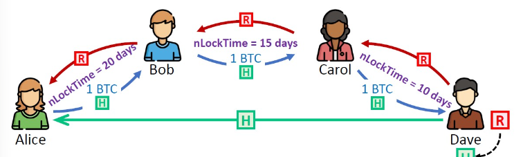
Se Alice ha un canale con Bob, e Bob ha un canale con Carol, e Carol ha un canale con Dave, Alice può instradare il pagamento attraverso Bob e Carol. I nodi intermedi **non si fidano l'uno dell'altro** — ognuno impegna i propri fondi solo a condizione che il nodo successivo faccia altrettanto. Questo si ottiene tramite gli **HTLC**.

### HTLC: Hashed Timelock Contract

L'HTLC è il cuore tecnico del routing sicuro. Combina due meccanismi già visti — hash lock e time lock — in un unico contratto che rende i pagamenti multi-hop **atomici**: o tutti i nodi vengono pagati, o nessuno.

> [!definition] HTLC (Hashed Timelock Contract)
> 
> Un contratto che condiziona il pagamento alla rivelazione di un **segreto preimage** $R$ tale che $H(R) = H$ (hash lock), con un limite di tempo entro il quale il segreto deve essere rivelato (time lock). Se il segreto non viene rivelato in tempo, i fondi tornano al mittente.

Il protocollo di pagamento multi-hop funziona così:

1. **Dave** (destinatario) genera un numero casuale segreto $R$ e calcola il suo hash $H = H(R)$. Invia $H$ ad Alice fuori banda (es. nell'invoice di pagamento).
2. **Alice** crea un HTLC verso Bob: "ti pago 1 BTC se riesci a darmi l'$R$ tale che $H(R) = H$, entro 20 giorni."
3. **Bob**, sapendo che deve ottenere $R$ da Dave tramite Carol, crea un HTLC verso Carol: "ti pago 1 BTC se mi dai $R$, entro 15 giorni."
4. **Carol** crea un HTLC verso Dave: "ti pago 1 BTC se mi dai $R$, entro 10 giorni."
5. **Dave** rivela $R$ a Carol e incassa il suo BTC.
6. Il segreto $R$ si propaga all'indietro: Carol lo presenta a Bob, Bob lo presenta ad Alice, tutti vengono pagati in cascata.

I timelock sono **decrescenti** lungo il percorso (20→15→10 giorni): questo garantisce che ogni nodo abbia abbastanza tempo per riscuotere il proprio pagamento prima del timeout del nodo precedente. Se Dave non rivela $R$ entro il termine, tutti i pagamenti vengono automaticamente rimborsati.

> [!tip] Atomicità degli HTLC
> 
> Poiché ogni nodo può riscuotere solo presentando $R$, e $R$ diventa noto solo quando Dave lo rivela, l'intera catena di pagamenti è atomica: o Dave rivela il segreto e tutti vengono pagati, oppure nessuno lo rivela e i fondi tornano indietro. Un nodo intermedio non può rubare i fondi.

### Capacità del Canale e Liquidità

Il routing introduce due concetti fondamentali che spesso vengono confusi:

> [!definition] Channel Capacity vs Channel Balance
> 
> La **channel capacity** è la somma totale dei fondi depositati nel canale alla sua apertura. È fissa per tutta la vita del canale. Il **channel balance** è come quei fondi sono distribuiti tra i due nodi in un dato momento. Varia dinamicamente ad ogni transazione.

Un nodo che vuole fare routing deve avere **liquidità in uscita** (outbound liquidity) verso il nodo successivo. Il routing calcola percorsi basandosi sulla channel capacity (pubblica), ma non conosce il channel balance (privato). Questo genera fallimenti di routing: un canale con capacity 3 BTC potrebbe avere tutto il balance dalla parte sbagliata, rendendo impossibile instradare 2 BTC in quella direzione. La conseguenza pratica è che l'algoritmo attuale usa **brute force path probing**: prova un percorso, se fallisce ne prova un altro, e così via — il che porta a latenze elevate per circa il 5% dei pagamenti (oltre 3 minuti).

### Onion Routing per la Privacy

Per garantire la privacy, il routing usa una tecnica ispirata a [[Tor]] denominata **onion routing**: il mittente costruisce un "cipolla" a strati crittografati. Ogni nodo intermedio può decriptare solo il proprio strato, scoprendo esclusivamente l'identità del nodo precedente e del successivo — mai l'intera traiettoria del pagamento. Questo impedisce ai nodi intermedi di sapere chi sta pagando chi.

### Rebalancing dei Canali

Con l'uso, un canale tende a sbilanciarsi: se Alice paga sempre Bob, il balance si sposta tutto dal lato di Bob, esaurendo la liquidità in uscita di Alice. Per ribilanciare, un nodo può eseguire un **circular payment** — instrada un pagamento a se stesso attraverso un percorso che ripristina i balance desiderati senza costi di apertura/chiusura di nuovi canali.

---

## Stato Attuale e Problemi Aperti

La Lightning Network ha rilasciato la versione alpha a gennaio 2017. Il primo acquisto noto tramite Lightning è avvenuto a gennaio 2018. Il 20 marzo 2018 è stato sferrato il primo attacco DDoS, portando offline 200 nodi. Da allora la rete è cresciuta significativamente, con migliaia di nodi e canali attivi.

Esistono diverse implementazioni open source indipendenti e interoperabili: C-Lightning, Eclair (Scala), LND (Go), Ptarmigan (C++), Rust-Lightning, LIT (Python), Electrum. Le specifiche sono pubblicate come **BOLT** (Basis Of Lightning Technology), da BOLT #1 (protocollo base) a BOLT #11 (protocollo invoice per pagamenti Lightning).

Per Ethereum esiste la **Raiden Network/uRaiden**, lanciata sulla mainnet a novembre 2017, ma non ha avuto lo stesso successo, soppiantata da altre soluzioni Layer-2 come i rollup.

### Limiti della Lightning Network

La Lightning Network risolve brillantemente il problema della scalabilità, ma introduce nuovi trade-off:

**Fund locking**: i fondi depositati nei canali sono immobilizzati per tutta la durata del canale. Un nodo che vuole fare routing deve impegnare capitali significativi. Comportamenti disonesti della controparte possono bloccare i fondi per settimane.

**Always-on requirement**: senza watchtower, un nodo deve monitorare la blockchain regolarmente per proteggersi da chiusure fraudolente. Questo è problematico per i wallet mobile.

**Centralizzazione strisciante**: ci sono indizi che la rete stia sviluppando una topologia hub-and-spoke, con pochi nodi hub molto connessi che gestiscono la maggior parte del routing. Se confermato, ridurrebbe la decentralizzazione effettiva.

**Routing inefficiente**: il brute force probing è lento e produce molti fallimenti. I nuovi algoritmi proposti (gossip-based, ant algorithms) non sono ancora maturi.

**Apertura del canale costosa**: si ha bisogno di almeno una transazione on-chain per aprire ogni canale, il che non è economico durante periodi di fee elevate.

Resta aperta la domanda centrale posta alla fine della lezione: i canali off-chain sono una soluzione al trilemma? La risposta è: _non è ancora dimostrato formalmente_. Migliorano enormemente la scalabilità senza sacrificare la sicurezza, ma la questione della decentralizzazione — specialmente nella topologia del grafo che si sta formando — rimane un punto di ricerca attivo.

```{=latex}
\newpage
```

# (Lab) Bitcoin: Anonimato e Deanonimizzazione

Questa quinta lezione di laboratorio affronta due temi correlati: il completamento della pipeline di parsing del `blk.dat` con la gestione degli UTXO, e l'analisi dell'anonimato in Bitcoin, che è una delle proprietà più fraintese della blockchain. Il filo conduttore è che la blockchain è pubblica e persistente: tutto ciò che avviene su di essa è osservabile, e l'unica protezione offerta nativamente è la **pseudonimia**, non l'anonimato vero.

---

## Completamento della pipeline: dal blk.dat al CSV con UTXO

### Il problema degli UTXO nel formato custom

Nelle lezioni precedenti si era costruito un formato CSV custom per rappresentare le transazioni Bitcoin estratte dal `blk.dat`. Il formato aveva due problemi principali: i blocchi non erano ordinati per altezza, e le transazioni non contenevano informazioni dirette sugli UTXO (cioè, gli input referenziavano le transazioni precedenti per hash, non per valore). Il metodo `cleanExactNoUtxo` in Java risolve il primo problema in modo sequenziale: prima inferisce una mappa da block hash a block height (`inferBlockHeightMap`), poi sostituisce gli hash dei blocchi con le altezze numeriche (`replaceBlockHashes`), quindi ordina le transazioni per altezza del blocco (`sortPreservingTxOrder`), e infine sostituisce gli hash delle transazioni e degli indirizzi con ID numerici incrementali a partire da zero. Il risultato è un file ordinato con ID compatti, adatto a successive elaborazioni.

Il metodo `fillItUtxo` affronta invece il secondo problema: leggendo il CSV ordinato, mantiene in memoria una mappa `TreeMap<TxOutputIds, TxOutputCouple>` che tiene traccia degli output non ancora spesi. Per ogni input di ogni transazione, consulta questa struttura per recuperare il valore e l'indirizzo sorgente, aggiungendoli al record dell'input nel CSV. Quando un UTXO viene consumato, viene rimosso dalla mappa. Il codice gestisce anche casi limite come le transazioni coinbase (che non hanno input reali), le incoerenze nel dataset e i fee negativi.

> [!warning] Complessità e ordinamento
>
> Il metodo `fillItUtxo` funziona correttamente **solo** su un file già ordinato per block height. Senza ordinamento, gli UTXO verrebbero cercati prima di essere creati, causando errori di lookup sistematici. La separazione tra `cleanExactNoUtxo` e `fillItUtxo` riflette proprio questa dipendenza sequenziale.

---

## Anonimato in Bitcoin: pseudonimia e i suoi limiti

### Che cosa garantisce Bitcoin

Bitcoin non è anonimo: è **pseudonimo**. La differenza è sostanziale. In un sistema anonimo, le transazioni non sono riconducibili ad alcun attore. In Bitcoin, ogni transazione è firmata con la chiave privata dell'indirizzo mittente, e l'intera storia delle transazioni è pubblica e permanente nella blockchain. L'identità reale di chi controlla un indirizzo non è direttamente visibile, ma le sue azioni (movimenti di fondi, tempi, importi) sono completamente tracciate.

Un utente può generare un numero arbitrario di indirizzi diversi — è anzi pratica consigliata usarne uno nuovo per ogni transazione. Ma questo non rompe la pseudonimia: significa solo che la stessa persona reale controlla più pseudonimi. Il problema è che le euristiche di clustering, descritte più avanti, riescono spesso a raggruppare questi indirizzi ricondizionandoli allo stesso utente.

Un ulteriore punto di debolezza è che le transazioni vengono diffuse nella rete P2P principalmente dai loro creatori tramite **gossip**. Chi le crea le ha firmate, quindi conosce le chiavi private degli input: è il proprietario degli indirizzi. Questa osservazione è alla base degli attacchi di network listening.

---

## Attacchi di deanonimizzazione

### La pipeline concettuale

Un attacco di deanonimizzazione mira a collegare le identità reali del mondo fisico con gli indirizzi pseudonimi della blockchain. Il processo si articola in tre stadi progressivi, ciascuno con risorse e strumenti diversi:

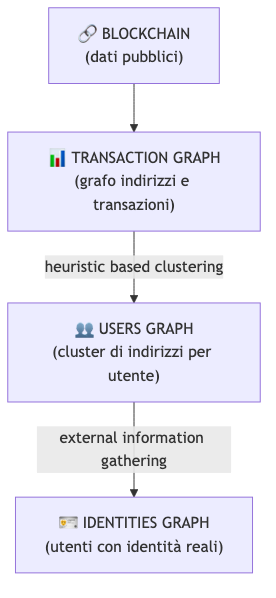
*Fig. — Pipeline di deanonimizzazione: dalla blockchain al grafo delle identità reali.*

Il primo stadio è puramente passivo: si costruisce il **transaction graph** dalla blockchain pubblica, dove i nodi sono indirizzi e gli archi rappresentano flussi di fondi. Il secondo stadio applica **euristiche di clustering** per raggruppare indirizzi che probabilmente appartengono allo stesso utente, ottenendo un **users graph** dove i nodi sono cluster. Il terzo stadio arricchisce il users graph con **informazioni esterne** per etichettare i cluster con identità reali, producendo l'**identities graph**.

### Clustering euristico

Le euristiche si basano sull'osservazione del comportamento reale degli utenti Bitcoin e sui vincoli tecnici del protocollo. Sono dipendenti dal tempo (le abitudini degli utenti cambiano) e non universali: generano falsi positivi e falsi negativi. La prassi è preferire la riduzione dei falsi positivi a scapito di un aumento dei falsi negativi, perché attribuire erroneamente indirizzi a un utente sbagliato è più grave che non attribuirli affatto.

> [!definition] Common Inputs Heuristic (euristica degli input comuni)
>
> Tutti gli indirizzi usati come input in una stessa transazione appartengono allo stesso utente. La logica è che per firmare gli input di una transazione servono le chiavi private corrispondenti: solo chi le possiede tutte può costruire quella transazione. Quindi gli indirizzi di input condividono necessariamente lo stesso proprietario.

Graficamente, una transazione con input multipli `addr_1, addr_2, ..., addr_n` produce un arco tra tutti gli indirizzi nel users graph, che vengono riuniti nello stesso cluster. L'implementazione efficiente si riduce a trovare le **componenti connesse** del grafo degli input, ottenibile con una BFS in complessità lineare.

> [!definition] Change Address Heuristic (euristica dell'indirizzo di resto)
>
> Quando si spende un UTXO, il valore in eccesso rispetto all'importo inviato viene restituito al mittente su un nuovo indirizzo, detto *change address* (indirizzo di resto). L'euristica assume che tale indirizzo appartenga allo stesso utente degli indirizzi di input.

Identificare il change address non è banale: in una transazione con più output, quale è il destinatario e quale è il resto? La versione raffinata dell'euristica definisce criteri precisi:

> [!tip] Criteri per identificare un change address (versione raffinata)
>
> L'indirizzo $c$ è un change address nella transazione $t$ se e solo se:
> - $t$ non è una transazione coinbase
> - $|\text{outputs}(t)| > 1$ (almeno due output: uno di destinazione, uno di resto)
> - $\text{inputs}(t) \cap \text{outputs}(t) = \emptyset$ (nessun "self-change" diretto)
> - Nessun altro indirizzo negli output di $t$ è già noto come change address o appartiene al cluster del mittente
> - È la **prima volta** che $c$ compare nella blockchain
> - Nessun altro indirizzo negli output soddisfa contemporaneamente queste condizioni (univocità)

La condizione di prima comparsa è particolarmente rilevante: un utente attento genera un indirizzo fresco per ogni resto, quindi un indirizzo mai visto prima è un forte indizio che si tratti di un change address. Regole aggiuntive possono essere introdotte per tenere conto di pattern comportamentali noti (es. wallet specifici che generano output in un certo ordine).

### Raccolta di informazioni esterne

Anche le euristiche più raffinate lavorano solo su dati on-chain. Per associare cluster a identità reali si ricorre a fonti esterne:

- **Timing analysis**: se due transazioni avvengono in rapida successione, possono essere collegate allo stesso utente o dispositivo.
- **Amount analysis**: importi molto precisi o ricorrenti possono rivelare pattern di utilizzo.
- **Log interni di servizi terzi**: exchange, wallet custodial e marketplace raccolgono dati KYC (*Know Your Customer*) e indirizzi di consegna fisici. Se le autorità accedono a questi log, l'associazione indirizzo–identità è diretta.
- **Dust attack**: l'attaccante invia una quantità minuscola di BTC (*dust*) a un indirizzo bersaglio. Se il wallet della vittima usa automaticamente quel UTXO come input in una transazione futura, quell'indirizzo viene collegato tramite la common inputs heuristic ad altri indirizzi dello stesso utente.

Un caso emblematico di informazione esterna è il tweet di WikiLeaks del 14 giugno 2011 che pubblicava esplicitamente il proprio indirizzo di donazione Bitcoin (`1HB5XMLmzFVj8ALj6mfBsbifRoD4miY36v`). Da quel momento in poi, quell'indirizzo è permanentemente e pubblicamente etichettato nella blockchain.

### Network listening

Il network listening è una tecnica che mira a correlare un indirizzo Bitcoin con l'indirizzo IP del suo proprietario, sfruttando le proprietà del protocollo di diffusione delle transazioni.

Le assunzioni di base (non necessariamente sempre vere) sono due: il primo nodo a diffondere una nuova transazione nella rete è con alta probabilità il suo creatore, e il creatore, avendo firmato la transazione, conosce le chiavi private degli input e quindi è il proprietario degli indirizzi corrispondenti.

L'attaccante inserisce nella rete P2P un gran numero di **nodi ascoltatori** sotto il proprio controllo, con connettività elevata e connessioni veloci. Grazie all'alta connettività, questi nodi ricevono le transazioni appena diffuse quasi in contemporanea con i vicini del creatore. Triangolando i tempi di ricezione tra tutti i nodi ascoltatori, si stima quale nodo della rete ha originato la transazione. L'IP del nodo originante viene quindi associato all'indirizzo Bitcoin degli input.

> [!warning] Limiti del network listening
>
> L'IP di un nodo non equivale sempre all'identità del proprietario: NAT, VPN, Tor e proxy possono nasconderlo. Per questo l'attaccante può raffinare la stima combinando IP con l'insieme degli *entry node* usati dalla vittima. Inoltre, solo i **full node** sono direttamente targetizzabili, poiché i light client non propagano le transazioni direttamente.

### Topology discovery

Il network listening è spesso accoppiato con la **scoperta della topologia** della rete P2P. Conoscere la topologia aumenta la precisione della triangolazione, perché permette di modellare accuratamente il percorso di propagazione del gossip. Poiché Bitcoin non ha un overlay strutturato, l'unico modo per conoscere la topologia è chiedere direttamente ai nodi la loro lista di vicini. Questo processo può **corrompere le liste di connessione** degli altri nodi (pollution attack) e può causare effetti simili a un DoS sulla rete, poiché richiede connessioni dirette con ogni nodo target.

---

## Dataset: Users Graph 2013 e caso Wikileaks

Come caso di studio pratico, il laboratorio utilizza un sottoinsieme della blockchain del 2013 relativo a WikiLeaks: i blocchi dalla height 130863 alla 131006 (144 blocchi), contenenti 6094 transazioni che coinvolgono 8129 indirizzi. L'indirizzo di donazione di WikiLeaks (`1HB5XMLmzFVj8ALj6mfBsbifRoD4miY36v`) è l'anchor noto nel dataset. Il Users Graph 2013 dell'intera blockchain di quell'anno, una volta costruito e labelizzato, mostra cluster identificabili con servizi noti come Mt. Gox, Silk Road, BTC-e, Bitstamp e altri exchange o marketplace, evidenziando come la deanonimizzazione pratica fosse già possibile a quell'epoca.

> [!abstract] Assignment del laboratorio
>
> Costruire il **users graph** come mappa indirizzo → cluster ID applicando la **common inputs heuristic** al dataset Wikileaks sopra descritto. Il tip suggerito è di ridurre il problema al calcolo delle **componenti connesse** del grafo degli input, risolvibile con una BFS in complessità lineare $O(V + E)$.

---

## Tracciamento dei furti: taint analysis

La natura pubblica e immutabile della blockchain può essere usata anche in senso difensivo. Quando un furto di Bitcoin viene reso pubblico, l'indirizzo del ladro diventa noto a tutta la community. Gli utenti onesti possono tracciare i movimenti dei fondi rubati e applicare **blacklisting** sugli indirizzi del ladro. In pratica, è difficile tracciare con certezza *tutti* i fondi rubati, ma è spesso sufficiente tracciarne una piccola parte fino a un servizio terzo (un exchange, un mixer) per stabilire con alta probabilità che il ladro ne detiene il controllo.

> [!definition] Taint Analysis (analisi della contaminazione)
>
> Il **taint value** dell'indirizzo $A$ rispetto all'indirizzo $B$ è la percentuale dei fondi attualmente in possesso di $A$ che possono essere fatti risalire a $B$. Formalmente misura la dipendenza economica tra due indirizzi lungo la catena delle transazioni.

La taint analysis è uno strumento di base per seguire fondi rubati ma non tiene conto della *proprietà*: sa che i fondi sono passati per un certo indirizzo, ma non chi lo controlla. Due casi storici illustrano l'applicazione:

- **Furto allinvain** (13/06/2011, 25.001 BTC): l'analisi del transaction graph mostrò i fondi convergere verso il servizio MyBitcoin attraverso una serie di transazioni intermedie, identificando percorsi di movimento con timestamp precisi.
- **Ransomware TorrentLocker 2 (CryptoWall 2)** (15/09/2014, target: PA italiana): il malware richiedeva riscatti in Bitcoin. Tracciando gli indirizzi delle vittime note fu possibile seguire parte dei fondi raccolti e identificare gli exchange usati per il cashout.

---

## Contromisure per la privacy

### CoinJoin e CoinShuffle

**CoinJoin** (2013) è la prima contromisura collaborativa: più utenti si accordano per unire i propri input in un'unica transazione grande, firmata collettivamente. L'accordo può avvenire tramite un server di rendezvous centralizzato o tramite consensus decentralizzato. Si possono costruire catene di transazioni CoinJoin per aumentare l'offuscamento. I limiti principali sono che l'anonimato all'interno di ogni transazione è limitato al numero di partecipanti, che esiste linkabilità interna (gli output sono ancora osservabili), che è vulnerabile a DoS da parte di partecipanti malevoli, e che nascondere gli IP dei partecipanti richiede strumenti aggiuntivi.

**CoinShuffle** (2014) migliora CoinJoin introducendo un protocollo di shuffling crittografico degli output che elimina la linkabilità interna: nemmeno il server di coordinamento può sapere quale output corrisponde a quale input.

### Tecniche di offuscamento

Indipendentemente da CoinJoin, esistono tecniche individuali per spezzare il tracciamento della proprietà:

| Tecnica | Descrizione |
|---|---|
| **Split** | Divide un UTXO in molti output piccoli verso indirizzi diversi |
| **Aggregation** | Aggrega molti UTXO piccoli in uno grande per rompere il grafo |
| **Peeling chain** | Invia una quantità fissa ripetutamente, mantenendo un "residuo" che scorre verso un indirizzo fresco a ogni passo |
| **Binary tree** | Struttura ad albero di transazioni per distribuire i fondi su molteplici rami |

La **peeling chain** è particolarmente visibile nell'analisi on-chain: genera una sequenza lineare di transazioni dove ogni nodo ha un output di importo fisso (il pagamento) e uno di importo decrescente (il residuo). Si riconosce facilmente e non offre vera protezione a un analista esperto.

### Mixer

I **mixer** (o tumbler) sono servizi che accettano Bitcoin da un utente e restituiscono la stessa quantità (meno fee) prelevandola dai fondi di altri utenti, spezzando così completamente la catena di proprietà on-chain. Non esiste link diretto tra l'indirizzo di invio e quello di ricezione.

> [!warning] Problemi dei mixer
>
> - Sono **terze parti centralizzate**: richiedono fiducia e introducono un single point of failure
> - Addebitano **commissioni**
> - Devono proteggere e **distruggere permanentemente** i log interni
> - Per importi grandi il processo è lento e insicuro (rischio di deanonimizzazione o furto da parte del mixer stesso)
> - Catene di mixer aumentano i costi e la probabilità di furto ad ogni hop
>
> Alternativa pratica: il **chain hopping**, ovvero spostare i fondi su una blockchain diversa (es. Monero) per poi tornare su Bitcoin con un indirizzo nuovo, sfruttando la migliore privacy nativa di quella chain.

```{=latex}
\newpage
```

# Hard and Soft Forks in Bitcoin

Un **fork** è, in senso generale, una modifica al protocollo e alle strutture dati di una rete blockchain. Nel mondo del software tradizionale si parla semplicemente di aggiornamenti; nel contesto delle criptovalute questi aggiornamenti assumono un nome e una rilevanza speciale, perché non avvengono su un sistema centralizzato ma su una rete distribuita di nodi che devono raggiungere il consenso sulle regole del gioco. I fork possono essere motivati dall'introduzione di nuove funzionalità, dalla correzione di vulnerabilità di sicurezza, dall'affrontare problemi di scalabilità, o dalla necessità di risolvere disaccordi profondi all'interno della comunità di sviluppatori e miner.

## Tipi di Fork

### Protocol Fork vs Chain Fork

È fondamentale distinguere due fenomeni che vengono entrambi chiamati "fork" ma hanno natura molto diversa.

Un **protocol fork** (*fork di protocollo*) nasce da un cambiamento deliberato nelle regole di consenso. È un aggiornamento intenzionale e coordinato: alcuni nodi adottano le nuove regole, altri no. Se i nodi seguono regole incompatibili, si crea una divisione permanente della blockchain in due catene separate, ognuna con la propria storia futura e i propri asset. I protocol fork si distinguono in due categorie — **soft fork** (compatibile con le versioni precedenti) e **hard fork** (non compatibile).

Un **chain fork** (*fork di catena*) è invece un fenomeno temporaneo e fisiologico. Accade quando due miner trovano un blocco valido quasi contemporaneamente, oppure a causa della latenza di rete o di un attacco. Si creano così più blocchi validi alla stessa altezza. La rete risolve l'ambiguità applicando la **longest chain rule** (la regola della catena con più lavoro cumulativo): uno dei rami diventa orfano e i suoi blocchi vengono scartati. Non cambia nessuna regola, non nasce nessun nuovo asset. È un evento normale nell'operatività quotidiana di Bitcoin.

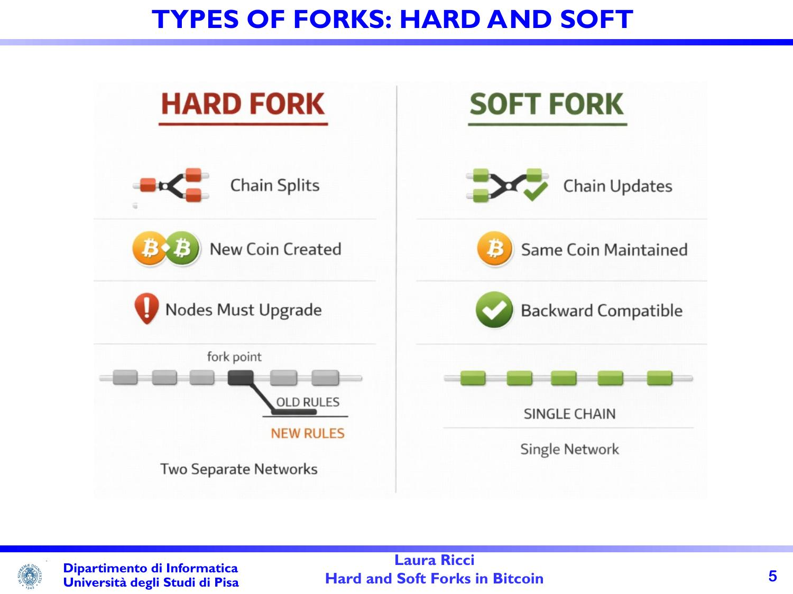
*Fig. — Hard fork vs soft fork a confronto: il primo divide la rete in due catene separate, il secondo mantiene la rete unita con regole più restrittive.*

> [!tip] Intuizione chiave
>
> La distinzione chiave è: il protocol fork cambia le regole, il chain fork è una gara temporanea tra blocchi validi che si risolve automaticamente. Solo il primo può generare una divisione permanente della blockchain.

---

## Soft Fork

> [!definition] Soft Fork
>
> Un soft fork è una modifica all'implementazione di una blockchain che è **backward compatible** (retrocompatibile): i nodi non aggiornati possono continuare a interagire con quelli aggiornati. In generale, un soft fork introduce regole più restrittive rispetto a quelle precedenti.

L'esempio classico è la riduzione della dimensione massima dei blocchi: un nodo non aggiornato, programmato per accettare blocchi fino a 2 MB, accetterà senza problemi blocchi da 1 MB prodotti dai nodi aggiornati. Il vincolo nuovo è un sottoinsieme dei vincoli vecchi.

### Accettazione del Fork

Il meccanismo con cui un soft fork viene adottato è simile a un **voto distribuito**. Quando gli sviluppatori propongono un aggiornamento, stabiliscono una data futura per la sua attivazione. Nel frattempo, i miner possono segnalare il proprio supporto codificando un numero di versione aggiornato nei blocchi che minano. Gli altri nodi della rete osservano quante versioni aggiornate circolano e possono stimare quanta potenza di hashing ha già adottato il cambiamento.

Il processo funziona così: i miner consapevoli delle nuove regole segnalano supporto tramite i **version bits**, ma non le applicano ancora. Le nuove regole diventano attive solo quando la soglia di approvazione viene raggiunta. Il famoso BIP66 del 2015 — che modificava il formato delle firme digitali — ottenne il 95% della potenza di hashing prima di essere attivato.

> [!note] BIP (Bitcoin Improvement Proposal)
>
> I BIP sono il meccanismo formale attraverso cui vengono proposte modifiche al protocollo Bitcoin. Chiunque può aprire un BIP; la sua adozione dipende dall'accordo della comunità e dei miner.

### Come Muore la Vecchia Versione

Dopo un soft fork, se la maggioranza della potenza di hashing adotta le nuove regole, la versione legacy sparisce gradualmente. Il motivo è puramente economico: i blocchi prodotti dai nodi non aggiornati vengono rifiutati dalla maggioranza dei nodi aggiornati. I miner non vogliono sprecare potenza computazionale producendo blocchi che la rete scarterà, quindi migrano alla nuova versione per continuare a ricevere ricompense.

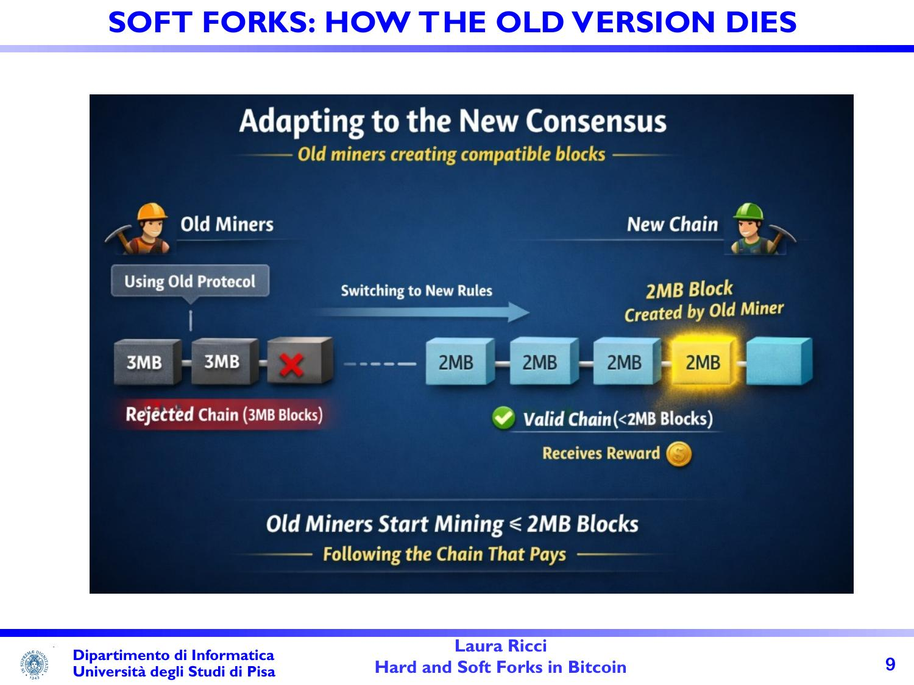
*Fig. — Come la vecchia versione muore: i blocchi dei nodi non aggiornati vengono rifiutati dalla catena dominante. I miner seguono "the chain that pays".*

I possibili esiti di un soft fork sono tre: tutti i miner accettano e il fork è semplicemente un aggiornamento software; la maggioranza accetta, la nuova versione si consolida e quella vecchia muore gradualmente; la maggioranza rifiuta e il fork non sopravvive.

---

## I Principali Soft Fork di Bitcoin

Prima di analizzare SegWit e Taproot nel dettaglio, è utile avere una visione d'insieme dei soft fork che hanno caratterizzato la storia di Bitcoin.

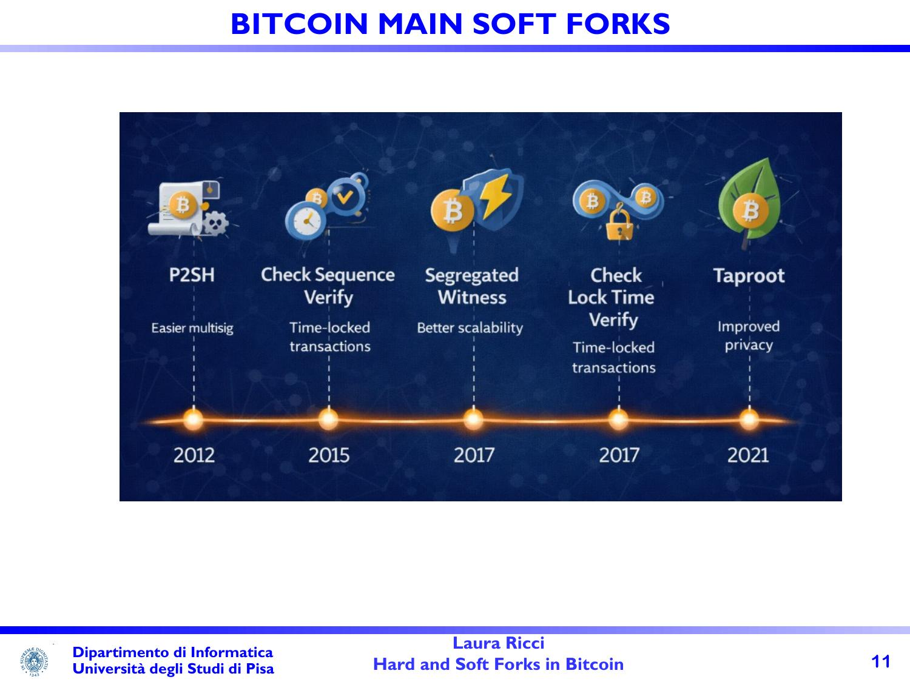
*Fig. — Timeline dei soft fork principali di Bitcoin: da P2SH (2012) per il multisig, a SegWit (2017) per la scalabilità, fino a Taproot (2021) per la privacy.*

---

## SegWit — Agosto 2017

**SegWit** (*Segregated Witness*, testimone segregato) è il più importante soft fork della storia di Bitcoin, attivato nell'agosto 2017. Per capire cosa ha cambiato, è necessario partire dal problema che risolveva.

### Il Problema: Transaction Malleability

Prima di SegWit, una transazione Bitcoin conteneva tre componenti principali: gli **input** (da dove provengono i bitcoin), gli **output** (dove vanno), e le **firme** (la prova che il mittente ha autorizzato la transazione). Le firme erano incluse nei dati della transazione stessa. Questo creava una vulnerabilità nota come **transaction malleability** (*malleabilità delle transazioni*): un attaccante poteva modificare leggermente i dati della firma senza invalidare la transazione, ma cambiando così il **txid** (l'identificatore della transazione). Il txid cambiato rendeva impossibile per altri protocolli — come la Lightning Network — fare riferimento in modo affidabile a una transazione non ancora confermata.

### La Soluzione: Separare la Firma dai Dati

SegWit risolve il problema spostando i dati delle firme fuori dalla struttura principale della transazione, in una sezione separata chiamata **Witness** (*testimone*). Poiché il txid viene ora calcolato senza i dati della firma, non può più essere alterato dopo che la transazione è stata firmata.

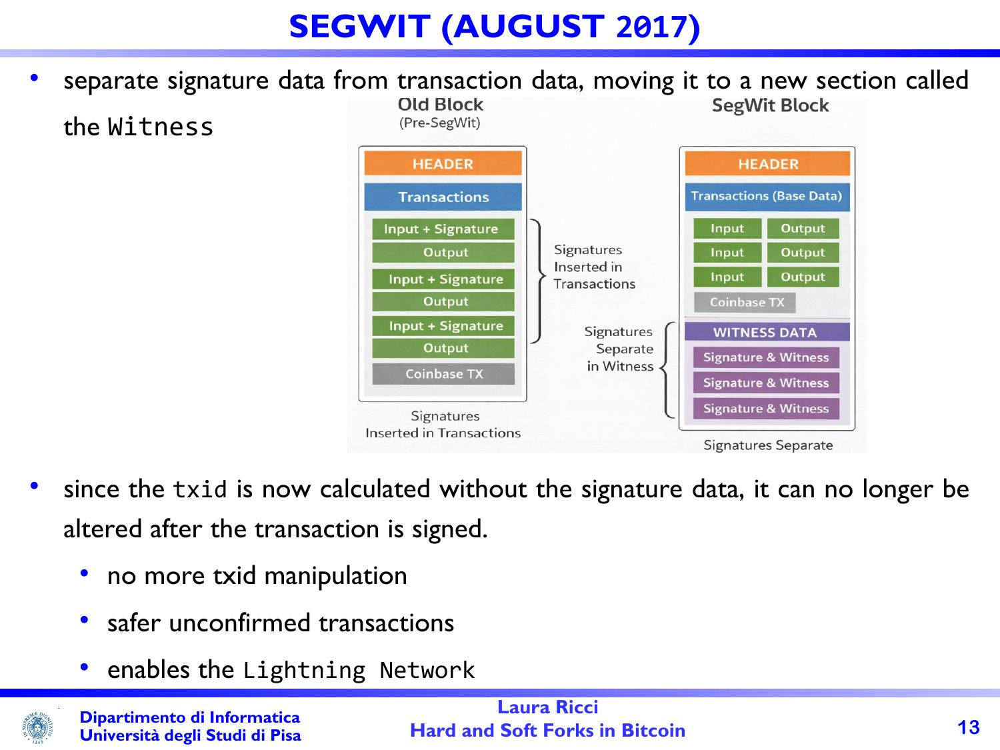
*Fig. — Confronto strutturale: nel blocco Pre-SegWit le firme sono embedded nella transazione; nel blocco SegWit la Witness Data è segregata e non influisce sul calcolo del txid.*

I benefici sono: eliminazione della manipolazione del txid, transazioni non confermate più sicure, e l'abilitazione della Lightning Network.

> [!warning] SegWit è davvero un soft fork?
>
> Apparentemente SegWit sembrerebbe incompatibile con i nodi vecchi, ma gli sviluppatori hanno usato un "trucco": le firme vengono spostate fuori dalla parte che i nodi vecchi contano per il calcolo del peso del blocco. I vecchi nodi non analizzano il Witness, vedono blocchi ≤ 1 MB e non violano nessuna regola. Accettano i nuovi blocchi senza sapere che contengono dati Witness.

### Block Weight e Aumento della Capacità

Anche se non era l'obiettivo primario, SegWit ha aumentato de facto la capacità di transazione. Prima di SegWit i blocchi erano limitati a 1 MB. SegWit introduce il concetto di **block weight** (*peso del blocco*): i byte normali di una transazione contano 4 unità di peso ciascuno, mentre i byte del Witness contano solo 1 unità di peso. Il limite massimo è 4 milioni di unità di peso. Questo significa che blocchi con molte transazioni SegWit possono contenere più dati totali, pur rimanendo entro il limite di peso — effettivamente aumentando il throughput.

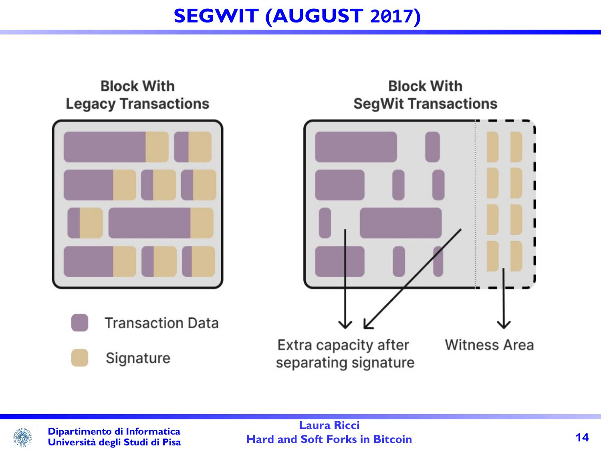
*Fig. — In un blocco SegWit la Witness Area (tratteggiata) contiene le firme a peso ridotto. La base data rimane ≤ 1 MB per i vecchi nodi, ma il blocco reale può superarla.*

### SegWit: Ricapitolazione

Il diagramma seguente riassume in modo completo il funzionamento di SegWit, evidenziando come i vecchi nodi vedano solo la parte base del blocco (≤ 1 MB) e ignorino la witness, mantenendo la retrocompatibilità.

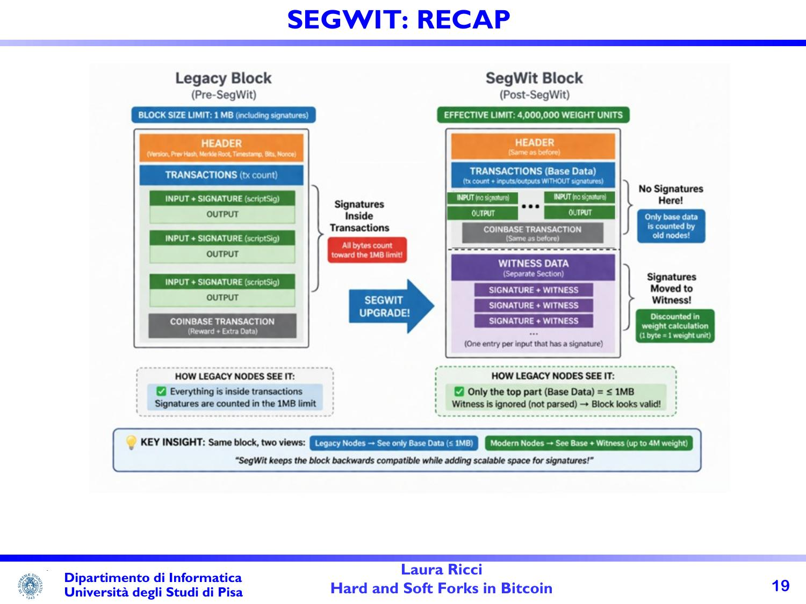
*Fig. — Ricapitolazione SegWit: il blocco legacy ha firme inline; il blocco SegWit le separa nel Witness. I vecchi nodi vedono solo la base data e rimangono sincronizzati.*

---

## Taproot — Novembre 2021

**Taproot** è il secondo grande soft fork di Bitcoin, attivato il 14 novembre 2021 con il supporto di oltre il 90% dei miner. Si basa su due tecniche crittografiche: le **Schnorr Signatures** e il **MAST** (*Merkelized Abstract Syntax Tree*). L'obiettivo è migliorare sia le capacità di scripting che la privacy della rete Bitcoin.

### Schnorr Signatures

> [!definition] Schnorr Signatures (Firme di Schnorr)
>
> Schema di firma digitale basato sul problema del logaritmo discreto. Alternativa alle firme ECDSA usate da Bitcoin, con proprietà crittografiche superiori.

Le Schnorr Signatures hanno cinque proprietà fondamentali:

**Privacy**: non è possibile distinguere firme individuali in un gruppo aggregato.

**Linearità**: consentono un metodo semplice ed efficiente per far sì che più parti collaboranti producano una firma valida per la somma delle loro chiavi pubbliche. Questo è il fondamento del **key aggregation** (*aggregazione di chiavi*) — più firmatari possono produrre una singola firma collettiva indistinguibile da quella di un singolo firmatario.

**Batch verification** (*verifica in batch*): con ECDSA, verificare tre firme richiede tre operazioni separate. Con Schnorr è possibile verificare tutte e tre insieme in una sola operazione: $\text{Ver}(\sigma_1 + \sigma_2 + \sigma_3) = 1\ \text{operazione}$, contro $\text{Ver}(\sigma_1) + \text{Ver}(\sigma_2) + \text{Ver}(\sigma_3) = 3\ \text{operazioni}$ con ECDSA.

**Non malleabilità**: le firme non possono essere modificate.

**Sicurezza dimostrabile**: la sicurezza è riducibile formalmente al problema del logaritmo discreto.


*Fig. — Key aggregation con Schnorr: P1, P2, P3 combinano chiavi e firme in un'unica $P_{agg}$ e $S_{agg}$. La verifica è identica a quella di un firmatario singolo.*

Le Schnorr Signatures producono una singola chiave pubblica e una singola firma, anche quando più firmatari cooperano. Il processo richiede cooperazione interattiva tra i firmatari, incluso lo scambio di chiavi pubbliche e la coordinazione del processo di firma.

### MAST — Merkelized Abstract Syntax Tree

> [!definition] MAST (Merkelized Abstract Syntax Tree)
>
> Struttura dati che combina un **Abstract Syntax Tree** (AST) con un **Merkle Tree** per rappresentare condizioni di spesa multiple in modo efficiente e privato.

Il problema che MAST risolve è il seguente: uno script Bitcoin può prevedere molteplici condizioni di spesa alternative. Senza MAST, tutte le condizioni devono essere incluse nella transazione quando si spende, rivelando tutte le clausole anche quelle non usate. MAST permette di includere nella transazione solo la condizione effettivamente eseguita, insieme alla Merkle proof che dimostra che quella condizione era nel set originale.

#### La Parte AST

L'**Abstract Syntax Tree** specifica come suddividere la logica di spesa in foglie. Le condizioni in relazione OR diventano foglie separate — se basta soddisfarne una, non ha senso includerle tutte. Le condizioni in relazione AND rimangono nella stessa foglia, perché devono essere soddisfatte insieme.

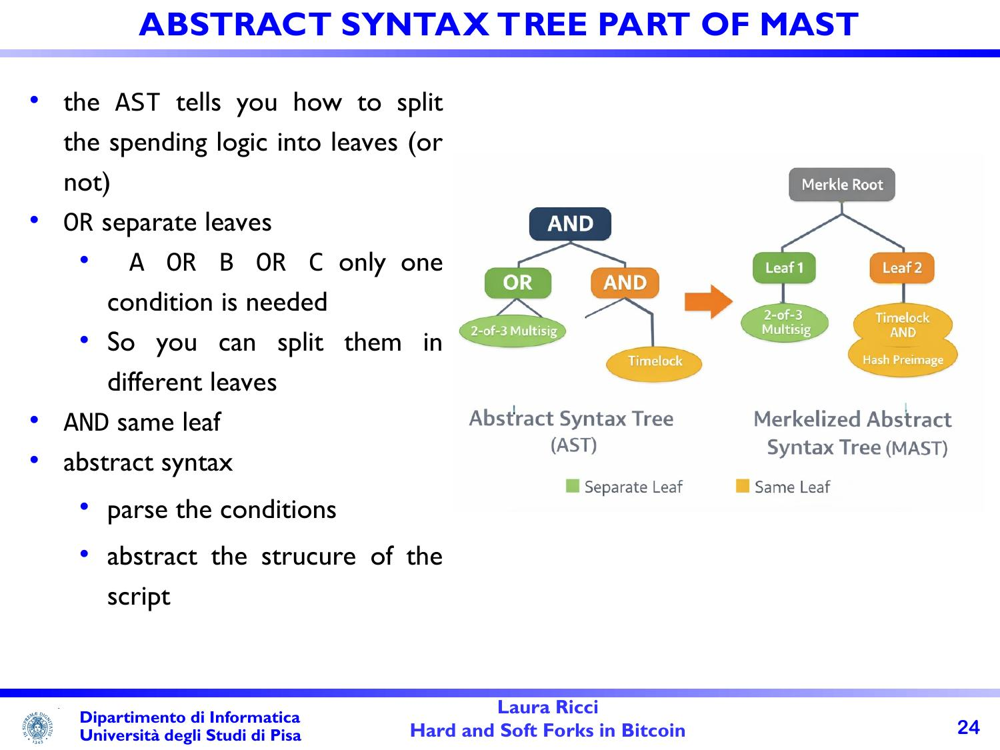
*Fig. — Da AST a MAST: le condizioni OR (2-of-3 Multisig, Timelock) diventano foglie separate; le condizioni AND (Timelock AND Hash Preimage) rimangono nella stessa foglia.*

#### La Parte Merkle Tree

Una volta strutturate le condizioni come foglie, si costruisce un Merkle Tree su di esse. La radice del Merkle Tree impegna crittograficamente tutte le condizioni. Quando si spende, si rivela solo la foglia usata e il percorso di verifica (Merkle proof), non le altre condizioni.

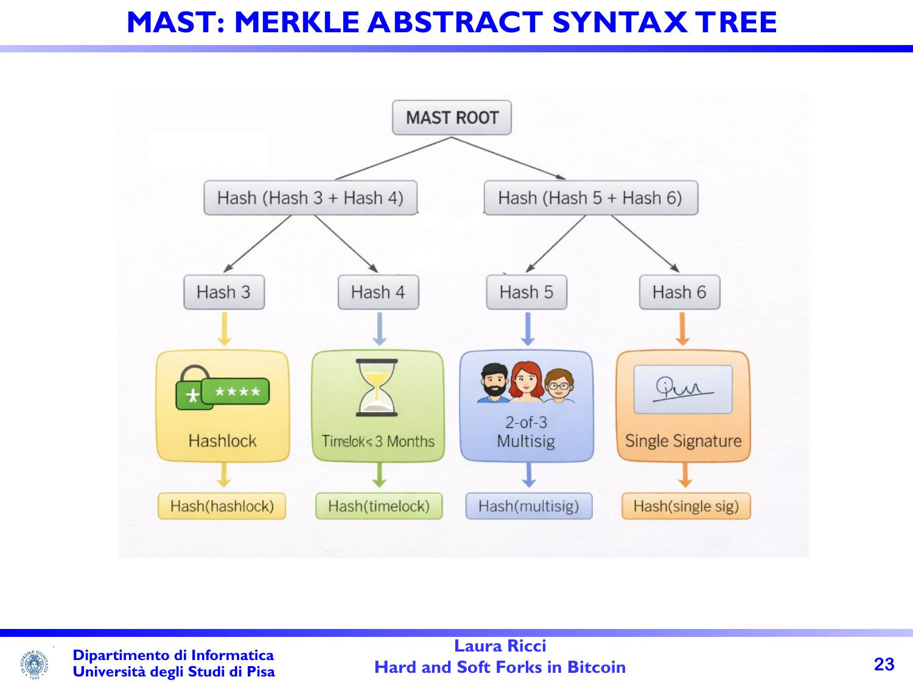
*Fig. — Il Merkle Tree del MAST: ogni condizione di spesa è una foglia. La MAST ROOT impegna tutte le condizioni. Al momento della spesa si rivela solo la foglia usata + il Merkle path.*

> [!example] MAST con 4 condizioni di spesa
>
> Supponiamo di avere:
> - Script 1: multisig 2-di-3 (Alice, Bob, Charlie)
> - Script 2: timelock di 1 anno
> - Script 3: hash preimage
> - Script 4: firma singola di Alice
>
> **Senza MAST**: tutti e 4 gli script sono inclusi nella transazione, rivelando tutte le clausole.
>
> **Con MAST**: solo lo script eseguito + la Merkle proof sono inclusi. Gli altri script rimangono nascosti.

### La Tweaked Public Key

Il meccanismo con cui Taproot unisce Schnorr Signatures e MAST è la **tweaked public key** (*chiave pubblica modificata*). Si parte da:
- una chiave pubblica $P$ (può essere singola o aggregata da più firmatari)
- la radice del Merkle tree degli script (MAST): $m$

Si calcola il **tweak** come:
$$
t = H(P \,\|\, m)
$$
dove $H$ è una funzione hash e $\|$ indica la concatenazione. Si applica poi il tweak alla chiave pubblica tramite operazione sulla curva ellittica:
$$
P' = P + t \cdot G
$$
Il risultato $P'$ è la **tweaked public key**: una nuova chiave pubblica che impegna crittograficamente sia la chiave interna $P$ che l'intero albero di script $m$.

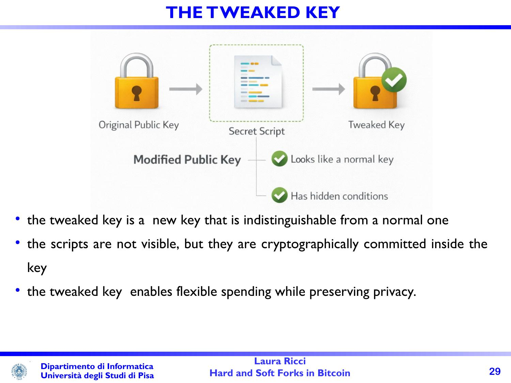
*Fig. — La tweaked key: combina la chiave pubblica originale con lo script segreto (MAST root) in un'unica chiave che appare normale on-chain ma impegna crittograficamente le condizioni di spesa.*

> [!tip] Cosa viene scritto on-chain
>
> Sull'output della blockchain non viene scritta né la chiave pubblica separatamente né la radice MAST separatamente. Viene scritto solo il singolo valore $P'$ — la tweaked key. Questo valore è indistinguibile da una normale chiave pubblica Schnorr. Gli script sono invisibili, ma sono crittograficamente impegnati all'interno della chiave.

### Key Path vs Script Path Spending

Taproot prevede due modalità di spesa:

**Key path spending** (*spesa via chiave*): se tutte le parti coinvolte sono d'accordo, producono una firma Schnorr aggregata valida per $P'$. Nessuno script viene rivelato. Dall'esterno sembra una semplice transazione a firma singola, anche se in realtà ci sono molteplici condizioni possibili. Questo è il caso "felice" e più privato.

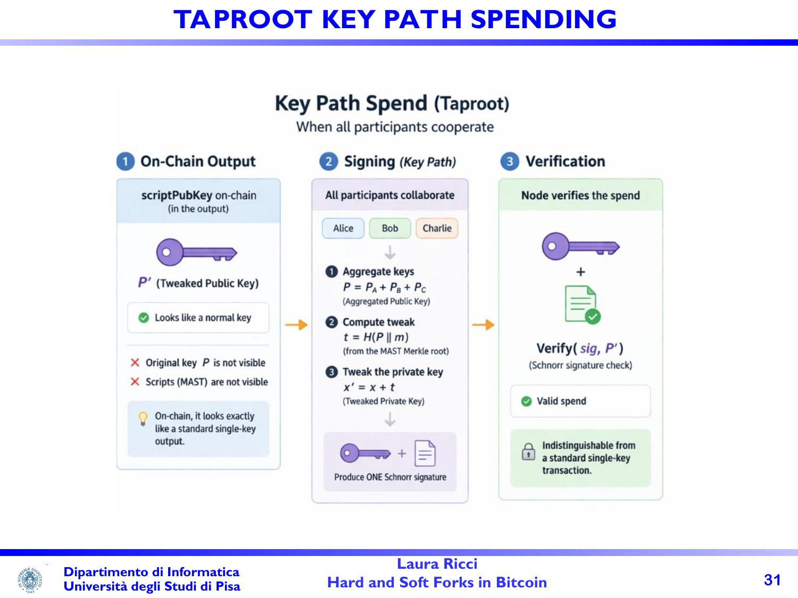
*Fig. — Key path spending: tutti i partecipanti cooperano, producono una firma Schnorr aggregata. Il nodo verifica $\text{sig}$ rispetto a $P'$. Indistinguibile da una transazione standard.*

**Script path spending** (*spesa via script*): se le parti non possono usare la key path (es. una parte non è disponibile), si rivela la foglia dello script desiderato e la Merkle proof che dimostra che quella foglia era nell'albero. Le condizioni alternative rimangono nascoste.

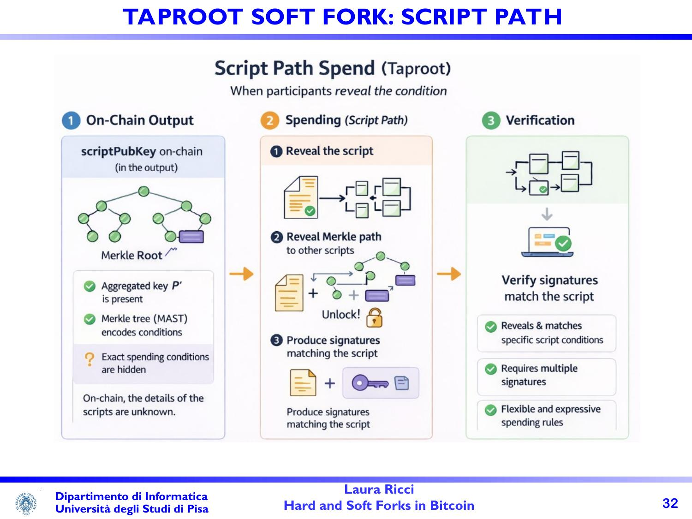
*Fig. — Script path spending: si rivela lo script specifico (tapleaf) e il Merkle path verso la root. Si producono le firme/dati richiesti dallo script. Le altre condizioni rimangono private.*

> [!abstract] Sintesi: Taproot
>
> Taproot unifica in modo elegante tre tecnologie: Schnorr Signatures (efficienza e aggregazione), MAST (script privati e compatti), e la tweaked key (un unico valore on-chain che impegna tutto). Il risultato è che transazioni Bitcoin complesse — multisig, timelock, contratti — appaiono on-chain identiche a transazioni semplici, migliorando sia la privacy degli utenti che l'efficienza della rete.

---

## Hard Fork

> [!definition] Hard Fork
>
> Un hard fork è una modifica alle regole di consenso **non retrocompatibile** che crea una divisione permanente della blockchain. I nodi non aggiornati rifiutano i blocchi prodotti dai nodi aggiornati, portando a due catene distinte.

Le caratteristiche chiave sono: i nodi devono aggiornarsi per seguire le nuove regole; i nodi vecchi rifiutano i nuovi blocchi, causando una divisione della catena; le due catene condividono la storia fino al punto di fork; il risultato è l'esistenza di due reti separate con asset separati.

### Bitcoin Cash — Agosto 2017

Il caso più celebre di hard fork di Bitcoin è **Bitcoin Cash**, nata nell'agosto 2017 dallo stesso giorno in cui veniva attivato SegWit. Il conflitto alla radice era la scalabilità: come rendere Bitcoin capace di gestire più transazioni al secondo?

Due visioni si scontrarono. **Bitcoin Core** sosteneva di mantenere blocchi piccoli (~1 MB) e di costruire soluzioni di secondo livello come SegWit e la Lightning Network. **Bitcoin Cash** optava per aumentare direttamente la dimensione dei blocchi a 8 MB e oltre.

L'hard fork ebbe un effetto immediato e interessante: chiunque avesse 10 BTC al momento del fork si ritrovò con 10 BTC e 10 BCH. La chiave privata Bitcoin funziona anche per Bitcoin Cash, perché le due blockchain condividono la storia fino al punto di scissione. Gli indirizzi dei wallet sono gli stessi. Gli UTXO esistenti al momento del fork sono validi su entrambe le catene, e spendere un UTXO su una catena non lo consuma sull'altra, perché le due catene sono indipendenti.

> [!note] Stato attuale di Bitcoin Cash
>
> Bitcoin Cash è ancora attiva. Fornisce circa 200 transazioni al secondo. Mantiene lo stesso algoritmo di mining di Bitcoin, quindi i miner possono minare entrambe le criptovalute. Il suo prezzo ha raggiunto un picco nella fase iniziale per poi calare significativamente rispetto a Bitcoin.

### Hard Fork come Strategia di Bootstrap

Gli hard fork sono diventati anche uno strumento strategico per lanciare nuove criptovalute. Anziché costruire una blockchain da zero — con la difficoltà di attirare utenti e sviluppatori — si crea un hard fork di Bitcoin e si annuncia agli utenti Bitcoin esistenti che riceveranno la stessa quantità della nuova criptovaluta. Questo abbassa la barriera all'adozione: chi aveva BTC si ritrova automaticamente con asset nella nuova rete.

Gli **Altcoin** sono nati così: alcune sono fork di Bitcoin fatte da comunità diverse che volevano seguire un percorso alternativo di sviluppo, altre sono fork nate esplicitamente per creare nuovi asset.

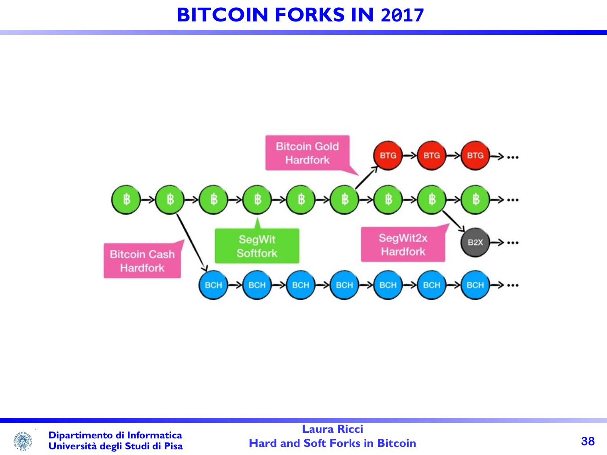
*Fig. — I fork di Bitcoin nel 2017: Bitcoin Cash e Bitcoin Gold sono hard fork che generano nuove catene (BCH, BTG); SegWit è il soft fork che mantiene la catena principale; SegWit2x è un tentativo di hard fork abortito (B2X).*

### Hard Fork per Vulnerabilità Crittografiche

Esistono scenari in cui un hard fork non è una scelta ma una necessità tecnica. Se viene scoperta una vulnerabilità critica nelle primitive crittografiche usate dalla blockchain, la risposta può richiedere un hard fork.

Un esempio concreto: se SHA-256 venisse compromesso, Bitcoin dovrebbe migrare a SHA-3. Aggiungere SHA-3 potrebbe essere un soft fork, ma rimuovere SHA-2 e sostituirlo completamente con SHA-3 richiede un hard fork — è una modifica non retrocompatibile.

Il caso più rilevante a lungo termine è quello dei **computer quantistici**: algoritmi come Shor possono rompere la crittografia a curva ellittica e le firme digitali — incluse le Schnorr Signatures. Se un computer quantistico sufficientemente potente diventasse disponibile, potrebbe derivare chiavi private dalle chiavi pubbliche e accedere ai fondi di chiunque. La risposta richiederebbe un hard fork per adottare algoritmi di firma **post-quantum** resistenti all'attacco quantistico.

```{=latex}
\newpage
```

# Ethereum: Account, Transazioni e Gas

## Smart Contracts: l'idea originale

Il concetto di **smart contract** non nasce con Ethereum. Fu Nick Szabo a formularne l'idea nel 1994, descrivendolo come un protocollo di transazione computerizzato che esegue i termini di un contratto, con l'obiettivo di soddisfare condizioni contrattuali comuni, minimizzare eccezioni (sia dolose che accidentali) e ridurre il bisogno di intermediari fiduciari.

> [!definition] Smart Contract
>
> Un programma informatico che automatizza la logica "se questo accade, allora fai quello" tipica dei contratti tradizionali. Il codice informatico si comporta in modo prevedibile ed è privo delle sfumature linguistiche del linguaggio naturale.

La novità fondamentale rispetto a un contratto cartaceo è triplice: il codice è **più funzionale**, può **ridurre i costi**, e soprattutto tende a **eliminare l'intermediario fiducioso** (banca, notaio, assicurazione). La crittografia e i meccanismi di sicurezza garantiscono che le relazioni algoritmicamente specificabili non possano essere violate.

### L'esempio dell'aeroporto

L'esempio didattico classico è quello assicurativo: Bob è in aeroporto e il suo volo subisce un ritardo. L'assicurazione ha caricato su una blockchain (per esempio Ethereum) uno smart contract che monitora i ritardi dei voli collegandosi al database della compagnia. Non appena la condizione "ritardo ≥ X ore" viene verificata, il contratto accredita automaticamente l'importo assicurato nel wallet di Bob.

Il meccanismo si articola in tre fasi distinte. Prima, il contratto viene **creato** con i termini e le condizioni, e registrato in un blocco della blockchain tenendo fermi i fondi della compagnia assicurativa finché la condizione non si avvera. Poi il contratto viene **eseguito** da tutti i nodi della rete P2P, che prelevano i dati dal database dei voli: tutti i nodi devono convergere allo stesso risultato. Infine, se la maggioranza dei nodi onesti valuta la condizione come vera, la compensazione viene trasferita automaticamente a Bob.

---

## Perché Bitcoin non basta: i limiti degli script

Prima di capire cosa fa Ethereum, è utile capire cosa non riesce a fare Bitcoin. Il linguaggio di scripting di Bitcoin presenta tre limitazioni strutturali:

- **Non è Turing-completo**: mancano i cicli, quindi i programmi esprimibili sono solo un sottoinsieme finito di computazioni.
- **Nessuna variabile di stato persistente**: gli script Bitcoin consumano i propri input per produrre un output, ma non lasciano alcuno stato residuo. Un contratto che ha bisogno di "ricordare" informazioni tra un'esecuzione e l'altra è impossibile da implementare.
- **Cecità verso la blockchain**: gli script non possono accedere ai valori degli header dei blocchi (nonce, timestamp, hash del blocco precedente).

> [!tip] Intuizione chiave
>
> Bitcoin è uno storage distribuito di transazioni. Ethereum estende questo modello trasformando la blockchain in un **computer distribuito**: non solo lo storage è replicato, ma anche la computazione. I nodi non si limitano a validare transazioni, eseguono codice.

---

## Ethereum in breve: il world computer

Ethereum è una piattaforma blockchain per la costruzione di **applicazioni decentralizzate** (*DApps*). Fu ideata da **Vitalik Buterin** (nato il 31 gennaio 1994) e lanciata nel 2015.

A differenza di Bitcoin, in Ethereum:
- il **codice** delle applicazioni e il loro **stato** sono memorizzati sulla blockchain,
- le **transazioni** non solo trasferiscono criptovaluta, ma possono innescare l'esecuzione di codice, aggiornare stato, emettere eventi e scrivere log,
- le **interfacce frontend** possono rispondere a eventi e leggere log dalla chain.

Le applicazioni di Ethereum vanno ben oltre il semplice trasferimento di valore: crowdfunding, token (ERC-20), DeFi, NFT, catene di approvvigionamento, IoT, voto, identità digitale sovrana (SSI). Tra gli esempi concreti: *Ethereum Name Service*, *Cryptokitties*, exchange decentralizzati.

> [!note] ICO (Initial Coin Offering)
>
> Un meccanismo basato sul token standard ERC-20 che consente a un'azienda di raccogliere fondi emettendo nuovi token. Negli anni 2017-2018 gli investimenti in ICO raggiunsero rispettivamente 7 e 12 miliardi di dollari.

### Ethereum come macchina a stati distribuita

Il modello formale di Ethereum è quello di una **macchina a stati deterministica distribuita**:

- lo **stato globale** è l'insieme degli stati di tutti gli smart contract,
- le **transazioni** sono gli eventi che cambiano lo stato globale,
- il **consenso** garantisce che tutti i nodi concordino sul risultato dell'esecuzione e aggiornino il proprio ledger in modo coerente.

Una proprietà cruciale è il **determinismo**: lo smart contract deve produrre lo stesso risultato su ogni nodo. Questo implica che la logica sia visibile a tutti (trasparenza), ma può creare problemi di privacy — risolvibili in alcuni casi con prove a conoscenza zero (*zero-knowledge proofs*).

---

## The Merge: da Proof of Work a Proof of Stake

Ethereum nacque con un meccanismo di consenso **Proof of Work**, identico per principio a quello di Bitcoin. Nel settembre 2022, con l'evento noto come **The Merge**, la rete è passata al **Proof of Stake**.

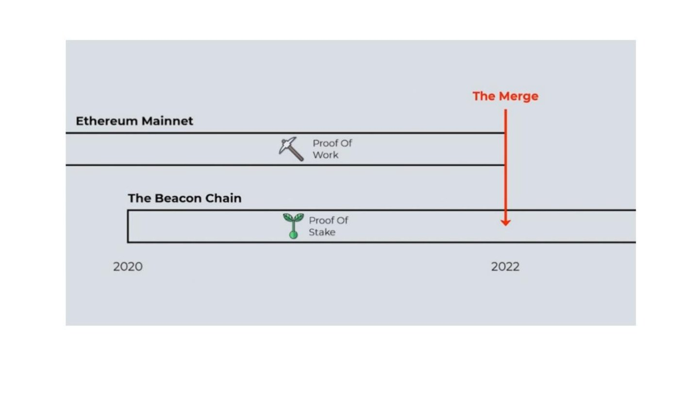
*Fig. — The Merge (settembre 2022): la Ethereum Mainnet (PoW) converge con la Beacon Chain (PoS), attiva in parallelo dal 2020. Da quel momento, il consenso è gestito interamente da PoS.*

La transizione era stata preparata con la **Beacon Chain**, una chain parallela basata su PoS attiva dal 2020. Al momento del Merge, la Mainnet PoW si è "agganciata" alla Beacon Chain, che da allora gestisce il consenso.

---

## Da Bitcoin a Ethereum: il modello a stati

### Bitcoin come macchina a stati: UTXO

Prima di analizzare Ethereum, vale la pena fissare il modello di Bitcoin come termine di paragone.

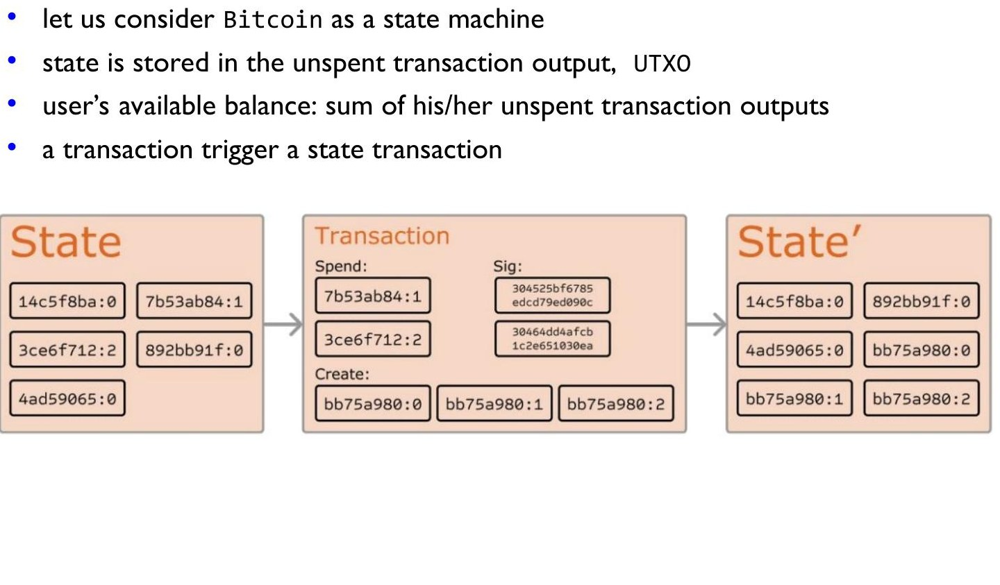
*Fig. — In Bitcoin lo stato è l'insieme degli UTXO (Unspent Transaction Output). Una transazione consuma degli UTXO esistenti e ne crea di nuovi, generando la transizione S → S'.*

Il saldo disponibile di un utente Bitcoin è la somma dei suoi UTXO. Ogni UTXO esiste una sola volta e viene consumato dalla transazione che lo spende: questo rende impossibile il doppio utilizzo a livello strutturale.

### Ethereum: account-based

Ethereum usa invece un modello **account-based**, simile a quello bancario. Lo stato globale non è un insieme di output non spesi, ma un insieme di **account**, ognuno con il proprio saldo e, nel caso degli smart contract, con il proprio codice e storage.

> [!definition] Ethereum come macchina a stati
>
> Una macchina virtuale deterministica che applica cambiamenti allo stato globale replicato. A differenza di Bitcoin, chiunque può definire le proprie funzioni di transizione di stato tramite smart contract.

---

## Gli Account di Ethereum

Ogni account Ethereum è identificato da un indirizzo di **20 byte (160 bit)**. Esistono due tipi fondamentalmente diversi.

### Externally Owned Account (EOA)

Gli **EOA** sono gli account "personali", controllati da un'entità esterna (persona o organizzazione) tramite una **chiave privata**. Chi possiede la chiave privata può accedere ai fondi e invocare smart contract.

Un EOA contiene:
- **address**: l'indirizzo pubblico dell'account
- **Ether balance**: il saldo in Ether
- **nonce**: il numero totale di transazioni emesse da quell'account (da non confondere con il nonce PoW!)

Un EOA può inviare transazioni per trasferire Ether o per invocare uno smart contract.

### Contract Account

Gli account contratto sono controllati non da una chiave privata, ma dal **codice** associato. Contengono:
- **contract code**: il bytecode immutabile del contratto
- **persistent storage**: le variabili interne del contratto
- **Ether balance**: come gli EOA, possono ricevere e inviare Ether
- **nonce**: numero di messaggi inviati da questo account

Gli account contratto **non hanno chiave privata**: non possono iniziare autonomamente una transazione, ma solo rispondere a transazioni o messaggi ricevuti.

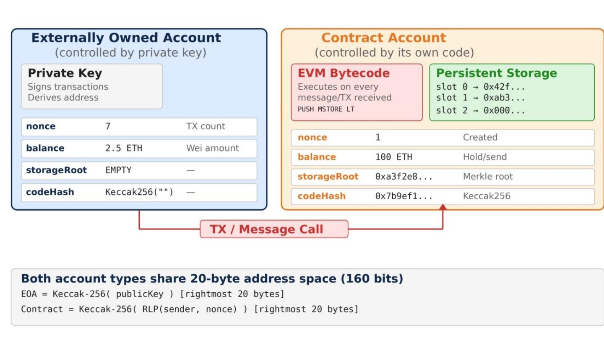
*Fig. — Confronto strutturale tra EOA e Contract Account. L'EOA usa una chiave privata per firmare transazioni e ne deriva l'indirizzo con Keccak-256; il Contract Account espone bytecode EVM e storage persistente. Entrambi condividono lo spazio di indirizzamento a 20 byte (160 bit).*

> [!warning] Generazione degli indirizzi
>
> Per un EOA: `EOA = Keccak-256(publicKey)[rightmost 20 bytes]`
> Per un Contract Account: `Contract = Keccak-256(RLP(sender, nonce))[rightmost 20 bytes]`

La tabella seguente riassume le differenze operative:

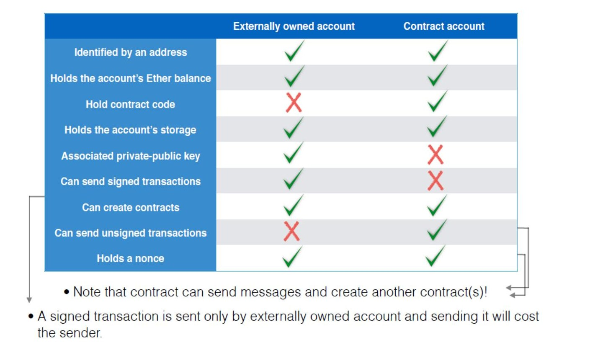
*Fig. — Confronto delle capacità: solo gli EOA possono inviare transazioni firmate; solo i Contract Account hanno codice e storage. I contratti possono inviare messaggi (non transazioni firmate) ad altri contratti e crearne di nuovi.*

---

## Transazioni in Ethereum

Qualsiasi azione sulla blockchain Ethereum è sempre **avviata da una transazione proveniente da un EOA**. Gli EOA sono il ponte tra il mondo esterno e lo stato interno di Ethereum.

> [!definition] Transazione
>
> Un pacchetto dati firmato, serializzato e inviato da un EOA a un altro account. Può innescare messaggi successivi tra contratti, genera una modifica allo stato della blockchain se inclusa in un blocco, e può essere usata per creare nuovi contratti.

### Transazione EOA → EOA

La forma più semplice di transazione trasferisce Ether da un EOA a un altro, funzionalmente analoga a una transazione Bitcoin — ma basata su account, non su UTXO.

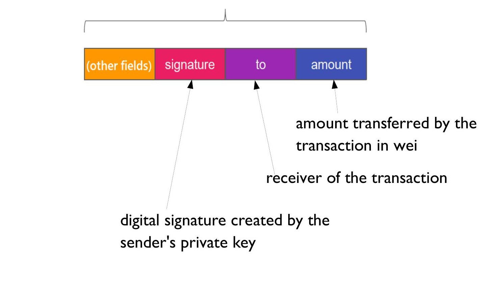
*Fig. — Formato della transazione EOA→EOA. I campi principali: `signature` (firma ECDSA del mittente), `to` (indirizzo del destinatario a 20 byte), `amount` (valore in wei).*

### Il nonce della transazione

> [!definition] Transaction Nonce
>
> Un valore scalare uguale al numero di transazioni inviate da quell'indirizzo (per gli EOA) o al numero di contratti creati (per i contract account). È un attributo dell'account mittente, non della singola transazione.

Il nonce serve a due scopi: **registrare l'ordine delle transazioni** e **proteggere dal replay attack**.

#### Il replay attack

Il problema nasce dalla differenza strutturale tra Bitcoin ed Ethereum. In Bitcoin ogni UTXO può essere speso una sola volta: una volta consumato, sparisce. In Ethereum invece esiste un saldo di account, e la stessa transazione firmata potrebbe in principio essere ritrasmessa più volte sulla rete.

Il replay attack funziona così: Alice firma una transazione per inviare 10 ETH a Bob. Bob, dopo che la transazione è stata minata, può prendere la stessa transazione e ritrametterla ripetutamente, svuotando progressivamente il conto di Alice.

La soluzione di Ethereum è il nonce: ogni transazione deve includere il nonce corrente dell'account mittente, e la rete non accetta una seconda transazione con lo stesso nonce. Bob non può modificare il nonce perché questo invaliderebbe la firma di Alice.

> [!warning] Ordinamento obbligatorio
>
> Il nonce impone un ordine rigido. Una transazione con nonce 2 non può essere minata se la rete non ha già confermato quelle con nonce 0 e 1. Le transazioni devono essere in sequenza e non possono essere saltate.

---

## Transizioni di stato in Ethereum

### Transizione semplice EOA→EOA

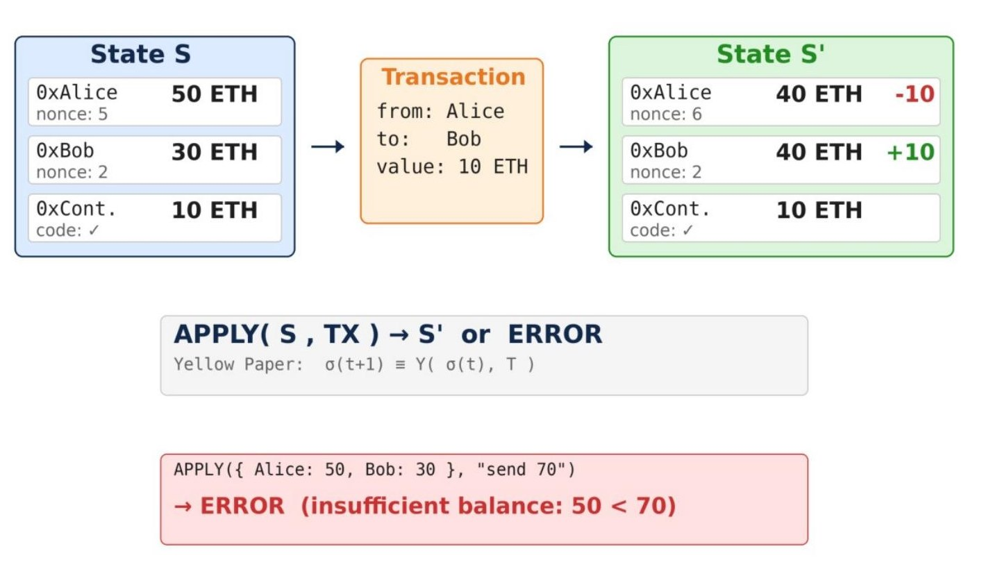
*Fig. — Transizione di stato EOA→EOA. Alice (50 ETH, nonce 5) invia 10 ETH a Bob (30 ETH). Lo stato S' vede Alice a 40 ETH (nonce 6) e Bob a 40 ETH. Se il saldo fosse insufficiente (es. Alice=50, Bob=30, send 70) la funzione APPLY restituisce ERROR.*

### Transizione con Smart Contract

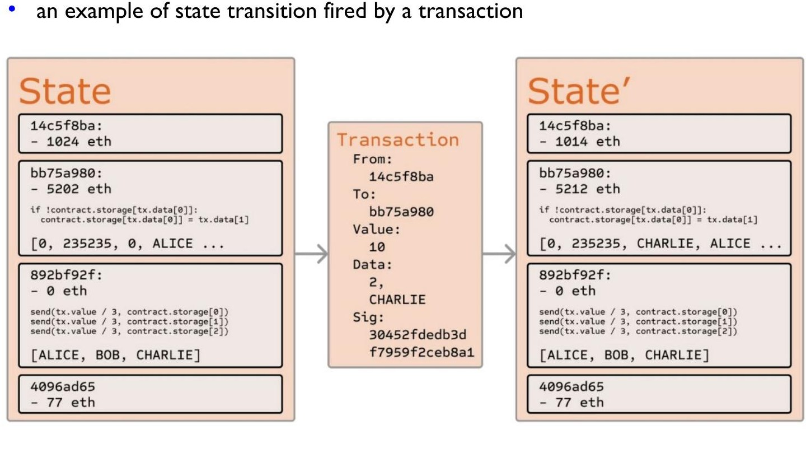
*Fig. — Transizione di stato con contract account. Il mittente invia una transazione con value 10 e data "CHARLIE" al contratto. Il contratto aggiorna il proprio storage (la lista diventa [ALICE, BOB, CHARLIE]) e i saldi vengono aggiornati di conseguenza.*

---

## Lifecycle degli Smart Contract

Uno smart contract attraversa tre fasi principali:

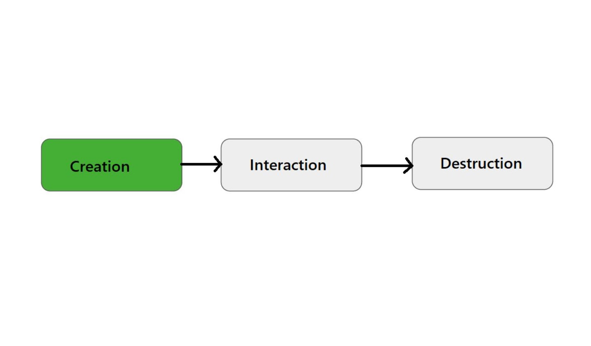
*Fig. — Il lifecycle di uno smart contract è una progressione lineare: Creazione → Interazione → Distruzione (opzionale).*

### Creazione

Solo un EOA può creare (fare il *deploy* di) uno smart contract sulla blockchain. La creazione avviene tramite una transazione speciale in cui il campo `to` è **vuoto** (nessun indirizzo di destinazione finché il contratto non è deployato), e il campo `data` contiene il **bytecode compilato** del contratto.

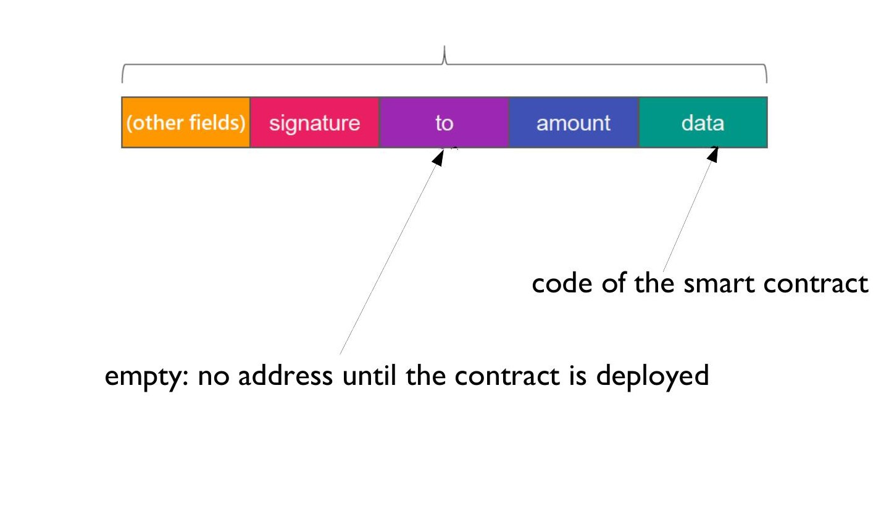
*Fig. — Transazione di creazione: il campo `to` è vuoto (l'indirizzo del contratto viene generato al deploy), il campo `data` contiene il bytecode EVM del contratto.*

### Interazione

Una volta deployato, il contratto può essere invocato da:
- un **EOA** tramite una transazione che specifica l'indirizzo del contratto e il metodo da chiamare,
- un **altro contratto** tramite un messaggio interno (non una transazione firmata).

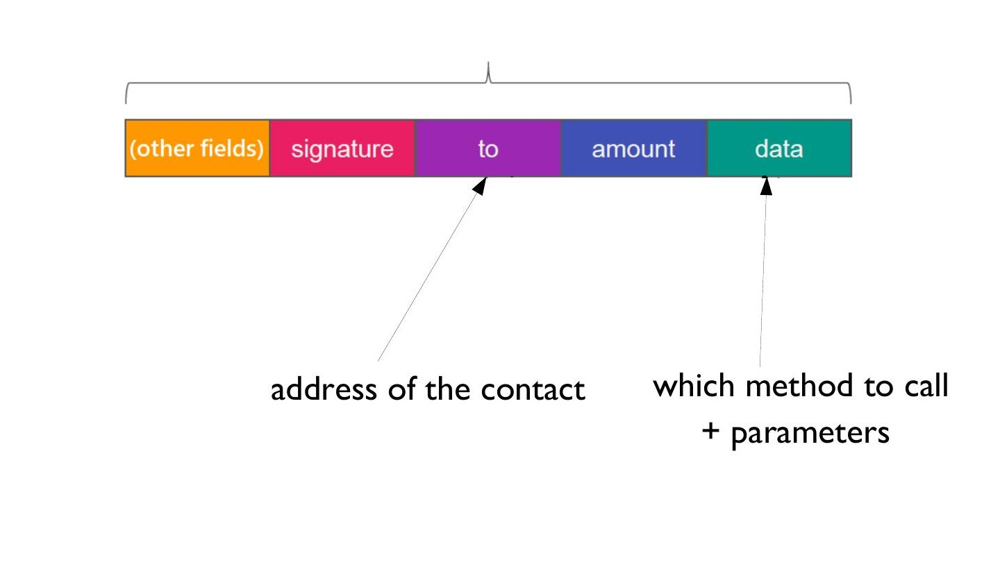
*Fig. — Transazione di interazione: `to` contiene l'indirizzo del contratto, `data` codifica il metodo da invocare tramite function selector (primi 4 byte del Keccak-256 del prototipo della funzione) + argomenti ABI-encoded.*

> [!note] Contract-to-Contract
>
> I contratti non possono avviare transazioni autonomamente, ma possono costruire percorsi di esecuzione complessi generando **messaggi** verso altri contratti come risposta a una transazione ricevuta da un EOA o da un altro contratto.

### Caratteristiche di esecuzione

Quando uno smart contract riceve una transazione o un messaggio, viene eseguito dall'**Ethereum Virtual Machine (EVM)**. Le azioni possibili includono:
- calcoli aritmetici/logici,
- scrittura sullo storage interno,
- invio di messaggi ad altri smart contract,
- creazione di nuovi contratti.

### Distruzione

Un contratto può essere eliminato dalla blockchain invocando l'operazione **`selfdestruct`**. La transazione di distruzione contiene nel campo `data` il nome del metodo che chiama `selfdestruct`, e nel campo `to` l'indirizzo del contratto. Dopo la distruzione, il contratto non è più eseguibile.

### Esempio Naive in Solidity

```solidity
pragma solidity ^0.8.0;

contract Crowdsale {
    mapping(address => uint256) public balances;
    uint256 public totalRaised;

    function contribute() public payable {
        require(msg.value > 0, "Contribution amount must be greater than zero");
        balances[msg.sender] += msg.value;
        totalRaised += msg.value;
    }

    function withdraw() public {
        uint256 amount = balances[msg.sender];
        require(amount > 0, "No funds available to withdraw");
        balances[msg.sender] = 0;
        payable(msg.sender).transfer(amount);
    }
}
```

Questo semplice contratto di crowdfunding mostra i meccanismi fondamentali di Solidity: un `mapping` per tenere traccia dei contributi, una funzione `payable` per ricevere Ether, e una funzione di prelievo con verifica del saldo e azzeramento prima del trasferimento (per prevenire reentrancy attack).

---

## Il Formato Completo della Transazione

Ogni transazione Ethereum include i seguenti campi, serializzati con lo schema **RLP** (*Recursive Length Prefix*):

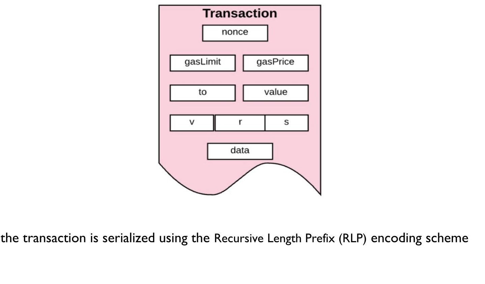
*Fig. — Struttura completa di una transazione Ethereum: nonce, gasLimit, gasPrice, to, value, i tre componenti della firma ECDSA (v, r, s), e data.*

| Campo | Descrizione |
|-------|-------------|
| `nonce` | Numero progressivo di transazioni dell'EOA mittente |
| `gasLimit` | Quantità massima di gas che il mittente è disposto a consumare |
| `gasPrice` | Prezzo in wei per unità di gas (scelto dal mittente) |
| `to` | Indirizzo destinatario (20 byte); vuoto per creazione contratto |
| `value` | Importo in wei da trasferire |
| `v`, `r`, `s` | Componenti della firma ECDSA; permettono di ricavare l'indirizzo del mittente |
| `data` | Payload: bytecode (creazione) o function selector + argomenti (interazione) |

### Il campo `to`

Il campo `to` accetta qualsiasi valore di 20 byte senza validazione: se l'indirizzo è errato o inesistente, l'Ether inviato viene **bruciato** (*burnt*). Rispetto a Bitcoin, Ethereum semplifica radicalmente il formato: un solo indirizzo di output, valore inserito direttamente (nessun riferimento a transazione precedente), nessuno script nel campo destinatario.

### I campi `value` e `data`

I due campi del payload possono essere combinati in modi diversi:

| `value` | `data` | Significato |
|---------|--------|-------------|
| valorizzato | vuoto | Pagamento puro in Ether |
| vuoto | valorizzato | Invocazione di funzione |
| entrambi valorizzati | entrambi valorizzati | Invocazione con trasferimento Ether |

Quando `data` è inviato a un contract account, i primi **4 byte** costituiscono il **function selector** (i primi 4 byte dell'hash Keccak-256 del prototipo della funzione), che identifica univocamente il metodo da invocare. I byte successivi codificano gli argomenti secondo l'ABI Ethereum.

---

## Il Problema dell'Halting e il Gas

Il prezzo della Turing-completezza è l'**halting problem**: non è possibile determinare staticamente se un programma terminerà o girerà all'infinito. Per verificarlo bisogna eseguirlo — ma eseguire codice che non termina su una rete di nodi significa un **denial of service** distribuito. Bitcoin non ha questo problema (il suo linguaggio non è Turing-completo), Ethereum sì.

```javascript
function foo() {
    while (true) { /* Loop forever! */ }
}
```

### La soluzione: il Gas

> [!definition] Gas
>
> Un'unità di misura del costo computazionale associato all'esecuzione di ogni istruzione EVM. Ogni transazione include un budget di gas; l'EVM si ferma (e la transazione fallisce) non appena il gas si esaurisce.

Il gas serve a tre scopi:
1. **Rendere costosi gli attacchi DoS**: chi vuole eseguire codice malevolo deve pagare per ogni ciclo.
2. **Compensare i miner/validatori**: le fee di esecuzione ricompensano chi convalida le transazioni.
3. **Definire il limite computazionale**: l'EVM è una macchina *quasi*-Turing-completa — può eseguire qualsiasi programma purché disponga di gas sufficiente.

### Gas Price e Gas Limit

La **gas price** è il prezzo in Ether per unità di gas, espresso in **gwei** (1 gwei = 10⁹ wei). È il mittente a sceglierla: alta priorità richiede alta gas price, poiché i miner preferiscono le transazioni più remunerative. Il prezzo è variabile e dipende dalla congestione della rete.

Il **gas limit** è la quantità massima di gas che il mittente è disposto a consumare. La fee massima pagabile è:

$$
\text{fee} = \text{gasPrice} \times \text{gasLimit}
$$

Se al termine dell'esecuzione rimane del gas inutilizzato, viene **rimborsato** al mittente. Se il gas si esaurisce prima del completamento, tutte le modifiche di stato vengono **revertite** (ma il gas consumato non viene restituito).

### Ether e le sue denominazioni

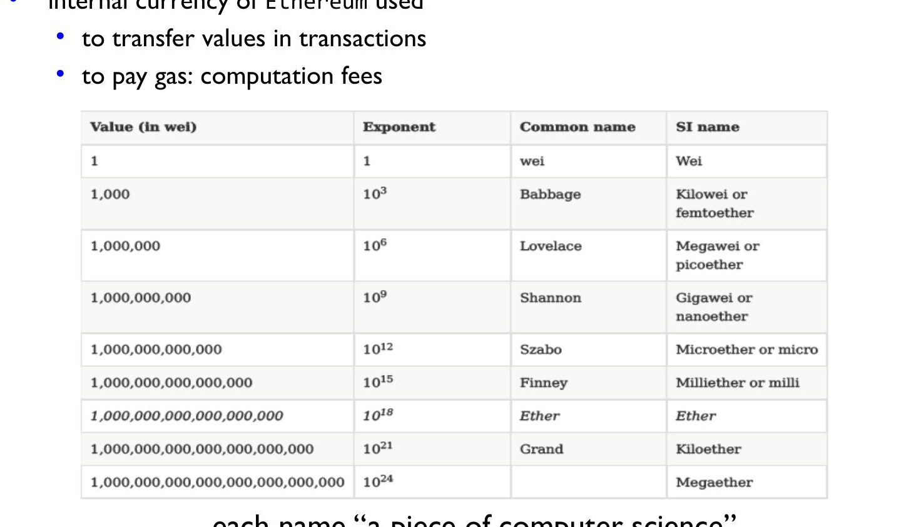
*Fig. — Le denominazioni dell'Ether, ciascuna intitolata a un pioniere dell'informatica: wei (unità base), Babbage (10³), Lovelace (10⁶), Shannon (10⁹), Szabo (10¹²), Finney (10¹⁵), Ether (10¹⁸), Grand (10²¹), Megaether (10²⁴).*

L'unità base è il **wei**: 1 ETH = 10¹⁸ wei. Tutte le operazioni interne di Ethereum lavorano in wei.

### Il meccanismo del Gas: riepilogo

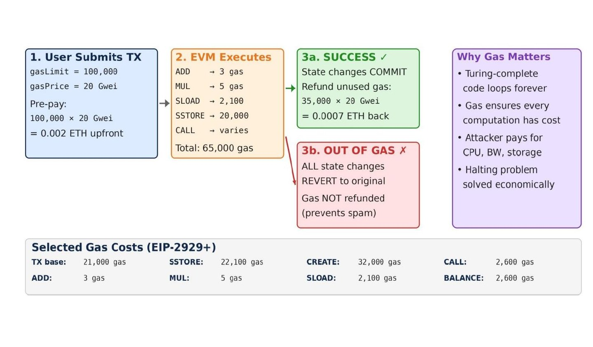
*Fig. — Riepilogo del meccanismo gas. Il mittente specifica gasLimit e gasPrice (es. 100.000 gas × 20 Gwei = 0.002 ETH upfront). L'EVM esegue consumando gas. Se successo: gas non usato rimborsato. Se out-of-gas: tutte le modifiche revertite, gas consumato NON rimborsato (deterrente contro spam). In basso: tabella dei costi gas per le istruzioni principali.*

### Costi delle operazioni EVM

Il costo in gas di ogni istruzione è fisso e definito nel Yellow Paper di Ethereum. Le operazioni di storage sono di gran lunga le più costose.

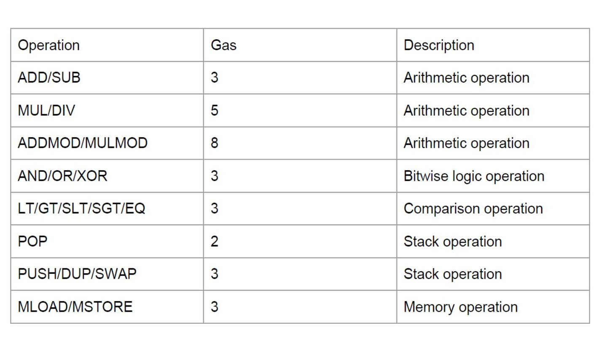
*Fig. — Costi gas per operazioni di base: ADD/SUB (3 gas), MUL/DIV (5 gas), ADDMOD/MULMOD (8 gas), operazioni bitwise/confronto (3 gas), operazioni stack POP (2), PUSH/DUP/SWAP (3), MLOAD/MSTORE (3).*

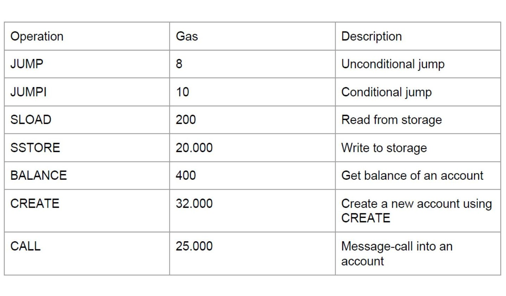
*Fig. — Costi gas per operazioni avanzate: JUMP (8), JUMPI (10), SLOAD (200), SSTORE (20.000), BALANCE (400), CREATE (32.000), CALL (25.000). Lo storage è deliberatamente costoso per scoraggiare l'uso eccessivo della chain come database.*

### Gas nei messaggi interni

I messaggi interni (da contratto a contratto) **non hanno un proprio gas limit** separato: il gas limit dell'intera catena di esecuzione è quello specificato nella transazione originale dell'EOA, e deve essere sufficiente a coprire tutte le sub-esecuzioni. Se un messaggio interno esaurisce il gas, quella specifica sub-esecuzione viene revertita, ma la transazione padre può continuare se ha gestito il caso d'errore.

---

## Ethereum e Bitcoin: confronto finale

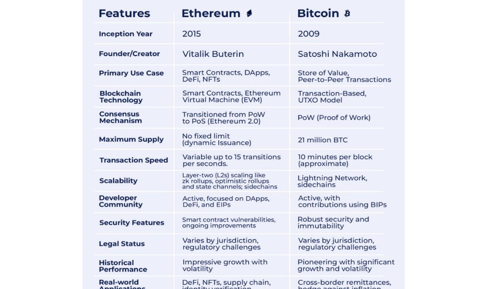
*Fig. — Confronto sistematico tra Ethereum (2015, Vitalik Buterin) e Bitcoin (2009, Satoshi Nakamoto): use case, modello blockchain, consenso, supply, velocità, sicurezza e community.*

| Feature | Ethereum | Bitcoin |
|---------|----------|---------|
| Inception | 2015 | 2009 |
| Fondatore | Vitalik Buterin | Satoshi Nakamoto |
| Use case principale | Smart Contracts, DApps, DeFi | Store of value, p2p transactions |
| Tecnologia | Account-based, EVM | UTXO-based |
| Consenso | PoS (da settembre 2022) | PoW |
| Supply massima | Nessun limite fisso | 21 milioni di BTC |
| Linguaggio contratti | Solidity (Turing-completo) | Script (non Turing-completo) |
| P2P layer | Kademlia | Protocollo proprietario |

> [!note] Kademlia in Ethereum
>
> Ethereum usa [[Kademlia]] come protocollo P2P per la peer discovery, a differenza di Bitcoin che ha sviluppato il proprio protocollo di gossip. Kademlia era già stato studiato nelle lezioni precedenti come DHT efficiente.

---

## Cosa resta da discutere

> [!abstract] Prossimi argomenti
>
> - **Programmazione degli smart contract**: Solidity (laboratorio)
> - **Struttura dei blocchi Ethereum**: log, Merkle Patricia Tries
> - **Proof of Stake**: meccanismo di consenso attuale
> - **Ethereum Virtual Machine (EVM)**: architettura e bytecode

```{=latex}
\newpage
```

# Lezione 20 — (Lab) Solidity

## Ethereum: ripasso del modello degli account

### Il modello account vs UTXO

Ethereum adotta un **modello basato su account**, non su UTXO come Bitcoin. Questo lo rende concettualmente più simile a un conto bancario: ogni account ha un saldo che può essere incrementato o decrementato direttamente, il "cambio" è implicito, e la verifica della firma è fatta sull'account stesso (non su script).

L'identificatore di un account è gli ultimi 160 bit dell'hash **Keccak-256** della chiave pubblica — non c'è un encoding human-friendly come in Bitcoin (no Base58Check).

### EOA vs Contract account

Esistono due tipi di account:

- **EOA** (*Externally Owned Account*): account controllato da una chiave privata, l'unico che può *iniziare* transazioni autonomamente.
- **Contract**: account senza chiave privata, il cui comportamento è determinato da bytecode EVM. Viene attivato solo quando riceve una transazione.

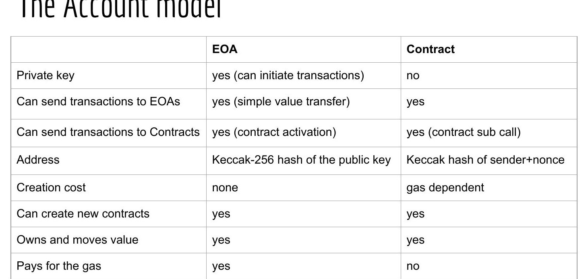
*Fig. — Confronto tra EOA e Contract: solo l'EOA possiede una chiave privata e paga il gas. Il Contract riceve il proprio indirizzo come hash di sender+nonce alla creazione.*

### Campi di ogni account

Tutti gli account, sia EOA che Contract, condividono quattro campi:

- **nonce** — numero di transazioni inviate dall'account (per EOA) o numero di contratti creati (per Contract, da 1). Previene la *malleability* e garantisce l'ordinamento: campo **dinamico**.
- **balance** — quantità di wei posseduti, espressa come intero: **dinamico**.
- **codeHash** — hash del bytecode EVM del contratto (per gli EOA è l'hash della stringa vuota). Il codice vero e proprio è conservato nel database di stato sotto il suo hash: **statico**.
- **storageRoot** — hash della radice di un *Merkle Patricia Trie* che codifica lo storage dell'account (una mappa da interi a interi), vuoto per default: **dinamico**.

> [!tip] Statico vs Dinamico
>
> `codeHash` è l'unico campo **statico**: il bytecode di un contratto non cambia dopo il deployment. Tutti gli altri campi variano ad ogni transazione che li coinvolge.

---

## Lo stato di Ethereum

Lo stato globale di Ethereum è strutturato come una gerarchia di **Merkle Patricia Trie**. Ogni blocco contiene nel suo header tre radici di trie:

- **stateRoot** — la radice del World State Trie, che mappa ogni indirizzo ai quattro campi dell'account.
- **transactionsRoot** — la radice del Transactions Trie, dove la chiave è l'indice della transazione nel blocco (da 0).
- **receiptsRoot** — la radice del Receipts Trie, che contiene i risultati dell'esecuzione di ogni transazione.

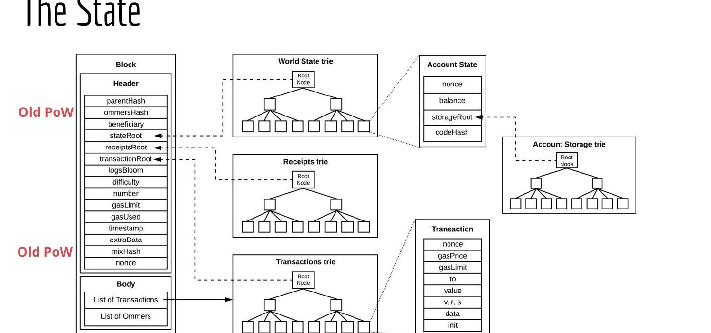
*Fig. — Il block header punta via hash a tre trie: World State, Receipts e Transactions. L'Account State contiene nonce, balance, storageRoot e codeHash; lo storageRoot punta a sua volta all'Account Storage Trie.*

La struttura si replica su blocchi successivi: ogni nuovo blocco N+1 condivide i nodi immutati con il blocco N (persistent data structure) e crea nuovi nodi solo per gli account modificati.

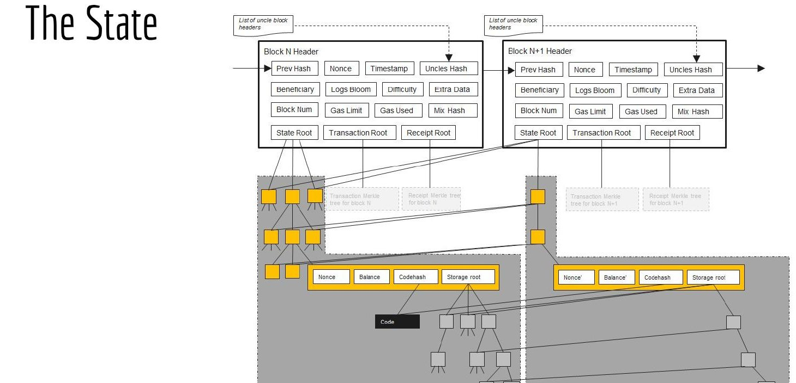
*Fig. — I blocchi N e N+1 mostrano come i Merkle Patricia Trie si propaghino tra blocchi: le foglie gialle rappresentano gli account modificati, i nodi condivisi rimangono inalterati.*

### Receipt e Bloom filter

Per ogni transazione viene generata una **receipt** contenente:

- `medstate` — root del state trie dopo l'elaborazione della transazione.
- `gas_used` — gas consumato cumulativo dopo la transazione.
- `logs` — lista di voci della forma `[address, [topic1, topic2...], data]`, generate dagli opcode `LOG0`…`LOG4` durante l'esecuzione (incluse le sub-call). L'indirizzo è quello del contratto che ha emesso il log, i topic sono fino a 4 valori da 32 byte.
- `logBloom` — **Bloom filter** costruito su indirizzi e topic di tutti i log della transazione.

L'OR bit a bit di tutti i `logBloom` delle receipt viene inserito nell'header del blocco. Questo permette a client leggeri di verificare rapidamente se un blocco contiene log rilevanti senza scaricare l'intero stato.

> [!definition] Bloom filter
>
> Struttura dati probabilistica che permette di verificare l'appartenenza di un elemento a un insieme in tempo costante. Può restituire falsi positivi ma mai falsi negativi. Nel contesto Ethereum, consente di filtrare efficientemente i blocchi rilevanti per una query su eventi.

### Log ed eventi in Solidity

I log risiedono **sopra** lo stato EVM interno e non sono visibili ai contratti durante l'esecuzione. Sono pensati per applicazioni esterne, che possono sottoscriversi a specifici tipi di log senza dover rieseguire tutte le transazioni o mantenere lo stato.

In Solidity i log si usano tramite gli **eventi**:

```solidity
event moneySent(address indexed _from, address _to, uint _amount);

function sendMoney(address _to, uint _amount) public returns (bool) {
    require(Balance[msg.sender] >= _amount, "Not enough value");
    moneyBalance[msg.sender] -= _amount;
    moneyBalance[_to] += _amount;
    emit moneySent(msg.sender, _to, _amount);
    return true;
}
```

Il parametro `indexed` su `_from` significa che il topic corrispondente viene incluso nel Bloom filter, rendendo le query per mittente molto efficienti.

> [!note] Smart contract e source code
>
> Nello stato EVM è conservato solo il **bytecode** compilato, non il sorgente Solidity. I sorgenti visibili su explorer come Etherscan sono caricati volontariamente dagli sviluppatori e verificati dall'explorer tramite compilazione.

---

## Gas

Il **gas** è il meccanismo che risolve due problemi fondamentali dell'EVM, resa Turing-completa dagli smart contract:

1. **Anti-DDoS**: senza un costo per l'esecuzione, un attaccante potrebbe inviare transazioni con loop infiniti bloccando la rete.
2. **Utilizzo equo delle risorse**: ogni operazione ha un costo in gas proporzionale al lavoro computazionale richiesto.

Il gas viene pagato per l'**esecuzione** (opcode EVM) e per lo **storage** (scrittura nello stato). Aspetto importante: il gas viene pagato anche per transazioni che falliscono o che esauriscono il gas — il lavoro già fatto deve essere compensato.

> [!warning] gaslimit a livello di transazione
>
> Il mittente specifica un `gaslimit` nella transazione: se il contratto consuma più gas del limite, l'esecuzione si interrompe con un **revert** (lo stato viene ripristinato) ma il gas già consumato viene comunque pagato. Questo protegge da comportamenti inattesi, incluse sub-call a contratti esterni.

Il `gaslimit` a livello di blocco (analogo alla block size di Bitcoin) limita il tempo di validazione di un blocco e quindi la quantità di computazione per blocco.

I costi in gas per operazione sono **hardcodati** nell'Appendice G del Yellow Paper di Ethereum. Esiste inoltre un insieme speciale di indirizzi (da `0x01` a `0x0a`) che contengono **precompiled contracts**: contratti il cui comportamento non è definito da bytecode EVM ma è implementato direttamente nell'esecuzione environment (Appendice E del Yellow Paper). Si chiamano come contratti normali ma il loro gas consumption è anch'esso predefinito.

---

## Solidity

**Solidity** è il linguaggio di programmazione ad alto livello per smart contract su Ethereum. Si compila in bytecode EVM.

Caratteristiche principali:
- **Staticamente tipato**: i tipi vengono verificati a tempo di compilazione.
- **Object Oriented**: un contratto si modella come un'istanza di classe, con stato (variabili di stato) e metodi (funzioni).
- **In continuo sviluppo**: la documentazione ufficiale è su `https://docs.soliditylang.org/en/latest/`.

### Remix IDE

Lo strumento standard per sviluppare e testare contratti Solidity è **Remix IDE**, accessibile via browser.


*Fig. — Remix IDE: pannello di deploy a sinistra, editor con Counter.sol al centro, log delle transazioni in basso. Si vedono le chiamate a `inc`, `dec`, `get` con i rispettivi hash e gas usato.*

### Primo contratto: Counter

Il contratto `Counter` è l'esempio introduttivo classico. Il workflow su Remix:

1. Creare un nuovo file `Counter.sol`
2. Copiare il codice
3. Compilare
4. Deploy su VM (ambiente locale simulato)
5. Chiamare i metodi
6. Ispezionare le receipt delle transazioni

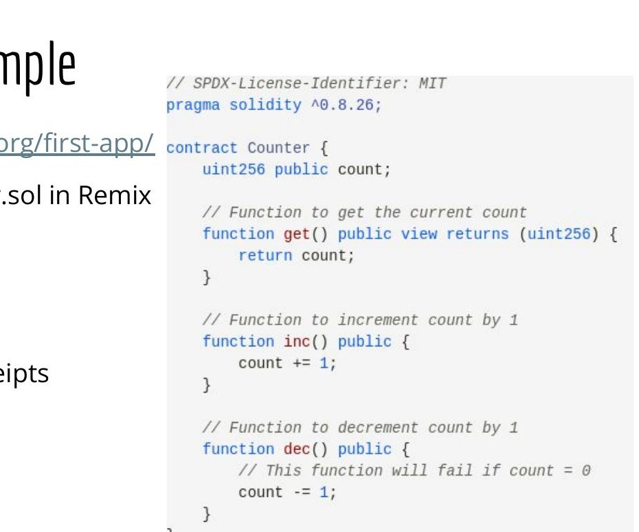
*Fig. — Il contratto Counter: variabile di stato `uint256 public count`, funzioni `get()` (view), `inc()` e `dec()` (public). La funzione `dec()` fallisce se `count = 0` per underflow aritmetico.*

### Pragma e versioning

La direttiva `pragma` specifica la versione del compilatore Solidity richiesta. La semantica del versioning segue regole precise:

| Direttiva | Significato |
|---|---|
| `pragma solidity 0.4.16` | Esattamente la versione 0.4.16 |
| `pragma solidity >=0.4.16 <0.7.1` | Dalla 0.4.16 (inclusa) alla 0.7.1 (esclusa) |
| `pragma solidity ^0.4.16` | Dalla 0.4.16 alla 0.5.0 (esclusa) |

La versione `x.y.*` introduce breaking change rispetto a `x-1.*.*` o `x.y-1.*`.

### Import

Solidity supporta diversi meccanismi di import per la modularizzazione del codice:

```solidity
import "lib/util.sol";                        // import diretto
import "../token.sol";                         // import relativo
import * as tokenLibrary from "lib/token.sol"; // rinomina namespace
// uso: tokenLibrary.varName1
```

### Costrutti principali

Un contratto Solidity è composto da quattro categorie di costrutti:

- **State Variables** — variabili persistenti nello storage del contratto.
- **Functions** — le operazioni che il contratto espone o usa internamente.
- **Errors e Modifiers** — meccanismi di validazione e pattern guard.
- **Events** — log emessi durante l'esecuzione, visibili alle applicazioni esterne.

### Visibility Modifiers

La visibilità controlla chi può accedere a variabili e funzioni.

**Variabili di stato:**

| Modificatore | Comportamento |
|---|---|
| `public` | Visibile internamente + getter automatico con visibilità esterna (`view`) |
| `internal` | *Default.* Visibile nel contratto e nei contratti derivati |
| `private` | Solo nel contratto corrente, non nei derivati |

**Funzioni:**

| Modificatore | Comportamento |
|---|---|
| `external` | Chiamabile solo da transazioni/messaggi esterni (internamente via `this.fun()`) |
| `public` | Chiamabile sia da esterno che internamente |
| `internal` | Solo dal contratto corrente o derivati — non fa parte dell'ABI |
| `private` | Solo dal contratto corrente — non fa parte dell'ABI |

> [!warning] `private` non significa segreto
>
> Una variabile `private` non è accessibile via chiamate Solidity, ma il suo valore è comunque leggibile direttamente dallo storage on-chain da chiunque. In Ethereum non esiste vera riservatezza dei dati in-chain.

> [!tip] ABI e visibilità esterna
>
> L'**ABI** (*Application Binary Interface*) è l'interfaccia pubblica del contratto: descrive le funzioni e gli eventi visibili dall'esterno. Solo le funzioni `external` e `public` fanno parte dell'ABI e possono essere chiamate da transazioni o da altri contratti tramite call standard.

```{=latex}
\newpage
```

# Lab 7 — Solidity (avanzato)

Questa lezione prosegue l'introduzione a Solidity approfondendo il sistema dei tipi, le funzioni, la gestione degli errori, i modifier e gli eventi. Si tratta del cuore del linguaggio: capire come Solidity gestisce i tipi, la mutabilità dello stato e il controllo degli accessi è fondamentale per scrivere contratti corretti e sicuri.

---

## Solidity: ripasso rapido

Solidity è un linguaggio **staticamente tipato**, **object-oriented**, compilato in bytecode EVM. Un contratto è modellato come una classe con stato (variabili di storage persistenti) e metodi (funzioni). La documentazione ufficiale è su `https://docs.soliditylang.org/en/latest/`.

Il primo contratto di riferimento è `Counter.sol`, da deployare su Remix IDE:

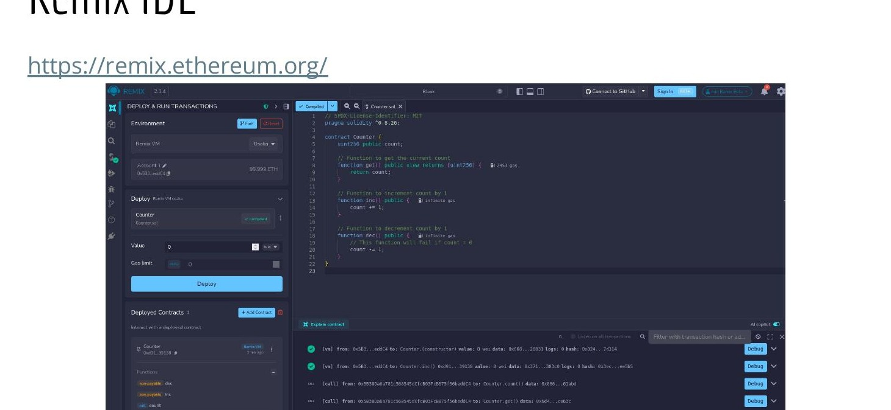
*Fig. — Remix IDE: a sinistra il pannello di deploy, al centro l'editor con Counter.sol, in basso i log delle transazioni con hash, gas usato e valori restituiti.*


*Fig. — Counter.sol: variabile di stato `uint256 public count`, funzione `get()` con modificatore `view`, `inc()` e `dec()` pubbliche. La `dec()` fallisce per underflow se `count == 0`.*

---

## Il sistema dei tipi

Solidity distingue due grandi famiglie di tipi: **value types** e **reference types**. La dichiarazione segue la sintassi `tipo [modificatore] nome;`.

I **value types** non specificano un'area di memoria (il compilatore li colloca nello stack se efimeri, nello storage se variabili di stato). Possono avere qualificatori:
- `transient` — come lo storage ma valido solo per la durata di una singola transazione.
- `constant` — valore sostituito a tempo di compilazione.
- `immutable` — valore fissato a tempo di costruzione del contratto.

I **reference types** devono specificare esplicitamente l'area di memoria: `memory` (temporanea, per la durata della chiamata), `storage` (persistente, nel trie dell'account), o `calldata` (read-only, per i parametri di funzioni `external`).

### Value Types

**Booleano e interi:**

```solidity
bool flag;                  // true / false
int8 .. int256              // interi con segno (int == int256)
uint8 .. uint256            // interi senza segno (uint == uint256)
```

Le divisioni intere arrotondano sempre verso zero (troncamento). I numeri in virgola mobile esistono (`fixed`/`ufixed`) ma sono molto limitati nella versione attuale.

**Byte e stringhe:**

```solidity
bytes1, bytes2, ..., bytes32    // array di byte a dimensione fissa
string                          // sequenza di caratteri UTF-8
```

**Enum:** tipo enumerato con al massimo 256 membri. Internamente rappresentato come `uint8`. Quando esposto all'ABI esterna, la firma viene tradotta automaticamente in `uint8`.

```solidity
contract test {
    enum ActionChoices { GoLeft, GoRight, GoStraight, SitStill }
    ActionChoices choice;
    ActionChoices constant defaultChoice = ActionChoices.GoStraight;

    function setGoStraight() public {
        choice = ActionChoices.GoStraight;
    }
    // Per l'ABI esterna getChoice() diventa "getChoice() returns (uint8)"
    function getChoice() public view returns (ActionChoices) {
        return choice;
    }
}
```

### Il tipo `address`

Il tipo `address` è fondamentale in Solidity: rappresenta un indirizzo Ethereum a 20 byte. Esistono due varianti:

- `address` — solo lettura.
- `address payable` — può ricevere Ether (convertibile da `address` con `payable(...)`).

Gli indirizzi hex che superano il checksum EIP-55 sono letterali di tipo `address` (es. `0xdCad3a6d3569DF655070DEd06cb7A1b2Ccd1D3AF`). L'indirizzo zero è `address(0)`.

**Membri dell'address:**

| Membro | Tipo | Descrizione |
|---|---|---|
| `.balance` | `uint256` | Saldo in wei dell'indirizzo |
| `.code` | `bytes memory` | Bytecode all'indirizzo (vuoto per EOA) |
| `.codehash` | `bytes32` | Hash del bytecode |
| `.transfer(amount)` | — | Invia `amount` wei, **revert** on failure, 2300 gas stipend |
| `.send(amount)` | `bool` | Invia `amount` wei, **false** on failure, 2300 gas stipend |
| `.call(payload)` | `(bool, bytes)` | Low-level CALL, tutto il gas disponibile, ritorna bool + data |

> [!warning] `transfer` e `send` sono deprecati
>
> Il limite fisso di 2300 gas era pensato come protezione, ma è una scelta di design fragile: i costi del gas cambiano con gli hard fork e contratti che oggi funzionano potrebbero rompersi in futuro. La pratica corretta è usare `.call{value: amount}("")` con controllo esplicito del valore di ritorno.

**Uso di `call` con selettore di funzione:**

```solidity
(bool success, bytes memory returnData) = address(nameReg).call{
    gas: 1000000,
    value: 1 ether
}(abi.encodeWithSignature("register(string)", "MyName"));
require(success);
```

I primi 4 byte dell'encoding della firma (`abi.encodeWithSignature`) formano il **function selector**: Keccak-256 della firma troncato a 4 byte.

> [!note] `delegatecall` e `staticcall`
>
> - **`delegatecall`**: esegue il codice del contratto chiamato nel contesto del chiamante (stesso storage, stesso `msg.sender`, stesso `msg.value`). Usato nei proxy pattern.
> - **`staticcall`**: come `call` ma esegue un revert se la chiamata modifica lo stato. Corrisponde alle funzioni `view`/`pure`.

**Creazione di contratti e interazione via address type:**

```solidity
contract Created {
    uint public x;
    constructor(uint a) payable { x = a; }
    function increment() public { x += 1; }
    function get() public view returns (uint) { return x; }
}

contract Creator {
    Created innerContract;

    function createCreated(uint arg) public {
        Created newCreated = new Created(arg);   // deploy di un nuovo contratto
        innerContract = newCreated;
    }
    function overrideCreated(address arg) public {
        innerContract = Created(arg);            // cast da address a tipo contratto
    }
    function createAndEndowCreated(uint arg, uint amount) public payable {
        Created newCreated = new Created{value: amount}(arg); // deploy con ETH
        newCreated.x();
    }
}
```

> [!tip] I contratti possono deployare altri contratti
>
> Un account Contract non può *iniziare* transazioni (non ha chiave privata), ma può deployare nuovi contratti tramite `new`. L'indirizzo del contratto creato è il Keccak-256 di `(creator_address, nonce)`.

### La keyword `payable`

Una funzione contrassegnata `payable` può ricevere Ether. Quando un contratto riceve Ether senza specificare una funzione, il runtime EVM cerca nell'ordine:

1. la funzione **`receive()`** (se esiste ed è `payable`),
2. la funzione **`fallback()`** `payable` (se esiste).

```solidity
receive() external payable { ... }   // chiamata senza dati o via transfer/send
fallback() external payable { ... }  // funzione inesistente, o receive assente
```

Entrambe sono funzioni speciali: senza nome (al più una per contratto), senza parametri, senza return. `fallback` viene chiamata anche quando si chiama una funzione inesistente nel contratto.

### Reference Types

**Array:**

```solidity
uint[] storage arr;          // dinamico
uint[10] storage arr;        // statico (dimensione fissa)
// metodi: .length, .push(), .push(elem), .pop()
```

**Struct:**

```solidity
struct Campaign {
    address payable beneficiary;
    uint goal;
    uint amount;
}
```

**Mapping:**

```solidity
mapping(KeyType => ValueType) varName;
```

I mapping funzionano come hash table con tutti i valori inizializzati al default del tipo. La chiave può essere qualsiasi tipo value built-in, `bytes`, `string`, o tipo contratto/enum. Il valore può essere qualsiasi tipo, inclusi mapping annidati.

> [!warning] Limitazioni dei mapping
>
> - I dati della chiave non vengono salvati nello storage: non è possibile enumerare le chiavi.
> - Non hanno `.length`.
> - Possono risiedere solo in `storage` (non in `memory`).
> - **Non sono iterabili**: per iterare occorre mantenere una lista separata delle chiavi.

---

## Unità predefinite

Solidity supporta suffissi per valori monetari e temporali, convertiti a interi a compile time:

```solidity
// Ether
assert(1 wei   == 1);
assert(1 gwei  == 1e9);
assert(1 ether == 1e18);

// Tempo
1 == 1 seconds
1 minutes == 60 seconds
1 hours   == 60 minutes
1 days    == 24 hours
1 weeks   == 7 days
```

---

## Variabili globali

Solidity mette a disposizione variabili e funzioni globali per accedere al contesto di esecuzione:

**Blocco:**

| Variabile | Tipo | Descrizione |
|---|---|---|
| `blockhash(n)` | `bytes32` | Hash del blocco `n` (solo ultimi 256 blocchi) |
| `block.basefee` | `uint` | Base fee del blocco corrente (EIP-1559) |
| `block.chainid` | `uint` | Chain ID corrente |
| `block.coinbase` | `address payable` | Indirizzo del miner/validator del blocco |
| `block.gaslimit` | `uint` | Gas limit del blocco corrente |
| `block.number` | `uint` | Numero del blocco corrente |
| `block.timestamp` | `uint` | Timestamp Unix del blocco corrente (secondi) |
| `gasleft()` | `uint256` | Gas rimanente |

**Messaggio e transazione:**

| Variabile | Tipo | Descrizione |
|---|---|---|
| `msg.data` | `bytes calldata` | Calldata completa |
| `msg.sender` | `address` | Mittente del messaggio (della call corrente — cambia nelle sub-call!) |
| `msg.sig` | `bytes4` | Primi 4 byte della calldata (function selector) |
| `msg.value` | `uint` | Wei inviati con il messaggio |
| `tx.gasprice` | `uint` | Gas price della transazione |
| `tx.origin` | `address` | Mittente originale dell'intera catena di chiamate |

> [!warning] `msg.sender` vs `tx.origin`
>
> `msg.sender` è il mittente della chiamata *corrente* e cambia ad ogni sub-call. `tx.origin` è sempre l'EOA che ha firmato la transazione originale. Non usare `tx.origin` per autenticazione: è vulnerabile ad attacchi di phishing tramite contratti intermedi.

---

## Funzioni

### Constructor

Il `constructor` viene invocato **una sola volta**, durante la creazione del contratto, e non fa parte dell'ABI esterna:

```solidity
constructor() public {
    creator = msg.sender;
}
```

### Valori di ritorno multipli

Solidity supporta return multipli sia con assegnazione esplicita che con `return` inline:

```solidity
// Stile 1: assegnazione nelle named return variables (return implicito)
function arithmetic(uint a, uint b) public pure
    returns (uint sum, uint product)
{
    sum = a + b;
    product = a * b;
}

// Stile 2: return esplicito
function arithmetic(uint a, uint b) public pure
    returns (uint sum, uint product)
{
    return (a + b, a * b);
}
```

Le variabili di ritorno nominate sono inizializzate al valore di default del tipo. Non è possibile restituire mapping (o tipi compositi che li contengono).

### State Mutability

Il modificatore di mutabilità indica cosa può fare la funzione rispetto allo stato della blockchain:

| Modificatore | Può leggere lo stato? | Può modificarlo? |
|---|---|---|
| *(nessuno)* | sì | sì |
| `payable` | sì | sì (+ riceve Ether) |
| `view` | sì | **no** |
| `pure` | **no** | **no** |

**`view`** — vieta di modificare lo stato. Sono considerate modifiche: scrittura a variabili di storage, emissione di eventi, creazione di contratti, `selfdestruct`, invio di Ether, chiamata a funzioni non `view`/`pure`.

**`pure`** — vieta sia lettura che scrittura dello stato. Non può accedere a `block`, `tx`, `msg` (eccetto `msg.sig` e `msg.data`), né a `.balance`. Una funzione `pure` deve essere valutabile a compile-time dati solo i suoi input e `msg.data`.

---

## Errori

Solidity offre tre primitive per segnalare condizioni di errore:

```solidity
assert(bool condition)
// revert con Panic(uint256) se falso — per invarianti che non devono mai fallire

require(bool condition, string memory message)
// revert con Error(string) se falso — per validazione di input o precondizioni

revert(string memory reason)
// revert incondizionato con messaggio personalizzato
```

> [!definition] `Panic` vs `Error`
>
> `Panic` è riservato a errori che **non dovrebbero esistere in codice corretto** (overflow, accesso out-of-bounds, divisione per zero). `Error` è per violazioni di precondizioni o input non validi — condizioni che l'utente può legittimamente causare.

Il **try-catch** è disponibile solo per chiamate esterne — non per chiamate interne. Vedi `FeedConsumer.sol` come esempio.

---

## Function Modifiers

I **modifier** sono guard che si applicano a una funzione prima (e/o dopo) della sua esecuzione. Il simbolo `_` segnaposto indica dove viene inserito il corpo della funzione:

```solidity
contract owned {
    constructor() { owner = payable(msg.sender); }
    address payable owner;

    modifier onlyOwner {
        require(msg.sender == owner, "Only owner can call this function.");
        _;   // <-- qui viene eseguito il corpo della funzione decorata
    }
}

contract myContract is owned {
    function doSomethingRestricted(uint n) public onlyOwner {
        // eseguito solo se msg.sender == owner
    }
}
```

Regole importanti dei modifier:

- Più modifier su una funzione vengono applicati **nell'ordine in cui sono elencati**.
- Non hanno accesso implicito agli argomenti o ai valori di ritorno della funzione decorata — devono essere passati esplicitamente.
- Il simbolo `_` può apparire più volte: ogni occorrenza sostituisce l'intero corpo della funzione.
- Un `return` esplicito in un modifier o nella funzione esce solo dal contesto corrente; il flusso riprende dall'`_` nel modifier precedente.
- I simboli introdotti nel modifier non sono visibili nella funzione e viceversa (eccetto quelli già nel contratto).

---

## Events

Gli eventi sono **log parametrizzati** emessi durante l'esecuzione, scritti nella receipt della transazione e ricercabili off-chain tramite topic, indirizzo del contratto e firma dell'evento. Non sono accessibili on-chain da altri contratti.

```solidity
pragma solidity >=0.4.21 <0.9.0;

contract ClientReceipt {
    event Deposit(
        address indexed from,   // topic 1 (nel Bloom filter)
        bytes32 indexed id,     // topic 2 (nel Bloom filter)
        uint value              // in data (non indicizzato)
    );

    function deposit(bytes32 id) public payable {
        emit Deposit(msg.sender, id, msg.value);
    }
}
```

Un evento può avere fino a **tre parametri `indexed`** (inclusi come topic nel Bloom filter per ricerche efficienti). I parametri non indicizzati vanno nel campo `data` della receipt in formato ABI-encoded.

---

## Selfdestruct

```solidity
selfdestruct(address payable recipient)
```

Nell'EVM pre-Cancun (≤ Shanghai): distrugge il contratto e invia tutti i fondi al `recipient`. Il contratto viene effettivamente rimosso dallo stato **alla fine della transazione** — eventuali revert possono annullare la distruzione. Fino alla fine, tutte le funzioni del contratto rimangono chiamabili.

> [!warning] `selfdestruct` post-Cancun
>
> Dall'hard fork **Cancun** in poi, `selfdestruct` invia i fondi al recipient ma **non distrugge il contratto**. L'unica eccezione è se `selfdestruct` viene chiamato nella stessa transazione che ha creato il contratto (comportamento pre-Cancun preservato).
>
> Per "disattivare" un contratto in modo portabile, è preferibile usare una variabile di stato booleana e far sì che tutte le funzioni facciano revert se il contratto è disattivato. In questo modo il contratto rimanda indietro l'Ether immediatamente.

---

## Proxy Contracts

Un problema fondamentale dei contratti Ethereum è l'**immutabilità**: una volta deployato, il bytecode non può essere modificato. Questo impedisce di correggere bug o aggiornare la logica.

Il pattern **proxy** risolve il problema separando:
- un contratto **proxy** (che non cambia mai) che detiene lo storage e delega le chiamate tramite `delegatecall`,
- uno o più contratti di **implementazione** (la logica) che possono essere aggiornati sostituendo il puntatore nel proxy.

Poiché `delegatecall` esegue il codice dell'implementazione nel contesto dello storage del proxy, lo storage e il mittente rimangono invariati dal punto di vista dell'implementazione.

Un'implementazione di riferimento: `OpenZeppelin/openzeppelin-contracts/blob/v4.8.2/contracts/proxy/Proxy.sol`.

> [!note] `virtual`, `override`, `abstract`
>
> - **`virtual`**: indica che un metodo (o parametro) può essere sovrascritto da contratti derivati.
> - **`override`**: segnala esplicitamente che un metodo sovrascrive quello del contratto padre.
> - **`abstract`**: analogo al concetto Java — contratto con funzioni non implementate che i derivati devono completare.

---

## Risorse

- `https://solidity-by-example.org/` — esempi pratici per tutti i costrutti Solidity
- `https://cryptozombies.io/course/` — corso interattivo gamificato

```{=latex}
\newpage
```

# Fungible e Non Fungible Tokens: Standard ERC

La tokenizzazione rappresenta una delle applicazioni più trasformative della blockchain. Insieme a criptovalute, DeFi (*Decentralized Finance*), supply chain e identità digitale, i token costituiscono le cosiddette **killer application** delle blockchain. Questa lezione analizza la distinzione fondamentale tra token fungibili e non fungibili, i meccanismi contrattuali che li implementano su Ethereum, e gli standard ERC che ne garantiscono l'interoperabilità.

---

## Coins e Token: una distinzione fondamentale

Prima di entrare nel merito degli standard, è necessario chiarire la differenza tra due termini spesso usati come sinonimi ma che indicano concetti distinti.

Un **digital coin** (*moneta digitale*) è un asset nativo della propria blockchain: bitcoin su Bitcoin, ether su Ethereum, ADA su Cardano, BNB su Binance, SOL su Solana. I coin svolgono le tre funzioni della moneta: mezzo di scambio, riserva di valore e unità di conto. Vengono inoltre utilizzati per ricompensare i nodi che garantiscono il funzionamento della rete.

Un **digital token** (*token digitale*), al contrario, è un asset non nativo creato sopra una blockchain esistente tramite smart contract. Questa dipendenza da un contratto spiega perché la stragrande maggioranza dei token sia implementata su Ethereum, che offre il runtime necessario. I token ereditano le proprietà di sicurezza e tracciabilità della blockchain sottostante, e la loro ragione d'esistenza è quasi sempre legata a un'applicazione decentralizzata specifica — una Dapp — all'interno del cui ecosistema assumono significato e valore.

Storicamente, i token hanno preceduto la blockchain: erano oggetti pseudo-monetari privi di framework legale, emessi da entità private per usi specifici. I gettoni dei casinò o le monete create dalle mining companies per i propri negozi aziendali (*company store*) ne sono esempi emblematici: avevano valore all'interno della comunità che ne accettava l'uso, ma nessuno al di fuori.

---

## Token Fungibili

> [!definition] Fungibilità
>
> Un asset è **fungibile** quando le sue unità sono identiche in natura e funzione: non esiste alcuna caratteristica distintiva tra un'unità e l'altra dello stesso tipo.

Le proprietà fondamentali dei token fungibili sono tre. L'**interscambiabilità** implica che ogni token sia sostituibile con qualsiasi altro token della stessa specie: il tuo biglietto da 20€ e il mio hanno lo stesso valore, così come un lingotto d'oro da 1 kg equivale a qualsiasi altro da 1 kg. Per le criptovalute questa proprietà è generalmente vera, ma con una sfumatura importante: ogni bitcoin ha la propria storia di transazioni on-chain, il che apre interrogativi sulla sua fungibilità assoluta. La **fusione** (*merging*) consente di sommare unità per ottenere valori aggregati. La **divisibilità** permette di trasferire frazioni di token, proprietà essenziale per le criptovalute dove si opera spesso con millesimi o microfraction.

### Applicazioni dei token fungibili

I token fungibili trovano impiego in scenari economici diversi. Nelle **ICO** (*Initial Coin Offering*), le aziende emettono token per raccogliere fondi dagli investitori, garantendo che la standardizzazione li renda negoziabili. Nella **DeFi**, i token fungibili fungono da collaterale su piattaforme di lending e borrowing, da strumento di voto e governance nelle **DAO** (*Decentralized Autonomous Organization*), e da mezzo di scambio generico. Nell'industria **gaming**, sono usati come valuta in-game e per rappresentare attributi dei personaggi, permettendo economie interne alle piattaforme. Sulle piattaforme social, modellano sistemi di reputazione e incentivi.

---

## Token Non Fungibili (NFT)

> [!definition] Non Fungibilità
>
> Un **NFT** (*Non-Fungible Token*) è un asset unico: contiene informazioni o attributi che lo rendono impossibile da sostituire con un altro token della stessa categoria. Ogni NFT rappresenta un'entità intera, non frazionabile.

La distinzione visiva tra fungibile e non fungibile è immediata: due palline da baseball identiche prodotte in serie sono fungibili; una pallina firmata da Babe Ruth è non fungibile, perché quella firma la rende unica e irreplicabile. Analogamente, la Gioconda è non fungibile (un originale), mentre una maglietta con la stampa della Gioconda è fungibile (producibile in mille copie).

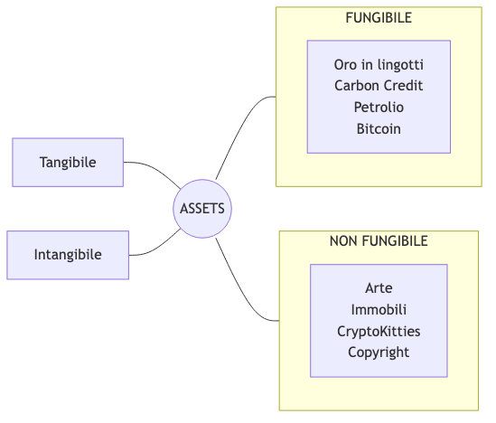
*Fig. — Tassonomia degli asset secondo fungibilità e tangibilità: i token intangibili fungibili includono criptovalute e carbon credit, quelli non fungibili includono arte digitale e copyright.*

Un NFT può rappresentare oggetti digitali unici come opere d'arte, oggetti in-game, domini .eth; asset fisici come immobili o opere d'arte reali (la tokenizzazione rende il trasferimento di proprietà più efficiente riducendo il rischio di frodi); oppure certificati di proprietà e identità. Il fenomeno dei **Beanie Babies** negli anni '90 anticipa molte dinamiche degli NFT: produzione limitata, ritiro deliberato di edizioni per creare scarsità, difetti intenzionali che generano edizioni ultra-rare. La psicologia del collezionismo è la stessa.

---

## Cryptographic Tokens e Standard ERC

I token crittografici implementati come smart contract ereditano le proprietà di tracciabilità, sicurezza e impossibilità di falsificazione della blockchain. Il settore è in piena espansione: i **colored coins** furono i primi cryptotoken sviluppati su Bitcoin; Ethereum rimane la piattaforma dominante per via degli smart contract, ma esistono ora piattaforme alternative specializzate.

### Perché uno standard?

> [!tip] Il valore di uno standard
>
> Uno standard ERC garantisce ai developer che gli asset si comporteranno in modo prevedibile, e alle aziende che i propri token saranno compatibili con l'infrastruttura Ethereum esistente: wallet, exchange, marketplace.

**ERC** (*Ethereum Request for Comment*, o *Ethereum Request for Improvements*) è il formato con cui si propongono e approvano le specifiche degli smart contract. Uno standard ERC per i token definisce l'interfaccia che un contratto deve implementare: come vengono creati, trasferiti, mutati e distrutti i token. I tre standard principali sono:

| Standard | Tipo | Caso d'uso principale |
|---|---|---|
| **ERC-20** | Token fungibili | Criptovalute, governance, DeFi |
| **ERC-721** | Token non fungibili (NFT) | Arte digitale, oggetti da collezione, immobili |
| **ERC-1155** | Multi-token (FT + NFT) | Gaming, piattaforme con asset eterogenei |

---

## ERC-20: Standard per Token Fungibili

Lo standard ERC-20 fu proposto dal co-fondatore di Ethereum Vitalik Buterin nel novembre 2015. Definisce un insieme comune di funzioni che ogni token fungibile su Ethereum deve implementare, così da garantire l'interoperabilità con wallet, contratti e marketplace.

### Struttura interna: il balance map

Il contratto ERC-20 mantiene internamente una struttura dati fondamentale: un mapping da indirizzi a saldi.

```
balanceOf: address → uint256
```

Il saldo di un indirizzo non è un numero astratto: dipende dal contratto specifico e può rappresentare unità fisiche, diritti, valori monetari o qualsiasi altra quantità che il contratto decida di modellare.

### Funzioni obbligatorie

Le sei funzioni obbligatorie dello standard sono:

| Funzione | Descrizione |
|---|---|
| `totalSupply()` | Restituisce il totale di token attualmente esistenti nel contratto. Può essere fisso o variabile. |
| `balanceOf(address)` | Restituisce il saldo di token di un indirizzo specifico. |
| `transfer(address _to, uint256 _value)` | Trasferisce token dall'indirizzo del chiamante a `_to`. |
| `approve(address _spender, uint256 _value)` | Autorizza `_spender` a spendere al massimo `_value` token per conto del chiamante. |
| `allowance(address _owner, address _spender)` | Restituisce la quota corrente approvata da `_owner` per `_spender`. |
| `transferFrom(address _from, address _to, uint256 _value)` | Trasferisce token da `_from` a `_to` per conto di un delegato autorizzato. |

Oltre alle funzioni, lo standard definisce due **eventi** che devono essere emessi:
- `Transfer(address _from, address _to, uint256 _value)` — emesso a ogni trasferimento
- `Approval(address _owner, address _spender, uint256 _value)` — emesso a ogni approvazione

### Campi opzionali

I tre campi opzionali migliorano l'usabilità del token:

- `name()`: nome human-readable, ad es. `"US Dollars"`
- `symbol()`: simbolo leggibile, ad es. `"USD"`
- `decimals()`: numero di cifre decimali per la rappresentazione visiva. Solidity non supporta i numeri decimali — lavora solo con interi — per cui si rappresenta un valore con moltiplicatori. Con `decimals = 18`, il valore `1000000000000000000` corrisponde a `1.0` token a schermo.

### Meccanismo di trasferimento diretto

La funzione `transfer` implementa una transazione diretta in un solo passo: il proprietario del wallet invia token a un altro indirizzo, esattamente come una transazione cryptocurrency convenzionale.

> [!example] Transfer: Alice invia 10 token a Bob
>
> 1. Il wallet di Alice invia una transazione al contratto token, chiamando `transfer(BobAddress, 10)`
> 2. Il contratto aggiorna: `balanceOf[Alice] -= 10` e `balanceOf[Bob] += 10`
> 3. Viene emesso l'evento `Transfer(Alice, Bob, 10)` on-chain, utile per il logging

### Meccanismo di delega (Allowance)

Il meccanismo di **allowance** risolve un problema pratico: in molti scenari (pagamenti ricorrenti, marketplace, DeFi) è necessario che una terza parte esegua transazioni per conto del proprietario, senza che il proprietario debba approvare ogni singola operazione.

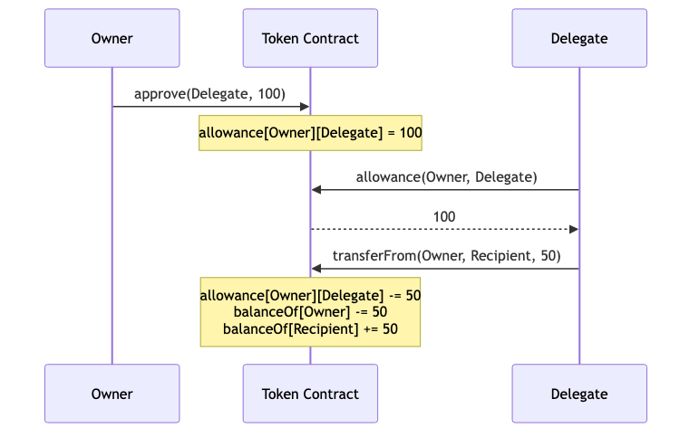
*Fig. — Flusso del meccanismo allowance: il proprietario approva una quota, il delegato la utilizza con transferFrom.*

Il mapping interno che traccia le allowance è una struttura a due livelli:

```solidity
mapping(address => mapping(address => uint256)) public allowance;
```

La prima chiave è il proprietario, la seconda è lo spender autorizzato, il valore è la quota massima. In altri termini: `allowance[owner][spender]` = quanto lo spender può ancora spendere dal conto di owner.

> [!example] Esempio completo di allowance
>
> Alice ha 1000 token e vuole delegare Bob a spenderne al massimo 100.
> 1. Alice chiama `approve(Bob, 100)`
> 2. Bob verifica la quota con `allowance(Alice, Bob)` → restituisce 100
> 3. Bob preleva 50 token: `transferFrom(Alice, Bob, 50)` → la allowance scende a 50
> 4. Bob può continuare a prelevare fino a esaurire la quota di 100 token totali

### L'interfaccia IERC20 e l'implementazione

L'interfaccia IERC20 formalizza in Solidity il contratto che ogni implementazione ERC-20 deve rispettare:

```solidity
// Funzioni opzionali
function name()     public view returns (string)  // optional
function symbol()   public view returns (string)  // optional
function decimals() public view returns (uint8)   // optional

// Funzioni obbligatorie
function totalSupply() public view returns (uint256)
function balanceOf(address _owner) public view returns (uint256 balance)
function transfer(address _to, uint256 _value) public returns (bool success)
function approve(address _spender, uint256 _value) public returns (bool success)
function allowance(address _owner, address _spender) public view returns (uint256 remaining)
function transferFrom(address _from, address _to, uint256 _value) public returns (bool success)

// Eventi
event Transfer(address indexed _from, address indexed _to, uint256 _value)
event Approval(address indexed _owner, address indexed _spender, uint256 _value)
```

Un'implementazione minimale del contratto ERC-20 è:

```solidity
pragma solidity ^0.8.7;
contract MyToken {
    string public name = "My Token";
    string public symbol = "MTK";
    uint8 public decimals = 18;
    uint public totalSupply = 100_000 * 10**decimals;
    mapping(address => uint) public balanceOf;
    mapping(address => mapping(address => uint)) public allowance;

    event Transfer(address indexed _from, address indexed _to, uint256 _value);
    event Approval(address indexed _owner, address indexed _spender, uint256 _value);

    function transfer(address _to, uint256 _value) public returns (bool success) {
        balanceOf[msg.sender] -= _value;
        balanceOf[_to] += _value;
        emit Transfer(msg.sender, _to, _value);
        return true;
    }

    function approve(address _spender, uint256 _value) public returns (bool success) {
        allowance[msg.sender][_spender] = _value;
        emit Approval(msg.sender, _spender, _value);
        return true;
    }

    function transferFrom(address _from, address _to, uint256 _value)
            public returns (bool success) {
        require(allowance[_from][msg.sender] >= _value);
        balanceOf[_from] -= _value;
        balanceOf[_to] += _value;
        emit Transfer(_from, _to, _value);
        allowance[_from][msg.sender] -= _value;
        return true;
    }
}
```

> [!warning] Bug nella slide originale
>
> Il codice presentato a lezione per `transferFrom` contiene un errore: `balanceOf[_from] += _value` invece di `-= _value`. La versione corretta sottrae il valore dal saldo del mittente e lo aggiunge al destinatario.

---

## Implementare i Token in Solidity

### Contratti come classi, istanze e deployment

In Solidity, un contratto è concettualmente equivalente a una classe in un linguaggio orientato agli oggetti. Il codice del contratto definisce la struttura; l'**istanza** viene creata quando il contratto viene deployato sulla blockchain tramite una transazione, a un determinato indirizzo. Il creator può essere sia un external account che un altro contratto (come mostrato nel pattern *Fabric* che istanzia token dinamicamente).

Una volta che un contratto crea un'istanza di un altro contratto tramite `new`, l'istanza risultante può essere usata per invocare le funzioni pubbliche dell'altro contratto:

```solidity
Token token = new Token(_name);   // deployment + riferimento
token.name();                     // invocazione funzione pubblica
```

### Ereditarietà

Solidity supporta l'ereditarietà in stile OOP. Un contratto figlio eredita tutte le variabili di stato e le funzioni non dichiarate `private` dal contratto padre. Le variabili e funzioni `internal` sono accessibili nel contratto e nei derivati; quelle `private` restano confinate al contratto in cui sono dichiarate, rafforzando l'incapsulamento.

Le funzioni dichiarate `virtual` nel padre possono essere sovrascritte nel figlio con `override`:

```solidity
contract Foo {
    function calculate(uint x, uint y) public virtual pure returns (uint) {
        return x + y;
    }
}
contract Bar is Foo {
    function calculate(uint x, uint y) public override pure returns (uint) {
        return x - y;
    }
}
```

### Interfacce

Le **interfacce** in Solidity sono blueprints puri: dichiarano le firme delle funzioni senza implementarle e senza variabili di stato. Sono lo strumento naturale per descrivere standard come ERC-20 ed ERC-721, e possono ereditare da altre interfacce.

### OpenZeppelin: non reinventare la ruota

> [!tip] OpenZeppelin
>
> OpenZeppelin (https://openzeppelin.com) è un SDK open source per lo sviluppo sicuro di smart contract. Il codice è sottoposto ad auditing continuo dalla community e usato in circa 3000 progetti blockchain. Fornisce template pronti per ERC-20, ERC-721 ed ERC-1155 importabili direttamente.

```solidity
import "@openzeppelin/contracts/token/ERC20/ERC20.sol";
contract MyToken is ERC20 {
    constructor() ERC20("MyToken", "MTK") {
        _mint(msg.sender, 1000);
    }
}
```

`MyToken` è un contratto figlio di `ERC20` di OpenZeppelin, ne eredita tutte le funzioni. Il costruttore del padre richiede nome e simbolo del token, che devono essere trasmessi dal figlio. La funzione `_mint` crea token dal nulla e li assegna all'indirizzo specificato, incrementando di conseguenza il `totalSupply`.

---

## ERC-721: Standard per NFT

Lo standard ERC-721 fu proposto nel gennaio 2018. La differenza architetturale rispetto a ERC-20 è fondamentale: mentre ERC-20 mappa **indirizzi → quantità**, ERC-721 mappa **ID unici → proprietari**.

> [!definition] tokenId in ERC-721
>
> Ogni NFT è identificato da un `uint256 tokenId`. La coppia `(contract address, tokenId)` deve essere **globalmente unica**: il tokenId è univoco all'interno di un contratto. Due contratti ERC-721 diversi possono avere token con lo stesso ID numerico, ma non rappresentano lo stesso asset.

L'interfaccia ERC-721 offre funzionalità analoghe a ERC-20 ma adattate alla gestione di token unici:

```solidity
function balanceOf(address _owner) external view returns (uint256);
function ownerOf(uint256 _tokenId) external view returns (address);
function safeTransferFrom(address _from, address _to, uint256 _tokenId, bytes data) external payable;
function safeTransferFrom(address _from, address _to, uint256 _tokenId) external payable;
function transferFrom(address _from, address _to, uint256 _tokenId) external payable;
function approve(address _approved, uint256 _tokenId) external payable;
function setApprovalForAll(address _operator, bool _approved) external;
function getApproved(uint256 _tokenId) external view returns (address);
function isApprovedForAll(address _owner, address _operator) external view returns (bool);
```

### safeTransferFrom: perché esiste

La funzione `transferFrom` standard presenta un problema critico: trasferisce il token senza verificare se il contratto destinatario sia in grado di gestire NFT. Se l'indirizzo `_to` è uno smart contract che non implementa il supporto ERC-721, il token viene inviato e si blocca permanentemente, irrecuperabile.

Per questo motivo esiste `safeTransferFrom`, che aggiunge un controllo:
1. Se `_to` è un contratto, chiama `onERC721Received(...)` su di esso
2. Se il contratto non implementa correttamente questa funzione (cioè non "riconosce" il token ricevuto), la transazione viene revertita
3. Il trasferimento avviene solo se il destinatario dimostra di saper gestire NFT

> [!warning] Gli NFT sono preziosi
>
> Usare `transferFrom` invece di `safeTransferFrom` verso un contratto sconosciuto è rischioso: se il contratto destinatario non supporta ERC-721, l'NFT va perso per sempre. Preferire sempre `safeTransferFrom` quando il destinatario potrebbe essere un contratto.

---

## Metadata degli NFT

Un NFT non è solo un ID on-chain: il suo valore deriva dai **metadata** associati, ovvero le informazioni che descrivono cosa rappresenta.

### La struttura dei metadata

I metadati tipici di un NFT includono:

| Campo | Significato |
|---|---|
| `name` | Nome dell'NFT (es. "Cool Ape #123") |
| `description` | Descrizione testuale |
| `image` | Link all'immagine (IPFS o HTTP) |
| `attributes` | Array di trait_type/value per caratteristiche specifiche |
| `unlockable_content` | Contenuto accessibile solo al proprietario |
| `royalty` | Percentuale di royalty per rivendite future |
| `supply` | Quasi sempre 1 per gli NFT |

### tokenURI: il collegamento tra on-chain e metadata

La funzione `tokenURI(uint256 tokenId)` è il punto di accesso ai metadata: dato un tokenId, restituisce un URI che punta a un file JSON. Questo URI può essere un URL HTTP (`https://my-nft-site.com/metadata/123.json`) oppure un link IPFS (`ipfs://Qm.../123.json`). Il file JSON contiene a sua volta ulteriori link, tra cui il link all'immagine vera e propria.

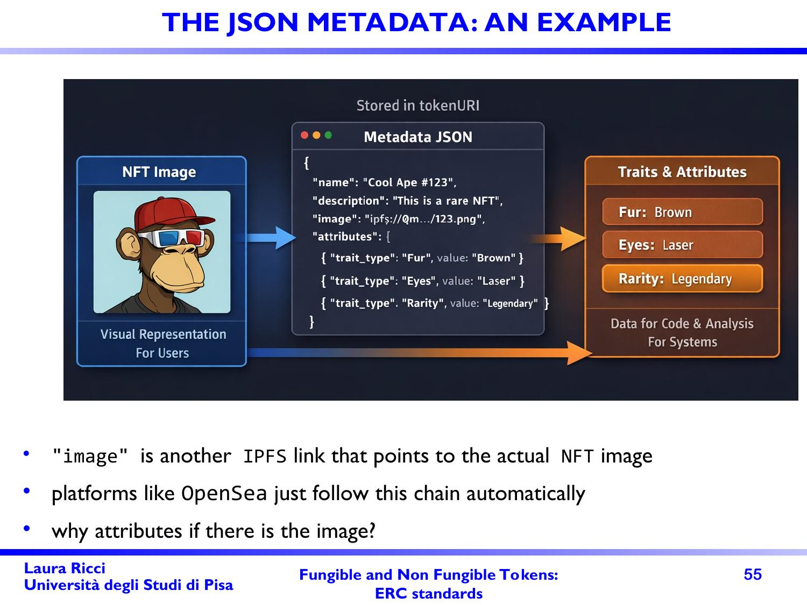
*Fig. — Il flusso dei metadata di un NFT: la `tokenURI` punta al JSON, che contiene il link IPFS all'immagine e l'array di attributi usati da marketplace e sistemi per filtrare e calcolare la rarità.*

### Perché gli attributi se c'è l'immagine?

L'immagine è per gli umani; gli attributi sono per le macchine. I marketplace come OpenSea usano gli attributi per permettere il **filtro** (*"solo NFT con fur dorata"*), il **calcolo della rarità** (*se solo l'1% ha "Laser Eyes", quell'attributo è molto raro e aumenta il valore*) e la **logica di gioco** (*uno Strength di 85 può influenzare il gameplay*). Senza attributi strutturati, un marketplace potrebbe solo mostrare le immagini, non filtrarle.

### On-chain vs Off-chain: dove archiviare i metadata?

Archiviare i metadata direttamente on-chain è possibile ma costosissimo e raramente raccomandato. Si fa solo quando:
- L'informazione deve persistere indipendentemente dall'esistenza del sito originale (arte digitale destinata a durare secoli)
- La logica del contratto deve accedere ai metadata (es. l'età dei CryptoKitties influenza la velocità di riproduzione)

La soluzione off-chain prevalente è l'**IPFS** (*InterPlanetary File System*), una rete peer-to-peer decentralizzata dove i contenuti sono distribuiti su più nodi e indirizzati per contenuto (non per posizione). L'alternativa cloud (AWS, Google Cloud) esiste ma contraddice lo spirito decentralizzato della blockchain.

### Royalties

Le royalties permettono all'autore originale di un NFT di ricevere una percentuale automatica su ogni rivendita futura, senza dover fare nulla. Il contratto traccia la percentuale scelta dall'artista e, ogni volta che l'NFT cambia mano, invia automaticamente la quota al wallet del creatore.

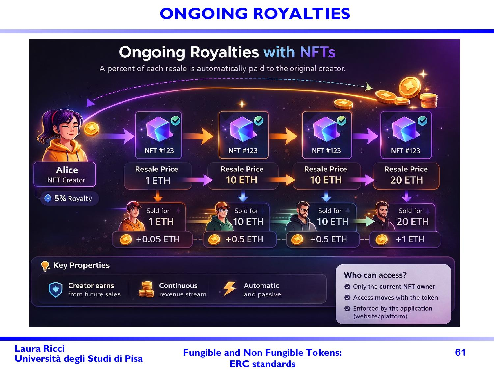
*Fig. — Il meccanismo delle royalties: Alice crea e vende NFT #123 per 1 ETH con royalty del 5%. Ad ogni rivendita futura (10 ETH, 10 ETH, 20 ETH), Alice riceve automaticamente il 5% — rispettivamente 0.05, 0.5, 0.5, 1 ETH — senza alcuna azione da parte sua.*

### Unlockable Content

L'*unlockable content* è contenuto visibile o accessibile solo al proprietario corrente dell'NFT: video esclusivi, documenti privati, codici di attivazione, access key per community ristrette. L'accesso si sposta automaticamente con il token quando viene trasferito.

Il flusso di verifica che una piattaforma deve implementare è:

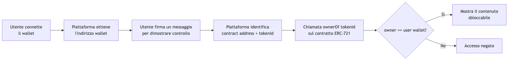
*Fig. — Flusso di verifica per l'unlockable content: la piattaforma chiama `ownerOf(tokenId)` on-chain e confronta il risultato con il wallet connesso dall'utente.*

---

## ERC-20 vs ERC-721: il confronto strutturale

La differenza architetturale tra i due standard si riassume in come viene organizzato il registro interno:

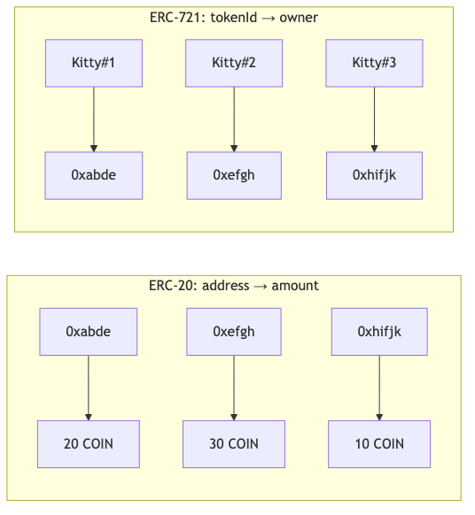
*Fig. — ERC-20 mappa indirizzi a quantità (fungibile); ERC-721 mappa ID unici a proprietari (non fungibile).*

---

## ERC-1155: Multi-Token Standard

Lo standard ERC-1155 fu proposto dal CTO di Enjin nel 2018 con un obiettivo preciso: **ridurre il volume di transazioni e i costi** combinando in un unico contratto le funzionalità di ERC-20 e ERC-721.

> [!definition] ERC-1155
>
> Un singolo contratto ERC-1155 può gestire contemporaneamente token fungibili (come ERC-20) e token non fungibili (come ERC-721), supportando il **batch transfer** (trasferimento di più token in una sola transazione) e includendo meccanismi di safe transfer per prevenire perdite.

Il confronto tra ERC-721 ed ERC-1155 evidenzia i vantaggi di quest'ultimo:

| Caratteristica | ERC-721 | ERC-1155 |
|---|---|---|
| Tipi di token supportati | Solo NFT | FT e NFT |
| Smart contract richiesti | Uno per ogni tipo di token | Uno solo per tutti i tipi |
| Batch transfer | Non supportato | Supportato (meno gas, meno transazioni) |
| Safe transfer | No recovery se indirizzo sbagliato | Verifica + possibilità di recovery |

### Applicazioni di ERC-1155

Il gaming è il caso d'uso principale. **Enjin Platform** usa ERC-1155 per creare asset di gioco — armi, scudi, oggetti — gestibili in un unico contratto condiviso tra più giochi. **The Sandbox** usa ERC-1155 per terreni, edifici e attrezzature nel suo metaverso. **Rarible** lo usa per supportare sia FT che NFT sulla stessa piattaforma, aumentando la flessibilità per artisti e collezionisti.

---

## La "giungla" degli standard ERC

> [!note] Un ecosistema in espansione
>
> ERC-20, ERC-721 ed ERC-1155 sono i principali standard, ma l'ecosistema Ethereum ne conta molti altri: ERC-777 (valuta Ethereum-based), ERC-827 (trasferimento a terze parti), ERC-884 (stock tokenization), ERC-1400/1404 (security token), ERC-725 (identità digitale), ERC-223 (European Research Council standard). La proliferazione di standard riflette la ricchezza e complessità degli use case che la tokenizzazione rende possibili.

```{=latex}
\newpage
```

# Lab 8 — Advanced Solidity: Vulnerabilities e Contract Upgrading

Questa lezione chiude il ciclo su Solidity affrontando due temi che separano il codice didattico dal codice production-ready: le **vulnerabilità tipiche** degli smart contract e le **strategie di aggiornamento** per contratti che, per natura, nascono immutabili. I due temi sono strettamente collegati: l'impossibilità di correggere un contratto dopo il deploy rende le vulnerabilità particolarmente dannose, e i pattern di upgrading sono nati proprio per mitigare questa rigidità — al prezzo, però, di introdurre nuove forme di centralizzazione e nuovi vettori di attacco.

> [!tip] Filosofia della lezione
>
> In Ethereum il codice è legge, ma la legge può contenere bachi. Scrivere smart contract sicuri significa anticipare i modi in cui un attaccante può manipolare il contesto di esecuzione (chi chiama, quando, con quale gas, con quali effetti collaterali) e progettare il codice perché non dipenda da invarianti che l'attaccante può violare.

---

## Vulnerabilità comuni

Prima di entrare nei singoli pattern di attacco è utile fissare alcune considerazioni generali, valide trasversalmente per qualsiasi contratto che gestisca valore o logica critica.

### Caveat generali

Due insidie ricorrenti, spesso sottovalutate, riguardano la **generazione di casualità** e il **costo delle view function**.

La prima questione nasce dal fatto che, in un sistema deterministico e replicato come l'EVM, non esiste una vera sorgente di casualità interna alla blockchain. Qualsiasi valore apparentemente casuale (hash di un blocco, timestamp, difficulty) è in realtà **manipolabile dai validatori**, che possono scegliere di non produrre il blocco se l'esito non è loro favorevole — o di ritardarne la pubblicazione per estrarre valore. Un contratto che dipenda da "casualità on-chain" per decisioni economicamente rilevanti (lotterie, estrazioni, distribuzione di premi) è vulnerabile per costruzione. Le soluzioni vere richiedono oracoli specializzati con schemi commit-reveal o VRF (Verifiable Random Functions) come Chainlink VRF.

La seconda questione è più sottile. Una funzione marcata `view` non modifica lo stato e, **se chiamata esternamente da fuori la blockchain** (ad esempio via `eth_call` da una DApp), non costa gas. Tuttavia, se la stessa funzione viene chiamata **da un'altra funzione on-chain**, il suo costo viene sommato al gas della transazione che la contiene. Una view function con loop non limitato su una struttura dati che cresce nel tempo può quindi diventare un **denial-of-service economico**: inizialmente gratuita, poi progressivamente più costosa, fino a superare il block gas limit.

> [!warning] Le view function non sono "gratis" in assoluto
>
> `view` garantisce solo che la funzione non scriva sullo stato. Non garantisce che il costo di lettura sia limitato. Se un altro contratto la chiama, paga l'esecuzione. Un attaccante può **far crescere volutamente** strutture dati iterate dalle view per trasformarle in bombe a orologeria.

> [!note] Riferimenti della lezione
>
> La guida ufficiale Ethereum sui disaster recovery plans e la sezione sicurezza degli smart contract è disponibile su `ethereum.org/developers/docs/smart-contracts/security`. Per esercitarsi sui pattern di attacco è storicamente utile **Ethernaut** (`ethernaut.openzeppelin.com`), una CTF di OpenZeppelin sui bug classici: leggermente datato, ma ancora ottimo per allenare l'istinto difensivo.

### Overflows

Gli overflow aritmetici sono stati a lungo il bug più classico di Solidity. In una `uint256` l'operazione `type(uint256).max + 1` tornava silenziosamente a `0`, con effetti disastrosi quando il valore rappresentava un saldo o un contatore critico. La libreria **SafeMath** di OpenZeppelin è nata proprio per fornire operazioni aritmetiche con controllo esplicito e revert in caso di overflow.

Dalla versione **0.8.0** del compilatore Solidity, il controllo di overflow/underflow è diventato **automatico** per tutte le operazioni aritmetiche standard. Il compilatore inserisce istruzioni di verifica che fanno revert della transazione se il risultato uscisse dai limiti del tipo. SafeMath rimane storicamente rilevante ma, in pratica, l'uso è diventato marginale: i contratti moderni possono fare affidamento sul controllo automatico, a meno che non sia esplicitamente necessario l'overflow silente (nel qual caso si usa un blocco `unchecked { ... }` per disattivarlo localmente e risparmiare gas).

> [!tip] Quando usare `unchecked`
>
> Il blocco `unchecked` serve quando si è **matematicamente certi** che l'overflow non possa avvenire (es. una variabile di loop limitata, un decremento protetto da un `require` precedente) e si vuole evitare il costo del check automatico. Usarlo per errore è esattamente il tipo di bug che il controllo automatico è stato introdotto per prevenire.

### Phishing tramite `tx.origin`

Solidity espone due variabili globali che a prima vista sembrano intercambiabili: `msg.sender` e `tx.origin`. La differenza è cruciale. `msg.sender` è l'indirizzo dell'**ultimo chiamante** — il contratto o l'EOA (Externally Owned Account) che ha invocato direttamente la funzione corrente. `tx.origin` è invece l'indirizzo dell'**EOA che ha firmato la transazione** all'origine dell'intera catena di chiamate.

Un controllo di autorizzazione basato su `tx.origin` è vulnerabile a un classico attacco **man-in-the-middle**: un contratto malevolo può indurre la vittima (che magari è l'owner di un contratto protetto) a interagire con sé, e poi, durante quella stessa transazione, invocare il contratto protetto. A quel punto `tx.origin` è ancora l'indirizzo della vittima (che ha firmato la transazione), quindi il controllo passa, anche se l'effettivo chiamante immediato (`msg.sender`) è il contratto malevolo.

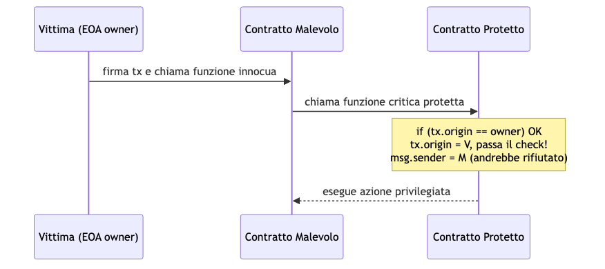
*Fig. — Schema dell'attacco di phishing basato su `tx.origin`: l'EOA della vittima resta `tx.origin` lungo tutta la catena di chiamate, quindi il controllo ingannevole passa nonostante il vero chiamante sia un contratto ostile.*

> [!warning] Regola pratica
>
> **Non usare mai `tx.origin` per controlli di autorizzazione.** Usa sempre `msg.sender`. L'unico uso legittimo di `tx.origin` è il rifiuto deliberato di chiamate da parte di contratti (`require(tx.origin == msg.sender)`), pattern oggi considerato scarsamente utile perché fragile e anti-composizionale.

### Reentrancy

La reentrancy è probabilmente la vulnerabilità più famosa della storia di Ethereum — è il bug che nel 2016 portò al collasso di **The DAO** e alla hard fork che separò Ethereum da Ethereum Classic. L'essenza del problema è semplice: si verifica quando **una funzione (o una combinazione di funzioni) viene richiamata dall'interno della propria esecuzione**, prima che gli effetti della prima chiamata siano stati consolidati nello stato del contratto.

Il vettore tipico è una chiamata esterna a un contratto non fidato: l'EVM, per `.call()`, `send` o `transfer` verso un indirizzo di contratto, esegue il codice del **fallback** o della `receive` di quel contratto. Se il fallback a sua volta richiama la funzione originaria, e questa non ha ancora aggiornato lo stato che regola l'accesso, l'attaccante può ottenere più volte il risultato di un'operazione che avrebbe dovuto essere unica.

#### Esempio classico: withdraw vulnerabile

```solidity
function withdraw() public {
    require(shares[msg.sender] > 0);

    (bool success,) = msg.sender.call{value: shares[msg.sender]}("");

    if (success)
        shares[msg.sender] = 0;
}
```

Il problema è l'**ordine delle operazioni**. La funzione:

1. verifica che il chiamante abbia share positive,
2. invia l'ether corrispondente (che trigger-a eventualmente il fallback del chiamante),
3. **solo dopo** azzera le share.

Se il chiamante è un contratto il cui fallback chiama di nuovo `withdraw()`, al passo 1 della seconda invocazione il controllo `shares[msg.sender] > 0` passa ancora (le share non sono state azzerate), e il contratto invia di nuovo ether. Il processo si ripete fino a svuotare il contratto o esaurire il gas della transazione.

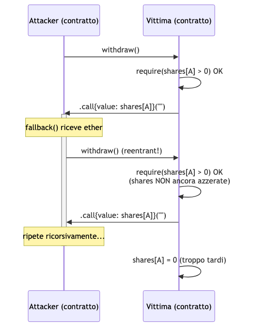
*Fig. — Il flusso di una reentrancy classica: la chiamata esterna restituisce il controllo al contratto malevolo, che rientra nella funzione prima che lo stato sia aggiornato.*

#### Mitigazioni

La difesa principale è il pattern **Checks-Effects-Interactions**: prima si fanno tutti i **controlli** (`require`), poi si aggiornano **gli effetti** sullo stato locale, e **solo alla fine** si eseguono le **interazioni** con contratti esterni. Riscritto correttamente, l'esempio diventa:

```solidity
function withdraw() public {
    uint256 amount = shares[msg.sender];
    require(amount > 0);
    shares[msg.sender] = 0;                          // Effect prima
    (bool success,) = msg.sender.call{value: amount}("");
    require(success);
}
```

Ora, anche se il fallback del chiamante richiama `withdraw`, il check fallisce perché `shares[msg.sender]` è già 0.

Esistono mitigazioni complementari, meno robuste ma utili come difesa in profondità:

- **Limitare il gas della chiamata esterna** (usando `send` o `transfer`, che forniscono solo 2300 gas, o fissando un gas cap in `call`). È una mitigazione storica che però non è sempre applicabile: dopo l'EIP-1884 il costo di alcune operazioni è aumentato e i 2300 gas di `transfer` possono non bastare per fallback legittimi, rompendo l'interoperabilità.
- **Lock non-reentrant** (reentrancy guard): un mutex booleano che viene alzato all'ingresso di funzioni sensibili e abbassato all'uscita. Se una chiamata esterna prova a rientrare, il mutex è alto e il require fallisce. OpenZeppelin fornisce `ReentrancyGuardTransient` (versione ottimizzata con storage transient EIP-1153) e `ReentrancyGuard`. **Attenzione a non rimanere bloccati per sempre**: il mutex deve essere abbassato in ogni percorso di uscita, inclusi i revert gestiti.

> [!example] Reentrancy guard con modifier
>
> ```solidity
> bool private locked;
> modifier nonReentrant() {
>     require(!locked, "Reentrant call");
>     locked = true;
>     _;
>     locked = false;
> }
> ```
>
> Applicando `nonReentrant` alla funzione `withdraw`, qualunque rientro trova `locked == true` e viene rifiutato.

> [!note] Approfondimenti
>
> Un'analisi dettagliata del TheDAO exploit si trova su `medium.com/@zhongqiangc/smart-contract-reentrancy-thedao-f2da1d25180c`. Una raccolta sistematica di attacchi reentrancy è mantenuta in `github.com/pcaversaccio/reentrancy-attacks`. Il guard ufficiale OpenZeppelin è su `github.com/OpenZeppelin/openzeppelin-contracts/blob/master/contracts/utils/ReentrancyGuardTransient.sol`.

---

## Contract Upgrading

Gli smart contract su Ethereum sono **immutabili per design**: una volta deployato il bytecode, non esiste un'istruzione EVM per modificarlo. Questa proprietà è sia una forza (garantisce che il codice non possa essere alterato dopo il deploy) sia un limite (non permette di correggere bachi né di aggiungere funzionalità). Il **contract upgrading** è l'insieme dei pattern architetturali che consentono di aggirare questa rigidità quando è necessario.

### Perché (e perché no) aggiornare un contratto

I benefici dell'upgradability sono evidenti: permette di **correggere vulnerabilità o bachi** scoperti dopo il deploy, **aggiungere nuove funzionalità** che rispondano a requisiti emergenti, e predisporre **disaster recovery plans** per intervenire in caso di attacco o malfunzionamento grave.

Il costo è altrettanto concreto: un contratto upgradable è, per definizione, **meno immutabile**, quindi meno credibilmente neutrale. Introduce un potere centralizzato (chi controlla l'upgrade?) che può essere usato maliziosamente o compromesso. L'upgrade stesso è una superficie di attacco: un nuovo contratto logic può introdurre bug o backdoor non presenti nella versione originale.

La mitigazione standard è introdurre **timelock** (ritardi obbligatori tra annuncio e attivazione di un upgrade, per dare agli utenti tempo di uscire) e **multisig** (richiedere più firme per autorizzare l'upgrade, evitando single-point-of-failure sulla chiave del deployer). Il trade-off è evidente: i timelock rallentano le risposte in emergenza, i multisig aumentano il costo operativo. È un compromesso, non una soluzione.

> [!tip] L'upgradability come scelta politica
>
> Rendere un contratto upgradable è anche una dichiarazione di governance: chi può votare l'upgrade? Con quale maggioranza? Dopo quanto tempo? Molti protocolli DeFi hanno migrato nel tempo da multisig a DAO governance proprio per decentralizzare questo potere.

### Esempio guida della lezione

Come filo conduttore la lezione usa l'aggiunta di funzionalità di **"proper deactivation"** al posto di `selfdestruct` come disaster recovery plan: si parte dal contratto `Created.sol` e si trasforma in `CreatedSafe.sol`, ragionando su come far adottare la nuova logica senza rompere lo stato già esistente.

### Le quattro opzioni principali

Esistono due macrofamiglie di soluzioni — quelle **senza proxy** e quelle **con proxy** — per un totale di quattro pattern principali:

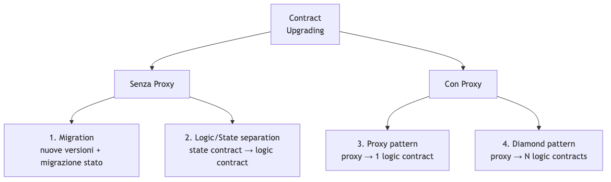
*Fig. — Tassonomia delle strategie di upgrading: si parte dalla scelta se introdurre o meno un proxy, e all'interno di ciascuna famiglia si distinguono approcci monolitici e modulari.*

#### Opzione 1 — Migration

Si crea una **nuova istanza** del contratto con la logica aggiornata e si **migrano i dati** dal vecchio al nuovo. È l'approccio più semplice concettualmente, ma impone che **tutti gli utenti passino al nuovo contratto**: ogni DApp, ogni wallet, ogni interazione esterna deve essere aggiornata al nuovo indirizzo. Rompe ogni integrazione on-chain che avesse hard-coded il vecchio indirizzo. Funziona bene per contratti di nicchia con pochi utenti coordinabili, male per protocolli con ampia adozione.

#### Opzione 2 — Separazione logic/state

Si divide il contratto in due: un **contratto di stato** (immutabile, contiene i dati) e un **contratto di logica** (mutabile, contiene il codice). Il contratto di stato espone getter/setter accessibili solo dal contratto di logica corrente, e mantiene un puntatore al contratto di logica attivo, aggiornabile dal proprietario.

Il vantaggio è che i dati non si spostano mai: lo stato rimane nello stesso indirizzo. Lo svantaggio è che **il caller interagisce con l'indirizzo della logica**, quindi un cambio di logica cambia l'indirizzo con cui l'utente interagisce — e le DApp devono aggiornarsi. È una mezza soluzione: risolve il problema della migrazione dati ma non quello dello stable address.

#### Opzione 3 — Proxy pattern

È l'approccio più diffuso nei protocolli moderni. Si usa un **proxy contract immutabile** che l'utente chiama sempre allo stesso indirizzo. Il proxy non contiene logica di business: contiene solo una **puntatore al contratto logic** e una funzione `fallback` che **delegate-call**-a al logic contract ogni invocazione ricevuta.

La chiave è `delegatecall`: a differenza di `call`, esegue il codice del callee **nel contesto (storage) del caller**. Quindi lo stato vive nel proxy, ma l'implementazione viene letta dal logic. Aggiornare il contratto significa cambiare il puntatore del proxy verso un nuovo logic contract.

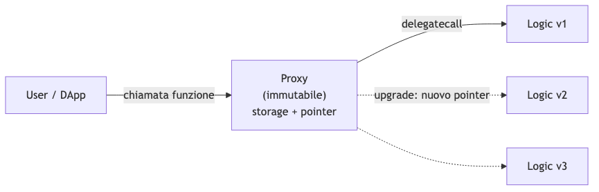
*Fig. — Pattern proxy: l'utente interagisce sempre con lo stesso indirizzo (il proxy), ma la logica eseguita è quella del contratto puntato, sostituibile dall'owner.*

> [!definition] `delegatecall`
>
> Opcode EVM che esegue il codice di un altro contratto **nel contesto di storage, `msg.sender` e `msg.value` del caller**. A differenza di `call`, che esegue il callee nel proprio contesto, `delegatecall` tratta il codice del callee come una libreria: lo stato modificato è quello del caller. È il meccanismo fondamentale che rende possibile il pattern proxy.

L'implementazione di riferimento è `Proxy.sol` di OpenZeppelin, disponibile in `github.com/OpenZeppelin/openzeppelin-contracts/blob/v4.8.2/contracts/proxy/Proxy.sol`. Un tutorial pratico è `jamesbachini.com/proxy-contracts-tutorial/`.

> [!warning] Storage collision
>
> Il punto più delicato del pattern proxy è l'**allineamento dello storage**: proxy e logic devono avere layout di storage compatibili, perché entrambi scrivono nello stesso storage (quello del proxy). Se il logic v2 aggiunge una variabile nel mezzo della lista, tutte le variabili successive "scorrono" e vengono sovrascritte/lette da slot sbagliati. Per questo OpenZeppelin impone un layout di storage **append-only** e usa slot deterministici (EIP-1967) per le variabili del proxy stesso (come l'indirizzo dell'implementazione), così da non collidere con quelle della logic.

#### Sintassi Solidity: `virtual`, `override`, `abstract`

Il pattern proxy usa intensivamente l'ereditarietà, quindi richiede familiarità con tre parole chiave:

| Parola chiave | Significato |
|---|---|
| `virtual` | Il metodo **può essere sovrascritto** da un contratto che eredita. |
| `override` | Il metodo **sta sovrascrivendo** un metodo `virtual` del contratto padre. |
| `abstract` | Il contratto **non può essere istanziato** direttamente perché ha funzioni/parametri non implementati; serve solo come base per sottoclassi. |

Il concetto di `abstract` è analogo a Java: un contratto che dichiara firme di funzioni senza implementazione, lasciando ai derivati il compito di completarlo.

#### Opzione 4 — Diamond pattern (EIP-2535)

Il pattern proxy standard ha un limite: **un solo logic contract** alla volta. Ma un logic contract è un singolo contratto Solidity, quindi è soggetto al **limite di dimensione del bytecode** (circa 24 KB per EIP-170). Protocolli grandi (DEX, lending, derivati) rischiano di sbattere contro questo soffitto.

Il **diamond pattern** (EIP-2535) generalizza il proxy: un unico contratto "diamond" (immutabile, con lo stato) delega a **più logic contracts**, detti **facets**. Ogni selector di funzione (i 4 byte che identificano una funzione nell'ABI) è mappato al facet che la implementa. Quando un utente chiama una funzione, il diamond consulta la mappa, individua il facet competente, e delegate-call-a ad esso.

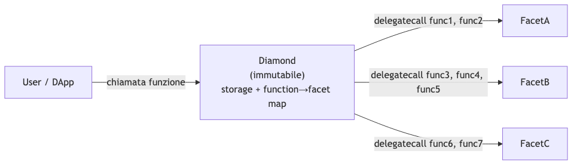
*Fig. — Pattern diamond: un unico indirizzo esposto all'utente, ma le funzioni sono implementate da più facet. La mappatura funzione → facet è aggiornabile, permettendo di sostituire, aggiungere o rimuovere facet nel tempo.*

Il cuore del pattern è la **function-to-facet mapping**:

```solidity
mapping(bytes4 => address) facets;

// Esempio di mapping:
// (func1) e2532512 => 0x0b22380B7c423470...  (FacetA)
// (func2) b1e5392a => 0x0b22380B7c423470...  (FacetA)
// (func3) 1857ea99 => 0x501E5D8e2FBbBc8A...  (FacetB)
// (func4) 876e3abc => 0x501E5D8e2FBbBc8A...  (FacetB)
// (func5) 79d9df55 => 0x501E5D8e2FBbBc8A...  (FacetB)
// (func6) 0b7eac44 => 0x39555988230b4c87...  (FacetC)
// (func7) d86e6291 => 0x39555988230b4c87...  (FacetC)
```

Il diamond gestisce anche più **storage struct** dedicate (una per facet o gruppo di facet), tipicamente usando il pattern **Diamond Storage** per isolare gli slot di storage di ciascun facet ed evitare collisioni: ogni facet usa uno slot di storage calcolato come hash di una stringa unica, garantendo che facet diversi non si pestino i piedi.

> [!tip] Perché "diamond"
>
> Il nome richiama la forma dell'ereditarietà multipla: un singolo punto di ingresso (il diamond) si apre su molte facce (i facet). A differenza dell'ereditarietà multipla tradizionale, qui non c'è un unico albero di compilazione: i facet sono contratti separati, deployati indipendentemente, e la "composizione" avviene a runtime tramite la mappa di selector. Il risultato è massima modularità, al prezzo di una maggiore complessità di governance (ora bisogna gestire upgrade, aggiunte e rimozioni di facet).

> [!abstract] Sintesi dei quattro pattern
>
> | Opzione | Indirizzo stabile? | Migrazione dati? | Complessità | Limite dimensione |
> |---|---|---|---|---|
> | Migration | no | sì | bassa | nessuno |
> | Logic/state separation | no (cambia logic) | no | media | ~24 KB |
> | Proxy | **sì** | no | media | ~24 KB |
> | Diamond | **sì** | no | alta | **nessuno** (molti facet) |

---

## Mappa concettuale della lezione

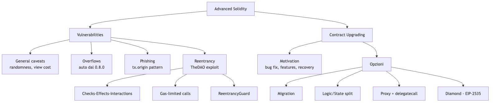
*Fig. — Struttura complessiva della lezione: da un lato i pattern di attacco e le relative difese, dall'altro l'evoluzione dei pattern architetturali per superare l'immutabilità degli smart contract.*

---

```{=latex}
\newpage
```

# IPFS: Interplanetary File System

## Il Web centralizzato e il problema della localizzazione

Il Web così come lo conosciamo oggi si regge su un modello **location based**: quando scriviamo `http://sito.com/image.jpg` non stiamo chiedendo "voglio quella specifica immagine", bensì "contatta la macchina che risponde a `sito.com` e chiedigli il file `image.jpg`". L'indirizzo HTTP punta cioè a un **luogo** della rete — un dominio risolto in un indirizzo IP, che a sua volta identifica una macchina fisica. La conseguenza è duplice: il contenuto esiste solo fintanto che quel server è raggiungibile, e l'intero modello è fragile rispetto alla censura, ai guasti e alla centralizzazione delle infrastrutture.

> [!warning] Il problema della censura
>
> Se un governo o un provider decide di bloccare un dominio o un indirizzo IP, il contenuto diventa irraggiungibile per intere porzioni di rete, anche se copie dello stesso file sono fisicamente presenti su milioni di macchine sparse nel mondo. Il legame forte fra **contenuto** e **luogo** è ciò che rende possibile la censura su scala.

C'è inoltre un problema più sottile di *discovery*: immagina che Mary voglia una certa immagine e che Bob, sulla stessa rete locale, ce l'abbia già sul disco. Nel modello HTTP, Mary non ha alcun modo di sapere che il file è a due metri da lei: deve per forza contattare il web server d'origine, magari dall'altra parte del mondo. Manca un meccanismo che permetta di **recuperare il contenuto da dove esso si trova**, invece che da dove è stato pubblicato.

### Dal Web location-based al Web content-based

L'idea di IPFS è ribaltare la prospettiva: invece di indirizzare il *contenitore* (il server), si indirizza direttamente il *contenuto*. Non ci interessa sapere dove un file è ospitato, ci interessa solo **che cosa è** quel file. Se riusciamo a dare a ogni file un nome univoco derivato dal suo contenuto, allora la rete può occuparsi autonomamente di cercarlo dove esso si trova, replicarlo, servirlo dal nodo più vicino.

> [!tip] Intuizione chiave: content addressing
>
> In un sistema **content-addressed**, il nome di un file *è* il file — nel senso che è una funzione univoca dei suoi bit. Due file identici hanno lo stesso nome, ovunque essi siano; un file manomesso anche in un singolo bit ha un nome diverso. La localizzazione diventa un problema di rete, non di design del protocollo.

---

## IPFS: cos'è e da dove viene

IPFS (**InterPlanetary File System**) è un protocollo peer-to-peer per lo storage distribuito dei contenuti del Web, sviluppato da **Protocol Labs**. Lo slogan canonico, tratto dal white paper di Juan Benet del 2013, lo descrive come un "Content Addressed, Versioned, P2P File System". Il contributo di IPFS, secondo lo stesso Benet, non è inventare nuove tecniche, ma *combinare* in un unico sistema coerente idee già collaudate nel mondo peer-to-peer.

> [!info] L'ecosistema di Protocol Labs
>
> - **IPFS** — protocollo P2P content-based, alternativa a HTTP per lo scambio di contenuti.
> - **Filecoin** — rete di storage decentralizzata con un mercato basato su criptovaluta, costruita *sopra* IPFS per risolvere il problema degli incentivi allo storage.
> - **libp2p** — libreria modulare di rete nata come sotto-progetto di IPFS e poi diventata indipendente, usata da molti altri progetti.

Le idee che IPFS riprende e integra sono:

| Componente | Ispirazione |
|---|---|
| Routing | DHT (con miglioramenti da **S/Kademlia** per la sicurezza e **Coral sloppy DHT** per la performance) |
| Strutture dati | **Merkle DAG** (da Git e dai Merkle tree crittografici) |
| Scambio di blocchi | **BitTorrent**, adattato nel protocollo **Bitswap** |
| Versionamento | **Git** (version control system) |
| Namespace auto-certificante | **SFS** (Self-Certified File System) |

Nessuno di questi è un nodo "privilegiato": la rete IPFS è piatta, ogni peer memorizza oggetti nel proprio store locale e si connette ad altri peer per trasferire blocchi. L'identificazione dei contenuti è **content-based tramite hash crittografico sicuro**, lo scambio è peer-to-peer in stile BitTorrent, l'organizzazione dei file segue un **DAG di Merkle** che permette al tempo stesso verifica crittografica, deduplicazione e versionamento.

---

## Lo stack di IPFS a colpo d'occhio

Prima di entrare nei dettagli, è utile avere in mente l'architettura a livelli di IPFS. Il sistema si presenta come uno stack, in cui ogni livello si appoggia a quello sottostante e risolve un problema distinto.

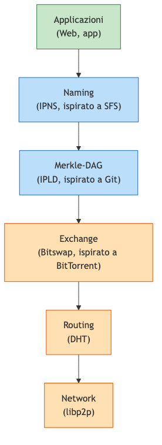
*Fig. — Lo stack IPFS: il livello più basso trasporta i dati (network, routing, exchange), quello intermedio li definisce (Merkle-DAG, naming), quello superiore li usa (applicazioni).*

Tre blocchi logici emergono chiaramente. In basso troviamo **Transporting Data**, il compito di muovere bit tra peer: network (libp2p), routing (DHT), exchange (Bitswap). Al centro **Defining Data**, dove i bit diventano strutture identificabili: Merkle-DAG e naming (IPNS). In cima **Using Data**, dove le applicazioni si appoggiano a tutto il resto.

---

## Content addressing: l'hashing come indirizzo

L'idea fondativa di IPFS è trasformare ogni pezzo di contenuto in un identificatore derivato matematicamente dai suoi bit. Quando carichi una foto su IPFS, accade questo: l'immagine viene convertita in raw data (una sequenza di byte), e su questi byte viene calcolato un **hash crittografico sicuro** — per default **SHA-256**, ma l'architettura supporta esplicitamente l'uso di altri algoritmi (e vedremo fra poco perché questa flessibilità è cruciale). Il digest risultante diventa l'etichetta univoca del contenuto.

> [!definition] Hash crittografico come indirizzo
>
> Un hash crittografico è una funzione che mappa input di qualsiasi lunghezza in output di lunghezza fissa (256 bit per SHA-256), con tre proprietà fondamentali: **tamper-freeness** (cambiare un bit dell'input cambia drasticamente l'output), **verifiability** (chiunque può ricalcolare l'hash e verificare l'integrità del dato) e **security** (non è possibile risalire all'input dall'output).

Queste tre proprietà si traducono direttamente in tre garanzie di IPFS. La prima è **l'auto-certificazione**: se Bob ti invia un file dichiarando che ha un certo CID, basta ricalcolare l'hash per verificare che non sia stato manomesso — non serve fidarsi di Bob. La seconda è **l'integrità end-to-end**: se anche un singolo pixel di una foto viene modificato, il suo hash cambia completamente, quindi il CID corrispondente è diverso. La terza è **la robustezza contro la manipolazione**: non esistendo un modo efficiente per costruire un file diverso con lo stesso hash, IPFS è di fatto un file system a prova di tampering.

### Dal digest al CID (Content Identifier)

Il digest da solo, però, non basta. Per poter evolvere l'algoritmo di hashing nel tempo, supportare formati di codifica diversi e permettere a software differenti di interpretare correttamente i dati, IPFS non usa *l'hash puro* come indirizzo: lo avvolge in una struttura chiamata **CID (Content Identifier)**.

> [!definition] Content Identifier (CID)
>
> Un CID è un'identificazione **self-describing** del contenuto. Contiene:
>
> - **l'hash del contenuto** — che identifica *cosa* è il dato;
> - **metadata** che descrivono *come* interpretare/decodificare il dato (quale algoritmo di hash, quale codifica, quale formato di serializzazione).
>
> Il CID **non** indica dove il contenuto è memorizzato: non è un puntatore di rete, è un'"impronta digitale" auto-descrittiva.

Nelle versioni legacy, i CID cominciano con il prefisso `Qm…` (es. `QmPK1s3pNYLi9ERiq3BDxKa4XosgWwFRQUydHUtz4YgpqB`). Le versioni moderne (CIDv1) hanno una struttura più flessibile e ricca, che analizzeremo a breve.

---

## Il progetto Multiformat

La scelta di includere i metadata dentro il CID nasce da un'esigenza molto concreta di **evoluzione del software**. Se hard-codifichi SHA-256 ovunque nel tuo codice, il giorno in cui SHA-256 viene rotto (come è successo a MD5, e come potrebbe succedere domani con l'arrivo di computer più potenti o con attacchi crittografici imprevisti) devi riscrivere e ridistribuire tutto lo stack. Tool, applicazioni e script avranno fatto assunzioni *implicite* sulla lunghezza del digest, sul formato dell'identificatore, sul protocollo di rete. È un problema analogo al millennium bug.

> [!tip] L'insight dietro il Multiformat
>
> Invece di assumere un formato fisso, ogni valore trasporta con sé una descrizione di *quale* formato usa. Un'applicazione che riceve un dato lo interpreta leggendo prima i metadata, poi il valore. Così l'evoluzione dei protocolli di hashing, di codifica o di rete non richiede di modificare il codice delle applicazioni: basta che esse leggano correttamente il prefisso auto-descrittivo.

Il Multiformat è una **collezione di standard** nati all'interno di IPFS e poi diventati indipendenti. I protocolli attuali sono:

| Protocollo | Cosa descrive |
|---|---|
| **multihash** | hash auto-descrittivi (quale funzione di hash, quale lunghezza) |
| **multibase** | codifica auto-descrittiva di stringhe (base32, base58, base64...) |
| **multicodec** | formato di serializzazione auto-descrittivo |
| **multiaddr** | indirizzi di rete auto-descrittivi |

### Multibase: come leggere una stringa

Quando un CID viene presentato come stringa leggibile (per copiarlo in un URL, incollarlo in chat, stamparlo su una slide), i suoi byte binari devono essere codificati in caratteri alfanumerici. Esistono molte basi possibili — Base32, Base58 (la stessa usata da Bitcoin), Base64 — e Multibase risolve il problema di non dover sapere a priori quale è stata usata: **un singolo carattere di prefisso** identifica la codifica, e un'applicazione può decodificare qualsiasi stringa senza ipotesi hard-coded.

### Multihash: come leggere un digest

Un multihash non memorizza soltanto il valore dell'hash, ma anche **quale funzione di hash è stata usata** e **quale lunghezza ha il digest**. Il formato è compatto:

```
<hash-function-code> <digest-length> <digest-bytes>
```

Anche se oggi il sistema usa di fatto solo SHA-256, il formato multihash segnala alle applicazioni che domani potrebbe essere qualsiasi altra cosa. Tool, applicazioni e script non devono fare assunzioni sulla lunghezza: la leggono direttamente dal valore. Il risultato è che **la stragrande maggioranza del software non richiede alcun upgrade** quando l'algoritmo di hash cambia — un risparmio enorme di ore di engineering su larga scala.

### CID: tutto il Multiformat messo insieme

Un CIDv1 mette insieme tutti questi elementi: una versione, un multicodec che descrive il formato di serializzazione del contenuto, un multihash (con codice della funzione di hash, lunghezza e valore). La stringa visibile all'utente è poi passata attraverso multibase per essere codificata in caratteri stampabili.

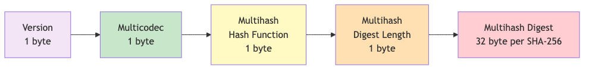
*Fig. — Struttura a byte di un CIDv1 (dag-pb, sha2-256): versione, multicodec, funzione di hash, lunghezza, digest.*

Il CID completo è quindi un flusso di byte che viene poi raggruppato in chunk da 5 bit e codificato — tramite multibase — in caratteri Base32 (o altra base). Il carattere di prefisso della stringa finale identifica la base usata, completando il quadro auto-descrittivo.

> [!note] Perché 5 bit per Base32
>
> Base32 usa 32 simboli distinti, cioè $2^5$. Ogni gruppo di 5 bit del flusso binario diventa un carattere dell'alfabeto Base32. Si noti che i confini dei campi originari (versione, multicodec, ecc.) **non** sono allineati ai 5 bit: nella stringa Base32 finale la struttura a byte non è più visibile, si può recuperare solo dopo aver decodificato.

---

## IPLD e il Merkle DAG

Fin qui abbiamo parlato di file singoli. Ma IPFS deve gestire anche strutture più complesse — directory, collezioni di blocchi, versioni successive di uno stesso documento — e lo fa attraverso un livello chiamato **IPLD (InterPlanetary Linked Data)**, il modello dati di IPFS.

> [!definition] IPLD e Merkle DAG
>
> IPLD trasforma tutti i dati in un **grafo di nodi collegati da CID**. Ogni pezzo di dato è un nodo; i nodi sono connessi da *link*, dove un link è semplicemente il CID del nodo di destinazione. L'insieme forma un **Merkle DAG (Directed Acyclic Graph)**: un grafo orientato aciclico in cui ogni nodo contiene, all'interno dei propri dati, i digest dei nodi figli.

L'aggettivo "Merkle" viene dalle classiche strutture crittografiche di Ralph Merkle: **il contenuto di cui si calcola l'hash contiene i digest di altri contenuti**, quindi ogni nodo autentica ricorsivamente tutti i suoi discendenti. L'hash della radice è sufficiente per verificare l'integrità dell'intera struttura.

### Come funziona in concreto

Quando aggiungi un file a IPFS, il sistema lo divide in **chunk** (blocchi di dimensione fissa o variabile). Per ogni chunk calcola un digest e crea un CID. Poi costruisce un nodo "indice" che contiene i CID dei chunk in ordine, e ne calcola a sua volta il CID: questo è il **base CID** del file.

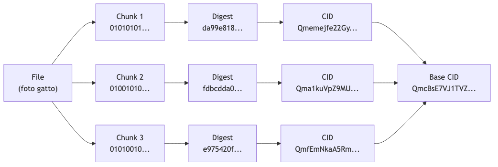
*Fig. — Costruzione del Merkle DAG di un file: chunking, hashing, generazione dei CID dei figli e del CID radice.*

### Deduplicazione automatica

Una conseguenza bellissima di questa struttura è la **deduplicazione**: lo stesso contenuto è memorizzato **una sola volta** nell'intera rete. Se due foto condividono gli stessi chunk — perché sono simili, perché hanno la stessa intestazione, perché qualcuno ha modificato solo una piccola parte dell'immagine — la parte comune ha lo stesso CID in entrambi i file, quindi non viene duplicata.

L'esempio limite è evocativo: immagina che ogni lettera dell'alfabeto abbia il suo CID e sia memorizzata una sola volta nel sistema. Un intero libro potrebbe essere rappresentato *componendo i CID delle lettere* — ovviamente in pratica si lavora a grana più grossa, ma l'idea è quella.

Il diagramma seguente mostra concretamente come IPLD organizza i dati in un Merkle DAG, evidenziando il caso in cui un nodo (qui `CID_D`) è **condiviso** fra più genitori — ed è proprio questo che rende la struttura un DAG e non un semplice albero.

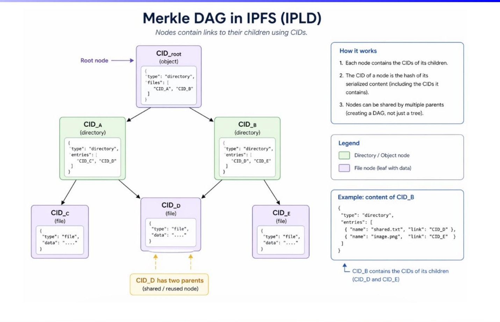
*Fig. — Merkle DAG in IPFS (IPLD). `CID_root` contiene i CID dei figli `CID_A` e `CID_B` (entrambe directory). Il file `CID_D` è referenziato sia da `CID_A` sia da `CID_B`: essendo identificato dall'hash del suo contenuto, viene memorizzato una sola volta ma puntato da più genitori. A destra, l'esempio del payload serializzato di `CID_B`, che elenca i suoi figli come coppie `(name, link)`.*

### Proprietà del Merkle DAG

La struttura ha tre proprietà fondamentali che conviene tenere a mente.

**Il CID di un nodo dipende dai CID di tutti i suoi discendenti.** Se fotoritocchi anche un solo pixel di un'immagine contenuta in una directory, il CID del chunk modificato cambia; di conseguenza cambia il CID del nodo che lo contiene; poi cambia il CID della directory; e così via fino alla radice. La modifica **si propaga verso gli antenati**, mai verso i fratelli.

**La costruzione avviene sempre dal basso verso l'alto.** Non si può creare un nodo padre finché i CID dei figli non sono noti. Questa è anche la ragione strutturale per cui il DAG non può contenere cicli: sarebbe una dipendenza circolare dei CID.

**Una modifica in un ramo non tocca gli altri rami.** Se cambi un file in `dir/foto/gatto.jpg`, i CID di tutti i file dentro `dir/foto/` vengono ricalcolati solo per il ramo interessato; gli altri file della directory mantengono invariato il loro CID. È la stessa proprietà che in Git permette di identificare in modo compatto un commit e di verificare rapidamente l'identità di due sottocartelle.

> [!example] Verifica di due directory
>
> Hai fatto una copia di backup di una directory durante un lavoro di editing, mesi fa. Oggi ritrovi le due copie e vuoi sapere se hanno lo stesso contenuto. Invece di confrontare file per file, calcoli il Merkle DAG di ciascuna: se i CID delle radici coincidono, le due directory sono *identiche* bit per bit — puoi cancellare una delle due in tutta sicurezza e liberare spazio. È lo stesso principio con cui Git confronta due commit.

### Ogni nodo può essere radice

Il Merkle DAG è **ricorsivo**: ogni sottografo è a sua volta un DAG completo, con una sua radice (il suo nodo di partenza) e un suo CID. Questo apre possibilità espressive molto potenti.

> [!tip] DAG come strutture componibili
>
> - Puoi **condividere un sottografo** semplicemente inviando il CID della sua radice — il destinatario non ha bisogno del contesto del grafo più grande.
> - Puoi **incorporare lo stesso sottografo in DAG diversi**: il CID del sottografo dipende solo dai suoi discendenti, non dai suoi antenati. Lo stesso file, lo stesso chunk, la stessa directory possono apparire in posizioni diverse di DAG diversi senza essere duplicati.

Questa proprietà è la base strutturale su cui IPFS costruisce file system versionati, blockchain e, più in generale, qualunque sistema che abbia bisogno di memorizzare dati autenticati, componibili e condivisibili.

---

## Il livello di rete: libp2p

Passiamo dalla struttura dei dati al modo in cui i nodi si parlano. Il livello di rete di IPFS è implementato da **libp2p**, una libreria modulare nata come sotto-progetto di IPFS e oggi usata da molti altri progetti peer-to-peer (tra cui Ethereum 2.0, Polkadot, Filecoin).

Libp2p si occupa di tutto ciò che serve per mettere in comunicazione due nodi senza fare assunzioni sulla rete sottostante. Le funzionalità principali sono:

| Funzionalità | Cosa fa |
|---|---|
| **Peer discovery** | trovare altri nodi tramite Kademlia DHT, mDNS, bootstrap node |
| **Transport abstraction** | supportare TCP, QUIC, WebSocket, WebRTC in modo trasparente |
| **Connection establishment** | aprire connessioni anche attraverso NAT e firewall (hole punching, relay) |
| **Secure communication** | cifratura e autenticazione (Noise, TLS) — i peer hanno identità crittografiche |
| **Stream multiplexing** | più stream logici sulla stessa connessione (come HTTP/2) |
| **Protocol handling** | supporto a protocolli custom (Request/Response, PubSub) |
| **Peer routing** e **Content routing** | trovare peer e contenuti |
| **PubSub messaging** | canali di publish/subscribe (es. Gossipsub) |
| **NAT traversal & relay** | raggiungere peer dietro NAT |
| **Peer identity** | ogni nodo ha un PeerId crittografico |

### PeerId e multiaddress

Ogni peer possiede una coppia di chiavi **(pubblica, privata)**. Il **PeerId** è l'hash crittografico della chiave pubblica — cioè un CID, coerentemente con la filosofia content-based di IPFS. La coppia di chiavi permette poi di stabilire canali sicuri e autenticati tra peer.

> [!definition] Multiaddress
>
> Un **multiaddress** è un indirizzo di rete **self-describing** che contiene tutte le informazioni necessarie per raggiungere un peer: protocollo di rete, indirizzo, porta, protocollo applicativo, PeerId.

Un esempio concreto:

```
/ip4/127.0.0.1/tcp/4001/p2p/12D3KooWJ...
```

Letto da sinistra a destra: "usa IPv4, indirizzo 127.0.0.1, protocollo TCP, porta 4001, protocollo p2p, PeerId 12D3KooWJ...". La struttura è componibile: si può sostituire `ip4` con `ip6`, `tcp` con `udp`/`quic`, aggiungere `wss` per WebSocket sicuri, o wrappare tutto in un relay. Ogni componente ha un codice di protocollo (varint) che lo identifica e alcuni hanno una lunghezza/byte value associati.

> [!tip] Perché il multiaddress è così flessibile
>
> - **Self-describing**: contiene tutti i protocolli e gli indirizzi necessari.
> - **Composable**: è fatto di componenti di protocollo concatenabili.
> - **Transport agnostic**: funziona con qualsiasi protocollo di rete.
> - **Extensible**: aggiungere nuovi protocolli è facile.

Esempi tipici: `/ip4/127.0.0.1/tcp/4001/p2p/12D3Koo...` per una connessione TCP locale, `/ip4/203.0.113.10/tcp/4001/p2p/12D3...` per TCP pubblico, `/dns4/example.com/tcp/443/wss/p2p/12D3...` per WebSocket su HTTPS, `/ip6/2001:db8::1/udp/443/quic-v1/p2p/12D3...` per QUIC su IPv6.

---

## Il livello di routing: la DHT

Quando richiedi un contenuto a partire dal suo CID, IPFS deve risolvere una domanda precisa: **quali peer hanno questo contenuto?** È compito del livello di **routing**, implementato tramite una **DHT (Distributed Hash Table)**.

> [!warning] Cosa fa (e cosa non fa) la DHT di IPFS
>
> La DHT di IPFS **non memorizza i dati**. Memorizza soltanto una mappa `CID → lista di PeerId che hanno dichiarato di averlo`. Quando un nodo pubblica un contenuto, annuncia alla DHT "io ho questo CID"; la DHT registra il mapping. Quando qualcuno cerca il CID, la DHT risponde "prova a chiedere a questi peer". Il trasferimento vero e proprio avviene **peer-to-peer direttamente**, bypassando la DHT.

Inoltre la DHT serve anche per la **peer discovery**: se hai un PeerId e vuoi sapere come raggiungerlo, la DHT può restituirti il suo multiaddress.

Il problema che risolve è concreto: tu hai un CID `bafybeigdyrzt...` ma non sai né chi ha il dato né da dove scaricarlo. La DHT fa da "elenco telefonico" decentralizzato: usa l'hash del file come chiave e restituisce le *locations* (i peer) del file.

### Miglioramenti rispetto a Kademlia

La DHT vanilla di Kademlia non basta per un sistema in produzione: IPFS adotta una serie di miglioramenti presi da due filoni di ricerca.

> [!note] Estensioni adottate
>
> - **S/Kademlia** — migliora la **sicurezza** contro attacchi Sybil ed eclipse: invece di affidarsi a un singolo percorso di routing, cerca i nodi attraverso percorsi disgiunti e verifica l'identità dei peer con primitive crittografiche.
> - **Coral sloppy DHT** — migliora la **performance** con una struttura gerarchica che permette di trovare repliche "vicine" (geograficamente o in termini di latenza), evitando di contattare sempre lo stesso nodo logicamente responsabile di una chiave.

---

## Il livello di scambio: Bitswap

Una volta che la DHT ti ha detto "questi peer dovrebbero avere il contenuto", serve un protocollo per **scambiare effettivamente i blocchi**. È il compito di **Bitswap**, il livello di exchange di IPFS.

### Perché non basta la DHT

La DHT ti dice "questo peer **ha annunciato** di avere il CID", ma non garantisce che ce l'abbia *in questo momento*. Tra il tempo in cui un peer pubblica l'annuncio e il tempo in cui un client cerca il contenuto possono succedere molte cose: il peer può essere andato offline, il blocco può essere stato rimosso (unpin, garbage collection), il peer può non rispondere per problemi di rete. L'informazione della DHT può essere **obsoleta**.

> [!abstract] Division of labor
>
> - **DHT** risponde alla domanda "*chi potrebbe avere il CID?*" — è un elenco, non una garanzia.
> - **Bitswap** risponde alla domanda "*chi effettivamente me lo dà adesso?*" — è il protocollo real-time che scarica i blocchi.

### Bitswap vs BitTorrent

Bitswap è ispirato a BitTorrent ma non coincide con esso. La differenza fondamentale è architetturale:

| BitTorrent | Bitswap (IPFS) |
|---|---|
| uno **swarm separato** per ogni file | un **unico swarm globale** per tutti i contenuti condivisi dagli utenti |
| il peer cerca chi ha quel file specifico | il peer partecipa a un unico mercato di blocchi in cui tutti domandano e offrono CID qualsiasi |
| file diviso in pezzi | tutto è diviso in **blocchi**, la più piccola unità di dato trasferibile |

Il white paper originale introduce anche una **strategia di bartering** di base per lo scambio (tu mi dai blocchi, io te ne do in cambio), che nel progetto **Filecoin** viene poi estesa con una criptovaluta vera e propria.

### Come funziona un trasferimento Bitswap

Il protocollo ruota attorno a quattro tipi di messaggio: **WANT** (voglio questo CID), **HAVE** (ho questo CID), **REQUEST** (mandami il blocco), **BLOCK** (ecco il blocco).

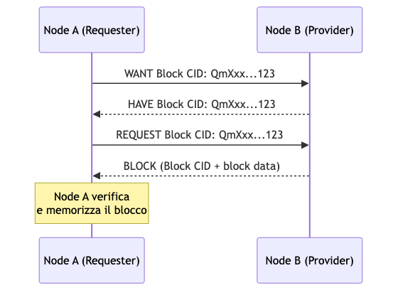
*Fig. — Scambio Bitswap: il nodo A chiede un blocco, il nodo B conferma di averlo, A richiede i dati e B li invia. A verifica l'integrità ricalcolando il CID.*

**A cosa serve HAVE?** Fornisce una **conferma in tempo reale**: la DHT dice "potrebbe avere", HAVE dice "ce l'ho *adesso*". È un messaggio **opzionale**: un peer può rispondere direttamente con il blocco (`WANT → REQUEST → BLOCK`), saltando la conferma intermedia. Bitswap è **best effort**: se un peer non risponde, il richiedente può provare con altri peer — nessuna garanzia di consegna da un singolo fornitore, ma alta probabilità grazie alla molteplicità.

> [!tip] Punti chiave di Bitswap
>
> - I blocchi sono identificati dal loro CID (content ID).
> - Bitswap è **demand-driven** ed efficiente: nulla viene trasferito se nessuno lo richiede.
> - **Più provider** possono rispondere allo stesso WANT in parallelo: il richiedente scarica dal più veloce.
> - La verifica avviene **lato ricevente** ricalcolando l'hash dei blocchi ricevuti.

---

## Disponibilità dei file: il problema della persistenza

Il modello peer-to-peer di IPFS ha un vantaggio enorme — la replicazione naturale dei contenuti popolari — ma porta con sé un problema di disponibilità. Dove sono memorizzati i file in IPFS? Ogni nodo mantiene una **cache** dei file che ha scaricato o condiviso; rimane online fintanto che ha interesse a esserlo e aiuta a distribuire se altri utenti lo richiedono. È un modello simile a uno swarm BitTorrent, con la differenza che **esiste un solo swarm per tutti i contenuti** anziché uno swarm per file.

> [!warning] Cosa succede se tutti i nodi che ospitano un file vanno offline?
>
> Il file diventa **irraggiungibile**. Il CID resta valido in astratto (è una proprietà matematica del contenuto), ma non c'è nessuno sulla rete che possa servire i blocchi corrispondenti. Questo è il problema di **persistenza dei dati** in IPFS.

Tre strategie di mitigazione sono possibili.

1. **Pinning services** — servizi centralizzati che mantengono sempre attivi i contenuti di interesse.
2. **Incentivazione economica** — pagare i nodi per tenere online certi file (la soluzione di Filecoin).
3. **Distribuzione proattiva** — replicare attivamente i file per garantire un numero minimo di copie nella rete.

### Pinning services: Pinata

**Pinata** è l'esempio più noto di pinning service centralizzato. Gestisce la propria infrastruttura, pinna i dati dei clienti e garantisce uptime.

> [!info] Come funziona Pinata
>
> Pinata esegue i propri nodi IPFS e "pinna" (fissa) i contenuti che i clienti caricano: significa che quei nodi non cancelleranno mai il blocco né lo rimuoveranno dalla cache. Risultato: il CID resta sempre servibile. L'interfaccia è semplice: *upload → ottieni CID → il dato resta disponibile*. È essenzialmente uno "storage cloud per IPFS".

Un aspetto importante: siccome il CID identifica il *contenuto* e non il *server*, lo stesso CID può essere pinnato **contemporaneamente** su Pinata, sul tuo nodo locale, e su altri peer. Non c'è un "vero proprietario" del dato — c'è solo un insieme di nodi che lo servono, e basta che uno sia raggiungibile perché il file sia accessibile.

### Filecoin: incentivare lo storage con una criptovaluta

Filecoin prende questa idea e la decentralizza: invece di un pinning service centralizzato, costruisce **un mercato decentralizzato per lo storage** sopra IPFS.

> [!definition] Filecoin
>
> Filecoin è un layer costruito sopra IPFS che trasforma lo storage in un bene scambiabile sul mercato. I nodi che hanno spazio libero sul disco possono affittarlo ad altri utenti e guadagnare in cambio un token, **FIL**. I clienti pagano in FIL per memorizzare i loro dati sulla rete.

L'idea economica è potente: c'è una quantità enorme di spazio storage inutilizzato sui computer del mondo, e al tempo stesso una domanda crescente di cloud storage. Filecoin connette domanda e offerta in un mercato competitivo.

Vantaggi rispetto alle alternative centralizzate (Pinata, Google Drive, Dropbox):

- **Prezzi più equi** — il mercato competitivo tende a pressare al ribasso i prezzi rispetto a quelli delle infrastrutture centralizzate.
- **Efficienza di utilizzo** — invece di costruire nuovo storage, si sfrutta quello esistente e sottoutilizzato.
- **Decentralizzazione** — nessun punto di fallimento unico, nessun singolo fornitore che può chiudere l'account.

Il token FIL viene usato dai client per pagare lo storage, e dai *miner* come ricompensa per i task che svolgono: memorizzare i dati, dimostrare crittograficamente di continuare a memorizzarli nel tempo, proteggere la rete, validare le transazioni.

---

## NFT e IPFS

Un uso concreto e molto diffuso di IPFS è lo storage dei metadata e degli asset degli **NFT (Non-Fungible Token)**. Un NFT su Ethereum non contiene di solito l'immagine o il file multimediale vero e proprio (sarebbe proibitivamente costoso in gas): contiene un **puntatore** a dove quel contenuto è memorizzato.

> [!warning] Il rischio dei puntatori HTTP
>
> Se il puntatore è un URL HTTP (`https://mysite.com/nft-image.jpg`), il NFT è tanto permanente quanto il dominio e il server. Se il sito chiude, l'immagine sparisce — e con essa tutto ciò che l'NFT "rappresenta". Storie di NFT che hanno perso il loro contenuto sono frequenti proprio per questa ragione.

La soluzione è usare un **CID IPFS** come puntatore. Il CID è immutabile e content-addressed: anche se un nodo specifico va offline, finché il contenuto esiste da qualche parte nella rete IPFS (tipicamente pinnato su un servizio come Pinata o su Filecoin), il NFT continua a puntare correttamente al contenuto originale. I marketplace NFT (OpenSea, Rarible, ecc.) leggono il CID dal metadata del token e risolvono il contenuto tramite IPFS gateway.

> [!tip] Perché IPFS è naturale per gli NFT
>
> Il CID **è** un'impronta digitale crittografica del contenuto. Se un giorno qualcuno sostituisse l'immagine con un'altra, il CID sarebbe diverso: non può silenziosamente cambiare a cosa punta un NFT. L'immutabilità dell'NFT sulla blockchain si estende, tramite il CID, all'immutabilità del contenuto puntato.

---

## Sintesi

> [!abstract] Riepilogo della lezione
>
> IPFS è un protocollo P2P **content-based** che sostituisce l'indirizzamento HTTP basato sulla location con identificatori crittografici (**CID**) derivati dal contenuto stesso. Lo stack si articola su tre blocchi logici: **trasporto** (libp2p per la rete, DHT per il routing, Bitswap per lo scambio), **definizione** (IPLD con Merkle DAG per la strutturazione dei dati, IPNS per il naming), **applicazioni**. Il progetto **Multiformat** (multihash, multibase, multicodec, multiaddr) rende tutti i valori auto-descrittivi, permettendo al protocollo di evolvere senza rompere il software esistente. Il **Merkle DAG** garantisce deduplicazione automatica, verifica crittografica end-to-end e versionamento naturale. La **persistenza** dei dati è un problema aperto, mitigato da servizi di pinning centralizzati (**Pinata**) o dal mercato decentralizzato di **Filecoin**, che incentiva lo storage con una criptovaluta.

```{=latex}
\newpage
```

# Ethereum Consensus: Proof of Stake

## Il Problema del Consenso Distribuito

Il consenso distribuito nasce da una sfida fondamentale: costruire un sistema affidabile su un'infrastruttura inaffidabile. Nell'ecosistema blockchain, "inaffidabile" significa che i nodi comunicano su Internet — con banda limitata, alta latenza, perdita di pacchetti — e possono comportarsi in modo arbitrariamente difettoso: possono semplicemente andare offline, seguire una versione diversa del protocollo, o tentare attivamente di ingannare altri nodi pubblicando messaggi contraddittori. L'obiettivo del consenso è fare in modo che decine di migliaia di nodi indipendenti, sparsi per il mondo, procedano in modo completamente sincronizzato.

### Il Problema dei Generali Bizantini

Il modello teorico di riferimento è il **Byzantine Generals Problem** (problema dei generali bizantini). Nell'analogia classica, un esercito circonda una città e i generali devono decidere unanimemente se attaccare o ritirarsi: possono comunicare solo tramite messaggeri, e alcuni generali potrebbero essere traditori.

I "traditori" esibiscono un **comportamento bizantino**: possono ritardare o riordinare messaggi, mentire, inviare messaggi contraddittori a destinatari diversi, o non rispondere affatto. Il requisito del consenso è che tutti i generali leali decidano lo stesso piano d'azione, e che nessun numero di traditori al di sotto di una certa soglia possa portarli ad adottare piani contraddittori.

---

## Safety e Liveness

Due proprietà fondamentali definiscono la qualità di un protocollo di consenso.

> [!definition] Safety — "Non accade mai nulla di brutto"
>
> Il sistema non raggiunge mai uno stato scorretto o inconsistente. Nel contesto della blockchain: nessun nodo onesto decide valori diversi sullo stesso blocco. La safety corrisponde all'assenza di conflitti e fork permanenti.

> [!definition] Liveness — "Prima o poi accade qualcosa di buono"
>
> Il sistema non si blocca indefinitamente. Nella blockchain: le transazioni vengono eventualmente incluse in un blocco, e nuovi blocchi vengono prodotti continuamente. La violazione della liveness è una situazione di stallo.

Il **Nakamoto Consensus** di Bitcoin sceglie deliberatamente di privilegiare la liveness rispetto alla safety: la catena continua sempre a crescere (always available), ma accetta inconsistenze temporanee sotto forma di fork, che vengono risolti applicando la regola della catena più lunga. La safety in Bitcoin è quindi *probabilistica*: non c'è finality assoluta, ma più conferme accumulate, più è improbabile un'inversione di catena.

> [!warning] CAP Theorem
>
> Il teorema CAP (Consistency, Availability, Partition Tolerance) afferma che, in presenza di una partizione di rete, un sistema distribuito deve scegliere tra consistenza (nessun nodo vede dati obsoleti) e disponibilità (ogni nodo risponde sempre). Non è possibile garantire entrambe simultaneamente.

---

## Dalla Proof of Work alla Proof of Stake

### Limiti del Nakamoto Consensus

Il mining Bitcoin ha costi enormi: consuma quantità sproporzionate di energia, e i mining pool controllano porzioni crescenti della catena, erodendo la decentralizzazione. Le alternative al PoW includono:

- **Proof of Stake** (Ethereum 2.0, Algorand, Cardano, Solana)
- **Delegated Proof of Stake** (Steemit, EOS)
- **Byzantine Consensus** (Hyperledger)

### La Timeline di Ethereum 2.0

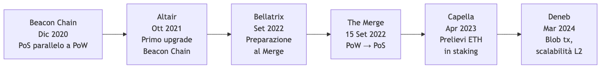
*Fig. — Timeline degli upgrade del Consensus Layer di Ethereum 2.0, da Beacon Chain a Deneb.*

La **Beacon Chain** è stata una rete PoS completamente indipendente che ha funzionato in parallelo alla Mainnet Ethereum per quasi due anni. Il suo scopo era supportare la transizione senza interrompere il servizio. **The Merge** del 15 settembre 2022 ha unito la Execution Layer (Mainnet) con la Consensus Layer (Beacon Chain), completando il passaggio da PoW a PoS.

---

## Gasper: LMD GHOST + Casper FFG

Il protocollo di consenso di Ethereum PoS è detto **Gasper** e combina due meccanismi distinti con ruoli complementari:

> [!definition] Gasper
>
> Gasper = **LMD GHOST** (fork choice, liveness) + **Casper FFG** (finality gadget, safety). LMD GHOST sceglie la testa della catena in presenza di fork; Casper FFG aggiunge la finalità ai checkpoint, rendendo certi blocchi irrevocabili.

Questa architettura riflette la posizione di Ethereum rispetto al trade-off del CAP theorem: in condizioni normali, offre sia safety che liveness; in presenza di partizioni di rete, privilegia la liveness (i nodi continuano a produrre blocchi), ma la finalità può interrompersi.

> [!tip] Perché non solo un protocollo?
>
> LMD GHOST da solo garantisce che la catena cresca sempre, ma non fornisce garanzie di irrevocabilità — i blocchi possono sempre essere riorganizzati. Casper FFG da solo richiederebbe una supermajority in ogni round e si bloccherebbe se troppi validatori fossero offline. La combinazione bilancia i due estremi.

---

## I Validatori

### Ruolo e Incentivi

In Ethereum PoS non esistono miner. Al loro posto operano i **validatori** (validators): nodi che bloccano ETH come garanzia e partecipano al consenso. Ogni validatore svolge due ruoli:

- **Block proposer** (raramente): viene selezionato per creare un nuovo blocco in uno slot specifico, scegliendo e ordinando le transazioni pendenti.
- **Attester** (la maggior parte del tempo): vota sui blocchi proposti, confermando quale sia la testa corretta della catena.

### Diventare un Validatore

Per diventare validatore è necessario depositare esattamente **32 ETH** in un apposito *deposit smart contract*. Il deposito ha una funzione analoga al **collaterale** in finanza: un asset offerto come garanzia. Se il validatore si comporta correttamente, guadagna ricompense; se agisce in modo malevolo o negligente, può essere **slashed**, perdendo una porzione dello stake.

> [!note] Perché 32 ETH fissi?
>
> Un importo fisso permette di trattare ogni validatore in modo uguale nel calcolo dei voti. Chiunque può verificare che un validatore abbia depositato la somma corretta consultando il contratto pubblicamente.

Il sistema è altamente partecipativo: attualmente ci sono circa **1 milione** di istanze di validatori attivi, rendendolo genuinamente democratico.

### Staking senza 32 ETH

Chi non dispone di 32 ETH può partecipare tramite **staking pools** come Lido o Rocket Pool, o exchange centralizzati come Coinbase o Binance. In uno staking pool, gli ETH vengono aggregati da operatori professionali; in cambio si riceve un token che accumula le ricompense dello staking e può essere usato nei servizi DeFi.

---

## Slot ed Epoch

A differenza del PoW, che è un protocollo asincrono senza relazione con il tempo reale, il PoS di Ethereum organizza il tempo in unità discrete.

> [!definition] Slot ed Epoch
>
> - **Slot**: finestra temporale di **12 secondi**, durante la quale un comitato di validatori può votare per un beacon block.
> - **Epoch**: sequenza di **32 slot** = **6,4 minuti**. In un'epoch, ogni validatore attivo ha esattamente un'opportunità di partecipare.

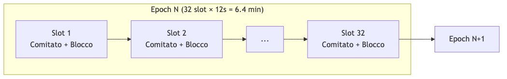
*Fig. — Struttura temporale di epoch e slot in Ethereum PoS.*

All'interno di ogni slot si svolgono tre fasi: (1) un singolo validatore propone un blocco e lo diffonde via gossip; (2) tutti gli altri membri del comitato emettono il loro voto (attestation); (3) negli ultimi 4 secondi, i voti vengono aggregati e inoltrati al proposer del prossimo slot.

---

## RANDAO: Randomness Decentralizzata

Ethereum ha bisogno di casualità verificabile per scegliere i block proposer e assegnare i validatori ai comitati. Non è possibile affidarsi a un'entità centrale (che potrebbe barare) né a un valore prevedibile (che potrebbe essere sfruttato). La soluzione è **RANDAO**: un protocollo distribuito per generare numeri casuali che nessun singolo partecipante può controllare.

### Come Funziona RANDAO

Il meccanismo segue uno schema commit-reveal in quattro passi:

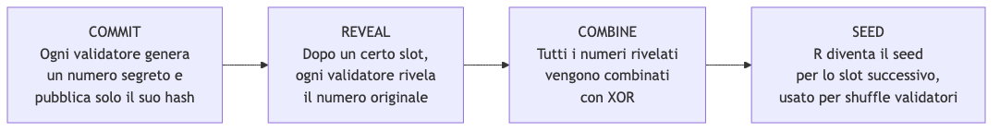
*Fig. — Il protocollo RANDAO: dalla generazione del segreto all'assegnazione dei ruoli.*

Il risultato finale $R = n_1 \oplus n_2 \oplus n_3 \oplus \ldots \oplus n_k$ è imprevedibile perché nessuno conosce tutti i segreti prima della reveal, è inalterabile dopo il commit, è decentralizzato poiché ogni validatore contribuisce, ed è verificabile pubblicamente.

L'output RANDAO viene usato come seed per mescolare (*shuffle*) i validatori e assegnarli a block proposer, comitati, aggregatori e sync committees, con un anticipo di **due epoch**.

---

## LMD GHOST: Fork Choice

### Perché si Formano i Fork

In Ethereum, dove i blocchi vengono prodotti ogni 12 secondi, il tempo di propagazione dei blocchi è dell'ordine di grandezza degli slot stessi. Non tutti i validatori vedono tutti i blocchi in tempo per attestarli o costruirci sopra. Il risultato è un albero di blocchi, non una singola catena.

### L'Algoritmo LMD GHOST

**LMD GHOST** (*Latest Message Driven Greedy Heaviest-Observed Sub-Tree*) è la regola di fork choice di Ethereum. L'intuizione centrale è sostituire la "catena più lunga" di Bitcoin con la "catena con più stake accumulato", usando solo il voto più recente di ogni validatore.

> [!definition] LMD GHOST
>
> Partendo dall'ultimo blocco finalizzato, l'algoritmo scende l'albero scegliendo ricorsivamente il ramo con il maggior peso totale. Il peso di un ramo è la somma del peso di tutti i voti per quel blocco e per tutti i suoi discendenti. Solo il messaggio più recente (LMD) di ogni validatore viene considerato.

Il peso di un voto è proporzionale al **bilancio effettivo** del validatore al momento del voto: deposito iniziale di 32 ETH, più le ricompense accumulate, meno le penalità subite. Quindi non conta il numero di voti, ma la quantità di ETH in staking che li sostiene.

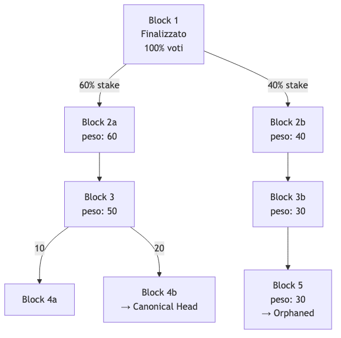
*Fig. — LMD GHOST: il ramo superiore (60→50→20) vince sul ramo inferiore più lungo (40→30→30→30) perché ha più stake accumulato.*

> [!tip] Intuizione chiave di LMD GHOST
>
> Un voto per un blocco figlio è implicitamente un voto per tutti i suoi antenati. Se due figli dello stesso blocco padre ricevono voti da validatori diversi, entrambi i gruppi stanno confermando il padre. GHOST sfrutta al massimo tutte le informazioni disponibili, anziché scartarle come farebbe la longest chain rule.

---

## Il Problema del "Nothing at Stake"

In PoW, produrre un blocco è costoso in termini computazionali: questo incentiva i miner a concentrare le risorse su un'unica catena. In PoS naive, creare nuovi blocchi è quasi gratuito, creando il problema del **nothing at stake**: un validatore razionale potrebbe votare per tutte le catene concorrenti contemporaneamente, massimizzando la probabilità di essere sul lato vincente indipendentemente dall'esito.

Le conseguenze sono severe: più fork perché i validatori attestano tutti i rami, risorse sprecate su catene orfane, tempi di finalità più lunghi, e vulnerabilità agli attacchi di double-spending.

### Lo Slashing come Soluzione

Ethereum risolve questo problema con il **slashing**: se un validatore viene trovato in *equivocazione* (ha firmato due blocchi diversi per lo stesso slot, o ha violato le regole di Casper FFG), viene punito con la rimozione di una parte del suo stake e l'espulsione dal protocollo.

> [!warning] Slashing accidentale
>
> La maggior parte degli eventi di slashing non è dolosa: è dovuta a errori operativi come avere due client attivi con la stessa chiave (es. nodo principale + nodo di backup entrambi ON), configurazioni errate di Docker/Kubernetes, o failover senza spegnere l'istanza precedente. Un validatore deve comportarsi come una singola entità.

---

## Casper FFG: Finality Gadget

### Il Concetto di Finality

In Bitcoin la finality è probabilistica: più conferme, meno probabile la reversione, ma mai impossibile. **Casper FFG** (*Friendly Finality Gadget*) è un protocollo *meta-consenso* che aggiunge finality assoluta a un protocollo sottostante. In Ethereum, il protocollo sottostante è LMD GHOST.

> [!definition] Casper FFG
>
> Casper FFG è un overlay su LMD GHOST che opera su scala di epoch (non di singolo slot). Identifica blocchi speciali chiamati **checkpoint** e, tramite un processo di votazione a supermajority, li porta allo stato di *justified* prima, e infine *finalized*.

### Checkpoint, Justification e Finalization

Il primo blocco di ogni epoch è definito **checkpoint**. Ogni validatore produce esattamente un'attestazione per epoch, che contiene due voti:

- **SOURCE**: il checkpoint dell'epoch precedente già giustificato ("costruisco sulla catena giustificata all'epoch $e-1$")
- **TARGET**: il checkpoint dell'epoch corrente ("voto per questa come testa della catena all'epoch $e$")

Il formato di un'attestazione è:

| Campo | Contenuto |
|---|---|
| `slot` | slot 0 dell'epoch $e$ |
| `index` | indice del validatore |
| `source` | checkpoint giustificato dell'epoch $e-1$ |
| `target` | checkpoint candidato dell'epoch $e$ |
| `signature` | firma BLS del validatore |

Quando più di $2/3$ del totale dello stake (pesato per bilancio effettivo) vota per lo stesso checkpoint, quel checkpoint diventa **justified**. Il checkpoint della fonte (source) del round precedente diventa a sua volta **finalized**.

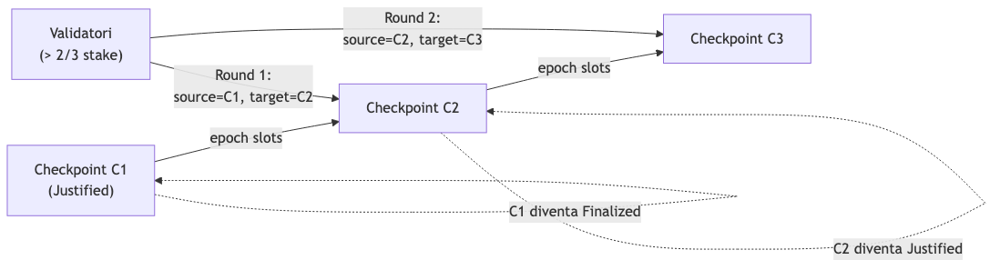
*Fig. — Il processo di justification e finalization in Casper FFG: due supermajority consecutive portano C1 alla finalità.*

### Perché Due Supermajority Consecutive Garantiscono la Finalità

La prova è elegante e si basa sul principio di inclusione-esclusione. Siano $S_1$ e $S_2$ i due insiemi di validatori che formano la supermajority in due epoch consecutive. Per definizione:

$$|S_1| \geq \frac{2}{3} N \qquad |S_2| \geq \frac{2}{3} N$$

dove $N$ è il totale dello stake. Applicando il principio di inclusione-esclusione, poiché $|S_1 \cup S_2| \leq N$:

$$|S_1 \cap S_2| = |S_1| + |S_2| - |S_1 \cup S_2| \geq \frac{2}{3}N + \frac{2}{3}N - N = \frac{1}{3}N$$

L'intersezione è quindi almeno $1/3$ dello stake totale. Qualsiasi tentativo di costruire una catena conflittuale richiederebbe a questi validatori di votare in modo inconsistente tra i due epoch, incorrendo nello slashing. Un attacco che reverta un blocco finalizzato costerebbe la bruciatura di almeno $1/3$ di tutto lo stake in Ethereum — miliardi di dollari — rendendo l'attacco economicamente irrazionale.

> [!abstract] Sintesi del meccanismo di finality
>
> C1 si finalizza quando: (1) nel Round 1 più di 2/3 dello stake vota C2 con sorgente C1 (C2 diventa justified); (2) nel Round 2 più di 2/3 dello stake vota C3 con sorgente C2 (C2 diventa justified per la seconda volta; C1 diventa finalized). La sovrapposizione obbligatoria di almeno 1/3 dello stake tra i due round rende impossibile una revisione senza un costo economico proibitivo.

---

## Il Traffico di Rete

La scala di Ethereum PoS è senza precedenti nel consenso distribuito: in 384 secondi (un'epoch), oltre **500.000 messaggi** devono essere propagati rispettando vincoli temporali rigidi. Nessun altro protocollo di consenso è stato progettato per un numero simile di partecipanti attivi.

Per contenere il traffico, Ethereum usa due meccanismi:
- **Message aggregation**: i comitati sono suddivisi in sottoreti; un validatore aggregatore raccoglie le firme di tutti i membri e le combina in una sola usando firme **BLS** (*Boneh-Lynn-Shacham*), che consentono di aggregare $n$ firme in una singola firma verificabile.
- **Node aggregators**: ruoli specializzati all'interno di ogni comitato.

---

## Ricompense e Penalità

Il comportamento dei validatori è regolato da un sistema di incentivi economici:

| Comportamento | Conseguenza |
|---|---|
| Attestazione corretta e tempestiva | Micro-ricompensa proporzionale al bilancio |
| Attestazione inclusa nel blocco successivo | Ricompensa massima |
| Attestazione mancante, tardiva o errata | Penalità |
| Block proposer che include attestazioni | Ricompensa proporzionale al numero di attestazioni |
| Equivocazione (doppio voto/proposta) | Slashing: perdita di stake + espulsione |

```{=latex}
\newpage
```

# Ethereum 2.0: Fees and Tries

Questa lezione affronta due macro-argomenti strettamente collegati: il **meccanismo di fee** di Ethereum — com'era prima del Merge e come è stato riformato dall'EIP-1559 — e le **strutture dati del Data Layer**, ossia i trie Merkle Patricia che Ethereum usa per rappresentare stato, transazioni, ricevute e storage dei contratti. Comprendere le fee significa capire l'economia di Ethereum; comprendere i trie significa capire come i dati vengono salvati, verificati e interrogati in modo efficiente.

---

## L'offerta di ETH: dalle origini alla supply pre-Merge

### L'ICO del 2014 e la distribuzione iniziale

Ethereum nacque attraverso un **Initial Coin Offering (ICO)** nel 2014, un evento di crowdfunding pubblico in cui i sostenitori precoci acquistarono ETH usando Bitcoin, prima ancora che la rete fosse operativa. Questa campagna fu cruciale per finanziare lo sviluppo e attirare talenti. Dalla distribuzione iniziale emersero **72 milioni di ETH**, ripartiti tra contribuenti precoci e la Ethereum Foundation.

### Supply dynamics pre-Merge

Prima della transizione al Proof of Stake (il cosiddetto Merge, avvenuto nel settembre 2022), Ethereum era basato sul Proof of Work. I miner ricevevano una **block reward** in ETH come incentivo alla sicurezza della rete, oltre alle gas fee delle transazioni incluse nel blocco. A differenza di Bitcoin — dove i dimezzamenti del reward avvengono automaticamente ogni 210.000 blocchi — in Ethereum la regolazione dell'emissione è **governance-driven**: le modifiche vengono decise dalla comunità attraverso Ethereum Improvement Proposals (EIP) e attivate tramite hard fork.

La progressione storica è la seguente:
- **2015 (genesis):** 5 ETH per blocco
- **2017 (Byzantium):** 3 ETH per blocco
- **2019 (Constantinople):** 2 ETH per blocco

Questa riduzione progressiva abbassò il tasso di inflazione della rete, ma in assenza di un meccanismo sistematico di rimozione dalla circolazione — a meno di perdite accidentali o distruzione volontaria — la supply continuava comunque a crescere.

---

## Il sistema di fee pre-Merge: il First Price Auction

### Come funzionava

Prima dell'EIP-1559, le fee di Ethereum seguivano il modello della **first-price auction**: per ogni blocco si apriva un'asta aperta in cui gli utenti dichiaravano il prezzo massimo che erano disposti a pagare per unità di gas (espresso in **gwei**, dove 1 gwei = 0,000000001 ETH). I miner includevano preferibilmente le transazioni con gas price più alto, perché incassavano l'intero importo dichiarato.

> [!definition] First Price Auction
>
> Modello d'asta in cui il vincitore paga esattamente quanto ha offerto, senza rimborso in caso di eccesso. Chi offre di più viene incluso prima.

Questo schema aveva un difetto strutturale: non esisteva un "prezzo giusto" determinato algoritmicamente. Gli utenti dovevano **indovinare** quant'era la domanda corrente, con due scenari negativi simmetrici:
- Se il bid era **troppo basso**, la transazione restava in attesa nel mempool senza essere inclusa.
- Se il bid era **troppo alto**, la transazione veniva inclusa rapidamente ma l'utente **overpagava** senza ricevere alcun rimborso.

> [!example] Bob e l'overpaying
>
> Bob vuole cogliere un'opportunità urgente su Ethereum. Stima competizione elevata e imposta un gas price di 100 gwei. In realtà, la transazione sarebbe stata inclusa con soli 50 gwei. Bob paga il doppio del necessario, poiché non ha strumenti affidabili per stimare il prezzo corretto.

---

## EIP-1559: la riforma del mercato delle fee

### Il London Hard Fork (agosto 2021)

L'EIP-1559, attivato con il London Hard Fork, ha completamente ridisegnato il meccanismo di fee introducendo quattro innovazioni fondamentali:

1. **Base fee algoritmica** — un prezzo minimo per unità di gas, calcolato dal protocollo e comune a tutte le transazioni del blocco, basato sulla congestione recente.
2. **Burn della base fee** — la base fee viene **bruciata**, cioè rimossa permanentemente dalla circolazione, anziché andare ai miner/validator.
3. **Priority fee (tip)** — un contributo volontario che l'utente aggiunge alla base fee per incentivare i validator a includere la propria transazione.
4. **Blocchi elastici** — la dimensione target di un blocco è fissa, ma i blocchi possono espandersi fino al **doppio del target** durante picchi di domanda.

> [!tip] Perché bruciare la base fee?
>
> Separare la base fee (bruciata) dal tip (ai validator) serve a disaccoppiare l'incentivo economico dei validator dal prezzo di mercato del gas. Se i validator ricevessero l'intera fee, avrebbero interesse a manipolare il mercato gonfiando artificialmente la domanda.

### baseFeePerGas: il prezzo di mercato algoritmico

La `baseFeePerGas` è un **parametro di protocollo a livello di blocco**, non un campo della transazione: viene calcolata automaticamente e applicata a tutte le transazioni del blocco. L'analogia con Bitcoin è quella dell'aggiustamento della difficoltà: è una forma di **auto-organizzazione del sistema**.

Il meccanismo di aggiustamento segue questa logica:
- Se il blocco precedente era **più che al 50%** della capienza → la base fee **aumenta**
- Se era **esattamente al 50%** → rimane invariata
- Se era **meno del 50%** → **diminuisce**

Il target è che i blocchi siano mediamente al 50% della loro capacità massima. La variazione è **cappata a ±12,5% per blocco**, il che impedisce oscillazioni brusche ma consente adattamento rapido a cambiamenti sostenuti della domanda. Poiché la base fee può cambiare mentre una transazione è ancora in attesa nel mempool, gli utenti specificano valori **massimi** per proteggersi da variazioni impreviste.

### maxPriorityFeePerGas e maxFeePerGas

In EIP-1559, una transazione include due parametri espliciti:

> [!definition] maxPriorityFeePerGas
>
> Il **tip massimo** che l'utente è disposto a pagare ai validator per prioritizzare l'inclusione. Il validator riceverà `min(maxPriorityFeePerGas, maxFeePerGas - baseFeePerGas)`.

> [!definition] maxFeePerGas
>
> Il **limite massimo assoluto** che l'utente è disposto a pagare per unità di gas. Protegge l'utente da rincari della base fee nel tempo tra submission e inclusione. Deve essere ≥ baseFeePerGas + maxPriorityFeePerGas.

La fee effettivamente pagata sarà: `gas usato × (baseFeePerGas + tip effettivo)`, dove il tip effettivo è `min(maxPriorityFeePerGas, maxFeePerGas - baseFeePerGas)`.

### Tre casi numerici

> [!example] Caso 1 — fee piena, nessun cap
>
> Transazione EOA→EOA di 1 ETH (21.000 gas). `baseFeePerGas = 100`, `maxPriorityFeePerGas = 20`, `maxFeePerGas = 200`.
>
> `maxFeePerGas > baseFeePerGas + maxPriorityFeePerGas` → nessun cap sul tip.
>
> - Fee totale: 21.000 × (100 + 20) = 2.520.000 gwei = **0,00252 ETH**
> - A paga: 1,00252 ETH; B riceve: 1 ETH
> - Validator ricevono: 0,00042 ETH (21.000 × 20 gwei)
> - Bruciati: 0,0021 ETH (21.000 × 100 gwei)

> [!example] Caso 2 — tip ridotto dal cap
>
> Stessa transazione. `baseFeePerGas = 100`, `maxPriorityFeePerGas = 20`, `maxFeePerGas = 110`.
>
> Tip effettivo = min(20, 110 − 100) = **10 gwei** (il cap abbassa il tip).
>
> - Fee totale: 21.000 × (100 + 20) = 2.310.000 gwei = **0,00231 ETH**
> - Validator ricevono: 0,00021 ETH; Bruciati: 0,0021 ETH
> - La transazione viene inclusa, solo il tip si riduce.

> [!example] Caso 3 — transazione bloccata
>
> `baseFeePerGas = 100`, `maxFeePerGas = 90`. L'utente non copre nemmeno la base fee.
>
> La transazione rimane **pending** nel mempool finché la `baseFeePerGas` non scende sotto 90, oppure viene eliminata.

### EIP-1559 e la pressione deflazionistica

L'EIP-1559 ha cambiato strutturalmente la politica di emissione di ETH attraverso due meccanismi congiunti:

1. **Riduzione dell'issuance**: i premi al mining sono stati sostituiti da premi allo staking, significativamente più bassi.
2. **Burn della base fee**: una parte del gas viene bruciata ad ogni transazione.

Quando la quantità di ETH bruciata supera quella emessa come ricompensa ai validator, la supply totale di ETH **diminuisce**: ETH diventa **deflazionario**. Questo fenomeno si osserva nei periodi di alta attività on-chain.

---

## L'architettura di Ethereum: i quattro livelli

Ethereum è organizzato in quattro strati funzionali:

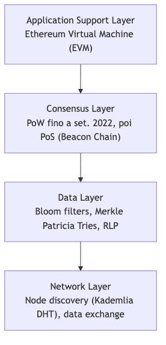
*Fig. — I quattro livelli dell'architettura Ethereum.*

Il **Data Layer** è il focus della seconda parte della lezione: comprende le strutture dati che rappresentano lo stato del sistema — account, transazioni, ricevute, storage dei contratti — attraverso strutture ad albero basate su Merkle Patricia Trie.

---

## Il Merkle Patricia Trie (MPT)

Il **Merkle Patricia Trie** è una struttura dati originale introdotta nel Yellow Paper di Ethereum, che combina due strutture classiche:

> [!definition] Merkle Patricia Trie
>
> Albero che unisce il **Patricia Trie** (raggruppamento di prefissi comuni delle chiavi per ricerca efficiente) con il **Merkle Tree** (ogni nodo è l'hash dei propri figli, garantendo integrità e verifica tamper-proof). È la struttura alla base di tutti i trie di Ethereum e della maggior parte delle blockchain EVM-compatibili.

Il Patricia Trie evita di memorizzare ripetutamente sotto-cammini comuni: nodi interni rappresentano prefissi condivisi, riducendo la profondità dell'albero e velocizzando la ricerca. La struttura Merkle garantisce che qualsiasi modifica a un dato foglia si propaghi cambiando gli hash lungo tutto il cammino fino alla radice, rendendo ogni manomissione immediatamente rilevabile.

---

## I due livelli di Ethereum 2.0

Dopo il Merge, Ethereum è strutturato in due livelli distinti che collaborano:

### Consensus Layer (Beacon Chain)

Il Consensus Layer gestisce il protocollo di consenso PoS e la validazione. Il suo blocco — il **Beacon Block** — non contiene direttamente transazioni o ricevute, ma include un riferimento al blocco dell'Execution Layer attraverso il campo `execution_payload_header`.

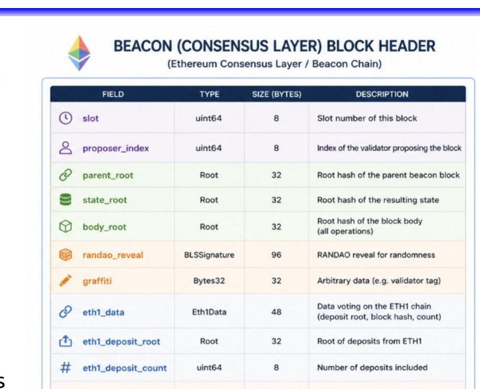
*Fig. — Struttura del Beacon Block Header: gestisce slot, proposer, state root e il collegamento all'Execution Layer.*

### Execution Layer

L'Execution Layer gestisce le transazioni, i contratti intelligenti e i log. Il suo block header è ricco di radici Merkle che certificano lo stato del sistema:

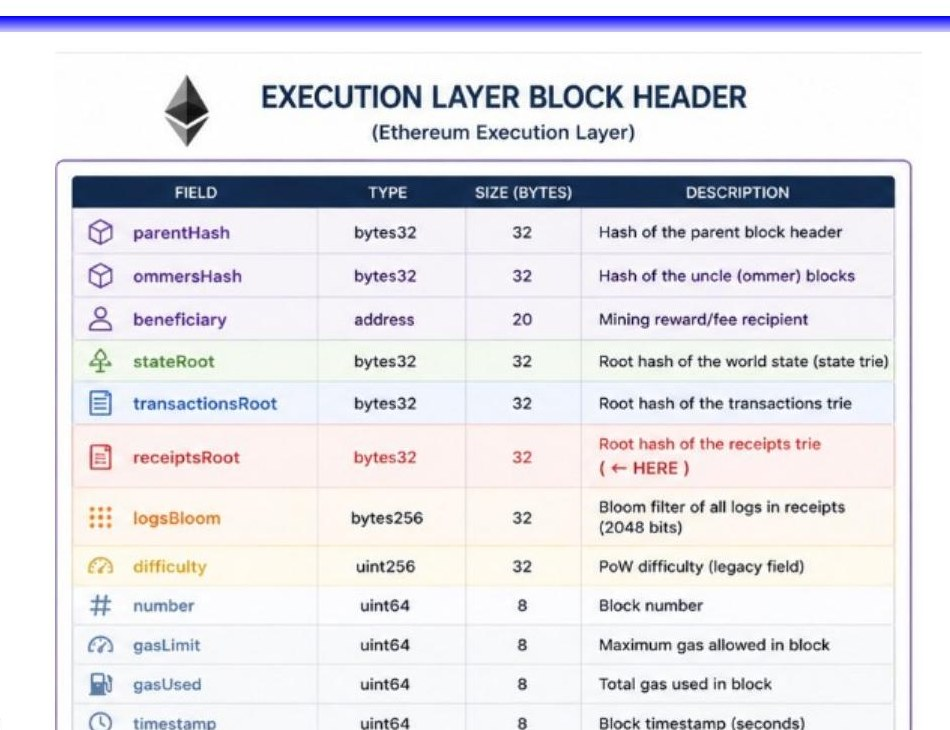
*Fig. — Struttura dell'Execution Layer Block Header: stateRoot, transactionsRoot, receiptsRoot e logsBloom sono le radici dei trie principali.*

I campi chiave per il Data Layer sono:
- `stateRoot` → radice del World State Trie
- `transactionsRoot` → radice del Transaction Trie
- `receiptsRoot` → radice del Receipts Trie
- `logsBloom` → Bloom filter aggregato di tutti i log del blocco

---

## I Trie dell'Execution Layer

La slide seguente mostra la relazione tra il blocco e i quattro trie principali:

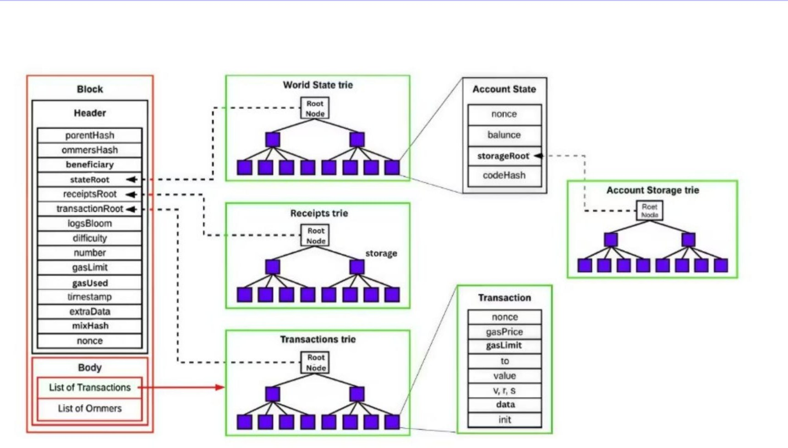
*Fig. — Il blocco punta tramite radici hash al World State Trie, al Receipts Trie e al Transactions Trie. Il World State Trie punta all'Account Storage Trie per ogni contratto.*

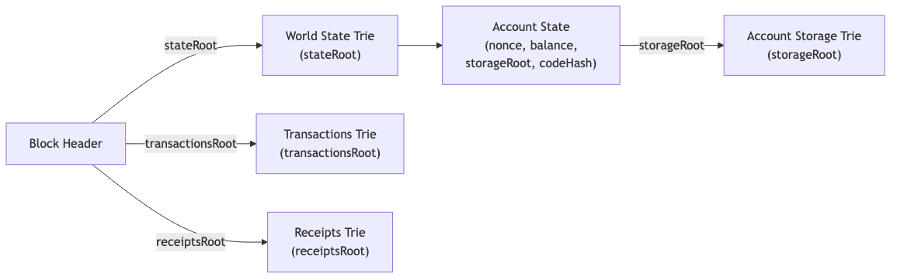
*Fig. — Relazione tra Block Header e i quattro trie dell'Execution Layer.*

> [!note] Quattro trie distinti
>
> - **World State Trie**: mappa ogni indirizzo → stato dell'account (nonce, balance, codeHash, storageRoot)
> - **Transaction Trie**: albero di tutte le transazioni del blocco; la radice è nel block header
> - **Receipts Trie**: albero delle ricevute di esecuzione (una per transazione)
> - **Account Storage Trie**: uno per ogni contratto, contiene le variabili di storage del contratto

---

## Il Transaction Trie

Il Transaction Trie è un MPT che indicizza tutte le transazioni di un blocco. Ogni transazione viene hashata, e gli hash vengono combinati fino a produrre un unico **root hash** incluso nel block header. Questo permette di:
- Rilevare qualsiasi modifica a una transazione (il root hash cambia)
- Dimostrare l'appartenenza di una transazione a un blocco senza scaricare il blocco completo (**Merkle proof**)
- Effettuare ricerche efficienti

---

## Logging e Transaction Receipt

### Perché i log

Consideriamo un contratto NFT. I dati di proprietà corrente dei token sono salvati nell'**account storage** — lo stato on-chain accessibile dal contratto. Ma altri tipi di informazione non richiedono di essere nello storage del contratto:

- La **storia delle proprietà** interessa analisti e investitori, ma il contratto non ne ha bisogno durante l'esecuzione.
- Le **notifiche al frontend** sono necessarie per confermare all'utente che un mint è avvenuto — ma le transazioni sono asincrone, quindi il contratto non può restituire un valore direttamente all'interfaccia.

La soluzione è che il contratto **emetta un evento** (`emit`), che viene scritto nei **log** della ricevuta di transazione. Il frontend può ascoltare questi log e reagire.

> [!tip] Log vs Storage
>
> Il log storage è **molto più economico** dell'account storage in termini di gas. È la scelta corretta per dati che non devono essere letti dal contratto stesso, ma solo da applicazioni esterne (DApp, analytics, indexer come The Graph).

### Struttura del Transaction Receipt

> [!definition] Transaction Receipt
>
> Struttura dati che registra l'esito dell'esecuzione di una transazione una volta inclusa in un blocco. Contiene:
> - **status**: 0 (fallita) o 1 (successo)
> - **cumulativeGasUsed**: gas consumato da tutte le transazioni precedenti nel blocco, inclusa quella corrente
> - **logs**: lista di log entries emesse dal contratto durante l'esecuzione
> - **logsBloom**: Bloom filter da 2048 bit costruito sulle log entries, per ricerca rapida

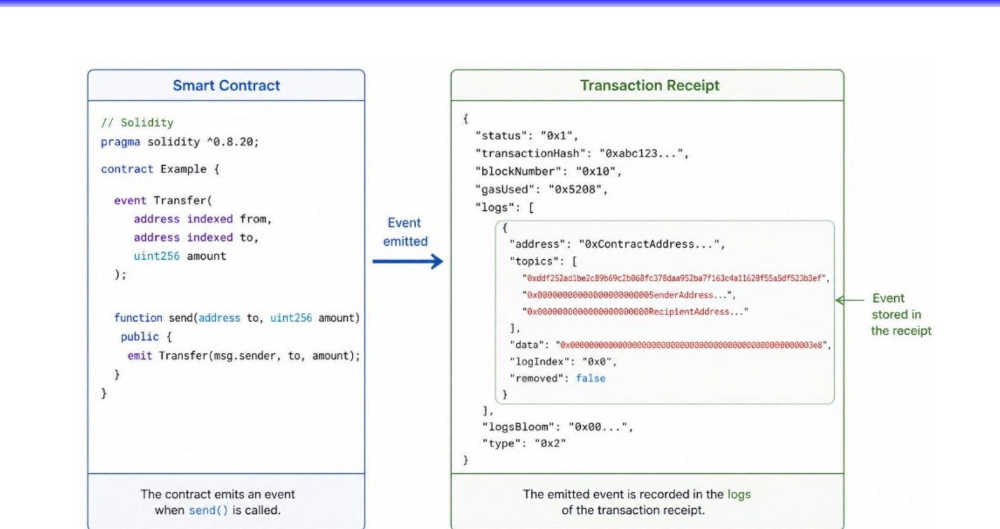
*Fig. — Un contratto Solidity con evento Transfer emette il log quando viene chiamata send(); il log viene registrato nella ricevuta della transazione.*

### Status

Il campo `status` è 0 o 1. Poiché l'esecuzione è asincrona, il chiamante deve attendere che il blocco venga incluso per leggere lo status dalla ricevuta e determinare se la transazione ha avuto successo.

### cumulativeGasUsed

Il campo `gasUsed` nella ricevuta **non** è il gas consumato dalla singola transazione: è il **totale cumulativo** di tutto il gas utilizzato dalle transazioni dalla prima alla corrente nel blocco, inclusa quest'ultima.

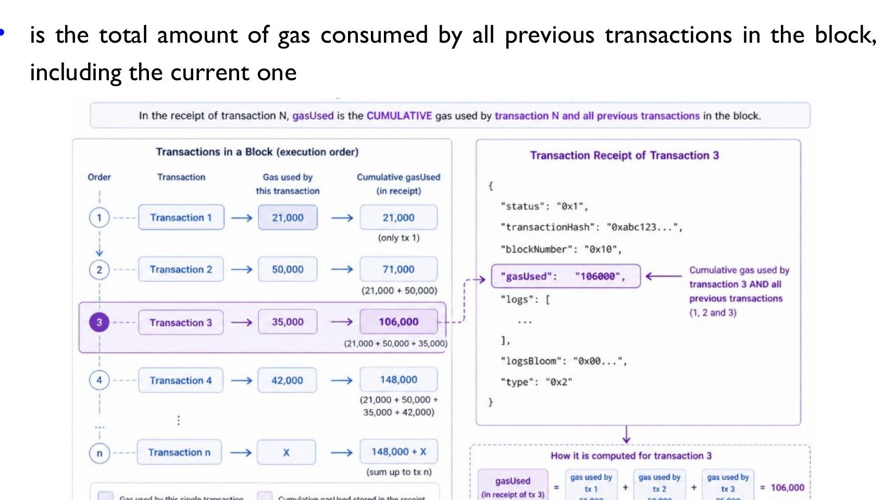
*Fig. — Per la transazione N, gasUsed nella ricevuta e la somma del gas di tutte le transazioni da 1 a N. Nell'esempio, la ricevuta della tx 3 riporta 106.000 gwei = 21.000 + 50.000 + 35.000.*

---

## I parametri Indexed e la struttura dei Log

### Parametri indexed in Solidity

Nei contratti Solidity, i parametri di un evento possono essere dichiarati `indexed`. Questo indica che quei valori devono essere salvati nei **topics** del log (campi indicizzati), anziché nel campo `data` generico.

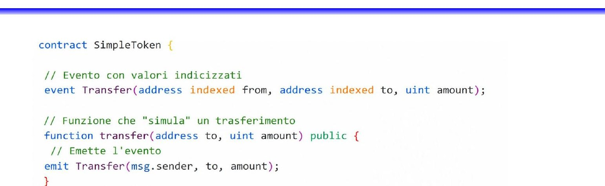
*Fig. — Nel contratto SimpleToken, from e to sono marcati indexed — vengono salvati nei topics della ricevuta per abilitare ricerche efficienti.*

I parametri `indexed` abilitano **ricerche e filtraggio efficienti**: per esempio, trovare tutti i trasferimenti di un token effettuati da un dato indirizzo, oppure tutti i token venduti da un utente. Sono salvati nei campi `topics` della ricevuta, mentre i parametri non-indexed finiscono nel campo `data`.

### La struttura completa di un evento loggato

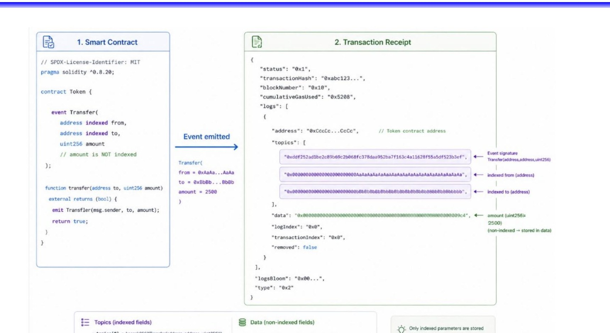
*Fig. — A sinistra il contratto Token con l'evento Transfer; a destra la ricevuta con topics (event signature + from + to) e data (amount non-indexed).*

La struttura di un log entry nella ricevuta è:
- `address`: indirizzo del contratto che ha emesso l'evento
- `topics[0]`: keccak256 della firma dell'evento (es. `Transfer(address,address,uint256)`)
- `topics[1]`, `topics[2]`, ...: parametri `indexed` hashati
- `data`: parametri non-indexed codificati in ABI

---

## LogsBloom: filtraggio efficiente con Bloom Filter

Cercare tutte le transazioni di un blocco che coinvolgono un certo indirizzo richiederebbe di analizzare tutti i log di tutte le transazioni — un'operazione costosa. La soluzione è il **logsBloom**: un [[Bloom Filter]] da 2048 bit (256 byte) che riassume il contenuto dei log.

### LogsBloom nella ricevuta (livello transazione)

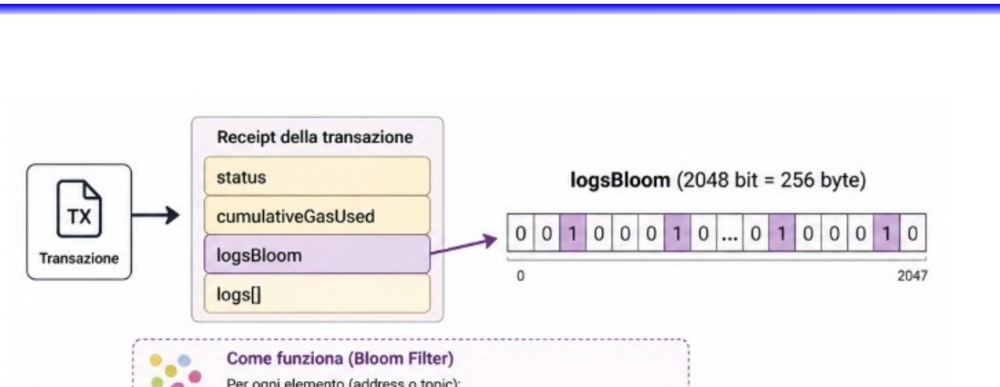
*Fig. — Per ogni transazione, logsBloom e un Bloom filter costruito sugli indirizzi e i topics dei log con keccak256 e 3 bit impostati nel vettore da 2048 bit.*

Il processo di costruzione:
1. Per ogni elemento (address o topic) nei log: calcola `keccak256(elemento)`
2. Deriva 3 posizioni nel vettore da 2048 bit usando 3 hash diversi
3. Imposta a 1 i 3 bit corrispondenti

### LogsBloom nel block header (livello blocco)

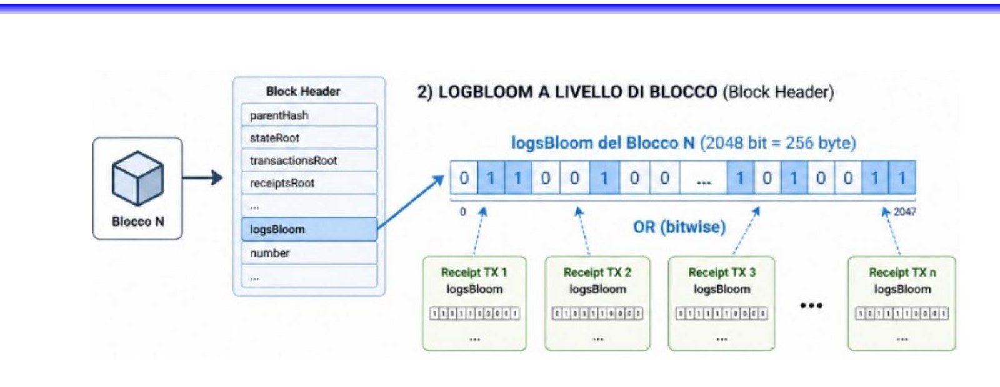
*Fig. — Il logsBloom del block header e l'OR bitwise dei logsBloom di tutte le ricevute del blocco.*

Il `logsBloom` del block header è l'**OR bitwise** dei logsBloom di tutte le ricevute nel blocco. Questo permette una ricerca a due livelli:
1. Controlla il `logsBloom` del block header: se il bit cercato è 0, il blocco non contiene quell'evento (nessun falso negativo).
2. Solo se positivo, scendi a esaminare le singole ricevute.

> [!warning] Falsi positivi nel Bloom Filter
>
> Il Bloom Filter garantisce assenza di falsi negativi (se un elemento è nel set, il filtro lo conferma sempre), ma ammette **falsi positivi** (potrebbe indicare la presenza di un elemento che non c'è). Per questo motivo, dopo aver trovato un blocco candidato tramite il Bloom Filter, occorre verificare i dati effettivi.

---

## Il Transaction Receipt Trie e il Storage Trie

### Il Transaction Receipt Trie

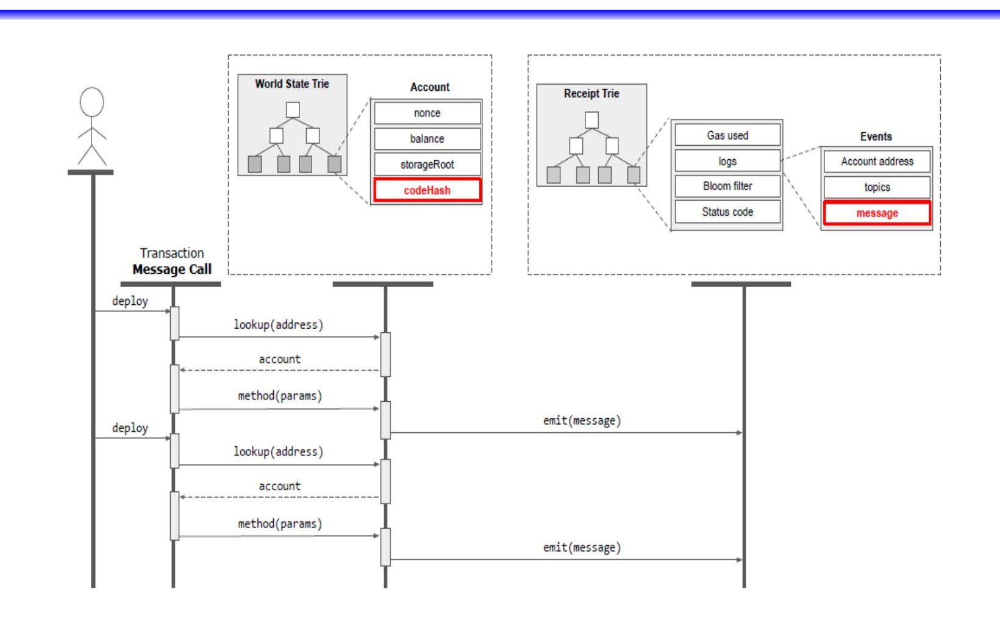
*Fig. — Il Receipt Trie punta alle ricevute con Gas Used, Logs, Bloom Filter e Status Code. Il sequence diagram mostra l'interazione utente-World State Trie-Receipt Trie durante deploy multipli.*

Le ricevute di tutte le transazioni di un blocco sono indicizzate in un MPT. La radice di questo trie è il campo `receiptsRoot` del block header. Quando un utente vuole sapere se una transazione ha avuto successo o vuole recuperare gli eventi emessi, può richiedere una Merkle proof al nodo, senza dover scaricare l'intero blocco.

### Il Storage Trie

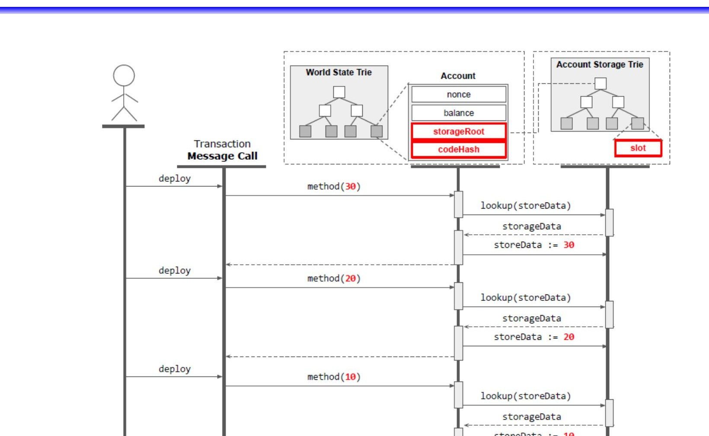
*Fig. — Il campo storageRoot punta all'Account Storage Trie con uno slot per ogni contratto. Il sequence diagram mostra tre chiamate successive con lookup e aggiornamento del valore.*

Ogni account contratto ha il proprio **Account Storage Trie**, a cui si accede tramite il campo `storageRoot` dello World State Trie. Ogni variabile di stato del contratto occupa uno **slot** nell'albero. Ogni modifica di una variabile di storage aggiorna la radice del trie dell'account, che a sua volta aggiorna la radice dello World State Trie — propagazione tipica della struttura Merkle.

---

## Bitcoin vs. Ethereum: confronto finale

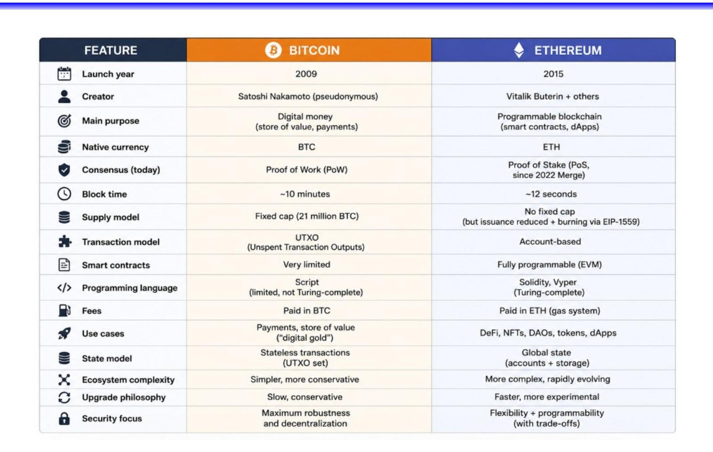
*Fig. — Confronto su 14 dimensioni: anno di lancio, scopo, consenso, block time, supply model, transaction model, smart contracts, fees, use cases, state model e altro.*

> [!abstract] Differenze strutturali chiave
>
> - **Modello transazionale**: Bitcoin usa UTXO (Unspent Transaction Outputs), Ethereum usa un modello account-based con stato globale.
> - **Smart contract**: Bitcoin ha Script (limitato, non Turing-complete); Ethereum ha l'EVM con Solidity/Vyper (Turing-complete).
> - **Supply model**: Bitcoin ha un cap fisso di 21 milioni; Ethereum non ha cap fisso ma EIP-1559 introduce pressione deflazionistica tramite burn.
> - **Block time**: ~10 minuti per Bitcoin, ~12 secondi per Ethereum.
> - **Use cases**: Bitcoin è ottimizzato per pagamenti e riserva di valore ("digital gold"); Ethereum è una piattaforma programmabile per DeFi, NFT, DAO, dApp.

```{=latex}
\newpage
```

# Applicazioni Reali con Smart Contracts

Le criptovalute come Bitcoin, Ethereum e Solana rappresentano le applicazioni più note della blockchain, ma si tratta soltanto del punto di partenza. L'introduzione degli **smart contract** ha reso possibile il passaggio da semplici transazioni finanziarie a sistemi digitali completamente programmabili on-chain: supply chain, token fungibili e non fungibili, finanza decentralizzata (DeFi), organizzazioni governate da comunità (DAO) e identità digitale auto-sovrana (SSI). La chiave di questa espansione è la **composabilità**: diversi protocolli possono essere combinati tra loro come moduli software, creando ecosistemi di applicazioni interoperabili.

---

## Caso d'uso: Supply Chain

### Limiti dell'architettura classica

Il problema di partenza è concreto: un'azienda come Alpha Corporation progetta e fa produrre macchinari complessi, li spedisce in sedi remote, li sottopone a manutenzione periodica tramite terze parti autorizzate, ne trasferisce la proprietà tra aziende diverse, e infine li dismette. In un'architettura centralizzata classica, la sede centrale A1 gestisce un database che traccia componenti, attrezzature, posizioni, storici di manutenzione e ciclo di vita. Questo approccio presenta fragilità strutturali: un attacco di tipo denial of service o una compromissione del database può cancellare o alterare i record; i processi manuali dipendono dalla memoria e dall'intervento umano; la conformità normativa e l'auditing da parte di terzi sono difficili da garantire; le dispute legali successive risultano costose e complesse perché l'auditabilità del sistema non è garantita by design.

### Blockchain permissioned per la supply chain

La soluzione proposta è una **blockchain permissioned**: una rete P2P privata in cui solo i partecipanti autorizzati possono unirsi e aggiungere blocchi. A differenza di una blockchain pubblica come Ethereum, l'accesso è controllato da un'entità centralizzata — in questo caso Alpha — che gestisce le chiavi pubbliche dei partecipanti tramite un **Membership Service Provider (MSP)**.

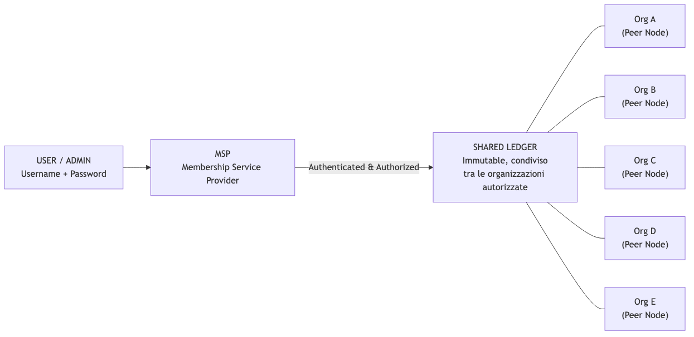
*Fig. — Architettura di una blockchain permissioned: ogni organizzazione gestisce un peer node e condivide un ledger immutabile; l'accesso è mediato dal Membership Service Provider (MSP).*

Il processo di bootstrap avviene in questo modo:

1. **Alpha (A1)** avvia la blockchain creando il blocco genesi, che contiene la propria chiave pubblica. Questa chiave servirà ad autenticare tutti i dati registrati da A1 in futuro.
2. **A2** (la fabbrica) e **B** (l'azienda di manutenzione) generano coppie di chiavi pubblica/privata e inviano le chiavi pubbliche ad A1, che le annuncia sulla blockchain. Da questo momento A2 e B sono nodi della rete P2P, gestiscono il proprio nodo blockchain e possono aggiungere blocchi.
3. Nessun partecipante conosce le chiavi private degli altri: l'impersonificazione è impossibile per costruzione crittografica.

#### Identificazione dei componenti e IoT

Ogni componente prodotto da A2 riceve una propria coppia di chiavi: la chiave pubblica viene annunciata sulla blockchain insieme alla posizione iniziale (magazzino della fabbrica), mentre la chiave privata può essere fisicamente incorporata nel componente. A seconda del valore del componente, la comunicazione con la blockchain avviene in modo diverso:

- **Componenti economici**: codice QR con la chiave pubblica; lettori RFID leggono la chiave e inviano report alla blockchain per conto del componente.
- **Componenti costosi**: tag RFID attivo con connettività Bluetooth; il componente può autonomamente contattare dispositivi vicini e inviare report on-chain.
- **Macchinario completo**: dispositivo IoT completamente connesso con GPS integrato, eventualmente un nodo blockchain leggero, e un lettore RFID integrato che scansiona tutti i componenti interni e rileva eventuali sostituzioni.

#### Smart contract e automazione della manutenzione

Quando un componente viene registrato sulla blockchain, all'annuncio della sua chiave pubblica può essere allegato uno smart contract. Questo contratto può innescare automaticamente richieste di manutenzione, ordini di sostituzione o procedure di dismissione senza intervento umano.

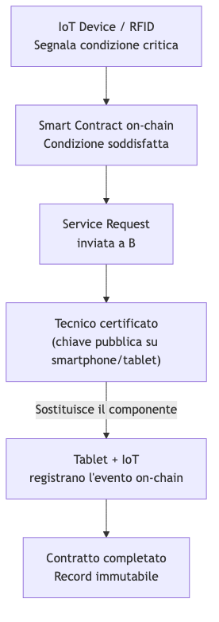
*Fig. — Flusso di automazione: dal rilevamento della condizione critica (IoT) all'esecuzione dello smart contract, fino alla registrazione immutabile dell'intervento.*

#### Revoca delle certificazioni

Se un tecnico lascia l'azienda B, il responsabile pubblica un messaggio di revoca della chiave sul blocco, firmato con la propria chiave privata. Tutti i record precedenti al blocco di revoca rimangono validi e immutabili; i record successivi firmati con la chiave revocata non sono più considerati autentici.

#### Trasferimento di proprietà e decommissioning

Quando il macchinario cambia proprietario (dall'azienda X alla Y), l'evento viene registrato sulla blockchain, creando un registro immutabile di provenienza. Al termine del ciclo di vita, la dismissione viene certificata con la firma del produttore originale A, consentendo futuri audit ambientali e di conformità normativa. Al termine dell'intero processo esiste sulla blockchain un registro completo di tutti i partecipanti, componenti, posizioni, interventi e trasferimenti: i record non possono essere alterati né cancellati, e non esiste un single point of failure.

---

## Certificazione e Tracciabilità

Oltre alla supply chain industriale, la blockchain trova applicazione ovunque sia necessaria la **tracciabilità** di prodotti lungo l'intera catena di distribuzione e la **prova di autenticità** a prova di manomissione. I settori principali includono: alimentare e agricoltura, farmaceutica, manifattura industriale, edilizia e BIM (dove si tracciano materiali, certificazioni e dati del ciclo di vita dell'edificio), beni di lusso e diamanti.

> [!note] EU Digital Product Passport
>
> L'Unione Europea sta valutando il Digital Product Passport (DPP) per tracciare sostenibilità e provenienza dei prodotti. I pilot attuali esplorano blockchain, Decentralized Identifiers (DID), Verifiable Credentials e smart contract. Lo scenario più realistico prevede architetture ibride: database centralizzati con prove su blockchain, reti DLT permissioned e standard di interoperabilità come EBSI.

---

## NFT: Arte Digitale e Proprietà

Un'opera d'arte digitale è banalmente copiabile: chiunque può farne screenshot o download. Ma **copiare non significa possedere**. In un sistema tradizionale, la proprietà resta all'artista o a chi detiene il copyright, indipendentemente da quante copie circolino. L'analogia fisica è la prima edizione di un libro: ha lo stesso contenuto di tutte le ristampe, ma vale di più.

Gli **NFT** (Non Fungible Token, token non fungibili) estendono questo concetto al digitale. Quando Beeple ha mintato il suo NFT per l'opera *Everydays: The First 5000 Days*, ha creato un token sulla blockchain contenente:
- Un **fingerprint unico** del file dell'opera (`8a5de7b183ecf2ec9f488`)
- Il nome del token: `Everydays: The First 5000 Days`
- Il simbolo: `EF5000D`

La transazione sulla blockchain registra che "il token `8a5de7b183ecf2ec9f488` è creato da Beeple, che ne è il proprietario." L'opera stessa **non è nel blocco**: l'NFT contiene solo un link al file archiviato su un file system distribuito (IPFS o equivalente). Ciò che si acquista è il certificato di proprietà, non il file — esattamente come comprare la chitarra di Elvis Presley: chiunque può comprare una chitarra identica, ma solo una ha quel certificato di autenticità.

---

## DeFi — Finanza Decentralizzata

La **DeFi** (Decentralized Finance) è l'insieme di applicazioni finanziarie costruite su blockchain che eliminano intermediari tradizionali come banche, broker e exchange, sostituendoli con smart contract e protocolli automatizzati.

### Stable Coin

Le criptovalute tradizionali sono altamente volatili. Una **stable coin** è progettata per mantenere un valore stabile, tipicamente agganciato a una valuta fiat (1 coin = 1 USD). Questo permette di integrare valute reali nelle applicazioni on-chain e offre a persone in paesi con alta inflazione un'alternativa digitale al dollaro senza necessitare di un conto bancario statunitense.

> [!definition] Tipi di Stable Coin
>
> | Tipo | Backing | Custodia | Esempi |
> |------|---------|----------|--------|
> | **Fiat-Collateralized** | Valute fiat 1:1 in riserva presso un ente | Custodial | USDC, USDT, BUSD |
> | **Commodity-Backed** | Materie prime fisiche (oro, argento) | Custodial | PAXG, XAUT |
> | **Crypto-Collateralized** | Crypto bloccate in smart contract (over-collateralized) | Non-custodial | DAI, LUSD |
> | **Algorithmic** | Algoritmi + incentivi di mercato | Non-custodial | FRAX, AMPL |

#### Fiat-Backed: ciclo di vita completo

Il ciclo di vita di una stable coin fiat-backed si articola in tre operazioni governate da uno smart contract **ERC-20**:

**Minting** — Bob deposita 100 USD e Alice 35 USD presso il custodian (la banca). Il custodian chiama `mint(Bob, 100)` e `mint(Alice, 35)` sul contratto ERC-20. Il contratto aggiorna il mapping `_balances` on-chain. La riserva del custodian ammonta a 135 USD.

**Transfer** — Bob paga 15 USDC a Carol chiamando `transfer(Bob → Carol, 15)` sul contratto (pagando la gas fee). Il trasferimento avviene completamente on-chain senza coinvolgere il custodian: i saldi diventano Bob: 85, Alice: 35, Carol: 15.

**Withdrawal** — Bob ritira 60 USD reali. Il custodian chiama `burn(Bob, 60)` sul contratto, distruggendo i token. Il saldo di Bob scende a 25 USDC, la riserva del custodian si riduce a 75 USD, e Bob riceve 60 USD fisici.

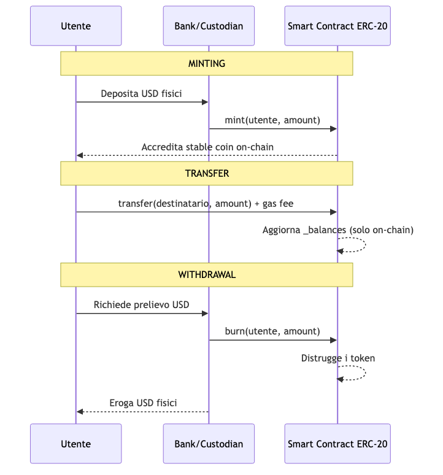
*Fig. — Ciclo completo di una stable coin fiat-backed: il minting e il withdrawal coinvolgono il custodian; il trasferimento è puramente on-chain.*

#### Stabilità tramite arbitraggio

Le stable coin fiat-backed mantengono il peg attraverso l'**arbitraggio**: se 1 USDC vale 1,02 USD sul mercato secondario, i trader acquistano USD dalla banca a 1:1 e vendono USDC sul mercato, spingendo il prezzo verso il basso. Il meccanismo inverso vale quando il prezzo scende sotto il peg.

#### Crypto-Collateralized

Le stable coin crypto-collateralized sono decentralizzate e non-custodial: il collaterale è bloccato in smart contract, non presso una banca. Poiché le criptovalute sono volatili, è richiesta la **over-collateralization**: per mintare 100 USD di stable coin occorre depositare 150 USD di ETH. Se il valore del collaterale scende sotto la soglia di sicurezza, la posizione viene liquidata automaticamente.

#### Algorithmic Stable Coin

Le stable coin algoritmiche mantengono il peg senza riserve complete, usando algoritmi, smart contract e meccanismi di arbitraggio. Un oracolo monitora il prezzo di mercato e lo invia on-chain: se il prezzo supera il peg, l'offerta aumenta; se scende al di sotto, l'offerta si riduce.

---

### Lending e Borrowing

I protocolli DeFi di lending replicano on-chain la funzione delle banche commerciali: chi ha liquidità la presta guadagnando interessi; chi ha asset ma non vuole venderli ottiene liquidità depositando collaterale. Il sistema coinvolge quattro attori: lender, borrower, price oracle e liquidator.

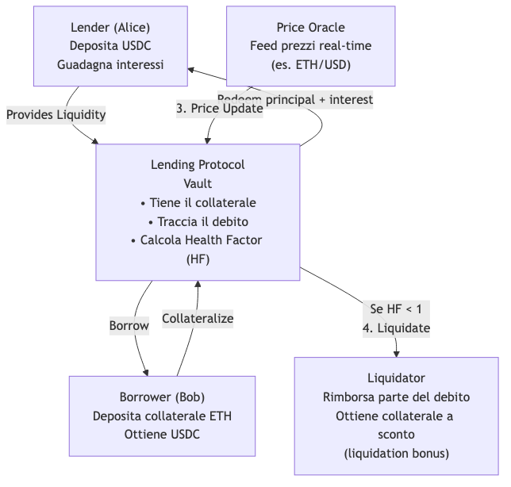
*Fig. — Modello generale del lending DeFi: il vault gestisce collaterale e debito; l'oracle fornisce prezzi; il liquidator interviene quando il Health Factor scende sotto 1.*

#### Il lender

Il lender deposita asset liquidi (es. 50.000 USDC) nel protocollo e riceve in cambio token di interesse. Nel tempo accumula rendimento proporzionale alla liquidità fornita e alla domanda di prestito.

#### Il borrower e l'over-collateralization

Il borrower deposita collaterale (es. 10 ETH a $3.000 = $30.000) e ottiene liquidità (es. 20.000 USDC) senza vendere i propri asset. La motivazione è strategica: Bob vede i suoi BTC o ETH come asset con potenziale di apprezzamento a lungo termine e preferisce ottenerci liquidità piuttosto che venderli. Il protocollo traccia il **Health Factor (HF)**:

$$HF = \frac{	ext{Valore collaterale} 	imes 	ext{Liquidation threshold}}{	ext{Valore debito}}$$

Quando $HF < 1$, la posizione è sottocollateralizzata e diventa liquidabile.

#### Il liquidatore

Se il mercato crolla e il collaterale scende sotto soglia (es. ETH da $3.000 a $2.200, collaterale vale $22.000 ma debito è ancora $20.000), il protocollo consente a qualsiasi liquidatore di intervenire:

1. Alice (liquidator) rimborsa 5.000 USDC del debito di Bob.
2. Il protocollo dà ad Alice ETH per $5.500 (liquidation bonus del 10%).
3. Bob perde parte del collaterale, ma il suo debito si riduce; Alice guadagna il bonus; il protocollo rimane solvente.

> [!warning] Il ruolo critico dell'oracle
>
> Per calcolare il Health Factor in tempo reale, il protocollo deve conoscere il prezzo corrente dell'ETH. Ma una blockchain è un "database isolato" senza connessione a Internet. La soluzione sono i **blockchain oracle**: servizi che portano dati off-chain (prezzi di mercato, risultati sportivi, orari voli) on-chain in modo sicuro.

#### Blockchain Oracle — use case

| Use Case | Dato richiesto |
|----------|---------------|
| Lending/Borrowing | Prezzi in tempo reale per il calcolo del Health Factor e trigger di liquidazione |
| Mercati scommesse | Risultato finale di eventi sportivi |
| Assicurazione voli | Orari e ritardi per contratti di rimborso automatico |
| Stable coin algoritmiche | Prezzo di mercato della stable coin per regolare l'offerta |

---

### Flash Loan

> [!definition] Flash Loan
>
> Un **flash loan** è un prestito preso e rimborsato all'interno di una singola transazione atomica. Se il rimborso fallisce, l'intera transazione viene revertita automaticamente: zero rischio per il lender, zero collaterale necessario per il borrower — la garanzia è l'atomicità della transazione stessa.

La potenza dei flash loan risiede nel permettere accesso a capitali enormi per pochi secondi al fine di eseguire operazioni complesse come l'arbitraggio. Esempio concreto:

1. Borrow di 1.000.000 USDC dal protocollo di lending.
2. Acquisto di ~625 ETH su DEX A (prezzo più basso).
3. Vendita dei ~625 ETH su DEX B (prezzo più alto), ricevendo ~1.025.000 USDC.
4. Rimborso di 1.000.900 USDC (loan + fee) al protocollo.
5. Profitto netto: ~24.100 USDC.
6. Tutta la sequenza è un'unica transazione atomica: se un passo fallisce, tutto si reverte e il prestito non viene mai erogato.

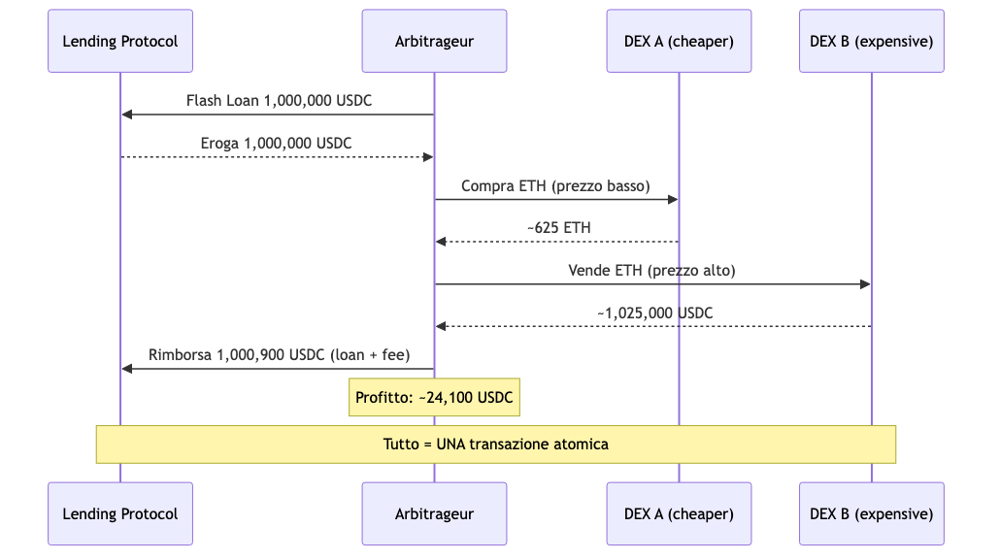
*Fig. — Flash loan per arbitraggio: borrow → buy on DEX A → sell on DEX B → repay, tutto in un'unica transazione atomica.*

---

## Exchange: Centralizzati vs Decentralizzati

### CEX — Exchange Centralizzati

Un exchange centralizzato (CEX) funziona come un mercato finanziario tradizionale: gli utenti depositano fondi sulla piattaforma, che gestisce custodia, esecuzione e liquidità. Il meccanismo centrale è l'**order book**: i compratori specificano il prezzo massimo che sono disposti a pagare (*bid*), i venditori il prezzo minimo accettabile (*ask*). Quando bid e ask si incontrano, avviene la transazione e il prezzo dell'incrocio diventa il prezzo di mercato. Esempi: Binance, Coinbase, Kraken.

> [!example] Order Book BTC/USDT
>
> | BUY ORDERS (Bids) | | | SELL ORDERS (Asks) | |
> |---|---|---|---|---|
> | Price (USDT) | Qty (BTC) | | Price (USDT) | Qty (BTC) |
> | 66.350 | 0.4200 | | 66.450 | 0.6000 |
> | 66.300 | 1.2500 | | 66.500 | 1.0000 |
> | 66.250 | 0.7500 | | 66.550 | 0.8500 |
>
> **Best bid**: 66.350 USDT | **Best ask**: 66.450 USDT | **Spread**: 100 USDT | **Mid price**: 66.400 USDT

### DEX — Exchange Decentralizzati

Un exchange decentralizzato (DEX) consente agli utenti di scambiare token direttamente dal proprio wallet, senza depositare fondi su una piattaforma centralizzata. I token vengono acquistati da una **liquidity pool**: un deposito di coppia di token (es. USDC/WETH) fornito da utenti chiamati **Liquidity Provider (LP)**, che guadagnano le fee sulle transazioni. Il prezzo non emerge da ordini umani ma da una formula matematica eseguita dallo smart contract.

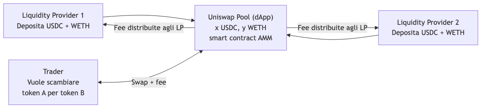
*Fig. — Struttura di un DEX: i liquidity provider alimentano la pool con entrambi i token della coppia; il trader swappa pagando una fee che va agli LP.*

### Automated Market Maker (AMM)

#### La Constant Product Formula

Il cuore matematico dell'AMM è la **constant product formula**:

> [!definition] Constant Product Formula
>
> $$x \cdot y = k$$
>
> dove $x$ = quantità del token X nella pool, $y$ = quantità del token Y, $k$ = costante. Il prodotto dei due saldi rimane costante dopo ogni swap.

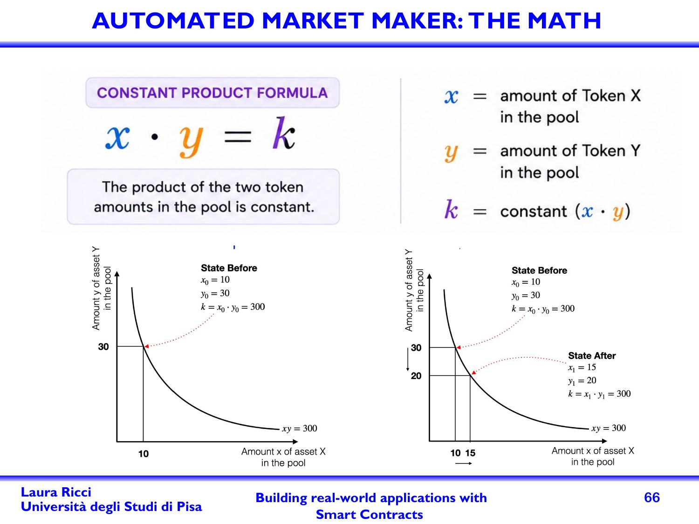
*Fig. — La curva iperbola $xy = k$: a sinistra lo stato iniziale ($x_0 = 10, y_0 = 30, k = 300$); a destra lo stato dopo uno swap ($x_1 = 15, y_1 = 20, k$ rimane 300). Il punto si muove lungo la curva mantenendo il prodotto costante.*

L'intuizione è immediata: più un asset diventa scarso nella pool (il suo $x$ o $y$ diminuisce), più il suo prezzo aumenta. Non c'è order book, non ci sono trader umani: solo matematica, liquidità e smart contract.

#### Il prezzo istantaneo

Per una curva $\psi(x, y) = \text{costante}$, il prezzo istantaneo di Y in termini di X si ricava come la pendenza della tangente alla curva nel punto corrente:

$$P_{Y/X} = \frac{dY}{dX} = \frac{y}{x}$$

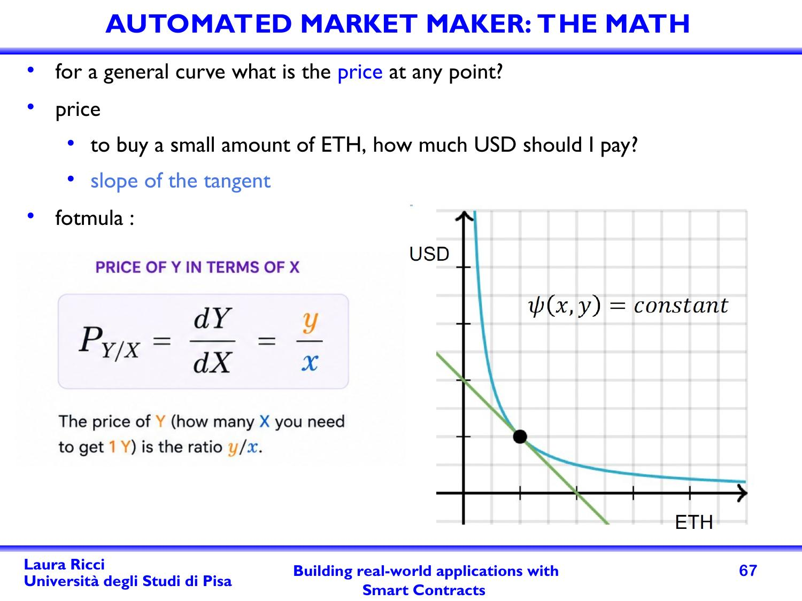
*Fig. — Il prezzo istantaneo di Y è il rapporto $y/x$, ovvero la pendenza della tangente alla curva $\psi(x,y) = \text{costante}$ nel punto corrente.*

#### Variazioni di $k$

$k$ non è permanentemente fisso: aumenta quando i liquidity provider aggiungono liquidità o quando le fee di trading si accumulano nella pool; diminuisce quando la liquidità viene rimossa. Gli swap spostano il punto lungo la curva; le operazioni di liquidità spostano l'intera curva. In conclusione, in un CEX i prezzi emergono dalla competizione di ordini umani/automatici nel mercato; in un AMM i prezzi emergono automaticamente dalla formula matematica e dal bilanciamento degli asset nella pool.

---

## Tokenizzazione di Asset Reali (RWA)

I **Tokenized Real-World Assets (RWA)** sono asset fisici o finanziari tradizionali rappresentati digitalmente su blockchain. Un asset reale viene convertito in un token blockchain che può essere scambiato, trasferito o usato in applicazioni DeFi. Esempi: immobili, titoli di stato, azioni, materie prime (oro, petrolio), opere d'arte, crediti privati.

Il processo è concettualmente semplice: l'asset esiste off-chain, una struttura legale collega l'asset al token on-chain, e il token rappresenta proprietà o quote dell'asset. I vantaggi rispetto alla finanza tradizionale: **proprietà frazionata**, **liquidità aumentata**, **trading 24/7 globale**, **settlement più rapido**, **maggiore trasparenza** e **integrazione nativa con smart contract e DeFi**.

> [!example] Esempi reali
>
> - **BlackRock BUIDL**: fondo che investe in T-bill americani a breve termine; la proprietà è rappresentata da token blockchain.
> - **Maple Finance**: tokenizzazione di prestiti e prodotti di credito istituzionali.
> - Esperimenti di tokenizzazione immobiliare a Dubai, Singapore e Svizzera.

---

## Rischi Nascosti nel DeFi

La DeFi rimuove banche e intermediari sostituendoli con smart contract e transazioni blockchain pubbliche. Questa trasparenza apre però la porta a nuove forme di manipolazione del mercato basate sull'**ordinamento delle transazioni**.

Prima di essere confermate on-chain, le transazioni rimangono visibili nel **mempool pubblico**, dove i validatori (miner nel PoW, proposer nel PoS) possono osservarle e decidere l'ordine di inclusione nel blocco. Chi controlla l'ordinamento può influenzare gli outcome di mercato.

### Sandwich Attack

> [!warning] Sandwich Attack
>
> Un attaccante osserva una transazione profittevole della vittima nel mempool e la circonda con due proprie transazioni:
>
> 1. **Front-run** ($T_{A_1}$, gas price **più alto** di $T_V$): compra lo stesso asset prima della vittima, facendone salire il prezzo.
> 2. **Vittima** ($T_V$): acquista l'asset a prezzo ormai più alto, subendo slippage sfavorevole.
> 3. **Back-run** ($T_{A_2}$, gas price **più basso** di $T_V$): vende l'asset al prezzo gonfiato dalla transazione della vittima, intascando il profitto.

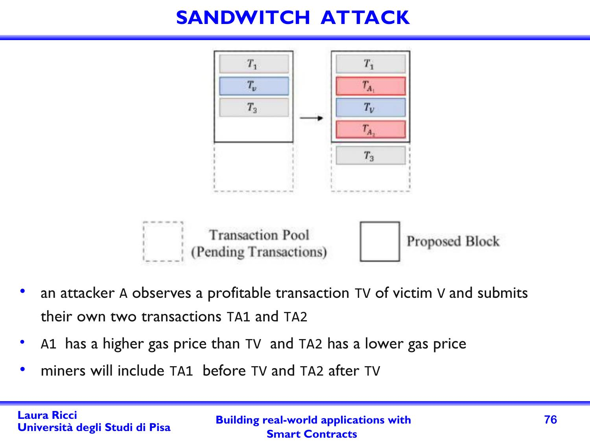
*Fig. — Il sandwich attack: $T_{A_1}$ (front-run) e $T_{A_2}$ (back-run) circondano $T_V$ (vittima) nel blocco proposto. I miner includono nell'ordine corretto grazie al differenziale di gas price.*

### MEV — Maximum Extractable Value

> [!definition] MEV
>
> Il **Maximum Extractable Value (MEV)** è il massimo profitto estraibile dal controllo dell'ordinamento e della selezione delle transazioni nella produzione di un blocco. Un miner o validatore può includere, escludere o riordinare arbitrariamente le transazioni.

Oggi la maggior parte dell'estrazione MEV proviene da **Bot Operator** che monitorano continuamente il mempool, identificano opportunità (sandwich attack, arbitraggio tra pool, liquidazioni) e le sfruttano automaticamente. Il MEV non è un bug accidentale: è una conseguenza strutturale della trasparenza del mempool e della discrezionalità sull'ordinamento.

### Prevenzione degli attacchi

Due meccanismi principali:

- **Limite sul gas price**: impedisce agli utenti di ottenere priorità tramite offerte più alte. Non funziona se i miner stessi sono gli attaccanti.
- **Commit-reveal scheme**: la transazione viene inviata con informazioni nascoste (hash dell'intenzione); solo dopo che la transazione è inclusa nel blocco l'utente rivela i dati in chiaro con una seconda transazione. L'attaccante nel mempool vede solo l'hash, non i dettagli dell'operazione, rendendo impossibile il front-running.

---

## Conclusione: Innovazioni Fondamentali della DeFi

> [!abstract] Core innovations
>
> - **Flash Loan**: accesso a capitale senza collaterale, rimborsato nella stessa transazione atomica; zero rischio per il lender.
> - **Automated Market Maker (AMM)**: pool di liquidità algoritmiche che eliminano l'order book; il prezzo è un output matematico deterministico.
> - **Finanza composabile**: i protocolli si combinano come moduli software, creando ecosistemi di applicazioni interoperabili.
> - **Accesso permissionless**: chiunque può usare i protocolli finanziari senza banche né intermediari.
> - **Logica finanziaria programmabile**: mercati, lending e governance diventano codice eseguibile on-chain.
> - **On-chain governance**: i protocolli sono gestiti collettivamente tramite token voting.
> - **Infrastruttura finanziaria aperta**: i sistemi finanziari diventano API pubbliche accessibili a qualsiasi sviluppatore.

```{=latex}
\newpage
```

